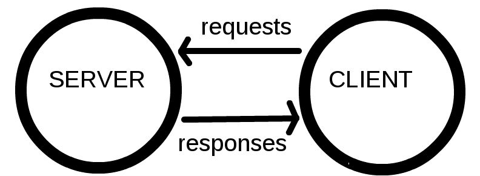

# [Web入门](https://developer.mozilla.org/zh-CN/docs/Learn/Getting_started_with_the_web)

## [专业人员使用哪些工具等?](https://developer.mozilla.org/zh-CN/docs/Learn/Getting_started_with_the_web/Installing_basic_software)

- 计算机
- 文本编辑器
- 浏览器
- 图像编辑器
- 版本控制系统
- FTP 工具软件
- 自动化构建工具
- 模板,库,框架等等,任何用来加快编写常规功能的工具.
- 还有更多工具！

## [你的网站会是什么样子?](https://developer.mozilla.org/zh-CN/docs/Learn/Getting_started_with_the_web/What_will_your_website_look_like)(有关网页制作步骤)

### 描述

请在编写你的代码和设计之前,指定你的计划和一些列的设计工作等,如:我的网页要呈现什么信息,我想要什么字体和颜色?我的网页有什么用处等.

- PS:以下的步骤只是一个最基本的步骤,你完全根据自己的需求制定更多的步骤,让你的项目更为的优秀.

### 第一步:做出计划

在做任何事之前,你需要一些主意.我的网页到底有什么作用？一个网页基本可以做任何事.

做出计划非常的关键,否则当你开始project后,你会发现:你的project很糟糕.

所以,在开始之前,你得思考一下几个问题(或者更多):

1. **你的网页内容是什么**？你喜欢狗狗,纽约或者吃豆人吗？
2. **你的主题中要展示什么信息**？编写一个标题和几个段落,再想几张你想展示出来的图片.
3. **你的网页长得什么样**？用高级一点的术语来说就是,你的背景颜色是什么？什么字体合适：正式的,卡通的,粗犷的,还是精细的？

复杂的项目通常还需要:详细的参考手册,内容包括颜色,字体,网页中各项目的间距,合适的编写规范等等.

参考手册有时也被称为设计指南或者品牌手册,你可以在 [Firefox OS Guidelines](https://www.mozilla.org/en-US/styleguide/products/firefox-os/) 查看一个参考手册的例子.

### 第二步:设计一个草图

拿一支笔和一张纸然后粗略地画出你希望你的网站呈现出来的样子.对于一个简单网页,并没有什么好做的,但是你现在应该养成这样的习惯.

这真的很有用——你并不需要成为下一个梵高！

​                                                                (图源[MDN](https://developer.mozilla.org/zh-CN/docs/Learn/Getting_started_with_the_web/What_will_your_website_look_like))

即使是在真正的复杂的网站中,设计团队也是首先在纸上画出草稿,然后在图形编辑器中或者使用 Web 技术作出数码模型；

Web 团队通常包括一个图形设计师和 [用户体验设计师](https://developer.mozilla.org/zh-CN/docs/Glossary/UX) .图形设计师的作用很明显是将网页视觉部分组合在一起.用户体验设计师则拥有一个某种更抽象的角色来解决用户如何浏览和与网站交互.

### 第三步:选择你的内容

这个时候就可以开始将最终呈现在你的网页上的内容放在一起了.

如,可以选择:

- 文本
- 主题颜色
- 图像
- 字体
- ...

## 文件处理

### 一些关于大小写和空格的提示

你会注意到,很多开源的项目中:所有的文件夹名和文件都使用小写字母,且没有空格.这是因为：

1. 很多计算机,特别是 Web 服务器,是对大小写敏感的.

   ​    举个例子,如果你将一张图片放在 test-site/MyImage.jpg,然后在一个不同的文件里你试图以 test-site/myimage.jpg 引用这张图片,这将不会起作用.

2. 浏览器,Web服务器,还有编程语言不能一致处理空格.

   ​    举个例子,如果你在文件名里使用空格,一些系统会把它这个文件名视为两个文件名.

   ​    一些服务器将会把你的文件名里的空格替换为 “%20([percent encoding](https://zh.wikipedia.org/zh-hans/%E7%99%BE%E5%88%86%E5%8F%B7%E7%BC%96%E7%A0%81)),破坏你所有的链接.

   ​    最好使用中划线,而不是下划线来分离单词：对比 my-file.html 和 my_file.html .

简单地说,你应该在文件名中使用连字符.谷歌搜索引擎把连字符当作一个词的分隔符, 但不会以这种方式处理下划线.

基于这些原因,至少在你知道自己在做什么之前,最好养成在文件夹和文件名中使用小写,并且使用短横线而不是空格来分隔的习惯.

这样可以避免你在以后碰到一些问题.

### 网站应该使用什么结构(basic)

接下来,看看我们的测试网站应该拥有什么结构.我们创建的任何网站项目中最常使用的就是一个索引 HTML 文件和不同的包括图像,样式表和脚本文件的文件夹.让我们现在创建它们：

1. **index.html** ：这个文件通常将包括你的主页内容,也就是说,人们第一次进入你的网页看到的文本和图像.
2. **images 文件夹** ：这个文件夹包含你网页上所有使用的图像.
3. **styles 文件夹** ：这个文件夹包含了为你的内容添加样式的样式表（比如,设置文本颜色和背景颜色）.
4. **scripts 文件夹** ：这个文件夹包含了所有为你网页添加交互功能的 JavaScript 代码（比如点击时读取数据的按钮）.

### 文件路径规则

一些文件路径的通用规则：

- 要引用一个位于调用的 HTML 文件**同级目录**的目标文件,只需**直接使用文件名**,比如 my-image.jpg .

  或使用 `./` my-image.jpg, 也是调用统计文件夹.    

- 要引用一个**子目录**的文件,在**路径前写下目录名并加一个斜杠**,比如 subdirectory/my-image.jpg .

  或使用 ./subdirectory/my-image.jpg

- 要引用一个位于调用的 HTML 文件的**父级**目录的目标文件,加上两个点 `../` (斜杠代表你准备引入的文件名)

  ​    举个例子,如果 index.html 在 test-site 下面的一个子目录而 my-image.png 在 test-site 目录,你可以在 index.html 里使用 ../my-image.png 引用 my-image.png .

- 你可以随意组合以上方法,比如 ../subdirectory/another-subdirectory/my-image.png.

- 使用当前工作区根目录: `/`; 

  比如在 vscode 有个文件夹名为 file, 路径是: `D:/code/file` , 且我们通过 vscode 打开的工作区的文件夹路径是: `D:/code`, 而此时我们在它里面的任意一个嵌套的文件夹中的文件中使用: `/index.html`, 

  `/index.html` 则表示: 在当前根目录 `D:/code` 下的 index.html 文件 => `D:/code/index.html`

  ​

TIP: Windows 文件系统会使用反斜杠而不是斜杠,比如 C:\windows .

这在 HTML 里没什么关系,但是若你在 Windows 上开发你的网页,你仍应该在你的代码中使用斜杠.

可以简单地分类一下根目录:

- 工作区根目录

  比如: vscode 打开的 workspace, 就叫做工作区根目录

- 项目根目录

  比如: 通过 node 的 process.pwd() 获取的目录, 就叫做项目根目录 (Node.js 进程的当前工作目录)

例子: vscode 打开的工作区根目录为: D:/code, 项目目录为: D:/code/yomua.

## [HTML基础](https://developer.mozilla.org/zh-CN/docs/Learn/Getting_started_with_the_web/HTML_basics)

超文本标记语言 (英语：**H**yper**t**ext **M**arkup **L**anguage,简称：HTML ) 是一种用来结构化 Web 网页及其内容的标记语言.

网页内容可以是：一组段落、一个重点信息列表、也可以含有图片和数据表.正如标题所示,本文将对 HTML 及其功能做一个基本介绍.

HTML 不是一门编程语言,而是一种用于定义内容结构的*标记语言*.

HTML 由一系列的**元素（[elements](https://developer.mozilla.org/zh-CN/docs/Glossary/元素)）**组成,这些元素可以用来包围不同部分的内容,使其以某种方式呈现或者工作.

 一对标签（ [tags](https://developer.mozilla.org/zh-CN/docs/Glossary/Tag)）可以为一段文字或者一张图片添加超链接,将文字设置为斜体,改变字号,等等. 

## [CSS基础](https://developer.mozilla.org/zh-CN/docs/Learn/Getting_started_with_the_web/CSS_basics)

层叠样式表（**C**ascading **S**tyle **S**heet,简称：CSS）是为网页添加样式的代码.它可以:将文本设置为黑色或红色？将内容显示在屏幕的特定位置？用背景图片或颜色来装饰网页？

和 HTML 类似,CSS 也不是真正的编程语言,甚至不是标记语言,它是一门样式表语言,这也就是说人们可以用它来选择性地为 HTML 元素添加样式.

### [JavaScript基础](https://developer.mozilla.org/zh-CN/docs/Learn/Getting_started_with_the_web/JavaScript_basics)

JavaScript 是一门编程语言,可为网站添加交互功能.（例如：游戏、动态样式,动画,以及在按下按钮或收到表单数据时做出的响应,等）.

[JavaScript](https://developer.mozilla.org/zh-CN/docs/Glossary/JavaScript)（缩写：JS）是一门完备的 [动态编程语言](https://developer.mozilla.org/zh-CN/docs/Glossary/Dynamic_programming_language).当应用于 [HTML](https://developer.mozilla.org/zh-CN/docs/Glossary/HTML) 文档时,可为网站提供动态交互特性.由布兰登·艾克（ Brendan Eich,Mozilla 项目、Mozilla 基金会和 Mozilla 公司的联合创始人）发明.

JavaScript 的应用场合极其广泛.简单到幻灯片、照片库、浮动布局和响应按钮点击;复杂到游戏、2D 和 3D 动画、大型数据库驱动程序,等等.

JavaScript 相当简洁,却非常灵活.开发者们基于 JavaScript 核心编写了大量实用工具,可以使 开发工作事半功倍.其中包括：

- 浏览器应用程序接口（[API](https://developer.mozilla.org/zh-CN/docs/Glossary/API)）—— 浏览器内置的 API 提供了丰富的功能,比如：动态创建 HTML 和设置 CSS 样式、从用户的摄像头采集处理视频流、生成3D 图像与音频样本,等等.
- 第三方 API —— 让开发者可以在自己的站点中整合其它内容提供者（Twitter、Facebook 等）提供的功能.
- 第三方框架和库 —— 用来快速构建网站和应用.

## [万维网(web)是如何工作的](https://developer.mozilla.org/zh-CN/docs/Learn/Getting_started_with_the_web/How_the_Web_works)

### 描述

这里简单的介绍

这个理论在短期内对你编写网页代码不会有实质性的帮助,但是不久之后你就会真正受益于理解了后台究竟发生了什么.

### 介绍

### 客户端和服务器

连接到互联网的计算机被称作客户端和服务器.下面是一个简单描述它们如何交互的图表：

- 客户端是典型的Web用户入网设备（比如,你连接了Wi-Fi的电脑,或接入移动网络的手机）和设备上可联网的软件（通常使用像 Firefox 和 Chrome的浏览器）.
- 服务器是存储网页,站点和应用的计算机.当一个客户端设备想要获取一个网页时,一份网页的拷贝将从服务器上下载到客户端机器上来在用户浏览器上显示.

### 其他部分

我们讲的客户端和服务器并不能完成全部工作.还有其他必要的部分,我们将在下面讲述.

现在,让我们假设 Web 就是一条路.路的一端是客户端,就像你的家.另一端则是服务器,就像你想去的商店.

除了客户端和服务器,我们还需要了解：

- **网络连接**: 允许你在互联网上发送和接受数据.基本上和你家到商店的街道差不多.

- **TCP/IP**: 传输控制协议和因特网互连协议是定义数据如何传输的通信协议.这就像你去商店购物所使用的交通方式,比如汽车或自行车（或是你能想到的其他可能）.

- **DNS**: 域名系统服务器像是一本网站通讯录.

  当你在浏览器内输入一个网址时,浏览器获取网页之前将会查看域名系统.

  浏览器需要找到存放你想要的网页的服务器,才能发送 HTTP 请求到正确的地方.就像你要知道商店的地址才能到达那.

- **HTTP**: 超文本传输协议是一个定义客户端和服务器间交流的语言的协议（[protocol](https://developer.mozilla.org/zh-CN/docs/Glossary/Protocol) ）

  就像你下订单时所说的话一样.

- 组成文件

  一个网页由许多文件组成,就像商店里不同的商品一样.这些文件有两种类型：

  - **代码** : 网页大体由 HTML、CSS、JavaScript组成,不过你会在后面看到不同的技术.
  - **资源** : 这是其他组成网页的东西的集合,比如图像、音乐、视频、Word文档、PDF文件.

### 到底发生了什么？

当你在浏览器里输入一个网址时（在我们的例子里就是走向商店的路上时）：

1. 浏览器在域名系统（DNS）服务器上找出存放网页的服务器的实际地址（找出商店的位置）.

2. 浏览器发送 HTTP 请求信息到服务器来请拷贝一份网页到客户端（你走到商店并下订单）.

   这条消息,包括其他所有在客户端和服务器之间传递的数据都是通过互联网使用 TCP/IP 协议传输的.

3. 服务器同意客户端的请求后,会返回一个“200 OK”信息,意味着“你可以查看这个网页,给你～”,然后开始将网页的文件以数据包的形式传输到浏览器（商店给你商品,你将商品带回家）.

4. 浏览器将数据包聚集成完整的网页然后将网页呈现给你（商品到了你的门口 —— 新东西,好棒！）.

### 浏览器如何解析服务器返回的 html 文件呢 

当浏览器从服务器获取 html 文件时，会有以下步骤。

> 注：假设 html 文件包含 \<link> \<script> 元素，前者指向 css 样式表，后者指向 javaScript 文件。

1. 浏览器先解析 html 文件，并找出 \<link> 和 \<script> 元素，获取它们指向的链接。

2. 继续解析 html 文件中其他信息，同时向刚才得到的链接发送请求，获取 css 和 javaScript 文件。

3. 当 html 解析完成后会生成一个 DOM 树（存在内存），
   CSS 解析完成后生成一个 [CSSOM](https://developer.mozilla.org/zh-CN/docs/Glossary/CSSOM) 树（类似 DOM，存在内存），
   对于 JavsScript 文件则是边编译边执行。

4. 当 DOM 树、CSSOM 树以及JavScript 文件都解析且执行完毕后，浏览器就会在屏幕绘制出网页的界面，

   最终浏览器就可以跟网页进行交互了。

### DNS解析

真正的网址看上去并不像你输入到地址框中的那样美好且容易记忆.它们是一串数字,像 63.245.217.105.

这叫做 IP 地址,它代表了一个互联网上独特的位置.然而,它并不容易记忆,不是吗？那就是域名系统（DNS）被发明的原因.它们是将你输入浏览器的地址（像 "mozilla.org"）与实际 IP 地址相匹配的特殊的服务器.

网页可以通过  [IP地址](https://developer.mozilla.org/en-US/docs/Glossary/IP_Address)直接访问.您可以通过在 [IP Checker](https://ipinfo.info/html/ip_checker.php) 等工具中输入域名来查找网站的IP地址.

### 数据包详解

前面我们用“包”来描述了数据从服务器到客户端传输的格式.这是什么意思？

基本上,当数据在Web上传输时,是以成千上万的小数据块的形式传输的.

大量不同的用户都可以同时下载同一个网页.

如果网页以单个大的数据块形式传输,一次就只有一个用户下载,无疑会让Web非常没有效率并且失去很多乐趣.
