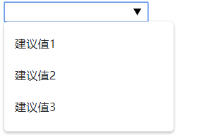

# [imput](https://developer.mozilla.org/zh-CN/docs/Web/HTML/Element/input)

## 描述

HTML \<input> 元素用于为基于Web的表单创建交互式控件,以便接受来自用户的数据; 可以使用各种类型的输入数据和控件小部件,具体取决于设备和[user agent](https://developer.mozilla.org/zh-CN/docs/Glossary/User_agent).

其工作方式依赖于属性type的值,各个不同的type值,input属性表现形式也不同,请继续往下看.

## input的type值

### [text](https://developer.mozilla.org/zh-CN/docs/Web/HTML/Element/input/text) 默认值

### [button](https://developer.mozilla.org/zh-CN/docs/Web/HTML/Element/input/button) 已被button标签代替

### [checkbox](https://developer.mozilla.org/zh-CN/docs/Web/HTML/Element/input/checkbox)

复选框

### [radio](https://developer.mozilla.org/zh-CN/docs/Web/HTML/Element/input/radio)

单选框

### [submit](https://developer.mozilla.org/zh-CN/docs/Web/HTML/Element/input/submit)	

提交按钮，作用和 formObj.submit() 方法一样，***参见：<form.md>***

### [color](https://developer.mozilla.org/zh-CN/docs/Web/HTML/Element/input/color)

### [date](https://developer.mozilla.org/zh-CN/docs/Web/HTML/Element/input/date)

### [datetime-local](https://developer.mozilla.org/zh-CN/docs/Web/HTML/Element/input/datetime-local)

### [email](https://developer.mozilla.org/zh-CN/docs/Web/HTML/Element/input/email)

### [file](https://developer.mozilla.org/zh-CN/docs/Web/HTML/Element/input/file)

### [hidden](https://developer.mozilla.org/zh-CN/docs/Web/HTML/Element/input/hidden)

### [month](https://developer.mozilla.org/zh-CN/docs/Web/HTML/Element/input/month)

### [number](https://developer.mozilla.org/zh-CN/docs/Web/HTML/Element/input/number)

### [password](https://developer.mozilla.org/zh-CN/docs/Web/HTML/Element/input/password)

### [range](https://developer.mozilla.org/zh-CN/docs/Web/HTML/Element/input/range)

### [reset](https://developer.mozilla.org/zh-CN/docs/Web/HTML/Element/input/reset)

### [search](https://developer.mozilla.org/zh-CN/docs/Web/HTML/Element/input/search)

#### 描述

input元素的 search 类型是: 为用户输入搜索查询而设计的文本字段.

功能上与 text 输入相同, 但是可以通过 user agent 进行不同样式的设置.

#### 以表格表述

| **[值](https://developer.mozilla.org/zh-CN/docs/Web/HTML/Element/input/search#值)** | DOMString 代表搜索字段中包含的值.                            |
| ------------------------------------------------------------ | ------------------------------------------------------------ |
| **事件**                                                     | [change](https://developer.mozilla.org/zh-CN/docs/Web/Events/change) 和 [input](https://developer.mozilla.org/zh-CN/docs/Web/Events/input) |
| **支持的通用属性**                                           | autocomplete, list, maxlength, minlength, pattern, placeholder, required, size. |
| **IDL 属性**                                                 | value                                                        |
| **方法**                                                     | select(), setRangeText(), setSelectionRange().               |

- [IDL](https://developer.mozilla.org/zh-CN/docs/Web/HTML/Attributes)属性也称为JavaScript属性

#### 值

value 属性包含 DOMString 代表搜索字段中包含的值.即当前在input中的值.

可以使用JavaScript进行获取.

#### 其他属性

除了可在所有input上的属性（无论其类型）之外,搜索字段输入还支持以下属性：

| 属性        | 描述                                                         |
| :---------- | :----------------------------------------------------------- |
| list        | datalist元素的ID,其中包含可选的预定义自动完成选项.           |
| maxlength   | 输入应接受的最大字符数.                                      |
| minlength   | 输入可以且仍被认为有效的最小字符数.                          |
| pattern     | 输入内容必须匹配的正则表达式才能有效.                        |
| placeholder | 空时在输入字段中显示的示例值.                                |
| readonly    | 一个布尔属性,指示输入的内容是否应为只读.                     |
| size        | 一个数字,指示输入字段应宽多少个字符.                         |
| spellcheck  | 控制是否对输入字段启用拼写检查,或者是否应使用默认拼写检查配置. |

### [tel](https://developer.mozilla.org/zh-CN/docs/Web/HTML/Element/input/tel)

### [time](https://developer.mozilla.org/zh-CN/docs/Web/HTML/Element/input/time)

### [url](https://developer.mozilla.org/zh-CN/docs/Web/HTML/Element/input/url)

### [week](https://developer.mozilla.org/zh-CN/docs/Web/HTML/Element/input/week)

## 属性

### list

list属性的值是位于同一文档中的datalist元素的id。

datalist元素提供了一个预定义选项值的列表，可向用户在input元素中建议此输入。

列表中与类型不兼容的任何值都不会包含在建议的选项中。

注意:提供的值是建议，而不是要求：用户可以从该预定义列表中选择或自己写其他值。

- ***参见：<easyElement-1.md>***

```html
<form action="xx" name="x" id="xx" list="suggest">
    <input type="search" />
    <datalist>
    	<option value="建议值1"></option>
        <option value="建议值2"></option>
        <option>建议值3</option>
    </datalist>
</form>
```




