[TOC]


# 为什么学习视觉格式化基础

视觉格式基础也就是视觉渲染的理论,之所以要学习这些知识,是因为CSS实在是太开放,太多知识点了.

在使用/探索CSS的过程中,我们可能会在某些用户代理中(通常指浏览器)遇到或者看到一些奇怪的行为.

而只有在掌握了视觉渲染模型的工作原理之后,我们才能分辨所遇到的奇怪行为究竟是不是CSS渲染引擎定义的正确方式,还是真的有异常发生.

而且只有了解了视觉格式理论,你才能写好很出色CSS,难道不是吗?没有键盘和鼠标的电脑你能用的顺畅?

会了用起来觉得没什么,但是不会寸步难行.

# 元素框基础

*<CSS权威指南P262>*

## 描述

**请注意:横向格式化和纵向格式化是不一样的.**

在CSS中,CSS都会假设任何的HTML的元素都会自生成一个或多个矩形框,通常这个矩形框成为元素框.

​	*在以后的规范中,可能会允许元素自生成非矩形框.*

元素框的构成：内容区 + 内边距 + 边框 + 轮廓 + 外边距。

每个元素框的中心都是内容区域(<行的构成.md>),在元素框的四周分别有可选的:

1. ## **内边距**

2. ## **外边距**

   ​    它可以在GodModel中看见也能影响到元素框,~~但是不会被用户代理(浏览器)计算进任何属性值中,~~

   ​	*这是错误的解释,横向格式化的属性和纵向格式化的属性中,用户代理就会将之当作一个值计算,只是通常情况下并不会这么做,没必要.*

   ​	且在通常情况下,外边距是不会被计算的.且外边距一定无法可见,无法被显示,除非GodModel中.

   ​	例如设置一个块级框的margin:20px,则代表在左外边距和右外边距(上下外边距也有20px)各设置为20px,

   ​	但是在计算块级框的宽度时,此外边距并不会被计算,请看以下例子

   ​	

   ```html
   <style>
   	p {
           width: 200px;
           padding: 10px;
           margin: 20px;
           border:0px;
           background-color: gray;
   
       }
   </style>
   <p>
       yomua
   </p>
   ```

   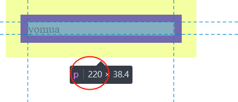

   即：外边距会影响元素显示，但是使用 width 等属性时，外边距并不会计算进入此等属性。

   ​	

   - ​    黄色的外边距,蓝色虚线里面为内容区,

     ​	紫色(实际为灰色,因为鼠标移动上去才改变了颜色)边界为边框,和孤儿轮廓（轮廓和边框类似，可以被改变，但是轮廓无法影响到布局），

     ​	紫色边界和蓝色虚线的区域为内边距。

     ​		(外边距是除GodModel外,都看不见)<CSS权威指南P271.md>)

     ​	红色圆圈里面的代表元素框的宽度

     ​		（这里是：内容区宽度width + 左右内边距宽度，若当前元素存在 box-sizing:border-box 属性，则红色圆圈的值应该为 200px，因为该属性表示：将内边距和边框计算进入 width 值。）

   - ​    而这5个东西（内容区 + 内边距 + 边框 + 轮廓 + 外边距）构成了整个元素框.

     ​	由于这里的示例并没有将所有属性写出来，所以没有写出来的属性的默认值为：0（轮廓：0），所以此时元素框的宽度应该为: 200+10+10+20+20 = 260px; 
     
     ​	但是红色圆圈只是200+10+10=220px,这代表着外边距其实不会被用户代理所计算进去作为一个值的,只是会被显示出来和影响样式.
     
   - ​    一个块级元素和其他元素(块级/行内/行内块级)的外边距会折叠,但是行内元素和行内元素的外边距不会重叠

3. ## **边框**

   ​    边框的线形由样式定义,例如设为:solid或inset等.

   ​	边框的颜色由border-color属性设置,若未设置颜色,那么边框的颜色将和元素中内容的前景色相同(即内容若是一段文本,文本的颜色为白色,则文本四周的边框也为白色.)

   ​	若边框的样式存在间隙(例如虚线),那么我们可以从间隙中看到当前元素的背景.

   ​	最后边框的宽度不能为负数(什么是边框的宽度?看图1-1,即黑色的区域)

4. ## **轮廓**

   ​	元素框的构成之一的轮廓,~~通常是被忽略的,因为轮廓没有属性,怎么显示?~~
   
   ​	轮廓是存在的,outline-style即可让轮廓显示出来，且默认情况下轮廓紧贴边框（在边框之外）
   
   ​	但是轮廓不占任何空间,这就代表它不会影响布局,它存于视觉上.***具体我们会在<内边距和边框和轮廓和外边距.md>***

之所以说这4个区域是可选的,是因为它们的宽度都可以设为0,也就是将能将这4个属性从元素框四周删除.

其中外边距,内边距,边框都有分别针对每一边的属性,例如:margin-left和border-bottom等,也有简写属性,例如padding.

- 这里所的每一边,是真的每一边,例如,外边距可以分为:
  1. 左外边距
  2. 右外边距
  3. 上外边距
  4. 下外边距

但是**轮廓**这个东西是个孤儿,没有针对轮阔各边的属性,也就是说没有属性能控制轮廓的哪条边,但是轮廓整体能被控制

在默认情况下,内容区的背景(如颜色,或平铺的图像)出现在内边距范围内.

对于外边距来说,它的区域始终是透明的,所以也正因此能透过它看到父元素(内容,背景等).

**请注意:**外边距是可以为负值的,但是内边距不行,而且边框的宽度也不能是赋值.在下面我即将会说明若把外边距设置负值会呈现什么样的效果.

现在,请看图1-1,它充分解释说明了外边距,边框,内边距,内容区域分布在哪里.

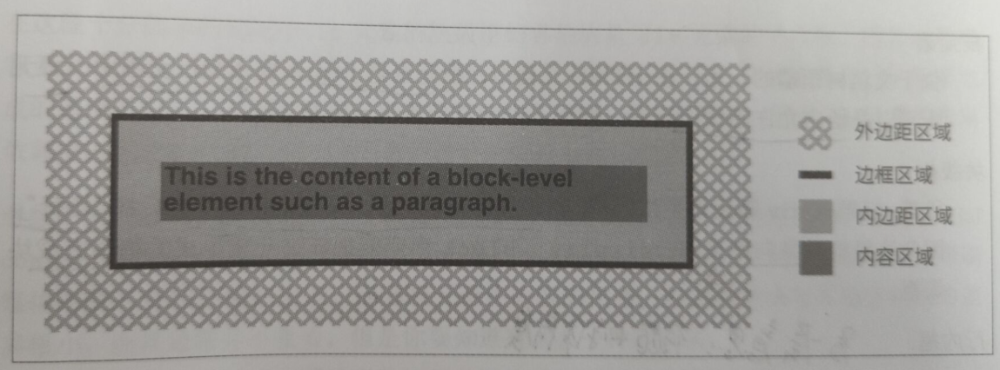

​																	图1-1

元素框由这4个部分组成(外边距区域,边框区域,内边距区域,内容区域),这4个部分各自都会受到很多种属性的影响,例如:width,border-right等.但是如果要完全讲明白这些,是不现实的.

所以这里我们不会深入讨论.

# 重要概念概览

在读本章之前,需要了解以下基本概念,因为本章将会使用到许多专业术语.

## 常规流动

所谓的常规流动,也就是用户代理在渲染模型(文本内容,图片等)时的顺序.

而常规流动就是指渲染[西方语言时]从左→右,从上→下的顺序,以及传统的HTML文档采用的文本布局方式.

​	*西方语言指:如英语等.对于西方语言来说,其流动方向有可能会变.*

对于HTML的大多数元素来说,都采用的是常规流动方式,除非元素浮动了,定位了,放入弹性盒子或采用栅格布局了等(这些在以后会说到,在这里我们只先讨论常规流动方式)

## 非置换/置换元素

我想各位都很了解这两个东西了吧,它们是HTML的最普遍的两种形式.

在**<u><置换_非置换_块级_行内元素.md></u>**中我们有非常详细的解释.这里我在稍微提几句.

### 置换元素

为其他内容占位的元素，如：\，\<input type="radio/text 等">，\<textarea>，其中：\ 通过 src 属性链接其他内容，\<imput>  和 \<textarea> 则是由用户自己手动提供。

笔者注：多数表单元素也是置换元素，上面的 \<input type="radio"> 就是一个例子。

### 非置换元素

和置换元素完全相反,其内容由用户代理（通常是浏览器）提供，或者说是内容包含在文档中，如：\<p>，\<span> 等。

## 块级框/行内框

在**<u><置换_非置换_块级_行内元素.md></u>**中我们有非常详细的解释.这里我在稍微提几句.

### 块级框

即一个元素是块级元素,那么它自生成的框就是块级框,其特点是在块级框的前后会折行(换行),并且块级框是纵向堆叠的(即两个及以上的块级框它们排列时是从上→下排列).

注意:display:block样式能把任何元素自生成的框变成块级框.但是只对此属性所在的单个元素有效,除非 `span {display:block}` 以这样的形式,那么就代表,当前HTML文件内,所有span元素生成的框都为块级框.

### 行内框

即一个元素是行内元素,那么它自生成的框就是行内框,其特点是不会在前后折行,并且行内框是横向堆叠的(即两个及以上的行内框它们排列时是从左→右排列).

注意:display:inline样式能把任何元素自生成的框变成行内框.但是只对此属性所在的单个元素有效,除非 `p {display:inline}` 以这样的形式,那么就代表,当前HTML文件内,所有p元素生成的框都为行内框.

### 注意

即使可以在表现形式上,将块级元素放入行内元素中,但是我们仍然不建议这么做,这是不对的.即使CSS不限制这样的行为.

并且我们使用类似display属性改变元素的显示方式,并不会改变元素本质,也就是说:将行内元素的行内框变成块级框,并不会把行内元素变成块级元素.反过来也是一样的.

## 行内块级框

顾名思义,其内部特征像块级框,其外部特征像行内框.行内块级框的行为与置换元素相似,但不是完全相同.

例如: 把一个div元素像行内图像那样插入一行文本,这样一想是不是就明白了?

关于行内框的属性:inline-block

# 容纳块

## 定义

在使用常规流动方式(即渲染模型时的方向为:从左→右,从上→下)渲染模型(通常指西方文本)时,

容纳块由离当前元素最近的 那个生成块级框(或特殊的块级框:列表项目)的祖辈元素的边界构成。

**简单来说就是: A元素的容纳块由离A元素最近的父辈块级元素的边界构成,即此边界（不含）以内就是容纳块**

注：容纳块和元素框是不一样的，**容纳块在不同的地方是不同的**，如：以 absolute 定位的元素，若其父辈元素为块级元素，则该元素的容纳块为父辈元素的边框（不含）以内区域；若父辈元素为行内元素，则该元素的容纳块为父辈元素的内容区（***参见：<定位.md>***）。

## 描述

容纳块是一个非常重要的概念.

通过定义我们可以知道,容纳块一定是一个块级元素生成的元素框(即块级框),且这个容纳块不是块级元素自身的容纳块,而是它的直接~~第一~~子集元素的容纳块.

​	*注意:不需要第一子集,只要其子集,那么容纳块都是其父元素的块级框*

且每个元素自身生成的元素框都相对于容纳块放置,即相对于父元素的块级框放置. 通俗来讲: 容纳块是元素框的"布局上下文".

请看下面的例子:

```html
<body>
    <div>
        <p>
            yomua
        </p>
    </div>
</body>
```

- ​    在这段十分简单的标记中(HTML是标记语言),根据定义:p元素的容纳块就是:离p元素最近的父辈块级元素的元素框.

  ​	所以此时p元素的容纳块是div元素所构成的元素框(块级框)

-    类似的,div元素的容纳快是body元素生成的元素框,而boy元素的容纳块则是根元素html生成的元素框.

- ​	那么html根元素的容纳块是什么呢?即初始容纳块:initial containing block.

  ​	这个初始容纳块很特别,其尺寸由视区(屏幕媒体中的浏览器窗口,印刷媒体中的可打印区域)决定,而非根据html根元素中内容的尺寸决定.

  ​	初始容纳快和普通容纳块的差异极小,而且通常并不重要,但是需要知道有这么一种容纳块.

# 详解块级框

块级框和块级元素并不是说的同一种事物,块级元素指的是HTML的元素是块级的,而块级框指的是框,矩形区域,盒子这些.

一个指的是框本身,一个指的是元素是哪种类型.

## 描述

对于块级框来说,它的行为有时可以预测,有时又让人捉摸不透.比如:框体位置在横轴和纵轴上的处理方式就不同,想要充分了解块级框的处理方式,必须知道一些界限和区域,请看图1-2.

​	*说是块级框,但是其实只不过是元素框的进一步抽象表示以及更加特指罢了.请往上看元素框基础-图1-1和以下图1-2的区别.*

​	*你们会发现区别并不是太大,这是因为元素框是一切元素的基石,而块级框是在此基础上派生过来的.就像JS的DOM接口一样,还有在其基础上增加细节/功能的HTML DOM接口.*


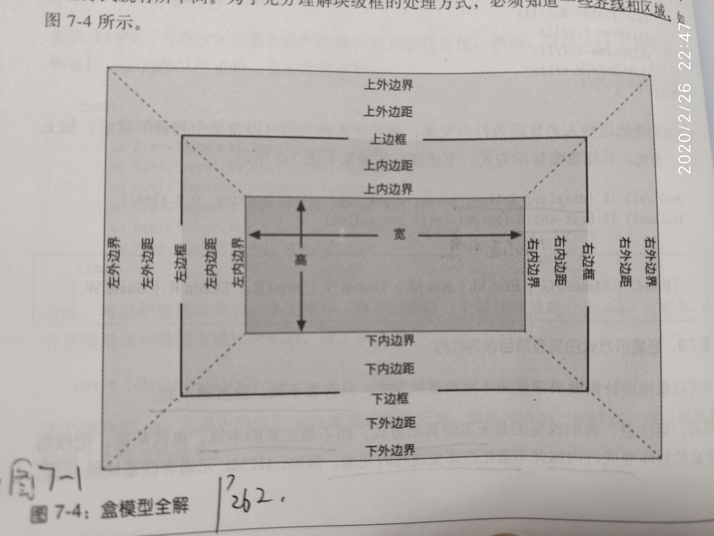																			图1-2

在默认情况下:

- 块级框宽度(width)等于左内边界到右内边界的距离

  即内容区的宽度. *不是边框,也不是内边距,单纯指内容区的边界*

- 块级框的高度(height)等于上内边界到下内边界的高度

  即内容区的高度

所以如果将这两个属性都设置为400px,那么增加宽度和高度就是增加内容区的宽度和高度,换句话说,增加的宽/高度是**以内容区为基础增加的,而内容区域之外的内边距,边框~~,外边距~~的宽度和高度也是在此基础上增加**

​	*外边距可以在GodModel中看见也能影响到元素框,但是不会被用户代理(浏览器)计算进任何属性值中,*

**请注意**:这里说的是块级框的宽度和高度,即也**包含**着外边距的宽度和高度,所以在默认情况下,用户代理呈现的块级框的宽度和高度始终比创作人员设置的width和height的值大一些.(请往下看box-sizing-示例)

但是若不在GodModel下,且没有边框,那么其实可见区域(边框,内边距,内容区,外边距是不可见的)的宽度和高度就等于width和height的值.

若设置了边框,那么可见区域的宽度/高度 = width和height的值 + 边框的宽度和高度

​	*比如:内容区宽高都为200px,那么设置width和height属性为400px时,则内容区的宽度和高度都会分别增加  200px,那么在没有边框的情况下,其可视区域为400px,详情往下看:横向格式化.*

对于width和height属性来说,在一些特殊情况下,它们的处理方式和意义会有所不同,它们不在是以内容区为基础增加宽度和高度,请往下看.

## 可见区域

即除了外边距之外的其余4个事物:边框,内边距,内容区,轮廓(在边框外侧,可见却不影响布局，).

或者简单来说:即边框(含)之内的区域,即为可见区域,除了特殊的轮廓..

## width和height

这两个属性值默认设置的是: 内容区的宽度/高度.

box-sizing:border-box属性值情况下,设置的是:可见区域的宽度和高度(即边框(含)之内的宽度和高度)

## box-sizing

### 介绍

适用于能设定width和height的任何元素.

取值为:content-box | padding-box | border-box

无法被继承,无法有动画性.

### 描述

比如:若在元素样式中使用了box-sizing属性其中的一些特殊值,那么width和height这两个属性的意义和处理方式就会被改变:如**box-sizing:border-box**

在最初的默认情况下width和height分别指内容区域的宽度和高度,不超出内容区的四个边界.

但是若使用了box-sizing属性的border-box值,则width和height两个属性就会分别指:

- width:从左外边界到右外边界的距离.

  即外边距的宽度.

- height:从上外边界到下外边界的距离.

  即外边距的高度.

  

也就是说,使用width和height设置块级框的宽度和高度时,**不在**以内容区为基础,而是以外边距的四个边界为基础.

**同时也正因为如此,边框和内边距[以及外边距]都在这个尺寸内计算,所以内容区的宽度就会相应减少.**

​	*比如:设置width和height属性为400px时,那么在没有边框的情况下,其可见区域为400px,*

​	*但是若有边框的情况下,其可见区域仍为400px,至于边框的宽度和高度加了进来为什么整体可见区域没有改变?只需要将内容区的宽度和高度一起缩小即可.*

​	*而这就是我们说的:以外边距的边界为基础增加宽度和高度,以及相应减少内容区的宽度和高度*

请看以下示例.

### 示例

```html
<style>
    p {
        height: 200px;
        width: 400px;
        border:  5px solid gray;
        box-sizing: border-box;
    }
</style>
<body>
    <p>yomua</p>
</body>
```

- 请注意:为了体现witdh和height两个属性在不同的意义下处理方式的不同,就要让元素拥有边框,而不是看不见的框.

     因为width和height两个属性指的就是宽度和高度,没有体现它的边框,不然在元素大小不改变的情况下,我们怎么知道这两个属性发挥了作用? 除非打开GodModel,但是这样太麻烦了

- ### 以下图1-3是**没有**box-sizing: border-box;属性值的用户代理呈现的样式.

  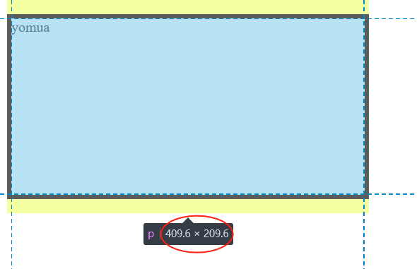

  ​														图1-3

  - ​    请注意红色圆圈,它指的就是在不存在box-sizing: border-box;属性值时用户代理呈现的可见区域的宽度和高度.

  - ​    width:  409.6 px

    ​	height: 209.6 px

    ​    你们也应该发现了,用户代理呈现的大小是比我们设置的大小都大了9.6.这是为什么呢?

    ​	在描述中我们应该说过:width和height属性默认设置的是内容区的宽度和高度,

  -    这里以内容区的宽度和高度为基础增加大小至400px,但是这里到的400px是指内容区的宽度和高度到400px,

    ​	并**没有计算边框的宽度和高度,所以才会形成偏差.**

    ​	多处来的9.6是: 边框的宽度/高度 .

    ​	而外边距不会被用户代理所计算.

- ### 以下图1-4是有box-sizing: border-box;属性值的用户代理呈现的样式.

  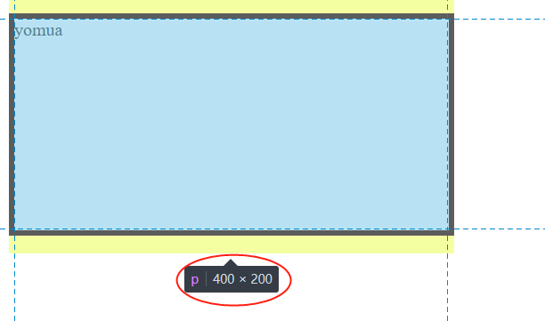

  ​													图1-4

  - ​    图1-4代表了若使用了box-sizing: border-box;属性值,则可见区域的宽度和高度会以外边界的宽度和高度作为增加它的宽度和高度的基础

    ​	请看图1-2,简单地说:

    ​		左边框的左外边界→右边框的右外边界的距离就是块级框的宽度(但不是可见区域的宽度).

    ​		上边框的上外边界→下边框的下外边界的距离就是块级框的高度(但不是可见区域的高度).

    ​	而这里呈现的400px宽度指的是: **内容区的宽度 + 边框的宽度.**

## 块级框宽度和高度

块级框宽度和高度并不是指内容区的宽度和高度.

正确的应该是: 整个块级框包含**外边界的宽度和高度**,**边框的宽度和高度,** **内边距的宽度和高度**, **内容区的宽度和高度**,这四个宽度和高度加起来才是一整个块级框的宽度和高度.

也就是说,块级框的宽度和高度指的是整体的框.通俗来讲:可以简单地认为左/上外边界到右/下外边界的宽度和高度其实就是块级框的宽度和高度.

我们常说的可见区域并没有包含外边界的宽度和高度,同时外边界的宽度和高度并不会被用户代理计算,只是会用占位空白空间所体现出来.


## 描述(续)

根据以上的示例,究竟选择哪一种方式设置width和height的属性值就仁者见仁,智者见智了.

而通过描述和示例,我们应该也知道了,块级框的宽度,高度,内边距,外边距在一起,就能决定文档的布局方式.

​	*(而元素框的构成之一的轮廓,是只存于视觉上的表现,不占任何空间,不会影响布局)*

# 横向格式化

## 定义

言简意赅的说,所谓的横向格式化就是有关块级框宽度的属性设置.

## 描述

在常规流动方式下(即从左→右,从上→下,元素未浮动,定位,放入弹性和未采用栅格布局),**当前块级元素的块级框各组成部分加起来的横向尺寸始终等于容纳块的宽度(~~可显示区域~~内容区宽度).**

**简单来说,就是: 当前块级元素的块级框的宽度(包括外边距) = 其父辈块级元素的块级框的宽度(~~可显示区域~~内容区宽度).**

PS:<CSS权威指南P271>说的是: 7个属性之和加起来会等于其容纳块的width值,也就是等于内容区宽度.

## 示例

```html
<style>
    div {
        width: 400px;
    }
    p {
        background-color: gray;
    }
</style>
<div>
	<p>
		yomua
	</p>
    
	<p>
		yomua
	</p>
</div>
```


通过以上的示例和运行的结果,我们不难发现,div元素是离两个p元素最近的父辈块级元素,所以两个p元素的容纳块 就是div元素的块级框,

同时p元素的块级框的宽度 = 容纳块的宽度 = div元素的块级框的宽度.

所以通过结果标注的红色圆圈也证明了这一点: p元素的宽度为400px,正是div元素的块级框的宽度.

e需要注意的是:子元素的块级框的各组成部分指:内容区宽度 + 左右内边距 + 边框宽度 + 左右外边距, 这些部分才代表整个块级框的宽度,加起来才会等于容纳块的宽度.

其实反过来也说得通,即:容纳块的宽度控制着其子元素块级框的宽度.**(注意这里说的只是宽度,高度不在考虑范围中,而且也控制不了)**

## 横向格式化属性

### 描述

在横向格式化-定义中我们已经说过了,所谓的横向格式化也就是设置有关块级框宽度的属性.所以现在我们必须要了解一下关于横向格式化的属性了.

横向格式化的属性右7个,分别是:

- ### margin-left 左外边距

- ### margin-right 右外边距

- ### border-left 左边框

- ### border-right 右边框

- ### padding-left 左内边距

- ### padding-right 右内边距

- ### width 内容区宽度

以上7个属性加起来得到的总共值才是容纳块的宽度*(父辈块级元素生成的块级框的宽度,~~且是可显示区域的宽度~~指内容区的宽度,容纳块的外边距,边框和内边距不需要算,纵向格式化也是如此)*,同时也是元素自身生成的块级框的宽度.

且在以上7个属性中,只有三个属性的值能设置为auto,即自动,让用户代理自己找个最合适样式看着办.这三个属性分别为: margin-left,margin-right,width.

但是在横向格式化中使用auto作为属性值,可能会得到不同的计算值.

剩下的4个属性,要么设置为具体的值,要么使用默认值(0),无法使用auto属性值.

### 使用auto作为属性的值

在使用横向格式化中我们说过,其中有3个属性的值可以使用auto,分别为margin-left,margin-right,width..

然后我们还说过,若使用auto可能得到不同的计算值,这里我们将说明使用auto作为属性值,将会带来哪些不同的结果.

但是要强调一点:我们这里将剩下的4个属性默认不写,即属性值为0.

#### 任意一个属性值为auto

那么此属性的计算值为: a + b + auto = 容纳块宽度.

- a,b是常数,是其余两个属性的具体值.

也就是说,设为auto值的属性,它要能满足其他6个属性个宽度属性加起来之和等于容纳块的宽度 = 父辈块级元素生成的块级框的宽度（父辈块级元素的内容区宽度）

#### 任意两个属性值为auto

##### width属性值为auto + 任意一个外边距为auto

若width属性值为auto,则其余两个属性只要为auto,那么这两个属性的auto计算值就等于0, 由width去填补不够的宽度.

##### width属性值不为auto,左右外边距为auto

则则左右外边距的auto值将会填补因自身生成的块级框的宽度（左右内边距宽+左右边框宽+width 宽）不够容纳块的宽度,并各填补一半.

即: (容纳块宽度（父级内容区宽度） - width值) / 2 = 左/右外边距的计算值.

#### 三个属性值都为auto

则左右外边距的auto计算值被设为0,由width的auto计算值填补剩余的宽度.

和 width属性值为auto + 任意一个外边距为auto 很像.

即只要width为auto,只要左右外边距的属性为auto,则会自动被设为0.

#### 没有属性值为auto,而是指定值

若三个属性值都是指定值(即过约束),但是又由于7个属性值加起来之和不等于容纳块的宽度,则用户代理会强制将margin-right右外边距属性的值设置auto,以自动填补不够的宽度值.

至于为什么是margin-right?原因:

1. 首先因为外边距是看不见的

2. 虽然外边距看不见,但是不选左外边距的原因是因为,外边距会被用户代理渲染出来,以显示方式被体现.

   所以左外边距若增大或减小,都会造成元素框的改变.

所以只能强制设置右外边距为auto值,这样既不会被看见,也不会被渲染出来的效果所体现,再者也通常能满足开发者的预期效果.

#### 左右外边距都是一样的值

若左右外边距都是一样的值,比如都设为auto,则元素会在块级框中居中显示.

也就是说:当前块级元素的元素框(块级框)会在其容纳块(父辈块级元素生成的块级框)中居中显示.

这是因为假设其他4个属性（左右内边距宽度，左右边框宽度）为0的情况下，那么用户代理将自动的使得设为 auto 的左右外边距相等，且刚好加起来等于父辈块级元素内容区宽度，这样当前元素自然就会居中于父辈块级元素内容区了。

### 使用百分数作为属性的值

即将这7个属性的值设置为百分数,但是其中的**边框**(左右[上下]边框)属性不可使用百分数作为值.原因请往下看.

当宽度,内边距,外边距设为百分数时,基本的规则依然适用,或者这么说,这3个属性的值设置为长度值还是设为百分数并没有什么问题.

不仅没有问题,甚至在有时候很好用,例如,开发者希望把元素的内容区宽度设为容纳块的2/3(≈67%),左右内边距各位5%,左外边距为5%,剩下的都给右外边距.

```html
<style>
    p {
        width:67%;
        padding-left:5%;
        padding-right:5%;
        margin-left:5%;
        margin-right:auto;
    }
</style>
<p> yomua </p>
```

- 是不是发现很容易,又不用求具体值,只需要给个百分比就好.
- 注意:margin-right = 100%-67%-5%-5%-5% = 18%

从以上示例发现,百分数挺好用,确实也是这样,但是在实际应用的过程中,若这7个属性中不只存在百分数,还存在其他长度值呢?

```html
<style>
    p {
        width:67%;
        padding-left:2em;
        padding-right:2em;
        margin-left:5em;
        margin-right:auto;
    }
</style>
<p> yomua </p>
```

- 请注意这个示例,混合使用了百分数和相对长度值.

  通过这样的使用,我们很难计算出auto的值.

  5em+0+2em+67%+2em+0+auto = 容纳块的宽度  

  ​															= 元素自身的块级框的宽度

- 此时,若要求出auto的计算值,或者求出容纳块有多宽就非常的困难了.

  ​    比如: 先求出auto的值为0时,容纳块的宽度为多少. 然后判断实际容纳块的宽度是否比这多/少,多的话就说明auto为正,负就说明auto为负.

  ​		👉 margin-right 的auto的计算值为0,则容纳块的宽度必须是27.272727em宽(元素内容区时18.272727em宽)

  ​	假设设置的容纳块宽度比auto值为0时容纳块的宽度宽,则auto的计算值为正. 

  ​	假设比它窄,那么auto的计算值就为负.

发现了吗?如果混用不同的单位,那么会造成结果的复杂,何况若继续多混用单位的化,那么会越来越复杂.

**所以为了避免这种复杂性,CSS规定:边框不接受百分数,只能设为长度值(左右上下边框皆是)**

除了为了避免复杂性的原因之外,边框不接受百分数的原因还有一点,即: 只使用百分数其实无法创建完全弹性的元素,这样不如直接不准边框使用百分比单位了. 

当然,除非你不使用边框,或者使用某种实验性的方案(例如:弹性和布局) ,那么你就可以使用百分数创建完全弹性布局,但是这不现实.

### 横向格式化的负外边距值

前文讲到,外边距是可以为负值的.

```html
<style>	
	div {
        width: 500px;
        border: 3px solid silver;
    }
    p {
        margin-left: 10px;
        margin-right: -50px;
        width: auto;
    }
</style>

<div>
	<p>yomua</p>
</div>

```


请注意红色原型圈起来的540px,则代表p元素的内容区宽度为540px,奇怪把,我们不是说容纳块的宽度 是子元素块级框7个属性之和加起来的宽度吗,为什么反倒是子元素的内容区宽度超过了容纳块宽度?

请别惊讶,这完全没违反CSS规范,因为右外边距的属性值为负值.请看红色箭头,这代表元素的内容区因为负外边距而超了出来.

其内容区的宽度width值得计算为: 

​	10px + 0 + 0 + 0 + 0 + (-50px) + auto = 500px.

​	那么auto必须等于 540px,等式左边才会等于右边.

是不是发现其实根本没有违反CSS规范了?

我们如果将左右外边距的之反过来也是从成立的,只不过其渲染效果也会反过来.


请注意上红色箭头指向的地方,即p元素的内容区因为左外边距为-50px从而造成这样的效果,其内容消失的原因是因为被浏览器"吞了"

*PS:负外边距是无法被显示得,GodModl中也无法直接看到,除非在GodModel中提供得盒子模型才能看见以冰冷的数字体现出来的负外边距*

## 置换块级元素的横向格式化

在上面的描述中,你们应该也发现了,我们说的都是非置换块级元素的横向格式化,没有说置换块级元素的横向格式化,这里我们将说到.

其实非常的简单,因为非置换块级元素的横向格式化的约定 在和置换块级元素的横向格式化中都是成立的.

唯一的不同就是width属性为auto时的区别.

当我们使用置换**块级**元素时,若将它的样式的width属性的值设为auto,则代表width属性值为内容自身的宽度(注意:不是内容区,是内容本身).

​	*在非置换块级元素中,width代表内容区宽度.*

```html
<style>
    img {
        width: auto;
    }
</style>
<body>
    
</body>
```

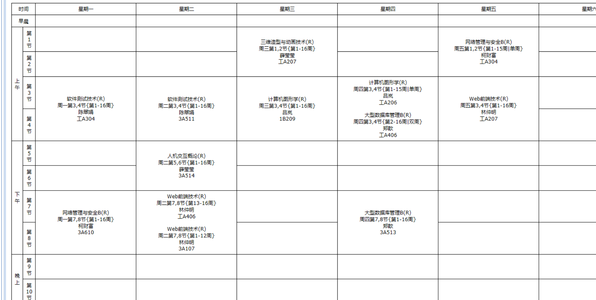

- 看以上图,块级框的宽度将会等于置换内容自身宽度

不过有趣的是,如果明确指定width是一个具体值,则可以覆盖这个规则,且若只使用width具体值,

那么置换内容的高度将会等比例缩小/放大,反之依然,只使用height具体值(或加width为auto),width也会等比例放大. 

还有一点: height也可以使用auto,其效果和width使用auto一样.

```html
<style>
    img {
        width: 200px;
    }
</style>
<body>
    
</body>
```

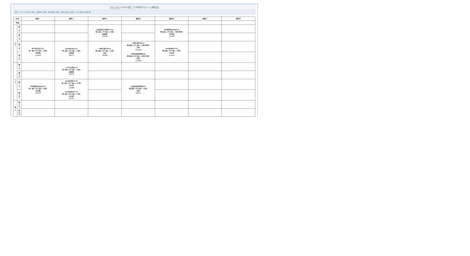

# 纵向格式化

## 讲在前面的话

前面讲了很多的横向格式化,你们肯定也一直抱有一个疑惑,即纵向格式化呢?别急嘛,现在这里我所准备讲的就是纵向格式化.

那么纵向格式化和横向格式化有什么区别吗?当然是有区别的,不过类似的地方也很多. 现在我就带你们领略一下纵向格式化的风采.

**而且请注意:纵向格式化和横向格式化是大有区别的!!!**

## 描述

在**默认**情况下,块级元素中的内容[的高度,又或者说**内容区**域的高度]决定了该元素 块级框的高度. 因为font-size大小就是内容区高度,

​	*( 当块级框没有内边距,没有边框,没右外边距的话,块级框的高度等于内容区高度,但是内容区并不决定宽度, 因为块级框宽度是随初始容纳块增加/减小. ).*

​	*PS:单独的一个块级框默认情况下是不存在高度的,但宽度会等于视区的宽度*

~~但是若存在块级元素存在边框,那么边框也的宽度也会将之计算进去,即边框高度+内容区高度 = 块级元素可见区域高度.~~

​	删除线部分是错误的理解,因为这里是默认情况,且指的是height属性值对块级元素自身生成的块级高度的作用,而不是容纳块的作用.

简单来说:

​	默认情况下,一个块级元素中的段落越高,行越高,又或者字体越高,边框越高,那么其块级框中内容区的高度也会越高,3行的高度height明显比5行的高度height小.

## 块级框的高度会受其宽度所影响

有意思的是,内容的宽度(内容区的宽度)也对内容区高度也有所影响. 例如:段落越窄(内容区的宽度越窄,元素块级框为了包含内部的所有内容,高度就越高.

```html
<style>
    p {
        background-color: silver;
        width: 30px;
    }
</style>
<body>
    <p>中华人名共和国</p>
</body>
```

- 若不存在width:30px属性的情况下,请看以下渲染结果:

  

  其高度为20.8px.

- 若存在width:30px的情况下,请看以下渲染结果:

  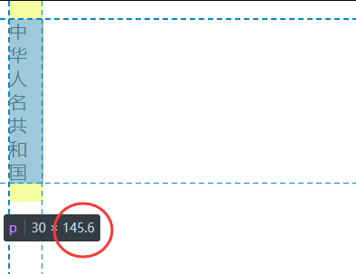

  在宽度指定,高度未指定的情况下,块级框为了包含所有内容,所以不得不增加了高度.

- 而且请注意:我这里用的是汉字,如果有西方文字,例如英文,虽然块级框元素的宽度也会影响高度,但是其效果较小,请看以下图:

  

  

  一个是36.8px,一个是55.2px,但是第二幅图为什么会是这样子,这里不予说明.

  **只需要知道块级框的宽度能影响高度即可.**


## 纵向格式化属性

### 描述

终于到了纵向格式化的属性了,它和横向格式化属性其实没有差多少,只是左右改成了上下而已,且都是7个属性

这七个属性分别为:

- ### margin-top 上外边距

- ### border-top 上边框

- ### padding-top 上内边距

- ### height 内容区高度

- ### padding-bottom 下内边距

- ### border-bottom 下边框

- ### margin-bottom 下外边距

毕竟横向和纵向格式化的属性都是同一个块级框中,它们有这种雷同性很正常,毕竟它们是矩形,又不是三角形...

且纵向格式化的7个属性之和必须也等于该元素生成的块级框的容纳块的内容区高度,即等于父辈块级元素生成的块级框的**height属性值**(不会包括容纳块的外边距,内边距和边框).

​	*PS:怎么样,是不是仿佛看见了横向格式化的描述,我在书写此的时候也有这样的感觉*

### 使用auto作为属性值

和横向格式化一样,纵向格式化其中的三个属性若使用auto作为属性的值,也会得到不同的处理效果.

这三个属性值分别为:height,margin-top,margin-bottom.

​	而其余值:上下内边距, 上下边框在不设置其属性值的情况下默认取0,这点也同样如同横向格式化属性一般. 

​	且还有一点: 若设置内边距(上下左右)属性,那么它的属性值必须为具体值.

​	若设定了边框(上下左右)**式样**,例如设置了border-style属性值,那么边框的默认取值将会被强制改变为不具体的medium值,除非你设置了边框宽度/高度.

#### 上/下外边距设为auto

有趣的是,在常规流动模式下,如果把块级框的上,下内边距(margin-top,margin-bottom.)其中1个/全部设为auto值,二者都将会被自动计算为0.

所以这也就代表着,将元素块级框的上下外边距设为auto,实际上就是设置为0.

​	*定位元素和弹性和元素生成的元素框对设为auto的上下外边距的处理方式会有所不同.*

### height属性详解

#### 定义

在**默认情况**下,height属性值定义的是内容区的高度,

除非设置box-sizing的属性值为border-box,那么height属性值定义的就是其可见区域（边框（含）以内）的高度,和width一样.

#### 描述

CSS是一个很神奇的东西,通过CSS我们能做到许多不可思议的事情.

就好比现在我要说的这个: 我们可以使用CSS为任何**块级**元素设定具体的高度.

​	*ps: 这里说的是块级元素,因为width和height属性无法用于行内元素,在FireFox会提示,请看以下图示:*

​	

且和横向格式化属性中的width属性一样,在**默认情况**下,height属性值定义的是内容区的高度,而不是可见区域的高度(即(含)边框之内的区域).

其height属性值带来的高度以什么为基础增加也和width属性一样,即受box-sizing的属性值影响.

​	*即若box-sizing的属性值为border-box,那么height属性值定义的就是其可见区域的高度,和width一样.*

并且height属性只有两个取值: 一种为auto,一种为非负值的具体值(可以是0,但是决不能小于0,否则整个当前样式无效)

#### 若指定的height属性值>显示内容所需的高度

**在默认情况下**

若我们设置一个块级框的height属性值>显示内容所需的高度会发生什么呢? 请看以下示例:

```html
<style>
	p {
        height: 10em;
        background-color: silver;
    }
</style>
<p>
	yomua
</p>
```


蓝色的区域为内容区域,黄色区域为外边距,红色圆圈为height属性值.

内容区域会很容易被误认为是内边距,因为它实在是高出yomua字体高度太多了,但是请相信,它依然是内容区域.

#### 若指定的height属性值<显示内容所需的高度

**默认情况下**

在我们的想象中,如果指定的高度<显示内容所需要的高度,那么所需要的内容一定会有一部分/全部看不见.但是实际上,并不会这样子.

因为如果发生这种情况,那么浏览器(用户代理)需要提供查看全部内容的方式,而且前提是不能增加元素框的宽度. 而用户代理的具体实现的方式(具体行为)取决于overflow属性.

这种情况请允许我用一个例子说明,这样会更加直观

```html
<style>
	p {
        height: 10px;
        background-color: silver;
    }
</style>
<p>
	yomua
</p>
```

在以上的示例中,你会发现和 *指定的height属性值>显示内容所需的高度* 此标题下的示例几乎一样,唯一的区别就是10后面的单位,一个是em,一个是px.

而10px很明显的西澳娱yomua的字体高度,那么会出现下图的情形


老样子,蓝色区域为内容区域,黄色区域为外边距,红色圆圈10为高度.

用户代理不折不扣的讲height属性值指定的内容区高度10px完美的显示了出来,没有违反任何规范,但是神奇的是: 本应该在内容区域中的内容竟然"跑"了出来.

这是为什么呢? 我记得刚才说过用户代理的具体行为取决于 overflow这个属性,是的.

至于为什么,这里先不加讨论.(其实我也不会,但是肯定是因为overflow这个属性.)

#### 百分数的height属性值

##### 描述

是的,与width相同,height的属性值也可以使用百分数来作为高度,且这个百分数的height属性值的具体计算值 是相对当前块级框的容纳块的高度height属性值而言的.

##### 示例1,明确指定height属性值

请看以下示例.

```html
<style>
    div {
        height: 6em;
        background-color: red;
    }
    p {
        height: 50%;
        background-color: silver;
    }
</style>

<div>
	<p>yomua</p>
</div>
```

p元素的height属性值为50%,其就等于容纳块的高度的50%,在这里也就是等于 6em * 50% = 3em,简单易懂. 请看一下渲染结果


容纳块的高度height为6em,换成px则是96px, 图中的蓝色椭圆圈起来的48px则是p元素的50%,即96px的一半:48px.

##### 示例2,不[明确]指定height属性值or值为auto

容纳块不指定height 和指定height值为auto其效果都一样.

###### 容纳块容纳一个子块级元素

示例1中的容纳块是有明确指定的height属性值的,但是若没有指定值,或者指定值为auto,那么又会发生什么呢?

```html
<style>
    div {height: auto;}
    p {
        height: 50%;
        background-color: silver;
    }
</style>

<div>
	<p>yomua</p>
</div>
```


如果不写height或者将值设置为auto,~~那么就会回到最初 纵向格式化-描述 中说的:当前元素的块级框的高度 = 元素内容的高度 = 容纳块的高度~~

~~即容纳块的高度也会和元素的高度一样.(除非box-sizing属性值为border-box)~~

被划掉的都是理解错的东西!!! 被划掉的意思应该是: height属性值设置元素的块级框的高度时发生的事情,而不是设置容纳块高度会发生的事情.

因为容纳块的高度是等于7个属性之和的啊! ~~是肯定会包括边框的~~. 接下来应该是: **那么容纳块的内容区高度 = 子块级元素7个属性之和的高度.**

​	*注意:不要将容纳块/子元素height属性值设为0,因为无论将哪个height设置为0,就代表着另一方一定为0,这样会使元素没有高度,就连背景色都会消失.*

​	*默认情况下,内容不会消失.因为我们说过,用户代理会提供查看全部内容的方式,除非使用overflow属性改变用户代理的具体行为.*

###### 容纳块容纳多个子块级元素

- #### 容纳块<u>无</u>内边距,边框(默认情况下)

在*上面我们的示例2-容纳块容纳一个子块级元素中*,容纳块只容纳了一个子块级元素,但是若为多个块级元素,此时容纳块的高度设为auto,或不写时,

将会等于什么呢?是等于子块级元素中的内容高度还是其他什么?

显然,这需要一个示例,请看以下下例子:

```html
<style>
    div {
        height: auto;
    }

    p {
        width: auto;
        background-color: silver;
    }
</style>
<div>
	<p>yomua</p>
	<p>yomomuomuomuomuomuomuomuomuua</p>
	<p>yomomuomumuomuomuua</p>
 </div>
```

我们先直接看用户代理(浏览器)渲染出来的结果是什么:


很明显的,此时容纳块的高度不会是子块级元素中的内容的高度了,它已经变了.

变成了最上边(第一个)子块级元素的上内容区边界(上边框)到最下边(最后一个子块级元素下内容区边界(下边框)的距离.

​	*(或者说上边框也行,因为这里子块级元素没有边框,在没有边框和内边距的前提下,内容区就是整个可见区域.* 

​	*如果容纳块有上下边框or上下内边距,那么容纳块的高度又会不一样,接下来我会说到)*

从这个容纳块的高度我们可以发现,默认情况下(即元素存在外边距)第一个和最后一个子块级元素的外边距是会"游离"在容纳块之外的.

也就是说默认情况下,至少有两个子块级元素,它们的外边距会"跑到"它们所属的父辈块级元素的可见区域的外部.

或许有些奇怪,但是这没什么好担心的,这属于正常现象,我将会在下一节说明.

- #### 容纳块中的多个块级元素<u>有</u>内边距,边框

**有上下边框**

现在我们要讲的是,刚刚说到的,如果容纳块存在上下边框,上下内边距,那么容纳块的高度又会以什么为基础呢增加/减少呢?

请看以下示例:

```html
<style>
    div {
        height: auto;
        width: 100px;
        border-top: 1px red solid;
    }
    p {
        background-color: silver;
    }
</style>
<div>
	<p>yomua</p>
	<p>yomomuoa</p>
	<p>yomomuomuua</p>
</div>
```


请看以上示例和渲染结果,我们轻松的可以看见红色直线的是容纳块(父辈块级元素的块级框)的上边框,此时再看红色箭头指的地方,那里是第一个p元素的外边距的上外边界.

而被蓝色虚线框着的蓝色区域是div的块级框,也就是p元素的容纳块.

接着,我们发现容纳块的上边框的底端线刚好处于第一个p元素的上外边界,这代表着:**若容纳块存在边框,则容纳块内容区计算高度时会将其内部子块级元素的外边距计算进去.**

但是如果你们再看,会发现容纳块的底部却没有将最后一个p元素的外边距计算进去, 而这是因为,我们并没有设置容纳快的下边框.

所以,有一个呼之而出的答案,即:**容纳块上下边框哪边被设置了具体值,才配将第一个/最后一个子元素的外边距计算进去,作为自身哪边的高度**

​	*你可能会有疑惑:如果子元素存在边框呢?拜托!!! 这个和这里有什么关系吗?*

​	*这里讲的是容纳块存在多个元素且height为auto/未设置的情况下,容纳块的高度是怎么计算的.跟单个子元素的7个属性加起来 = 容纳块高度没有任何关系.*

也就是说,**在常规流动模式下,容纳块的高度height为auto属性值/未设置时,用户代理处理将auto值转换成计算值时,**

**其容纳块的高度在容纳块存在上下边框或上下内边距时,哪边有被设定为具体的值,那么就会将哪边的子块级元素的外边距计算成容纳块的高度.**

**有上下内边距**

为了证明以上说有上下内边距和有上下边框是一样的情形,这里我也将给出示例.

```html
<style>
    div {
        height: auto;
        width: 100px;
        padding-top: 50px;
    }

    p {
        background-color: silver;
    }
</style>
<div>
	<p>yomua</p>
	<p>yomomuoa</p>
	<p>yomomuomuua</p>
</div>
```

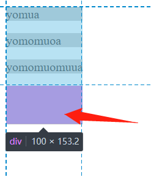

咦?  有人肯定知道红色箭头指向的紫色区域是容纳块的内边距,但是最后一个p元的外边距呢?不是说上下内边距会影响容纳块将子块级元素的外边距作为高度加起来计算吗? 现在外边距呢?

当然了,我怎么会骗你们呢?只是因为这个例子有些不寻常,

因为容纳块内边距的高度超过了子块级元素的外边距高度,所以就会造成容纳块自身的内边距高度覆盖了最后一个p元素的外边距.

从而导致,你们出现的这样的疑惑.我们将容纳块的下内边距值调小,你们就会发现,这其实是并没有错,假设div的padding-bottom为1px,则渲染结果为:

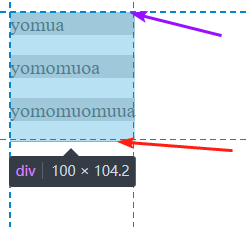

注意到了吗,红色箭头指向的地方正好是最后一个p元素的外边界,而蓝色箭头只是想再强调一句:哪边有边框/内边距,哪边才会计算子元素的外边距的值.

如果容纳块边框,内边距都存在的话...一切依然是如此,并没有什么不同.该算的外边距会算,该超过外边距高度的会超过.

## 折叠的纵向外边距

### 定义

目前来说,相邻的纵向块级元素的外边距,外边距值大的那方将会折叠外边距值小的那方.

**2020/2/29**

### 描述

在将这个标题之前,我相信,诸位都已经发现了,外边距是真实存在但是除了God之外谁都看不见.

- God:用户代理,通常是浏览器.

所以一个块级元素的外边距是会被渲染模型时体现出来的,比如:将一个块级元素的上外边距设为100px,那么它会离初始容纳块的上边界100px的距离.

- 初始容纳快:根元素html的容纳快,浏览器的可显示内容区域,宽/高度随着浏览器的可显示区域增大/减小.

而上面的元素框基础 -描述 中我们也说过外边距的特点.我也相信你们肯定已经很了解外边距了.

但是你们知道外边距是会折叠的吗? 这是意思呢? 且听我娓娓道来.

首先被折叠的外边距只能是上下外边距,而不是左右外边距. 因为行内元素和行内元素,行内元素和块级元素的任何外边距都不会被折叠.

其次这里指的是相邻的纵向块级元素的外边距会被折叠,而且只有外边距有这样的折叠"特效",其他的,如内边距,边框(若有的话),绝对不会和任何区域折叠.

### 示例

```html
<style>
    p {
        background-color: silver;
        margin-bottom: 100px;
    }
    h1 {
        background-color: silver;
        margin-top: 50px;
    }
</style>
<body>
        <p>yomua</p>
        <h1>yomua</h1>
</body>
```


请看下面的块级元素h1的上外边距为50px,上面的块级元素p的下外边距为100px,若纵向外边距不发生折叠,那么p和h1元素之间总共产生的外边距距离应该为100+50=150px.

然后实际上却不是这样,p元素的下外边距100px将h1元素的上外边距50px折叠了,也就是将之覆盖掉了,并没有产生50px的额外外边距距离.

但是请注意:我这里说的是折叠,而不是消灭,也就是说,虽然h1元素的上外边距被折叠了,但是实际上h1元素的上外边距仍然存在.

## 负外边距

和横向格式化一样,纵向格式化的外边距也可以是负值,且会造成一些令人困惑,或者说是有趣的效果.

​	*我这里指的是将元素的块级框的外边距设为负值,而不是指容纳快的设为负值.但是若将容纳块的左外边距和上外边距设为负值,整个容纳块(含)里的内容都会随之移动*

​	*而右外边距和下外边距它们不会使容纳块移动,而是会使附近的元素移动.*

### 上外边距为负值

若元素的块级框的上外边距为负值:

```html
<style>
    div {
        width: 420px;
        background-color: silver;
    }
    p {
        margin-top: -50px; 
        border: 3px solid red;
    }
</style>
<div>
	<p>
		yomua
	</p>
	我是div元素内容
</div>

```

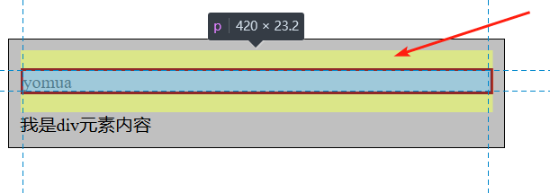


第一幅图是还未将p元素的上外边距设为负值的情况,第二幅是已经设置为负值的情况.

我们知道默认情况下: 容纳块内容区的高度 = 子块级元素生成的块级框的高度(上下外边距高度 + 边框(含)内的高度) = 7个属性之和

​	即容纳块的高度(不含边框高) =  子元素上下外边距高度 + 上下边框高 + 上下内边距高度 + 内容区高(如果运行以上例子(不含div元素内容),会发现其容纳块内容区高度为55.2px).

所以将子块级元素的上外边距设为负值,会造成容纳块高度减小,内容上移.

同时子块级元素本身也会发生上移情况,因为上外边距决定了子块级元素生成的块级框会里初始容纳块的上边界有多少.

但是下边的下外边距为负值却只会发生容纳块高度减小,内容上移.不会发生子块级元素本身上移.


### 下外边距为负值

常规流动那个模式,纵向格式中,子块级元素的下外边距为负值会造成容纳块高度变小,导致其**内容上移**,但是块级元素本身除了外边距为负值以外,是不会移动的.

因为子块级元素的下外边距决定的是它和下面的元素离得有多远,或者离初始容纳块(浏览器可显示区域)的下边界有多远.所以为负值并不会造成影星.

​	*非常大的正值也不会,只会让子块级元素的下外边距变得非常大而已,但是却不会超过初始容纳块的下边界,因为浏览器可显示区域的下边界是可以近乎无限增加的,浏览器可显示区域中内容变多了,不是右边就会多个下拉框吗?*

```html
<style>
    div {
        width: 420px;
        background-color: silver;
        border: 1px solid black;
    }

    p {
        margin-bottom: -50px;
        border: 3px solid red;
    }
</style>
<div>
	<p>yomua</p>
	我是div元素内容
</div>
```


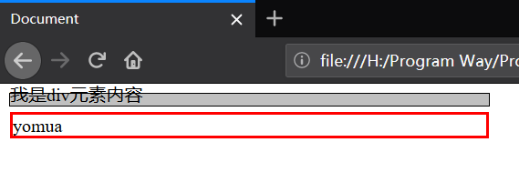

注意到了吗.第一幅还未设置下外边距为负值的渲染情况.

第二幅是已经设置下外边距为负值的渲染情况.

我们能很明显的发现div元素内容上移,且容纳块高度减少,甚至容纳块有一部分都被浏览器吞了. 而子块级元素的下外边距因为为负值,也会上移,导致也被浏览器吞了.

### 注意

如果因为负外边距导致的元素重叠,很难分清哪个元素在上边.

且如果你为使用负外边距作为值的元素或者和负外边距作为值得元素在一起的元素,添加背景色,后续元素得背景色非常有可能遮盖前面得元素得内容.

这是因为浏览器是从头到尾按顺序渲染元素的,在常规流动模式下,如果文档中位于后面得元素与前面得元素重叠了,则后面的元素理应覆盖前面元素得内容.

# 注意事项


- 块级元素生成的元素框为块级框,此框包括:外边距,边框,内边距,内容区,以及孤儿轮廓)

- 块级元素的容纳块 != 块级元素自身生成的块级框

  块级元素的容纳块的可显示区域宽度（边框（含）以内区域） != 块级元素生成的块级框(7个属性)的宽度,高度也是如此（因为包含外边距）

- width和height默认情况下指内容区的宽度和高度,有box-sizing:border-box属性值的情况下指可视区域(边框,内边距,内容区)的宽度和高度.

- CSS的每个元素生成的元素框有3种:

  ​	块级元素生成的元素框--块级框

  ​	行内元素生成的元素框--行内框

  ​	行内块级元素生成的元素框--行内块级框.

- 块级元素的父元素几乎都是块级元素.

  若不是,则...你写错了.
  
- 只有3个横向格式化属性/纵向格式化属性才能设为auto,且若设为auto会得到不同效果.

- 边框只接受长度值,不接受百分数

- ​    ~~容纳块指的是父辈块级元素生成的块级框,所以容纳块的宽度包括外边距的宽度.~~

  ​	~~但是横向格式化/纵向格式化的7个属性之和（子元素) = 容纳块的可见区域内容区的宽度/高度 = 父辈块级元素生成的块级框的内容区的宽度/高度 =   父辈块级元素的height/width值.~~

  ​	~~**并没有包含容纳块的外边距和内边距和边框的宽度/高度,这点非常关键.**~~

  不同情况下，子元素的容纳块是不同的。

  如：以 absolute 定位的元素，若其父辈元素为块级元素，则该元素的容纳块为父辈元素的边框（不含）以内区域；若父辈元素为行内元素，则该元素的容纳块为父辈元素的内容区（***参见：<定位.md>***）。

  在常规流动模式下，一个块级元素的容纳块是父辈块级元素的边框（不含）以内区域。

- 某些情况下,子块级元素的外边距会游离到容纳块之外.

- ​    默认情况下,height属性值决定块级元素内容区高度,在有box-sizing:border-box的情况下,决定可显示区域高度(即边框(含)之内的区域高度); 这和widht一样

- ​    容纳块中存在**多个**块级元素的情况下:

  ​		容纳块的height值为auto/未设置height,且它的上下边框与上下内边距没有被设置,则其容纳块的高度计算等于: 

  ​			*最上面那个块级元素的上**内**边界到最下面那个块级元素的下**内**边界.*

  ​		容纳块的height值为auto/未设置height,但是设置了上下内边距/上下边框,则容纳块的高度此时等于:

  ​			*最上面那个块级元素的上**外**边界到最下面那个块级元素的下**外**边界.*

  ​	如果容纳块只有一边有设置边框/内边距,则只有那边在计算高度时才会计算其中第一个/最后一个块级元素的外边距.

- ​    相邻的两个块级元素之间的纵向外边距会发生折叠(外边距大的折叠小的),但是块级和行内,行内和行内并不会发生折叠.

- 负外边距是无法被直接显示,GodModl中也无法直接看到,除非在GodModel中提供得盒子模型才能看见以冰冷的数字体现出来的负外边距

- ​    line-height属性在单个文本行中与多个文本行中的处理情况不同.详情请看<行的构成.md> - 行高line-height - 描述以及示例,还有<行内置换和非置换元素.md>

