[TOC]

# 讲在前面的话

在本章中或者说块级元素和行内元素中,所有的行为都不适用于表格元素,因为表格元素和块级元素/行内元素的行为有着极大的差异.

表格装饰是一个全新的领域,而且异常繁琐.

本章讲的行内置换元素和非置换元素有些许差异,这里将一一说明.

# 行内元素

## 行布局

### 基本

在理解行内元素及其行内格式化之前,我们需要明白行内元素的内容是怎么布局的,否则连布局都不清楚,就和不会说话就想和正常人交流一样,是无稽之谈.

行内元素的布局和块级元素先比较,还是较难一些的. 对于块级元素而言, 它自身生成的块级框通常不与其他内容共处一行.*(在我们讲到行内格式化会说到这一点.)*

不论是在块级元素中还是在行内元素中,你或许有个这么疑问: 元素中的内容(文本行)是怎么被显示出来的呢?为什么要这么排列,不能换种方式吗? 我们又该如何控制这些内容的排列,显示呢?

先别急,这里听我慢慢道来.

为了弄清楚文本行(内容)是怎么产生的,我先来以一个文本行(内容很长)特别长的元素为例。

​	*PS:为了接下去的说明,我这里先说明:任何文本行本身都是行内元素,无论这个文本行是否在行内元素中.*

​	*如: `<p> Are you yomua? </p>`Are you yomua? 是一个块级元素中的单行文本, 但是Are you yomua 是一个行内元素的内容,而不是块级元素的内容.*

​	*此字符串如同存在于一个虚构的行内标签中. 这里我不予解释,我将在下面的 行内格式化中说到.* 

```html
<style>
    p {
        width: 50px;
    }
</style>

<body>
    <p>
        yomua is my baby,I Love Her.Date:2020/3/2
    </p>
</body>
```

以上的示例是将一个行内元素(那串文本行存于一个虚构但又真实的行内标签中,你可认为存在\<line>,\<span>这些无格式行内标签中)放在块级元素中,其渲染结果以下所示:

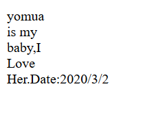

通过渲染结果我们可以发现,本来应该是一行文本行,变成了多行. 

这个示例非常简单,因为我们几乎没有做什么,只是将单行文本变成了多行文本,使文本行从上到下排列显示.~~**从而导致了每一行各存在一个虚构的行内元素中.~~**错误理解.它们仍属于同一个行内元素,请在GodModl中查看**

**若我们在以上示例的基础上**,将真正的行内元素添加到块级元素中去,然后为行内元素添加**边框**,你们将会发现: 

在一个行内元素的多个相邻的文本行中,边框是会重叠的,且相邻的两个文本行(行内元素),上一个文本行的下边框的上部会在下一个文本行的上边框的下部,从而导致重叠的那部分的边框如同多了一倍的高度.

```html
<style>
    p {
        width: 50px;
    }
    span {
        border: 5px solid red  ;
    }

</style>

<body>
    <p>
        <span>
            yomua is my baby,I Love Her.Date:2020/3/2
        </span>
    </p>
</body>
```

我们改的地方很少,只是增加了行内元素与行内边框,其余不变.增加行内元素和边框的目的是为了让大家更清楚行内元素的布局. 请看一下渲染结果

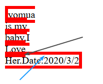

黑色箭头代表Love文本行的上边框,蓝色箭头代表Her文本行的下边框.

至于是怎么看出来的,非常的简单.不妨你们先假设若边框不重叠的情况.是不是就懂了. 即若边框不重叠,那么Love文本行那里如果用的是蓝色箭头指的线作为边框,则会导致边框覆盖过Love字体.

但是这是一种不可能存在的情况,在默认情况下,没有修改任何特殊的属性,边框不可能主动覆盖内容区的内容,或者说用户代理和CSS规范绝不允许这么做.

但是,我说的是但是,如果你让然无法明白,你可以尝试使用line-height属性将行距(**这里是多行文本的情况**)增大,然后盯着各行的边框,慢慢再将line-height属性减小到最初的大小,你就很容易理解以上的情况了. 

这里我给出动态图演示.


### 块级元素中行内元素的多行文本使用text-align属性

#### text-align详解

**text-a1ign 属性定义行内内容*（例如文字,文本行）*如何相对于它的父辈块级元素内容区对齐。**

**即定义当前块级元素中的子行内元素的内容相对于它(块级元素内容区)对齐的方式**

text- align并不控制块元素自己的对齐,只控制它的行内内容的对齐.

也就是说,text-align属性若用于块级元素中才会有作用,而且作用的是此块级元素中的行内元素的内容(虚构的行内元素的内容也是一样被作用).

而如果直接用于行内元素,不会起到任何作用.因为text-align属性定义的是行内内容如何相对于父辈块级元素对齐.

 而行内元素的内容依然为行内元素,不存在块级元素的父辈,那么此内容就无法相对于父辈块级元素对齐了.

简单来说,即: text-align属性只会作用域块级元素中的子行内元素内容,即使是虚构的行内元素亦然一样.

#### 使用text-align

##### text-align:justify

###### 示例

首先我们需要将行内元素放入块级元素,且行内元素除了边框之外不需要拥有任何的CSS样式,只需要为父块级元素设置样式即可.

因为行内样式可以从父块级元素那里继承可以被继承的属性,而边框属性正巧无法被继承.

```html
<style>
    p {
        text-align: justify;
        background-color: silver;
        width: 100px;
    }

    span {
        border: 1px solid red;
    }
</style>

<body>
    <p>
        <span>
            I am yomua,Are you? I am three rows, And you?
        </span>
    </p>
</body>
```

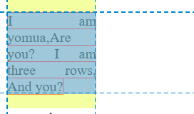

我们这里例子是将p块级元素中的内容设为两端对齐,同时由于span行内元素处于p中,所以span这个行内元素的内容也处于text-align属性作用范围之内,所以它的内容也会被两端对齐.

那么就出现以上的渲染结果. 请看第一行,I 和 am 被用户代理强心拆开靠着父辈p块级元素的内容区的左右两端边界.

而此时看到第二行你或许就会有疑问,为什么这行没有两端对齐呢? 这个问题有点繁琐,但是却不难,不过需要从其他地方讲起,才会更直白,先看以下示例

###### **行内元素内容超出父块级元素宽度却没换行的原因**

- ```html
  <style>
      p {
          width: 100px;
      }
      span {
          border: 5px solid red  ;
      }
  </style>
  <p>
  	<span>
  		yomuaismybaby,ILoveHe.Date:2020/3
  	</span>
  </p>
  ```

  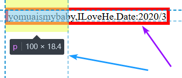

  ​	有些聪明人或许已经发现了,这个例子和 基本 - 第二个示例 近乎一样,唯一的区别是行内元素span的内容(文本行)都不存在了空格.

  ​	而就这仅仅一个空格,从而导致了和第二个示例的渲染结果,天差地别的效果. 

  ​	是的,就是因为空格的原因. 请看蓝色箭头指向的蓝色虚线,这两个蓝色虚线框着区域正式父辈块级元素p的内容区域.

  ​	而紫色箭头正是父辈块级元素p中的子行内元素span的可显示区域.通常来说,行内元素的可显示区域是不会超出父辈块级元素的内容区宽度(or高度)的

  ​	而之所以这里的子行内元素在超出了父辈块级元素限制的宽度之后仍未折行, 这是因为**浏览器会提供查看全部内容的方式**(除非用overflow属性,将之超出隐藏).

  ​	并且默认情况下,**文本行未折行代表着文本行还未完结,**那么关键来了,如何判断一个文本行有没有完结呢? 根据逗号吗?哈,开个玩笑的. 	   

  ​	是根据有没有空格,折行符(回车)以及< br>等这些来判断一个行究竟是否完结,**只有行完结,那么该行才会折行**,否则用户代理User Agent将会提供查看此行全部内容的方法.

  ​		*(除非用overflow属性改变用户代理的具体行为)*

  ​	这里还要再提一句: **默认情况下,在子元素的文本行的下一组词未超过限制的宽度(父元素的内容区宽度)时,空格或者折行符等并不会使行内元素的文本行折行**. q请看以下示例.

- ​	一组词:以空格/折行符等判读是否是一个词,其定义如CSS的属性选择符,<CSS权威指南P57>

  ```html
  <style>
      p {
          width: 100px;
      }
      span {
          border: 1px solid red  ;
      }
  </style>
  <p>
  	<span>
  		yomua is my baby,I Love
  	</span>
  </p>
  ```

  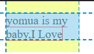

  ​    很明显的,第二行和第一行都未超过p元素的内容去宽度.此时,若我们将第二行的Love词的中间用空格,甚至用折行(即回车,用< br>则不同)将之隔开,那么渲染的结果会是什么呢?

  ​	以下为代码修改式样.

  - `Lo ve`  

  - `Lo       ve`

  -  `Lo`

     `ve`

  其渲染结果为:

  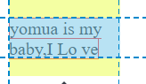

  ​	你们能会疑惑这三个结果渲染的是一样的吗,为什么只有一张图?是的,当然一样,原因是因为在默认情况(例如,white-space不为pre等)下,

  ​	HTML元素中的内容的多余空白(包含空白符,换行符,< br>元素不在此列)会被忽略.

  ​	而再加上【若子元素的文本行的下一组词未超过限制的宽度时,空格或者折行符等并不会使行内元素的文本行折行】这个原因,

  ​	就导致了出现以上渲染结果的情况.

  ​	**其实反过来说也是一样正确的,即默认情况下,若子元素的文本行的下一组词超过限制的宽度,则不论当前词离父元素内容区边界有多近/远,这下一组词都会另起一行.**

  ​	至于< br>这个元素它并不属于换行符或者空白,它属于HTML元素标签,是在文本中生成一个换行（回车）符号,它是强制生成的.并不会被忽略.

###### 示例_续

所以通过以上的"折行"示例与讲解,我们就能明白`I am yomua,Are you?`这一出纳内容中的 `I am`会独自属于一行然后两端对齐,因为它的下一组词 `yomua,Are`若加上 `I am`则会超过父元素的限制宽度,所以 `yomua,Are`才会另起一行.

​	***但是要记住: 无论有多少行,此字符串都属于同一个行内元素,你在GodModel中将鼠标移动到此span元素上方,你就可以发现它们被同一个内容区包裹着.***

不难看出,此示例的渲染结果中,并不是所有行都会进行两端对齐的操作.这是因为此示例中第二行只存在1组词 `yomua,Are`,且下一组词  `you?` 若加上来则会超过父元素内容区宽度,所以被强制换行,

用户代理也非常想实行两端对齐的操作,可无奈它做不到啊,它能将词与词之间的间隔分开然后强行两端对齐,

但是默认情况下用户代理可无法做到将一组词里面的字符的间隔分开从而强行让行内元素文本行两端和父元素的内容区边界对齐.(如果将 `yomua,Are`改成 `yomua , Are`就会被用户代理实行两端对齐的操作,其渲染结果为:

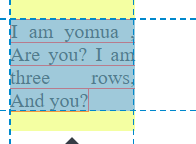

看到了吧,不仅被用户代理实现了两端对齐,还让 `yomua`和 `,`跑到了第一行,因为它们加上本来的第一行 `I am`并不会超出父元素内容区宽度.

需要注意的是,文本两端对齐会让每一行宽度都尽量能满足两端对齐,这也就导致了自身宽度和父辈块级元素内容区不等的子行内元素内容,被User Agent强行调整了字母及单词之间的距离.

鉴于此,使用text-align:justify的文本的word-spacing属性可能会被覆盖,但是如果是letter-spacing,且它的值是一个长度,那就无法被text-align:justify覆盖.

##### text-align:left/right

left,right分别为左对齐,右对齐,这两个对齐之间的效果是相反过来的,看名字也知道,所以这里将它们融会在一起将.

```html
<style>
    p {
        background-color: silver;
        width: 100px;
        text-align: left;
    }
    address {
        background-color: silver;
        width: 100px;
        text-align: right;
    }
</style>

<body>
    <p>
        yomua is my favorite. You konwo, I love her.
    </p>
    <address>
        TianShenXing, For Number 990##.
    </address>
</body>
```

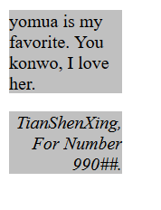

通过其以上示例和渲染结果,我们不难发现,left和right对齐方式它们完全是反过来的.

left:左对齐,其所有指定了text-align:left的块级元素中的行内元素的文本行的对齐方式,都为以父辈块级元素的内容区**左**边界为基础开始渲染,从左到右,从上到下,文本行的左边紧紧贴着内容区左边界.

right:右对齐,其所有指定了text-align:right的块级元素中的行内元素的文本行的对齐方式,都为以父辈块级元素的内容区**右**边界为基础开始渲染,从左到右,从上到下,文本行的右边紧紧贴着内容区右边界.

你们获取发现这两段高度相似,事实也确实是这样子.而且你们可能还发现左对齐和右对齐的文本, 并不是每一行都能延申到内容区的边界.还是因为那个理由:即 请看 text-align:justify - 行内元素内容超出父块级元素宽度却没换行的原因.

*这里简明扼要提一下:当前行的下一组词的宽度加到当前中,若超过了父块级元素内容区宽度,则会被强制换到下一行中去.*

不知道各位注意到了吗,左对齐似乎就是在没有写text-align:left的时候,用户代理的默认对齐方式.确实也是这样.

而且右对齐的文字书写方式依然是从左到右,从上到下.除非一些特殊字体是从右到左书写的,才会从右到左书写,不然右对齐并不会改变字体的默认渲染顺序.

**PS:此示例并没有真正的行内标签,而是虚构的行内标签,如<line><span>等.在行内格式化中我会讲到.**

##### center

center:中间对齐.将块级元素中的每一行 *行内元素* 内容沿着块级元素的中线对齐.	

```html
    <style>
        p {
            background-color: silver;
            width: 500px;
            text-align: center;
        }
    </style>
    <body>
        <p>
            I am yomua, who are<br /> 
            you? emmm, yhw?
        </p>
    </body>
```


看到以上的示例和渲染结果,就不难发现我们刚刚说的话.而且请注意text-align的中线对齐是center,而不是medium,刚刚我就犯了这个错误.

而所谓的中线对齐,也就是子行内元素的文本行沿着父辈块级元素内容区宽度/2进行对齐的方式.

##### 总结

对于以上的text-align属性的取值来说,都是文本行排列的最简单的情况,很快的,你将会发现,行内格式化模型比这复杂得多.

在继续深入探讨前,我们不得不再一次强调一下基本术语和概念.

## 基本术语和概念

### 匿名文本

不在任何行内元素中的字符串.(虚构的行内元素是不作数的)

例如: `<p>I am <span> what </span> yomua </p>`. 这个示例中的 `I , am , yomua`就是匿名文本. 它们虽然在虚构的行内标签中,但是虚构的毕竟是虚构的,不是真实的.

而且请注意: 这些匿名文本单词中的空格也是匿名文本的一部分,因为空格也是一种字符.

### 字体框

字体框或许各位还不熟悉,但是我们换一种说法,你们肯定就明白了,即字体中以每个字符的大小而形成的矩形,就是字体框.

所以字体框是由font-size属性控制它的高度的,字号越大,则字体框越大,所以就算是同一个字体中的字符,它们之间的字体框的高度可能大不相同.

而字体框这个概念咋一看有些类似于内容区高度,但是两者之间还是有差异的.

比如内容区还受到其他因素影响,例如存在一个行内元素存在多个文本行,其内容区的高度就会增加.

而且内容区是一个整体的概念,这里的字体框是一种个体概念,字体框属于每个字符都有的一个字体框,就和行内框一样.

但是内容区是容纳这些字体框的一个整体区域,默认情况中,一个元素肯定只存在一个内容区.

**注意:字体框通常是字体内置的大小,并不会被人为改变.而且多数字体的各个字符的字形之间都留有一定的空白,因为字符通常比字体框小一些,除了手写体以外(草书字体),它的字体的字形往往比字体框大.**

### 内容区.

内容区是老生常谈的话题,都讲腻了,你们也看腻了.不过这里还是需要讲的,并且这里将会更全面的讲解. 

对于内容区来说,非置换元素的内容区和置换元素的内容区是不一样的定义.且CSS允许非置换元素的内容区存在着两种定义.

#### 非置换行内元素内容区

##### 第一种定义

将字体中的各个字符的字体框连在一起构成的整体的矩形方框.

##### 第二种定义

 元素中各字符的字形合在一起构成的方框.

##### 总结

从字面意思来看,这第二种定义比第一种定义来的复杂.因为字符的字形也就是font-style属性,有正常体,斜体,倾斜体等.

所以在浏览器渲染种,常用的是第一种定义:字体框合在一起构成的整体的矩形方框.而在我们的CSS笔记中,也都是采纳第一种定义,除非特殊说明.

且注意,我们这里说的是行内元素,所以非置换行内元素内容区等于其里面字体的大小,即font-size的大小. 同时内容区宽度也会受其影响,字越多越宽,那么内容区就越宽.

#### 置换元素内容区

对于置换元素来说,其内容区和非置换元素大不一样,它的内容区是元素自身的高度 + 内边距 + 外边距 + 边框.

也就是等于整个元素框的高度(内容区+内边距+边框+外边距)

或许你在使用浏览器的GodModel时,会发现它们中的"布局"中的内容区指的是被置换过来的元素,而并不包含内外边距和边框,但是相信书本,相信你我,置换元素的内容区就是元素自身高度+内边距+边框+外边距

***详情请看:<CSS权威指南P290 - 基本属于和概念 - 内容区>***

### 行距内容区+内边距+边框+外边距

行距就是个烂大街的概念,我就不讲了.

想要了解的,去看<行的构成.md>

这里只提一句:只有非置换元素才有行距,且控制行距的属性line-height值可能比内容区高度小/大/一样.

### 行内框

<行的构成.md>种也有解释什么是行内框,而且非常详细.

但是依然的是,我这里还要在强调一番.(因为<行的构成.md>种没讲置换元素和非置换元素行内框的区别)

#### 置换元素

先说置换元素吧,因为它的行内框非常简单,即永远等于内容区高度.因为置换元素没有行距.

因为它的内容区就是整个元素框的高度和宽度了,哪里来的行距可言.

#### 非置换元素

##### 文本行默认情况下的行内框的高度

所谓的默认情况,就是说在不存在line-height属性情况下,文本行的行内框的高度.

即此时完全等于置换元素内容区的高度.

##### 文本行存在line-height属性的行内框的高度

即等于: 行距 + 字体高度 = 行内框高度 (= line-height属性值)

​	等于: line-height值 - font-size值 + font-size值.

这样一看,不就是默认情况下的行内框的高度吗,为什么要分为两点来解释.这

是因为,如果你不写line-height属性的话,行内框的高度就不存在吗,是不是?所以要分为两点,一个是存在,一个是不存在.

并且line-height属性值并不是一直会大于font-size值得,可能小于,又有可能等于.这就代表着:**行内框的高度可能小于内容区高度,可能大于内容区高度,可能等于内容区高度.**

所以我们才不能直接说: line-height值就等于内容区高度.因为这是不一定的.

而且需要注意点:行内框在一行中纵向对齐的方式由vertical-align属性决定.

### 外边距

​    一个块级元素和其他元素(块级/行内/行内块级)的外边距会折叠,但是**行内元素和行内元素的外边距不会重叠**

### 行框

行框是行内框的父集,因为行内框决定了行框的高度.

即在一个文本行中,它的行框的高度等于行中最高的行内框的高度,它的行框的底端(下边线)等于行中行内框底边最低的那个.

也就是说,一个文本行中,行内框与字体框一样,存在多个. 而行框和内容区一样,一行中的整体的矩形方框,只存在一个.

且需要注意:就算是一行中的各个行内元素的行内框是一样的高度,但是这并不代表着行框的高度就是行内框的高度了.

因**为行内框所处的位置会影响行框的顶变的位置或者/底端的位置.** 

​	*比如使用vertical-align属性将某行的内容改变位置,那么其内容区和行内框也会被改变位置,那么此行内框的顶变位置也就会被改变,那么行框的顶边位置也会被改变,即行框高度变了.请看行内非置换元素 - 纵向对齐.*

除以上基本概念外,CSS中还定义了一些有用的行为和概念

- 非置换行内元素的内边距,边框,外边距在对应的方框上没有纵向效果,也就是说这三个东西对行内框(包括当前行所在的行框)的高度没有影响.

- 置换元素的外边距和边框对行内框的高度有所影响,进而对其元素中的内容所在的行框的高度也有影响.

  因为置换元素的内容区 = 元素自身高度 + 内边距 + 外边距 + 边框.所以外边距和边框自然对其行内框有所影响,从而影响到了行框.

  至于为什么没有内边距影响行内框..蒽,内边距应该也是影响的.

## 一行中各元素的行内框高度的确定方法

请看<CSS权威指南P291>

# 行内格式化

## line-height与虚构标签

在看了行内元素一章之后,我们终于来到了行内格式这章,你们或许早就已经迫不及待了吧,我也是这样.

首先我们需要明确一个概念,即:所有元素都存在line-height属性. *(不知道什么是line-height属性的同学,请看<行的构成.md>)*

这是一个很显然的概念,因为line-height可以说是行高,没有元素不存在内容吧?所以也就没有元素不存在行高:line-height.

这个属性的值很大程度上影响着行内元素的显示,因此要非常清楚line-height的概念: 其概念是行高,它能控制行距,且某种程度决定行内框的高度(当line-height不小于font-size值时.)

​	*非置换元素上line-height属性存在两种处理情况:* 

​	*一个元素只存在单行文本line-height=上下行距+font-size值.* 

​	*一个元素存在多行文本:line-height =上行距+font-size这个值(多行文本不存在下行距)*

​	*详情请看<行的构成.md>*

在明白了line-height的概念后,接着我们就需要知道一个元素中的文本行的高度是如何确定的,文本行的高度就是行框的高度,并非指内容区的高度.

而行框的高度由内部的元素(行距,行内框)和其他内容(例如文本)决定.line-height属性影响的就是其行内行距或者说行内框的高度.

但是你们或许不清楚,但却非常重要的一点,即:**line-height属性只能影响行内元素,并不会影响块级元素,至少不存在直接影响(请继续往下看).**

这是什么意思呢?这个意思是讲我终于要填坑了,也就是在 *行内元素* 章中我们讲到的"虚构"的行内元素标签,激动吗,要揭开它的神秘面纱了.Hhh,开个小玩笑.

虽然line-height属性只能影响行内元素,但是这并不代表无法在块级元素中设置line-height属性.

请看以下示例:

```html
<style>
    p {
        width: 50px;
        line-height: 40px;
        background-color: silver;
    }

</style>

<body>
    <p>
        yomua is my baby.
    </p>
</body>
```

 															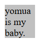

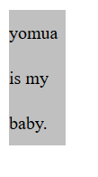

请看以上两个渲染结果,第1个渲染结果是未给p块级元素设置line-height属性时的渲染结果,第二个是设置了p元素的line-height属性的渲染结果.

从这以上连个渲染结果来看,我们很明显的能发现,块级元素p中的各个文本行使用了line-height属性的值,导致各个文本行的行高为40px(相邻两个文本行,上一行的基线到下一行的基线是为行高.)

而这种行为就类似于继承,即块级元素p中的文本行继承了line-height属性,导致它们被line-height属性所影响.

即使不是继承,那么块级元素p的内容也是无法被line-height属性所影响的.因为从理论上来说:**只有行内元素能继承line-height属性时,其中的内容才会继承,也就是才能使用此属性**.

所以块级元素p中内容,即这个匿名文本一定是个行内元素的内容,否则它根本不会被line-height属性所影响.

但是匿名文本怎么存在于行内元素中的?我们怎么没看见呢?

嘿嘿,现在你不妨想想,假设块级元素中的文本行内容(匿名文本)都存于一个虚构的行内标签中,那么这一切就说的通了,例如,用以上的示例来示范:

```html
<p>
	<line>yomua is my baby.</line>
    <line>line是虚构的行内标签</line>
    ....
</p>
```

这样一看,是不是恍然大悟,原来块级元素中的匿名文本其实是存于一个虚构的行内标签中啊!

需要注意的是:<line>元素标签的名字可以是任意的,并不一定要是line,可以是on或者en等等,反之它是虚构的,不是吗?

而且我们前面也说了,即使<line>标签是虚构的,不存在的,但是块级元素中的内容,它们的行为就像有这些标签一样,每行文本(内容)都是块级元素上继承样式.

**所以这才是我们为什么敢提出假设:块级元素中的内容都存于一个虚构的行内元素标签中 的原因**

而前文所讲的:line-height属性只能影响行内元素,无法直接影响块级元素的原因也是在这,因为若一个元素没有内容(无论是行内/块级/行内块级等),则设置其line-height属性没有任何意义.

因为没有内容就没有行框,没有行框就没有行内框,没有行内框就没有line-height,那本来就不应该有的东西,你设置出来了,能影响谁呢?

而如果有一个元素有内容,并使用了line-height属性,那么由于此属性只能被行内元素继承时,其内容才能继承此属性,内容才能使用line-height属性值,

所以块级元素有内容并且使用line-height属性值时,line-height属性才能影响到块级元素的内容,而又因为没有内容就无法被影响.

**所以line-height属性无法影响块级元素本身,只是影响其里面的存于虚构行内元素中的匿名文本行(内容)而已.**

# 行内非置换元素

在大概了解了行内元素和行内格式化之后,我们就以这些知识为基础,让我们讨论一下:只含非置换元素的行或匿名文本,也就是接下来说的都是非置换元素中的文本行或匿名文本)

这里说到匿名文本,是因为:匿名文本是也是存在于一个行内标签中,即使这个行内标签是虚构的.

## 行框的构成

### 描述

行框这个概念我们已经提了N次,这就证明了它有多重要,是的,确实也是这样.

行框代表一个文本行的高度,能不重要吗.(注意:是文本行的高度,并不是内容区的高度)

文本行或者匿名内容的布局都跟它息息相关,这里,我将讲解行框是如何构成的,以及解决一些容易造成思维的误区.

### 构成

#### 行框>内容区高度所造成的渲染样式

首先,对非置换元素或者匿名文本来说,font-size值决定了它们的内容区高度/宽度(字体越大,其宽度越大),这点我想大家也都明白.

然后想要构成行框,我们接下来还要考虑的是line-height属性的值.因为行内框的高度确定行框的高度,这我也不多说了,上面的 行内元素 -  基本术语和概念 - 行框中都有说的.

 而在我们知道了line-height属性值和font-size属性值之后,行内框的高度也就呼吁而出,而行内框的高度知道了之后,行框的高度还不好确定吗?

我们依然使用一个示例来讲解:

```html
<style>
    p {
        font-size: 15px;
        line-height: 21px;
    }
</style>
<body>
    <p>
        <span>inline element</span>
    </p>
</body>
```

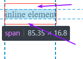

这个示例中存在font-size和line-hegiht属性,且有具体值,所以我们很容易能算出块级元素p中span元素的文本行的行内框的高度 : 

即使用line-height值 - font-size值之后得到的差:6px,然后再一分为2,放入内容区的上部分和下部分,

得出此文本行的上/下行距:3px. 

​	*(这里因为是只存在一行文本的情况下,所以line-height值-font-size值之后还要除2,分出上行距和下行距,具体请看:<行的构成.md - 行高line-height>*

最后将上行距和下行距以及内容区高度(font-size的值)加起来的合,就等于行内框高度.

计算过程为: (21-15)/2*2 + 15 = 21px

然后现在请看我自己画的红色矩形,它就是行内框. 为什么行内框需要我自己画呢?很简单,浏览器并没有显示出行内框这个东西,但是行内框(包括行框)是确实存在的一个概念.

然后我们现在知道,**行内框的高度是大于内容区高度**21-15 =6px的,其中这超过内容区的6px分别为上行距和下行距,即紫色箭头指的空白区域就是上行距和下行距.

​	*注意:行内框的左右两边紧贴内容区左右边界的.*

现在我相信诸位君对行内框有了更深的理解了吧.

那么,此示例的行框还需要我说吗?好吧,我还是说一下:即在此示例中,由于其文本行中的内容的行内框并没有区别,所以这个示例中:行内框的高度 = 行框的高度.

​	*PS:一个文本行中,可能存在多个行内元素,因为行内元素并不折行.这些行内元素的行内框大小不同,会影响整行的行框高度.*

#### 行框<内容区高度所造成的渲染样式

接下来的示例,才会讲行内框对行框的影响究竟有多大,以及若内容区超出了行内框会怎么样.

请看以下示例:

```html
<style>
    p {
        font-size: 12px;
        line-height: 12px;
    }
    strong {
        font-size: 24px;
    }
</style>

<p>
	This is text,
	<em>some of which is emphasized,</em>plus other 		text<br/>
	which is<strong>strongly empha  sized</strong>
	and which is <br />
	larger than the surrounding text.
</p>
```

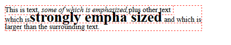

**红色虚线代表行框,因为浏览器无法显示行框,所以只好自己画啦...hhh**

根据以上代码示例,我们不难发现,由于块级元素p中的所有子行内元素都会继承其line-height和font-size属性的值,所以em,strong元素它们的line-height值和font-size值应该和父辈块级元素一样的.

但是由于strong元素本身设置的font-size:24px的权重>其继承属性的权重(*详情了解权重,请看<h5_css_js.doc> - 第二章CSS - 特指度 - 样式优先级对比)*

所以strong元素标签的font-size值为24px,也就是内容区高度为24px.

而根据 行内元素 - 基本属于和概念,我们很容易算出这些各行的行框以及每个行内元素的行内框是多少,由于行框是整体概念,行内框是个体概念,所以先让我们算行内框吧.

需要注意的是,这里是一个块级元素中存在着多行文本,所以其行距不用分为两部分.

首先块级元素p中的存在于虚假的行内标签中的匿名文本的行内框等于 : 12-12+12 = 12px, 而em标签行内框为: 12-12 + 12 = 12px,

strong元素的行内框等于: 12-24 +24 = 12px.也就是说,这三个行内元素的行内框高度都为12px.

蒽..从目前来看,一切的分析和上面的那些示例没有什么不同,行内狂的算法也没有被改变,但是,事实上要比我们想象的复杂得多.

请看strong元素,也就是第二行,第二个文本行中的各个行内狂虽然高度相等,但是由于每个文本行都是基线对齐的*(以字体中的x/X的底边画条直线为基线)*,

所以第二行由于其strong内容区大于其他行内元素内容区的高度,导致了这个文本行中的文本并不是都是一样的大小,也就是它们并不平齐.

再者以上的三行根据行内框的高度而言,其行框高度都为12px,这就代表着第二行的strong行内元素的内容区超出了行框的限制,叠加到了其他行(第一行)的行框中去了.

从而导致的最终结果为:第二行的strong元素这部分文本,显得不太协调.

*在后面,我将说明应对这种行为的方法,以及实现相同基线间距的方法.*

## 纵向对齐

***<CSS权威指南P226和P295>***

使用vertical-align属性即可让指定的行内元素(或表格单元格元素)进行垂直对齐.它的取值有:

1. baseline
2. sub
3. super
4. tup
5. text-top
6. middle
7. bottomm
8. text-bottom
9. <lenght>
10. <percentage>百分比

但是此属性用在表格的单元格元素时,只能使用baseline或top,middle,bottom.

且这以上的10取值只能取其中1个.

纵向对齐可能会影响行框的高度,请看以下示例:

```html
<style>
    p {
        font-size: 12px;
        line-height: 12px;
    }

    strong {
        font-size: 24px;
        line-height: 1em;
        vertical-align:10px;
    }
</style>
<p>
	This is text,
	 <em>some of which is emphasized,</em>plus other 		text<br />
	which is<strong>strongly empha sized</strong>
	and which is <br />
	larger than the surrounding text.
    </p>
```

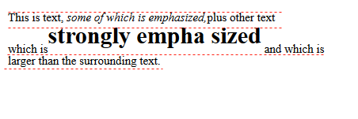

vertical-align:10px;的意思很简单:讲此属性所在的元素向上抬升10px,(负数就是下降),而且器内容区和行内框是随着元素一起抬升/下降的,

所以现在strong元素的行内框是最高的,而不是 在 *行框的构成 - 行框<内容区高度所造成的渲染样式* 的示例中,strong元素的行内框和当前行的其他行内元素的行内框一样高.

所以strong元素所在的当前行的行框高度为:strong元素的行内框顶边到任意一个匿名文本行的行内框的底端的高度.

所以很明显的,行框的高度增加了,并且增加的高度时被抬高的高度.而且需要注意的是:被vertical-align属性抬高/下降的元素(文本行)并不会变成其他行的一部分,也不会与其他行中的内容重叠.

否则这个示例的渲染结果应该是:strong元素与第一行重叠了.

这个属性,也就是纵向对齐并不难,可以看<CSS权威指南P225>,这里之所以会讲,是因为纵向对齐的属性值会影响到到行框,会给行内布局带来影响,所以我们才会在这里稍微提一句.

但是需要注意的是:此属性的值确实不会将指定的行内元素与其他文本行重叠什么的,但是如果是因为其他属性导致本来就会与其他文本行重叠,那么该属性vertiacl-align也无能为为力,例如:

将以上的代码示例,其中的两个line-height属性值改成0,则其渲染结果为:

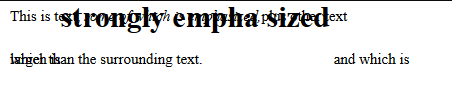

看到了吗,本来就会重叠的文本行,vertical-align也无法起死回生.当前行内框高度高度为0,那么行框高度也为0.

所以如果这样设置,若不是存在vertical-align属性将strong元素向上抬高10px,那么这三个文本行将会重叠在一起

## 控制行高

在前面几节中,我们充分的了解到了line-height属性以及其他各种最基本的非置换元素的行布局的概念,

​	*(即使是置换元素的布局概念我们也稍微讲了几句:比如内容区包括整个元素框,且它没有行距,其行内框高度=内容区高度,且外边距和边框对行内框的高度都有所影响,进而也对行框有所影响.)*

所以我们知道修改line-height属性值可能导致多个文本行的重叠,我们也说过有解决这个问题的方法,现在是该阐述的时候了.

### 解决line-height值导致文本行重叠的方法一

**使用相对单位设置line-height属性的值.**

首先要清楚的是:line-heigh属性设置相对单位,相对的是自身的font-size的大小,也就是说,为一个行内元素设置相对单位的line-height属性值,那么其行内框高度就会随着自身的font-size值变大/变小.

​	*行内框高度 = line-height高度 = line-height值 - font-size + font-size*

我们还是以 ***行框的构成 - 构成*** 中的示例为基础改变,请看以下示例:

```html
<style>
    p {
        font-size: 12px;
        line-height: 12px;
    }
    strong {
        font-size: 24px;
        line-height: 1em;
    }
</style>
    <p>
        This is text,
        <em>some of which is emphasized,</em>plus other text<br />
        which is<strong>strongly empha sized</strong>
        and which is <br />
        larger than the surrounding text.
    </p>

```

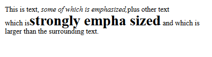

- em: 相对于当前元素的font-size计算,1em = 当前元素的font-size.

  ***参见: <CSS权威指南 P132>***

结果显而易见,第二行中的strong元素的行内框高度将不会小于其内容区高度,从而导致内容区和上一行的行框重叠,让文本看起来不协调.

所以现在strong元素的行内框高度 = 24-24 + 24 = 24px,属于当前行中行内框高度最高的那个行内框,

而当前行的行框的底端为这行中任意一个行内框的底端,因为当前文本行依然是处于基线对齐的情况,选择哪个行内框作为行框的底端都没有关系.

所以现在strong元素所在的行的行框高度,或者说文本行的行高为24px.

那么有其他方法吗?当然有啦,但是现在我不予说明*(好吧,其实我也不清楚,你们或许能Google,Baidu?)*


