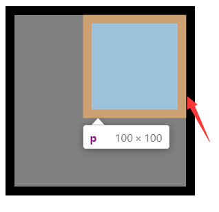

# 浮动知识点

## 浮动

- CSS可以浮动任何元素P483

- float取值为left/right/none float的默认值为none. P484

- 浮动元素脱离了常规文档流 P484
  
  元素一旦浮动了,就处于一个单独的平面上(异空间),但对文档中其余内容依然有影响,因为**元素浮动后,其他内容围绕它流动**P484

- 浮动元素的外边距不会折叠. P485

- 任何元素浮动后都是块级框 P487

- 浮动元素的容纳块是所在的段落区域(即父辈元素的内容区)) P487
  
  ~~其实依然是父辈块级元素的元素框(含外边距). 只有7个属性之和加起来才是不用算容纳块的外边距(等于内容区宽度,高度有其他情况<视觉格式化基础_块级置换和非置换元素.md>)~~

- **由于浮动元素生成的框不在文档的普通流中，所以文档的普通流中的块级框表现得就像浮动元素不存在一样。[W3C](https://www.w3school.com.cn/css/css_positioning_floating.asp)**

- 浮动的元素左/右外边界不能超过容纳块的左/右内边界, 即不能超过容纳块的内边距的边界,也就是说浮动元素只能在容纳块的**内容区**中.
  
  即:左浮动的元素其左外边界最多只能到容纳块的左内边界(左边内容区边界).
  
  ​     右浮动的元素其右外边界最多只能到容纳块的右内边界.(右边内容区边界（边框边界）) P488 第1
  
  ​    **注意:这里是内边界,指的是边框边界,不是内边距!!**
  
  ```html
  <style>
      div {
          width: 200px;
          height: 200px;
          background-color: gray;
      }
      p {
          float: rgiht;
          width: 100px;
          height: 100px;
          margin: 10px;
          background-color: beige;
          border:10px solid black;
      }
  </style>
  
  <body>
      <div>
          <p></p>
      </div>
  </body>
  ```
  
  
  
  （浮动元素的容纳块为父元素的边框边界（不含边框））

- 在容纳块宽度足够的情况下:
  
  ​    多个浮动元素**同时向左**浮动,则相邻的两个浮动元素之间,后面的(后写的)浮动元素的左外边界必定在前一个(先写的)浮动元素的右外边界的右侧.(前提是有外边界,否则就是以边框为准)
  
  ​    类似的**,都向右浮动**,则先写的(源码中)浮动元素会比后写的浮动元素更为右侧,同时 后写的浮动元素的外边界的右侧紧贴 先写的浮动元素的左外边界的左侧(前提是有外边界,否则就是以边框为准) P488 第2

- 浮动元素与浮动元素的外边界不会重叠 P489 第3

- 若在两个折叠的外边距之间存在一个浮动元素,则用户代理将之视为它存在于一个虚拟的块级元素中,这和虚拟行内元素异曲同工之妙.
  
  ​    *虚拟行内元素请看:<视觉格式化基础_行内置换和非置换元素.md>*

- 浮动元素9大规则P488 - P493,但是请注意,由于CSS的开放性,9大规则并无法完全覆盖所有情况,只是说大部分情况可以覆盖到.

- 浮动元素的后代也浮动时,将扩大范围,涵盖浮动的后代元素. 因此,若想让元素随浮动元素一起浮动,可以浮动父元素. P495

- 元素的背景会"滑到"浮动元素背后P495 - P496

- 负外边距将导致浮动元素移动到父元素的外面,并且这行为不违反9大规则.
  
  ​    (就和普通块级框的内容去会因为负外边距从而导致其内容区超出容纳块的内容区宽度类似.<视觉格式化基础_块级置换和非置换元素).
  
  ​    P496

- CSS规范规定:用户代理无需为文档中后面的内容腾出空间而重排之前的内容,所以当一个图像向上浮动,如果因为上外边距为负,导致盖住了前面的段落,那么盖住了也就盖住了.
  
  当一个浮动的元素比父元素宽,即：一个浮动的元素宽度大于其容纳块（内容区）宽度时,浮动元素将从容纳快的左/右内边界溢出. P498

- 浮动元素可能会与常规流动的内容重叠,并且CSS给出了当出现这汇总情况时,常规流动的行内框和块级框的处理规则: P499

## 清除浮动

- 使用clear属性可 以清除浮动 P500

- clear取值left/right/both/none,P501

- claer:left,让指定的元素不出现在左浮动元素的右侧(浮动的元素会让其他元素围绕它流动(布局)) ,
  
  ​    但浮动的元素仍然可以出现在指定元素的右侧,所以我们可以是使用clear:both属性,让左右浮动元素都无法出现在指定元素的左边或者右边,
  
  ​    类似的,clear:right也是一样的效果:让浮动的无法出现在指定元素的右侧,当然了,可以出现在左侧,所以也可也用clear:both属性防止让浮动元素出现在指定元素的左右两边. 
  
  ​    **none值的最大价值为**:让元素变为默认的行为. 因为有时候需要导入的网页万一都是不浮动的呢?这样我就不能轻松的让某个元素浮动.
  
  ​    **clear起到的作用其实就是:增加元素的上外边距,然后将元素移动到元素的下方.**
  
  ​    P501-P503
  
  ​    clearance间距概念是clear产生的,即:是为了把元素向下移动,确保显示在浮动元素的下方,从而将在元素上外边距上方增加额外的空白. 
  
  ​    例如:当你浮动一个元素a,清楚浮动元素b,此时你修改b的上外边距为0会发现,b不会靠近浮动元素a,因为存在clearance.
  
  ​    在普通情况下,即如果你并没有浮动元素b,你会发现b元素将在常规的文档流中,从而造成b元素会处于a元素的位置,且由于a元素不在常规文档流,所以a元素将覆盖b元素.
  
  P503
  
  ​    被清除的浮动的元素,其为元素声明的上外边距几乎会被忽略,除非正 上外边距的值大于容纳块内容区的高度,才会被强制改变位置,否则不论是负数还是多少值都不会影响此元素的位置.
  
  ​    P503-P504

- 以创建一个 BFC 的方式去使得一个块级元素生成的块级框包含一个浮动元素，这样就相当于清除浮动了。
  
  参见：[使用 overflow 创建一个 BFC](https://developer.mozilla.org/zh-CN/docs/Web/Guide/CSS/Block_formatting_context#%E4%BD%BF%E7%94%A8overflow_auto)

## 浮动形状

- 通过shape-outside属性我们可以改变浮动元素的元素框形状,即可以实现不规则浮动,也就是说浮动框不必再是矩形了.(注意:这个属性再将来可能也能改变非浮动元素的元素框的形状.

- shape-outside取值:
  
  ​     none| [\<basic-shape> || \<shape-box>] | \<image>
  
  P 504-P505

- none属性为默认形状,和常规的,写没写这个属性几乎没区别,没什么有趣的效果,除非依然是导入的其他网页全都是改变了浮动形状的,然后你想让其他网页的某个元素的形状为默认的.P505

- 可以使用shape-outside属性让非浮动元素紧贴图像流动,而不是整整齐齐的贴在那. P506

- 其他更多请参考P506 - P521
