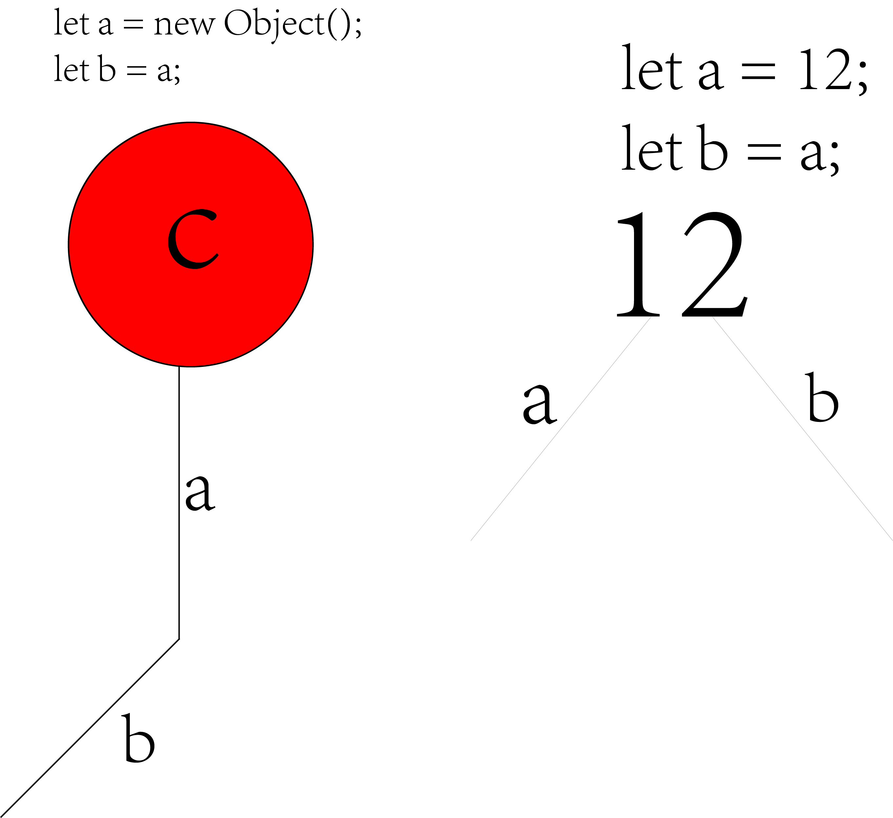

# 对象的大致定义

在ECMA-262中把对象定义为:

1. **属性的无序集合，每个属性存放一个 原始值 /对象 /函数。** 
   
   > ​    严格来说：这意味着对象是无特定顺序的值的数组。
   > 
   > ​    仔细一想确实是属性的无序集合，不妨想想，一个具体的人(例如yomua)由原子构成，又包含名字、身份地位、家庭住址、社会关系什么的,人还会做一些行为/动作(比如吃饭,喝水等),而这些行为动作也是一个个属性,一个个名词表示(将动词认为是名词)
   > 
   > ​    这些所有的名词都是一个个的属性，而这些属性构成了一个人，这些名词还不用按照顺序组成。
   > 
   > ​    所以说人是属性的无序集合也没错。即：
   > 
   > ​    人(yomua)是一个对象，可以用人包含的所有属性来表示此人,所以对象是属性的无序集合。

2. **通用定义：对象是基于代码的名词的表示**
   
   > ​    名词：人 /地点 /事物
   > 
   > ​    人名、人的眼睛、人的行为等

对象一定要是具体**存在**的一个物体.

- 此存在可以说是存在现实中,或者存在一个内存空间地址中,不能是'虚'的,不能一个概念一样的存在,否则就成为了类.

# JS中的对象定义

在 JavaScript 中,对象是金字塔塔尖级别的存在,对象是非常重要的一个概念,可以这么说,理解了对象, JavaScript 你也就理解了.

在 JavaScript 中,几乎"所有事物"都是对象.

即 JavaScript 的值,除了原始值以外,其余都是对象,且某些原始值也可以成为对象.(详情了解原始值,请看<***基本类型(原始类型).md>***)

对象拥有属性和方法(这是一句废话),因为对象是类的派生（实例）。

而对象有3种方式可以创建：

1. 文字方式（字面量方式）
   
   直接创建对象的方式

2. new 操作符方式
   
   new 操作符的方式适合有个'基类'的存在,然后将此'基类'实例化,以此创建对象.

3. 构造器方式
   
   需要有一个构造函数，然后实例化此构造函数，从而得到一个实例（对象）。

## JS中,什么可以成为对象

三个原始值可以是对象

- **布尔是对象（如果用 *new* 关键词定义）**

- **数字是对象（如果用 *new* 关键词定义）**

- **字符串是对象（如果用 *new* 关键词定义）**

- 日期 Date 永远都是对象

- 算术 Math 永远都是对象

- 正则表达式 RegExp 永远都是对象

- 数组永远都是对象（特殊的对象）

- 函数永远都是对象

- 对象永远都是对象

## 对象是包含变量的变量

### 描述

看似很拗口的说法,其实一语道破了对象的本质.

即对象是属性的无序集合,而属性又是一个个变量,也就是说对象是变量的无序集合,而对象的名字本身也是个变量.

所以对象就是包含变量的变量

### Example

```js
let person = {
  firstName : "Bill",
  lastName  : "Gates",
  age     : 62,
  eyeColor  : "blue"
};
```

很显而易见,person是一个对象名字,或者说是对象引用(指针),因为其实

```js
let person = {..};
--------------
let person = new Object();
person.xx = 'xxx'
...
```

即上面的代码可以写成下面的形式,只不过下面的形式是会导致程序变得复杂起来,所以通过从层层包装,变成了上面的形式.

所以person是一个变量,而里面的类如firstName,lastName等等,也是一个变量,所以我们才说对象时包含变量的变量.

## JS 中对象是易变的

在 JavaScript 中对象是易变的, 即它们通过引用来寻址,而不是通过值.

也就是说 JS 中,一个变量a引用一个对象b,则这个变量 a 可以操作对象 b 能操作的内存地址空间. 其实和<编程.doc>中的气球概念解释对象引用类似:

- 绳子:对象引用,对象的名字(变量)
- 气球:对象
- 连接:引用

即一个绳子a连接一个气球c,此时另一个绳子b连接绳子a,而绳子b和绳子a操作的是同一个对象c..也就是说一个对象引用 引用 另一个 对象引用并不会创建副本.

而如果是简单的变量赋值语句,是通过值寻址,它会在一个变量b引用另一个变量a时创建副本,为变量b创建和a的值一样的数据.

```js
/* 对象是易变的 */
let person = {
  firstName: "Bill",
  lastName: "Gates",
  age: 62,
  eyeColor: "blue",
};
console.log(person["age"]); // 62
// 对象引用
let x = person;
x.age = 10;
console.log(x.age); // 10
console.log(person.age); // 10

/* 简单的变量赋值是不易变的 */
let a = "yomua";
let b = a;
b = b.toUpperCase();
console.log(b); // YOMUA
console.log(a); // yomua
```

- 很显然,对象极容易被改变,即用不同的对象引用 x/y/.. 引用同一个 对象引用 a,
  
  这些不同的对象引用是可以操作到对象引用a能操作的内存地址空间,可以说这些不同的对象引用就是对象引用 a.它们而这一样.

- 而通过值寻址的简单变量赋值,则会在不同的变量b/c/...引用 同一个变量 a 时,为不同的变量进行创建一个副本,其数据和变量 a 一样.
  
  且一旦被执行完毕时,在后面使用代码无法让他们互相印象,它们都将成为独立的个体.

所以我们说对象是易变的,或者说通过引用寻址 都是易变的,它们不创建副本.

蒽..说到创建副本,就想到基本数据(原始类型),原始类型是不可被改变的,因为他们不创建副本,它们是非易变的. 详情了解基本数据(原始类型)请看 ***<基本类型(原始类型).md> - 堆内存和栈内存的区别***

- 即：创建一个非基本类型时（对象、数组等），它们会的具体值会被分配到堆内存当中，而它们的变量会被分配在栈内存中，这个栈内存存的是：对象在堆内存中的地址。

请看图1-1



​                                                                **图1-1**

# 面向对象的4个要求

ES 支持所有面向对象语言的要求，因为可以说ES是面向对象的语言。

1. 封装 - 把相关的信息（无论数据或方法）存储在对象中的能力。
   
   > ​    即我们实例化对象其实就是为了使用/里面的方法/数据。因为未实例化之前类不存在。
   > 
   > ​    让我们更为方便的操控整个程序的运行，让代码更加一目了然。

2. 聚集 - 把一个对象存储在另一个对象内的能力

3. 继承 - 由另一个类（或多个类）得来类的属性和方法的能力

4. 多态 - 编写能以多种方法运行的函数或方法的能力
   
   >      一个类可以用做多种类型。
   > 
   > ​    也就是说一个类，可以有多个对象实现，且这些对象调用类时，都可以达到同一种效果。
   > 
   > ​    例如：F1 在 browser 中是打开帮助，在 WPS 中是打开回答，在 QQ 中是打开聊天记录了，在..等等。
   > 
   > ​    用比较专业一点的话将就是：同一个接口可以通过多种方法调用。
   > 
   > ​    简而言之：多态性是指用一个相同的名字定义不同的函数，这些函数的执行过程不同，但是又相似的操作，
   > 
   > ​    即用同样的接口访问不同的函数。就好像都是按 F1，但是其函数代码实现的行为不同。

# 对象的销毁和创建

对象的创建和销毁都在JavaScript执行过程中发生，理解这种范式的含义对理解整个语言至关重要。

- 范式：符合某一种级别的关系模式的集合。

## 对象废除 和 对象销毁。

两者目的都是“释放”对象来释放内存。

- ES 拥有无用存储单元收集程序（garbage collection routine），意味着不必专门销毁对象来释放内存。
  
  ​    routine：在计算机中，这个词表示一套例行程序。
  
  ​    即这个词表示了，无用存储单元收集程序其实是ES当中的一套例行程序，按照惯例执行的程序。

- 当再没有对 对象 引用时，称该对象被废除（dereference）了。

无用存储单元收集程序一旦被运行，则所有废除的对象都被销毁

每当函数执行完成，无用存储单元收集程序都会运行，释放所有的局部变量，还有在一些其它不可预知的情况下，无用存储单元收集程序也会运行。

> 这个也就是解释了，为什么 let/var 无法使用于当前局部作用域(不是指{}块级作用域)之外的地方，因为函数执行完它就会被“回收”，都没了，还怎么使用。
> 
>  注意:若某些代码因为某些原因被跳过,那么它们有可能不会被回收(释放),
> 
> 比如:因为 throw (抛出异常)而被跳过的代码,或是因为catch中也抛出了异常(不一定要使用 throw 抛出,获取代码本身出错了)
> 
> 它们二者都有可能不会被无用存储单元收集程序回收掉.

- 把对象的所有引用设置为 null，可强行废除对象。
  
  ```js
  var oObject = new Object();
  oObject = null;
  ```
  
  ​    当 object 变量被设置为 null 时，对第一个创建对象，它的引用就不存在了（即指向了其它值，null）这意味着当下次无用存储单元收集程序运行时，该对象将被销毁。

每用完一个对象，就将其废除，是一个好的习惯。这样还确保不再使用已经不能访问的对象，从而防止更多的程序设计错误出现。

在废除对象的所有引用时，若一个对象拥有两个/更多引用，则若要正确废除该对象，必须将其所有引用设置对 null.

## 对象创建

- 定义和创建单个对象，使用对象文字/对象字面量。
  
  `let person = {...};`

- 定义和创建单个对象，通过关键词 new。
  
  `let person = new Object();`
  
  ​    当然,不建议使用此方法,因为new操作符会使程序变得复杂起来,实例化本身就会使程序变得复杂,不是嘛?

- 定义对象构造器，然后创建构造类型的对象。
  
  `let person = new String();`
  
      此处的String()是一个构造器,可以改成,Number(),Boolean等.
  
  凡是构造器都可以用此方式.

## 创建对象的属性/方法

### 创建属性 3种

三种方式

1. 使用字面量创建属性

```js
let objName = {
  firstName : "Bill",
  lastName  : "Gates",
  age     : 62,
  eyeColor  : "blue"
};
// 或以下形式
objName.hobby = 'girl'; // 创建一个hobby键且值为girl
...
```

2. 使用new操作符创建对象完之后,再创建属性

```js
let objName = new Object();
objName.firstName = "Bill";
objName.lastName = "Gates";
objName.age = 50;
objName.eyeColor = "blue"; 
console.log(objName.age); // 50
// 或可以写成以下形式
objName = {
    firstName: "Bill",
    lastName: "Gates",
    age : 50,
    language: "en",
};
console.log(objName.firstName); // Bill
```

当然,不建议使用此方法,因为new操作符会使程序变得复杂起来,实例化本身就会使程序变得复杂,不是嘛?

3. 定义对象构造器，然后创建构造类型的对象。

```js
let person = new String();
person.firstName = "Bill";
person.lastName = "Gates";
person.age = 50;
person.eyeColor = "blue"; 
```

String 就是构造器，或者或是构造函数，或者说是一个包装对象。

- 这三个名字因使用场景不同，而称呼不同，但是都是指同一个东西，如：String 
  
  参见：《基本类型(原始类型).md》- 讲在开头的一些话

- 在ECMAScript 5 中,也可以通过函数 Object.create() 来创建对象.

> 当然了,对象除了创建属性,理所当然也可以创建方法.

### 创建方法 3种

所谓的方法其实也可以说是属性的一部分,即方法是包含了函数定义属性,但是我们通常不把方法叫做属性,而是依然叫做方法,这样可以更好的理解和区分.

所以创建方法和创建属性一样但是它有4种方式

1. 使用字面量的方式,创建对象的方法

```js
var person = {
    fullName : function() {
       return this.firstName + " " + this.lastName;
    }
    // ES6 的写法为：
    fullName(){
        ...
    }
};
// 或以下形式
person.fullName = fucntion() {
    return this.firstName + " " + this.lastName;
}
```

2. 使用new操作符创建对象完之后,在创建方法
   
   至于使用prototype属性创建方法就另说了.

```js
let person = new Object();
person.fullName = function() {
     return this.firstName + " " + this.lastName;

}
```

3. 定义对象构造器，然后创建构造类型的对象。

```js
let person = new String();
person.fullName = function() {
     return this.firstName + " " + this.lastName;
}
```

这个对象构造器的方式,其实就和new操作符的方式差不读,这个第三点其实可以和第二点合并成一点。

# JavaScript对象访问器 Getter Setter

## 描述

ES5(2009)中,允许您定义对象访问器(被计算的属性)

注意: **调用get或set语句指定的表达式/其具体名字时,不允许使用(),** 因为虽然它们看上去是一个方法,也可以使用 return 作为该代码块的返回值，

但是:**实际上它们是一个[伪属性](https://developer.mozilla.org/zh-CN/docs/Web/JavaScript/Reference/Functions/set)，只能使用调用属性的方式调用它们.**

况且它们名字也叫对象访问器,像是属性又像是方法.

## [get](https://developer.mozilla.org/zh-CN/docs/Web/JavaScript/Reference/Functions/get)

### 描述

get 语法是[将对象的属性绑定到]查询该属性时将被调用的[函数] 

### 格式

get 有两种写法: (*get和set一样,其两种写法在语法上都是类似的,不过 `set`语法需要参数,用来接收需要改变成的值).* 

```js
对象名 = {
    get ownDefineProperty() {
        ...
    }
}

/* 例子1 */
let person = {
  firstName: "Bill",
  lastName: "Gates",
  language: "en",
  get ownDefineProperty() {
    return this.language;
    //  以上 return expression 可以改成以下形式
    return person.language;
  },
};
console.log(person.ownDefineProperty); // en
```

```js
对象名 = {
    get [expression]() { // []中括号在这里是必须的,而不是可选的意思
        ...
    }
}

// 使用一个表达式作为getter的函数(属性)名字.
let expression = "latest";
const obj = {
  log: ["a", "b", "c"],
  get [expression]() {
    if (this.log.length === 0) {
      return undefined;
      c;
    }
    return this.log[this.log.length - 1];
  },
};

console.log(obj.latest); // c
/*
    注意最后一句输出语句:obj.latest
    这里是latest,而不是expression,即在调用对象的'伪属性'(方法也算是属性,即将函数赋值给属性.),也就是方法时,需要使用被计算过后的表达式的值.
*/
```

- 以上两种方式皆可书写get的语法.其中 `expression`代表一个表达式,    即从ES2015起, `property`可以使用一个 `expression`(一个能计算出对象的属性名的表达式)来表示

- property: 要绑定到给定函数的属性名.
  
  即函数的名字,可以是一个变量/能计算出属性的的一个表达式.

- 注意,由于person本身就是一个对象,而不是一个构造器,所以不能使用 `let p = new person();`,它会报错:person不是一个构造器.

- 可通过 `delete` 操作符删除 getter。

### 其用法

有时需要允许访问返回动态计算值的属性,或着可能需要反映内部变量的状态,此时可以不用使用显式方式调用.

因为在JS中,可以使用getter来实现.

### 使用表达式作为 get 属性名的好处  /  使用计算属性名的好处

```js
对象名 = {
    get [expression]() { // []中括号在这里是必须的,而不是可选的意思
        ...
    }
}
```

1. Getter在访问此方法之前是不会计算属性的值的,即不会计算表达式的值.也就是说在直到你需要用到此方法时,你就不需要支付成本(计算量)

2. getter: Smart / self-overwriting / lazy getters ,
   
   即 聪明的/自我重写的/懒惰的

3. getter用到一种额外的优化技术,即用**智能或[记忆化](https://en.wikipedia.org/wiki/Memoization) ,使getters** 延迟属性值的计算并将其缓存以备以后访问。
   
   该值是在第一次调用getter 时计算的，然后被缓存，因此后续访问的是缓存值而不会重新计算它。这在以下情况下很有用：
   
   1. 如果属性值的计算是昂贵的（占用大量RAM或CPU时间，产生工作线程，检索远程文件等）。
   2. 如果现在不需要该值。它将在稍后使用，或在某些情况下它根本不使用。
   3. 如果被使用，它将被访问几次，并且不需要重新计算该值将永远不会被改变，或者不应该被重新计算。
   
   这意味着为你不应该为你希望改变值的属性使用getter,即若对象种的某个属性你希望被改变,则它不应该使用getter,getter应该用在以上3种情况种.
   
   因为get语法不会重新计算值,也就是说你若将之运用到了一个会改变值的属性中,那么在getter已经缓存此属性值的情况下改变其属性值,   
   
   这会造成在调用get语法时重新计算值,就会造成计算力的浪费,也失去了使用getter的初衷

### 使用 get 语法时需注意的问题

1. 可以使用数值或字符串作为标识

2. get语法必须不带参数（请参考[Incompatible ES5 change: literal getter and setter functions must now have exactly zero or one arguments](http://whereswalden.com/2010/08/22/incompatible-es5-change-literal-getter-and-setter-functions-must-now-have-exactly-zero-or-one-arguments/)
   
   若有参数,则会报错,和set是相反的.

3. 它不能与另一个 `get `或具有相同属性的数据条目同时出现在一个对象字面量中
   
   不允许使用 
   
   ```js
   { 
       get x() { },
       get x() { } 
   }
   
   { 
       x: ..., 
       get x() { } 
   }`
   ```
   
   - 以上的写法是禁止的,虽然这样写不会报错,但是禁止使用,没有任何意义.

## [set](https://developer.mozilla.org/zh-CN/docs/Web/JavaScript/Reference/Functions/set)

### 描述

当尝试设置对象的属性时, `set语法`将对象的属性绑定到要调用的函数名(方法名)上面.

### 格式

set和get一样,也有两种写法,且两种写法在语法上都是类似的,不过 `set`语法需要参数,用来接收需要改变成的值.

```js
{
    set ownDefineProperty(value) {
        ...
    }
}
// set property(){}
const language = {
  set current(name) {
    this.log.push(name);
  },
  log: [],
};

language.current = "EN";
language.current = "FA";

document.write(language.log); // EN FA
document.write(language.current); // undifined

/* 
  在每次调用 current方法时,都向此方法传入一个参数,此参数是用来改变log属性中的数组[]值的.
  即每次向log属性中的[]数组添加 name参数.
*/
```

- 有人或许奇怪,language.current得出的值为什么是undefined,即current为什么是undefined的,
  
  这是因为set语法没有返回值,它只是一个单纯的设置属性用的,没有返回值,当然是返回undefined.
  
  或许有人会问要不加个retrun不就好了吗?哈哈哈,当然不是这样子啦,也不会这么简单,
  
  对于JavaScript来说,set和get两个语法都有各自的作用,它们是JS自带,其功能不以开发者的意志为转移,不是像Java那样是自己命名的,功能什么的全靠自己设定.
  
  所以JS设定set是设置属性用的,就是设置属性用来,不能用来替换掉get的功能,反之也是一样的,get无法替换set功能.
  
  如果强行加return, 例如: 
  
  ```js
  set current(name) {
    return this.log.push(name);
  },
  ```
  
  ​    这样是错误的,其结果依然不变为undefined.
  
  <hr>

```js
// 使用表达式作为set方法名
{
    set [expression](value) {
        ...
    }
}
// set [expression](){}
let expression = "lang";
const language = {
  array: [],
  set [expression](name) {
    this.array.push(name);
  },
};
language.lang = "EN";
language.lang = "ZH";
document.write(language.array);
/*
    请注意language.lang = '...'
    此lang是计算expression之后的值,即 expression = lang.
*/
```

- property:即 `set`方法的方法名.
- value: 用于保存改变property的值 的变量.
- expression: 和get中的expression一样,使用一个能计算出对象的属性的表达式来作为变量.

### 使用表达式作为set属性名的好处

很显然,其好处和[使用表达式作为get属性名的好处/使用计算属性名的好处] 是一样的.

### 使用set语法时需注意的点

- 它的标识符可以是数字或字符串；

- 它必须有一个明确的参数 
  
  （详见 [Incompatible ES5 change: literal getter and setter functions must now have exactly zero or one arguments](http://whereswalden.com/2010/08/22/incompatible-es5-change-literal-getter-and-setter-functions-must-now-have-exactly-zero-or-one-arguments/)）；
  
  此和get语法不一样,get不能有参数.
  
  **若set没有参数,则会报错.**

- 在对象字面量中，不能为一个已有真实值的变量使用 set ，也不能为一个属性设置多个 set。
  
  ```js
  { 
      set x(v) {...}, 
      set x(v) {...} 
  }
  //--------------------------
  { 
      x: ..., 
      set x(v) {...} 
  }
  ```
  
  - 以上的写法是不允许的,即使可以在JavaScript中写出来也不会报错,但是是禁止的! 这和get语法是一样的.

## getter和setter之中关键点

### getter

#### get xx(){}可以换成其他形式

```js
const obj = {
  log: ["a", "b", "c"],
  get xx() {
    return this.log.length;
  },
  xx: function () {
    return this.log.length - 1;
  },
};
obj.xx = function () {
  return this.log.length - 2;
};
console.log(obj.xx()); // 请注意这里到底有没有括号.
```

1. ***get xx(){};***     
   
   使用这种方式在进行调用时,不可加括号
   
   `console.log(obj.xx);`
   
   若加了括号,会直接报错:obj.xx is not a funcion

2. ***xx:function(){};***     
   
   使用这种方式加不加括号**都不会报错**,但是得出的答案会不同.
   
   `console.log(obj.xx());` 将得到函数的返回值
   
   `console.log(obj.xx);`将得到整个函数表达式
   
   这种方式不加括号就和直定义了一个方法之后,直接输出此方法,而不是输出带括号表示函数返回值的形式.

3. ***obj.xx=function(){};***
   
   这种方式和第二种方式也是一样的,即加不加括号都不会报错,但是答案会不同, 其具体的答案和第二种方式亦是一样的.

get xx(){}是可以替换成第2种,第3种方式的,但是我们这里不建议替换,除非特殊原因,至于为什么,请往下看: ***为什么使用getter和setter***

#### get语法需要注意的点

1. 使用get时,一定不要添加参数,否则报错.
2. 不要有相同的get方法名字

### setter

1. 使用set语法时,必须添加参数,否则会报错.
2. 不要有相同的set方法名字

### get语法和set语法之间可以功能互换吗?

不能.

get语法和set语法之间的功能是不沾边的,且可以说是相斥的.

1. 在使用get语法时,不要为 会被改变的对象的属性使用get语法获取其值.

2. set和get语法之间的区别就注定了它们二者功能的相斥,一个必须无值,一个必须有值,这当然会相斥.

3. 不论如何,set有没有加return语句,它的属性都是undefined.
   
   详情请看: set - 格式  的第一点.
   
   而get语法在有返回值的情况下是可以获取值的.
   
   这说明了set和get语法真的是字面意义,即设置和获取属性值.

## 为什么使用getter和setter

- 它提供了更简洁的语法
- 它允许属性和方法的语法相同
- 它可以确保更好的数据质量
- 有利于后台工作

## getter&get 和 setter&set

~~有人会疑惑getter get, setter set到底有什么不同?为什么前者多了个ter呢?~~

~~2020/1/23,我不知道.~~

~~但是在书写时,使用get和set就完事了.~~    

2023/9/26: 它们都是指的是同一种用法，只不过使用时用 get/set，称呼时为 getter/setter

## Object.defineProperty()

### 描述

此方法也能用于添加Getter和Setter.其在帮助文档的详细解释为:

该方法会直接在一个对象上定义一个新属性,或者修改一个对象的现有属性,并返回这个对象.

该方法允许精确对 对象的添加属性或修改属性.

注意:用此方法添加的新属性在默认情况下是不可被修改的,且通过赋值操作添加的普通属性是可枚举的,能够在枚举期间呈现出来(for..in方法 或 Object.keys方法),这些属性的值可以被改变,也可以被删除.

该方法允许修改默认的额外选项(或配置)

### 语法

Object.defineProperty(object, property, descriptor)

#### 参数解释

##### object

要修改的属性/添加的属性的对象.

##### property

要修改的属性/添加的属性的名字.

##### descriptor

要修改的属性/添加的属性,其此属性的描述符.

### 返回值

其返回值为一个修改过属性/添加过属性后的对象.

在ES6中，由于 Symbol类型的特殊性，用Symbol类型的值来做对象的key与常规的定义或修改不同，而`Object.defineProperty` 是定义key为Symbol的属性的方法之一。

# 对象构造器

所谓的对象构造器就是对象蓝图，或者说是Java中的'类',而所有的JS中的'类'都可以被称之为对象构造器/对象蓝图.

`let obj = new Object();` 我们可以将这行代码看作是创造单一对象,但同时也可以把Object认为是一个对象构造器

同样的,以下的也可以认为是对象构造器.

```js
function Obj() {
    ...
}

let o = new Obj();
```

function也是可以用它来创建对象构造器的,或者可以把上面的function Obj(){}称之为构造函数,  `let o = new Obj();`就是创建了一个构造函数的对象(实例).

2020/1/31现在至以后的,在其它概念没改变的情况下,我会将以上的类似形式的function统称为构造函数或构造器.

即能用Obj来当蓝图(模板/类)的一个函数.

## 为对象构造器添加方法/属性

若需要为构造器/构造函数这样的形式的存在,添加一个新属性或者新方法,我们需要在内部形式添加,不能添加到外部,除非一些特殊的形式,例如使用prototype属性.

```js
// 添加新属性 nationality
function Person(first, last, age, eyecolor) {
    this.firstName = first;
    this.lastName = last;
    this.age = age;
    this.eyeColor = eyecolor;
    this.nationality = "English";
}

// 添加新方法 
function Person(first, last, age, eyecolor) {
    this.firstName = first;
    this.lastName = last;
    this.age = age;
    this.eyeColor = eyecolor;
    this.name = function() {
        return this.firstName + " " + this.lastName;
    };
}
    // 注意:这里可以将name看作一个包含函数方法的属性,但是依然建议将name称之为方法,以和包含非函数的属性区分开来.
```

## 内建JS构造器

即JS提供用于原始对象的构造器,通常有以下部分:

```js
var x1 = new Object();    // 一个新的 Object 对象
var x2 = new String();    // 一个新的 String 对象
var x3 = new Number();    // 一个新的 Number 对象
var x4 = new Boolean();   // 一个新的 Boolean 对象
var x5 = new Array();     // 一个新的 Array 对象
var x6 = new RegExp();    // 一个新的 RegExp 对象
var x7 = new Function();  // 一个新的 Function 对象
var x8 = new Date();      // 一个新的 Date 对象
```

Math() 对象不再此列。Math 是全局对象。new 关键词不可用于 Math。而不支持new操作符的还有Symbol,这是因为它作为构造器(函数)还不完整.

# 请勿创建多余复杂对象

如内建JS构造器所示,JavaScript 提供原始数据类型字符串、数字和布尔的对象版本。但是并无理由创建复杂的对象。原始值快得多！

即请使用创建 对象文字 的方式创建对象,而不是使用new操作符.

```js
var x1 = {};            // 新对象
var x2 = "";            // 新的原始字符串
var x3 = 0;             // 新的原始数值
var x4 = false;         // 新的原始逻辑值
var x5 = [];            // 新的数组对象
var x6 = /()/           // 新的正则表达式对象
var x7 = function(){};  // 新的函数对象
```

# 包装对象

在***<基本类型(原始类型).md>***有解释

这里我们给一个简单的归纳:

**所谓的包装对象也就是说可以将基本类型变为对象的对象，简称为包装对象；而能被包装成对象的基本类型,其返回类型都为对象,即object**

```js
let string = new String('String');
let number = new Number('666');
typeof(string); // object
typeof(number); // object
console.log(string); // String {"yomua"}
console.log(number); // Number {666}
console.log(number.toFixed(2)); // 666.00
console.log(number); // Number {666}
console.log(string[0]); // S
...
```

- String和Number两个对象
  
  > (构造函数则是实例化/调用一个对象自动会调用的构造方法,即没有任何参数,但名字和对象名字一样的方法.)
  
  将参数String和666,这两个原始值转换(包装)成了其返回类型为object的类型.即从基本类型string number变成了object类型.

- 注意: 虽然其基本类型被包装对象包装之后变成了objec类型,但是我们可以细分的详细一些:
  
  ​    即: new String('xx')其所返回的变量的类型是属于String对象,因为返回类型object就是指Object对象.

- **console.log(string); // String {"yomua"}**
  **console.log(number); // Number {666}**
  
  ​    请注意这两个的输出结果,也侧面正面了其值是一个对象,而不是一个原始值.

- **console.log(number.toFixed(2)); // 666.00**
  **console.log(number); // Number {666}**
  
  ​    原始值即使被包装成了 对象,那么原始值依然不能被改变,只能将值赋值一个新的变量使用,而原始值不可被改变.

- ***console.log(string[0]); // S***
  
  ​    是的,你没看错,由于string原始被转换成了String对象,所以string值可以以对象的方式获取到它每一字符,但是它的属性名却不能更改,因为变成对象之后,它的属性名是0,1,2,3,这样类似数组的索引.
  
  ​    即0,2,...变成了此时string对象的属性名

# 日常生活中类和对象的区别

1. 日常生活中的类
   
   中国人是一个类。
   
   地球人是一个类。
   
   外面有个美女是个类。
   
   我们之中有一个人是个类。

2. 日常生活中的对象
   
   ​    在中国的四川省的xx市xx县xx村xx号中有个名字叫yomua的神秘旅人是个对象。
   
   ​    外面有个名字叫yhw，头发为黑色的男孩是个对象。
   
   ​    我们之中的why哥哥是个对象。

3. 日常生活中类和对象的区别
   
   ​    类表示一个抽象，即将某个很广泛的事物定义成一个概念性的东西，冠以一个范围名词，例如中国人、福建人..
   
   ​    对象则表示一个具体的东西，将一个很广泛、一个概念性的东西，在这个东西之中存在着某个具体事物，就是一个对象。例如yhw,yomua,why 。
   
   ​    当别人说出一个事物时，可以是人、名词、地方等，但是如果此人说出的事物和我们脑中浮现的画面不同，则通常来说这就是类。
   
   ​    如果相同，通常来说，就是对象。
   
   ​    就是这么简单.

# 本地对象

## 描述

**由ES实现 提供的,独立于宿主环境的所有对象，如：Match。**

简单来说就是：可以直接使用的对象，不需要开发者自己 new.

# 内置对象

## 描述

**由ES实现 提供的,独立于宿主环境的所有对象,在ES程序开始执行时出现.**

在JS中,指: JS程序执行前就存在的对象,例如:Math等.

- 宿主环境: 即如同浏览器, 电脑这样的就为一个宿主环境.

内置对象的意思:**即开发人员不需要特别声明,也能使用的内置的对象**.

例如:Math、Reflect 就是一个内置对象,否则我们为什么可以直接使用四则运算?

使用四则运算之前创建Math对象了吗?没有!

内置类型也是这个意思,不需要开发人员声明就能使用的类型,例如:string,boolean等.

# 宿主对象

**由ES实现的宿主环境,这个宿主环境提供的对象称之为宿主对象**

所有非本地对象都是宿主对象.

简单来说就是: 执行JS脚本的环境提供的对象. 比如:对于嵌入到网页中的JS来说,其实宿主对象就是浏览器提供的对象,所以宿主对象又可以称之为浏览器对象.

而宿主对象显然有JavaScript中独有的BOM提供的对象:Window对象等.

# 自定义对象

**开发人员自己定义的对象.**

因为ES允许使用自定义的对象,那么实现ES的JS理所当然的也允许使用自定义的对象,ES把这些自定义的对象称之为: 规范中未给定的新对象.

```js
function Otto() {
    this.God = 'yomua';
    this.DOO = 'OTIO';
}

let owo = new Otoo();
```

请看以上的例子, owo就是自定义对象,即我创建的一个从未存在于ES或JS的对象. Otto则是我创建的构造器(构造函数,蓝图).

# 标准的内置对象(全局的对象)

以下介绍和说明了JS中所有的标准的内置对象,以及它们的方法和属性

注意:请不要将**全局的对象**和**全局对象**搞混.

- 全局的对象: 这里说的全局的对象是说在**全局作用域里的对象**

- 全局对象(global object): 可以在全局作用域里，通过this访问（但只有在 ECMAScript 5 的非严格模式下才可以，
  
  在严格模式下得到的是 undefined

- *全局作用域*: 实际上,全局作用域包含了全局对象的属性,还有它可能继承来的属性.
  
  而全局对象中其他对象则可以由用户的脚本创建,或由宿主程序提供,浏览器是最为常见的宿主程序(宿主环境)

## 基本对象

**顾名思义,基本对象是定义或使用其他对象的基础.** 

基本对象一般包括: 一般对象,函数对象和错误对象. 以下为截至2020/2/2的所有基本对象

- Object
- Function
- Boolean
- Symbol
- Error
- EvalError 
- InternalError 
- RangeError
- ReferenceError
- SyntaxError
- TypeError
- URIError