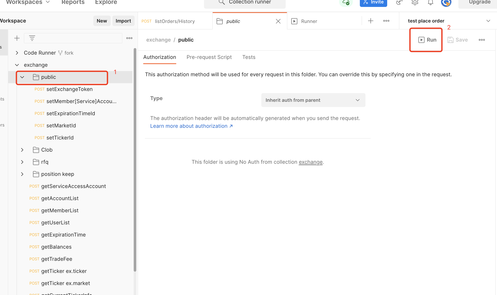

# postman基本字段介绍

Pre-request Script：在 postman 请求之前执行一些脚本；这里可以为请求初始化一些值，来作为本次请求的参数。

Tests：请求发送成功后所执行的脚本。

Tips:Pre-request Script 和 Tests 目前只支持 JavaScript。

# 动态的参数

我们为请求的 URL、请求体等使用动态参数，使用两个大括号括住变量即可（像 vue 一样）：`{{variable_name}}`

## 动态的 URL：

https://{{xxx}}/user

## 动态的请求体

请求体：Body > raw(JSON)

```json
{"access_token": "{{token}}",}
```

# 重复发送一个/多个请求

- 点击包含请求的文件
- 点击 run



NOTES：如果在头部存在 Runner 按钮，则点击 Runner 按钮也可以设置重复发送1个或多个请求。

# 例子

```json
{"side": "{{side}}",}
```

在发送请求之前，我们初始化这些这些动态变量，在 Pre-request Script 中写 JS 脚本：

```js
// 设为随机值，方法都是 JS 写的
pm.environment.set('side', switchSide());
```

然后我们在 Tests 中写：当请求发送成功后所需要做的操作：

```js
pm.test("Status code is 200", () => {pm.response.to.have.status(200);});
// 输出变量
pm.test(`side: ${pm.environment.get('side')}、`, () => {
    pm.response.to.have.status(200);
});
```
