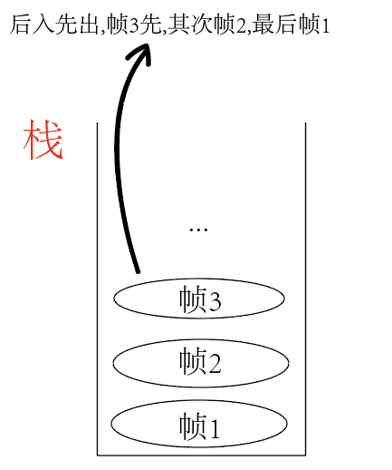
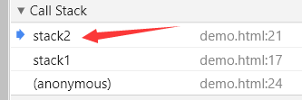
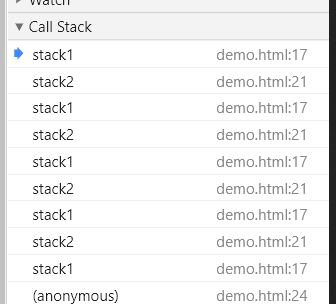
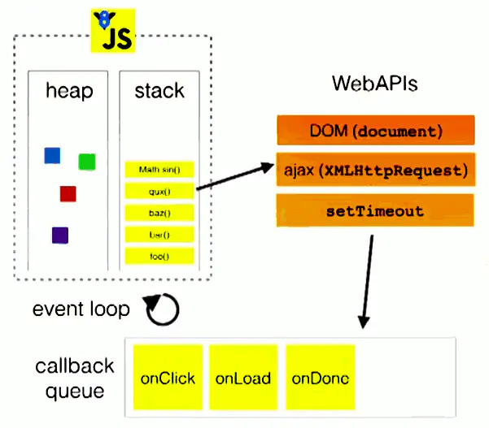
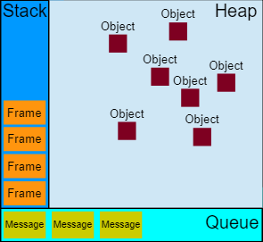

# 进程和线程

- 进程: 简单来说就是程序在处理机上执行时的活动称为进程，比如正在运行的浏览器，它就会有一个进程.***参见: <操作系统基础.md>*** 

- 线程: 进程中一个相对独立的步骤，行话来说就是: 程序中独立运行的代码块.
  
  一个进程由多个线程组成， 线程是用来执行程序的代码的，即: 堆**，栈，队列都是因为线程执行代码时而产生的概念.**

PS:程序和进程是不同的两个概念，***参见: <操作系统基础.md>***

# 堆栈

## 栈(stack)

概念上可以分为：

- 栈数据结构

指数据的构成方式。

栈的特点是先进后出，后进先出，它的基本操作包括入栈和出栈。在计算机中，栈一般用来实现函数调用、表达式求值等操作。

放入到栈中，意思就是：在栈内存重新为新来的变量分配了空间。

- 栈内存

指计算机内存中用来存储程序运行时局部变量、函数参数、[返回地址](https://baike.baidu.com/item/%E8%BF%94%E5%9B%9E%E5%9C%B0%E5%9D%80)等临时数据的一部分内存空间，这些是属于被频繁使用数据，所以放入栈中存储。

当函数被调用时，其参数、局部变量等数据都被存储在栈内存中。当函数返回时，这些数据也会被弹出栈内存，栈内存中的数据通常是临时的，生命周期较短。

返回地址:  当子程序运行完毕，返回主程序后，当前子程序的下一条指令的地址被称之为:  返回地址。



## 堆(heap)

概念上可以分为：

- 堆数据结构

指数据的构成方式。

堆的数据访问方式比较灵活，可以在任何时候随机访问其中的数据，而不需要先进后出的规则。

堆的典型应用场景是动态内存分配，例如通过 new 操作符分配内存。

- 堆内存

指计算机内存中用来存储动态分配的内存空间的一部分内存。

内存中的**一大块(通常是非结构化的)区域**， **对象就被分配在这里**，也就是说堆是用来存放对象的。

堆内存通常由程序员通过调用 malloc()、new() 等分配函数来分配和释放，堆内存中的数据通常是动态分配的，生命周期相对较长。

对于这些占据空间大、大小不固定的数据，如果存储在栈中，将会影响程序运行的性能。

注意：堆内存中对象的地址将会存储在栈内存中，当我们访问对象时（（如通过 JavaScript），代码解释器将先检索此对象在栈内存中的地址，通过此地址访问堆，从而拿到对象。如果未拿到，则报错。


## 堆内存和栈内存的区别

可以同时参考：\<基本类型(原始类型).md>

在计算机内存管理中，堆内存和栈内存是两种不同的内存分配方式。

- 栈内存（Stack）是指用于存放程序临时创建的变量，以及函数调用的上下文等信息的一块内存区域。

  每当函数被调用时，都会在栈内存中分配一个新的区域来存储该函数的局部变量、函数参数、返回地址等信息。当函数执行完毕后，这个区域就会被释放，变量也会被销毁。

  声明简单变量时，其数据也存储在栈内存中。

  栈内存的特点是分配和释放速度很快，但容量有限，因为它的大小是在编译时就确定好了。

- 堆内存（Heap）是指用于存放程序运行中动态分配的数据的一块内存区域。

  在 JavaScript 中，所有对象都是存放在堆内存中的，包括普通对象、数组、函数等等。

  堆内存的特点是容量大，但分配和释放速度较慢，因为它的大小是动态变化的，需要在运行时动态分配和回收。

在 JavaScript 中，[基本类型的数据](https://developer.mozilla.org/zh-CN/docs/Glossary/Primitive)是存放在栈内存中的，因为它们的值是固定的，大小也是确定的。

而对象类型的数据是存放在堆内存中的，因为对象的大小是不确定的，需要动态分配空间来存储。

需要注意的是，在 JavaScript 中，除了基本类型的数据，变量存储的对象，都是引用（指针），即：在栈内存中存储的是对象在堆内存中的地址。

因此，当我们复制一个对象类型的变量时，实际上是复制了对象的引用，而不是对象本身。

- 即：当你创建一个对象，此对象将被分配在堆内存中，而你将此对象赋值给的那个变量，将会被分配于栈内存中。

  而此变量的栈内存中的值为：对象在堆内存中的地址。

二者的区别：

1. 存储位置：堆和栈分别位于计算机内存的不同区域。

   栈内存通常位于计算机内存的较高地址区域，

   堆内存通常位于较低地址区域。

2. 管理方式：

   栈内存是由操作系统自动分配和释放的，不需要程序员手动管理。程序在调用函数时，函数的参数和局部变量都存储在栈内存中，函数执行结束时，这些数据也会自动从栈中弹出。

   堆内存则需要程序员手动分配和释放，当我们使用 JavaScript 中的 `new` 操作符创建一个对象时，JavaScript 引擎会在堆内存中分配一块内存来存储这个对象，当这个对象不再被引用时，我们需要手动释放这块内存。

3. 内存分配方式：

   栈内存的分配方式是连续的，每次分配的内存大小是固定的。

   堆内存则是不连续的，大小也不是固定的，分配的内存大小由需要存储

## 栈的形成

我们将一个函数的调用 -> 存储返回地址到内存 这个过程，称之为帧。

而 **n 个函数调用形成的若干个帧，将其组合起来就形成了栈，可以称之为[调用栈（callback stack）](https://developer.mozilla.org/zh-CN/docs/Glossary/Call_stack)**，

故我们能很明确的知道，调用栈是 JavaScript 中追踪函数执行流程的一种机制，与事件循环这类机制目的是相同的。

调用栈存储有关正在运行的子程序的数据 *(也就是帧中包含函数参数和局部变量)*，但调用栈不仅仅只存储子程序的数据，几乎所有程序的执行都依赖于调用栈。

```js
// 由于栈帧1调用了该函数，所形成了栈帧2
function foo(b) {
  let a = 10;
  return a + b + 11;
}

// 栈帧1
function bar(x) {
  let y = 3;
  return foo(x * y);
}

// 触发栈帧从而形成栈的必要条件
console.log(bar(7)); // 返回 42
```

在以上的示例中，调用bar()函数时，就会创建一个新的帧，该帧会被放入栈中，而bar()函数的参数和内部的局部变量将也同时随着帧一起被放入栈中，函数参数和局部变量都属于当前函数调用所形成的帧。

当bar函数内部调用foo函数时，第二个帧也被创建了，同样的，该帧也会被放入栈中，并在第一个帧之上，帧中包含foo函数参数和内部局部变量。

当foo执行完毕然后返回时，第二个帧(调用foo函数所形成的帧)就被弹出栈，然后等到bar也执行完毕然后返回时，第一个帧也会被弹出栈。

你可以将栈这种数据结构想象成一个只有一端开口的瓶子， 每一次只能放入一个东西， 当需要从瓶子取出这个东西时，只能从开头的那段取出，也就导致只能先取出最上面的东西，然后依次取完，才能取最下面的.

而最下面的东西就是先放入的，最上面的就是最后放入的，这就是先入后出。

## 栈溢出的元凶

[栈溢出(Stack Overflow)](https://zh.wikipedia.org/wiki/%E5%A0%86%E7%96%8A%E6%BA%A2%E4%BD%8D) 

我们知道: 调用栈(***详见: 调用栈***)通常用来存放返回地址*(即每个函数未来运行完毕后，回过头继续执行下一个指令的地址)*，

在调用任何函数时，栈内存都必须暂存函数运行完毕后应该返回到的地址，也就是说函数还未运行完毕时，栈内存中就已经暂存了函数运行完毕后应该的返回地址，

这有什么用呢? 这成功限制了可能因为无限循环或者死循环导致 CPU 及内存被占用 100%，从而导致电脑宕机这一现象，不妨想想:当一个子程序会唤醒无限多个子程序， 或者和另一个子程序互相唤醒 又或者 无限循环等， 

那么 栈 这个有序的容器就不得不存储每一个子程序运行完毕后应该返回的地址， 从而这些子程序信息就会溢出 栈 容器的大小， 从而就造成了所谓的栈溢出现象.

以下是一个非常典型的会导致栈溢出的无限互相唤醒的操作.

```js
stack1();
function stack1() {
    return stack2();
}

function stack2() {
    return stack1();
}
```

- 通过浏览器的控制台可以直接查看到 Call Stack 的内容(Sources页面的右边)


一开始的时候，调用栈里面没有任何内容.

当执行stack1()时，函数的调用就会形成帧，从而组成栈，如下图，其中(anonymous)是页面暂停的为止，即断点，只要存在暂停它就会自动出现，不必理会.


现在程序已经开始执行stack1()了，且当return stack2()语句被执行时，就又会形成一个新的帧，被压入栈中， 也就是如下图stack2;



由于stack2()函数中又存在语句return stack1(); 这就会导致又会新成一个新的帧，stack1，这样如此反复， 栈中的帧就会越来越多， 直到栈溢出.



栈溢出，浏览器就会报错，就如同我刚才所说的那样， 栈溢出这个机制成功限制了电脑不会因为CPU和内存被占满从而导致的宕机. 

即: 未捕获范围错误: 超过最大 调用栈 大小.


注意：计算机给 JavaScript 的调用栈分配的内存空间是有限的，此内存空间属于计算机的一部分，但非全部，所以即使调用栈被爆（溢出），顶多当前浏览器的标签“卡死”，计算机是不会”卡死”。

# 同步任务 异步任务

## 为什么会有异步任务？

JavaScript 是单线程的。

这也就意味着所有任务需要排队，前一个任务结束，才会执行后一个任务。如果前一个任务耗时很长，后一个任务就不得不一直等着。

如果这些任务排队是因为计算量大，CPU 忙不过来，这倒也算了，毕竟这并不浪费时间，但是很多时候 CPU 是闲着的，

只是因为有些任务天生就需要花费时间而不是只靠CPU，如: Ajax 操作从网络读取数据(同步的)，CPU此时无法发挥太大的作用，

因为这时候应该寄希望于对方的服务器响应速度够快， 否则 CPU只能 空闲下来，而排在后面的任务也必须等待 AJAX 获取完数据或返回错误才能继续执行.

显然，聪明的 JavaScript 设计者也考虑到了这一点，所以它同时为 JavaScript 植入了最基本的规则:异步执行.

也就是说: 如果一个任务是异步的(如异步的AJAX)，那么主线程完全不需要等待这个异步任务执行完成才能执行后面的任务，

而是先挂起这个异步任务，执行线程后面的非异步任务(同步任务)，等到这个异步任务执行完毕返回了结果后，再回过头*(**回头的前提是同步任务已经执行完**)*，把这个挂起的异步任务继续执行（如果它还在等待状态，那么就执行其他已经先完成的异步任务，如果只剩它一个异步任务，则就等待它执行，参考：[此处](https://codesandbox.io/embed/yi-bu-ren-wu-de-zhi-xing-shun-xu-bu-yi-ding-shi-xian-ru-xian-chu-tggoq?fontsize=14&hidenavigation=1&theme=dark)）

于是，在广义上，我们可以将JavaScript的所有任务分成两种:

1. **同步任务(synchronous)**

   在主线程上排队执行的任务，只有前一个任务执行完毕后，后一个任务才会执行，这种任务称之为同步任务。

   可以认为所有在主线程上执行的同步任务形成了一个概念上的执行栈，这个概念上的执行栈包含真正的栈。

2. **异步任务(asynchronous)**

   不进入主线程，而进入任务队列中的任务（包含常规任务和微任务），只有任务(消息)队列通知主线程，某个异步任务可以执行了，该任务才会进入主线程执行。

## 同步任务简述流程

1. 主线程开始f执行
2. 从上往下执行代码，碰到函数调用形成的帧组成的栈，那么就执行 栈，直到栈空， 然后根据第一个入栈的帧的返回地址***(详见: 栈 - 调用栈)***返回主线程， 主线程继续往下执行.
3. 重复第二步，直到主线程中的所有同步任务执行完毕.

## 异步任务简述流程

1. 所有同步任务都在主线程上执行(for，while，console等)，执行时若出现函数调用形成帧组成了栈，那么变会去执行这个栈

2. 同时主线程存在一个任务队列——常规任务队列和微任务队列。
   比如： setTimeout, .then(callback)，则就会在对应的 队列 中放置一个事件，
   setTimeout 放入常规任务队列，.then(callback) 中的 callback 放入微任务队列。

3. 一旦主线程中的所有同步任务执行完且栈也空了，主线程就必先会检查微任务队列，若有微任务则执行直到清空。
   然后读取常规任务队列中的任务，

   若有：那么就会取出常规任务队列中[第一个可用的任务](https://html.spec.whatwg.org/multipage/webappapis.html#definitions-3)执行。你可以看[异步任务的执行顺序不一定是先入先出](https://codesandbox.io/embed/yi-bu-ren-wu-de-zhi-xing-shun-xu-bu-yi-ding-shi-xian-ru-xian-chu-tggoq?fontsize=14&hidenavigation=1&theme=dark)这个示例，从而明白为什么任务队列不是队列，而是集合。

4. 主线程会不断重复第三步，直到队列也空.

# 宏任务和微任务

我们已经知道在 JavaScript 中，所有任务广义上被看作是同步任何和异步任务两类。

同步任务不用说，我们为了可以精确的描述异步任务，从而有诞生出了另外两类概念:

1. ~~宏任务（以前的概念）~~
   非微任务的其他异步任务（现在的概念）
2. 微任务

## 非微任务的其他异步任务

- AJAX, fetch, async

- 回调函数（Callbacks）： 回调函数是一种常见的异步编程模式，其中一个函数作为参数传递给另一个函数，并在某个事件完成后调用。例如，用于处理文件读取、网络请求、定时器等。

- setTimeout, setInterval

- 事件监听器
  主线程之外的某个线程将会一直观察是否有事件被注册和被触发，一旦有事件注册且触发，则此线程将会将关于此事件的任务推入到主线程的任务队列中。

  

## 微任务

上一个微任务结束之后将会立即执行下一个微任务(同一个微任务队列)，而第一个微任务的执行将会在主线程执行完整个 Script 脚本时执行。

如果在微任务执行期间，又新加了一个微任务，则[此微任务会加入到当前为任务队列的尾部，并且之后该微任务也仍将被执行](https://codesandbox.io/s/wei-ren-wu-zhi-xing-shi-chuang-de-xin-wei-ren-wu-jiang-bei-tian-jia-dao-dang-qian-wei-ren-wu-dui-lie-de-mo-wei-qrf4ht?file=/src/index.ts)。

微任务有: Promise的回调函数(如:then()) 以及 [mutation observe](https://developer.mozilla.org/zh-CN/docs/Web/API/MutationObserver)的回调， [queueMicrotask](https://developer.mozilla.org/zh-CN/docs/Web/API/HTML_DOM_API/Microtask_guide)。

```js
new Promise((r) => {
  console.log('1th promise')
  r('1')
}).then((v) => {
  console.log(v)
})

new Promise((r) => {
  console.log('2th promise')
  r('2')
}).then((v) => {
  console.log(v)
})

console.log('同步任务')
/**
  1th promise
  2th promise
  同步任务
  1
  2
 */
```

以上示例中，由于主线程将同步任务执行完毕前，就已经将 2 个微任务存入了微任务队列，所以当同步任务一被执行完毕时，微任务队列将被清空，故直接输出 1、2.

## 依照运行机制执行却得到不同结果?

### 示例1

请先看以下代码，经过以上的知识，我相信，你们一眼就能看出它的输出顺序: 

script start， script end， promise1， promise2， setTimeout

```js
console.log('script start');

// 该消息将被暂存到消息队列的宏任务队列的最后面（除了 animation 事件）
setTimeout(function() {
  console.log('setTimeout');
}， 0);

/** 参见: <Promise.md> */
Promise.resolve()
    .then(function() {
          console.log('promise1');
    })
    .then(function() {
          console.log('promise2');
    });
console.log('script end');
```

大家都知道这个是正确答案，但是令人惊奇的是，有些旧版的浏览器输出的结果却令人迷惑，如:

Microsoft Edge， Firefox 40， iOS Safari 和 desktop Safari 8.0.8在promise1，promise2之前打印了setTimeout=>script start， script end， `setTimeout`， promise1， promise2.

但让人懵逼的是Firefox 39 ， Safari 8.0.7会打印出正确顺序.

### 为什么会出现这种情况

这是因为这些浏览器好像会把promise的回调视作一个新的宏任务而不是微任务.

其实这无可厚非，因为promises 来自于ECMAScript 的标准而不是HTML标准。ECMAScript 有个关于jobs的概念和微任务挺类似的，但是否明确具有关联关系却尚未定论[（相关讨论）](https://esdiscuss.org/topic/the-initialization-steps-for-web-browsers#content-16)。

然而，普遍的观点是promise应该属于微任务。

如果说把 promise 当做一个新的 宏任务来执行的话，这将会造成一些性能上的问题，因为 promise 的回调函数可能会被延迟执行，

因为在每一个 宏任务执行结束后浏览器可能会进行一些渲染工作。由于作为一个 宏任务将会和其他任务来源（task source）相互影响，这也会造成一些不确定性，同时这也将打破一些与其他 API 的交互，这样一来便会造成一系列的问题。

但是没什么好担心的，现代浏览器都已经默认将promise(的then)认为是微任务了.

注意: 有时候我们会**直接说promise是微任务**（因存在于消息队列中的微任务队列），这是**因为**对于promise.prototype.then方法来说， 一旦Promise对象被resolve或reject，

then()方法都会自动执行(如果有的话)，那么promise这个对象改变状态对then()方法来说，就是一个事件， promise状态改变这个事件被触发，则调用then方法，

### 较难示例2

```html
<div class="outer">
  <div class="inner"></div>
</div>

<script>
    // Let's get hold of those elements
    var outer = document.querySelector('.outer');
    var inner = document.querySelector('.inner');

    // Let's listen for attribute changes on the
    // outer element
    //监听element属性变化
    new MutationObserver(function() {
      console.log('mutate');
    }).observe(outer， {
      attributes: true
    });

    // Here's a click listener…
    function onClick() {
      console.log('click');

      setTimeout(function() {
        console.log('timeout');
      }， 0);

      Promise.resolve().then(function() {
        console.log('promise');
      });

      outer.setAttribute('data-random'， Math.random());
    }

    // …which we'll attach to both elements
    inner.addEventListener('click'， onClick);
    outer.addEventListener('click'， onClick);
</script>
```

以上示例的输出结果为:

- click

  promise

  mutate

  click

  promise

  mutate

  timeout

  timeout

### 讲解

通过我们所学的知识，让我们来分类这个示例:

- 宏任务队列

  inner.addEventListener('click'， onClick);
  outer.addEventListener('click'， onClick);

  Promise.resolve()

  setTimeout()

- 微任务队列

  new MutationObserver(){..}

  Promise.resolve().**then()**

我们知道， 在一段程序中， 主线程会先执行script的所有同步任务，当同步任务*(宏任务，这里执行的并不是宏任务队列中的宏任务，至于有什么区别，详见:(消息/任务)队列)*被执行完之后，就会立即执行所有微任务.

 然后主线程就会去读取宏任务队列中的任务开始执行，每执行一次宏任务，就会将所有微任务执行(如果有的话)，直到宏任务队列为空.

<!--运行过程 -->

在这里，程序第一次运行就已经知道了有两个宏任务，一个微任务，会将它们依次放入队列中.

当我们单击inner时，就会触发宏任务队列中的消息(任务):click， 接着就会将这个消息从宏任务队列中取出来，进入执行栈(栈)， 相当于开辟了一个新线程，在这个新线程中，onClick() 将会作为一个 script 执行，其执行机制和在主线程上的执行机制是一模一样的。

然后就会调用对应的callback(onClick()函数)形成帧放入执行栈，并执行该函数.

- function onClick() {} 该函数会被执行 

当主线程执行onClick()回调函数时，就会发现有二个宏任务*(setTimeout， Promise.resolve())*和一个微任务*(.then())*，

然后这三个任务就会被放置对应的队列中， 等待其余同步任务执行完成后才执行它们， 而这里的同步任务有:

- console.log('click');
- outer.setAttribute();

当这两个同步任务执行完成， onClick()也就被执行完了，所以此时栈就空了.

- PS: 宏任务和微任务并不是不执行，而是这次执行只是会将之放入队列，等待其余同步任务完成后，再从队列中取出来执行.

我们知道，当主线程执行完所有同步任务，那么就会读取消息队列中的消息，将消息取出来执行.

这里，主线程会读取微任务队列中的所有微任务，并依次执行***(整个机制详见: 队列 - 宏任务队列和微任务队列 - 宏任务队列)***

- new MutationObserver() 先执行
- .observe() 再执行
- .then(function (v){}) 最后执行

此时，微任务队列被执行空了，主线程就会读取宏任务队列中的下一个消息， 

PS: 我们并没有忘记setTimeout()这个宏任务，只不过[setTimeout](https://developer.mozilla.org/zh-CN/docs/Web/JavaScript/EventLoop#%E9%9B%B6%E5%BB%B6%E8%BF%9F)这个队列中的宏任务很特殊，它会在当前队列(宏任务)中的所有消息都执行完毕后才会执行. ***详见:事件循环 - 零延迟***

很明显，当前宏任务队列中的消息并没有被执行完，还存在 outer.addEventListener('click'，function..);  这是因为事件冒泡机制，使得父元素的相同事件也会被执行(如果有的话)***(参见:<Event.md>)***

所以此时宏任务队列中还有个消息就是: outer的回调函数onClick， 和inter的执行顺序是一样的， 即: 所有同步任务->微任务队列中所有微任务;

ok，到现在除了setTimeout还在宏任务队列中，队列中已经没有其他宏任务了， 所以setTimeout现在才被执行，且要被执行两边，因为setTimeout()被放入了两次队列， 所以最后就形成了我们所看到的结果，setTimeout在最后执行，并且执行两次.

以上就是整个过程， 看起来很复杂，实际上只要清楚的知道队列，栈，同步任务运行的机制，就非常的容易.

# 消息/任务队列

消息队列也可以称之为任务队列，它们二者都是一个东西。

注意：在 w3c 规范中，消息队列称之为任务队列——Task Queue.

## 概念

2023-9-26

 任务队列不是一个队列（包括微任务队列），而是一个集合 - [W3C 规范](https://html.spec.whatwg.org/multipage/webappapis.html#event-loops)：

- 为什么不叫任务集合，而叫任务队列？

  将错就错。

  任务队列更能被大众所理解和接受，与其重新定义术语消息集合，不如就将错就错叫任务队列。

- 任务队列是一个集合，这表明：事件循环在处理任务时，会选择队列中的第一个可以运行的任务，而不一定是按照队列的顺序出队列。

任务队列可以分为：

- ~~宏任务队列（以前的概念）：异步任务，存放于宏任务队列~~
- 微任务队列：异步任务，存放于微任务队列
- 非微任务的队列的常规任务队列（现在的概念）：除微任务之外的其他异步任务都存放于此，由各个浏览器自己实现，在 Google 浏览器的源码中，可以浅显的分为：
  - 延时队列（专门存放计时器的队列）
  - 交互队列（专门存放用户事件的队列）

任务队列（微任务和非微任务队列）存储的都是异步任务。

[W3C 新规范](https://html.spec.whatwg.org/multipage/webappapis.html#task-queue)表示，除了微任务队列之外，其他队列可以有多个：

- 每个任务都有类型，相同类型的任务必须在一个队列；
  不同任务类型可以在不同队列；
  一个队列可以有多种任务类型；
  浏览器可以自己选择先从哪个队列取任务执行；
- 微任务队列优先级最高

## 微任务队列

微任务队列存放所有微任务，也是一个集合，不是队列。

在 w3c 规范中，微任务队列优先级最高，高于其他常规任务队列。

将 w3c 规范的描述简化：对于微任务队列来说， 每次常规任务队列中的任务执行一个，则浏览器都必须去检查一次微任务队列，如果存在微任务，那么将按照微任务队列的先后顺序执行。

这是因为微任务的特性导致的， 微任务都是优先级最高、最重要的任务，且这种行为有助于保持 JavaScript 中异步操作的可靠性和一致性。例如，如果您使用 Promise 进行异步编程，您可以信任微任务队列中的 Promise 回调将在下一个事件循环周期之前执行，而不会被常规任务队列中的其他任务打断。

## 非微任务队列的常规任务队列

常规任务队列存放所有非微任务之外的异步任务，由于任务队列不是一个队列，而是集合，所以此数据结构表示浏览器会取集合中的第一个可运行的任务执行。

主线程将整个 script 执行完且堆栈都空之后，就会把所有微任务队列中的所有微任务执行完毕，然后再去执行常规任务队列，

每执行一个常规任务队列中的任务，主线程都必须会先检查微任务队列，并在存在微任务时将其执行为空*(如果没有微任务，则继续执行微任务队列中的微任务)*，如此反复，直到微任务队列也为空后，整个程序执行完毕。

目前我所知的，Chrome 常规任务队列中有下列两个：

1. 延时队列（专门存放计时器的队列）
2. 交互队列（专门存放用户事件的队列）


# [事件循环](https://developer.mozilla.org/zh-CN/docs/Web/JavaScript/EventLoop#%E4%BA%8B%E4%BB%B6%E5%BE%AA%E7%8E%AF)

有一个线程在进行无限循环——从队列中取任务执行。[此处](https://html.spec.whatwg.org/multipage/webappapis.html#event-loop-processing-model)

### 事件循环执行流程

执行过程为:

1. 执行整个 script，从上到下。

   遇到异步任务则是先执行同步任务，等待同步任务完成后再回头执行异步任务。***（前提是同步任务执行完毕）*** 

   - 遇到异步任务时，其实会将异步任务***放入队列***中，如同事件一般，等到同步任务执行完毕，才会去执行队列（通常是先入先出执行，但是如果执行的是队列中的异步任务，则若此异步任务没完成时，会去执行下一个队列的消息，直到此异步任务完成才会回过头来执行它（不知道是不是立即，可能是））

     **[将异步任务放入队列](https://codesandbox.io/s/yi-bu-ren-wu-hui-bei-fang-ru-xiao-xi-dui-lie-se46zy?file=/src/index.js)**：在一个都是同步任务的 script 脚本的中间，插入一个异步任务，那么当主线程执行到此异步任务时，将会把此异步任务放入消息队列，而消息队列的特点是：当 当前执行栈 空了的时候，才会被主线程读取并执行，所以异步任务将在所有同步任务完成后执行。

   PS：如果程序遇到了 await，它会先执行 await 右边的表达式（等待它执行完毕），然后程序就会认为当前 await 所处的 async 函数接下来都是异步代码块，所以它就会先去执行当前 script 的同步任务，等到同步任务执行完毕，才会回过头来去执行 async 接下来的代码块。

   参见：[此处](https://codesandbox.io/s/async-han-shu-ruo-you-await-ze-dai-ma-zhi-xing-shun-xu-hgosq?file=/src/index.js) 

2. 微任务队列(执行到空)

3. 执行宏任务队列中的一个宏任务，如果不存在，则执行完毕

4. 执行微任务队列(执行到空)

5. 反复执行3和4，直到宏任务队列为空.

:zap:：setTimeout()将在宏任务队列中除动画事件之外最后执行，即使超过指定的延迟时间，即：setTimeout() 总是在宏任务队列中最后执行（除了动画事件外）

动画事件在UI线程中优先级最低.参见:《权威指南P919》

当主线程运行时*(一个程序: js代码 - 从上往下执行时)*，会产生堆 (heap) 和栈 (stack) ，以及队列 (queue)，

事件循环模型会帮助程序正确的工作。



下图是一个简单的堆-栈-队列的可视化描述.



### 概念

之所以将 能把消息队列依次处理完的操作 叫做事件循环，是因为它按照类似如下的方式来实现:

```js
while (queue.waitForMessage()) {
  queue.processNextMessage();
}
```

queue.waitForMessage() 会同步地等待消息到达，即:只有当当前的消息处理完成为true时，才会执行下一个消息.

即：JavaScript 事件循环是一种机制，用于管理异步操作，使得代码可以非阻塞地执行，并按照特定的顺序处理各种事件和任务。

### 执行至完成

队列中的每一个消息完整的执行后，其他消息才会被执行，这这种机制程序的分析提供了优秀的特性.

包括: 当一个函数被执行时，它不会被抢占，只有在它运行完毕之后才会去运行任何其他的代码*(该函数内部存在另一个函数，从而使该函数暂停执行，去执行另一个函数，这不叫被抢占，因为它仍然在执行自己内部的代码，这另一个函数难道就不是它内部的代码了?)*，才能修改这个函数操作的数据. 这种消息队列执行的方式和C语言不同，如:在C语言中，如果函数在线程中运行，它可能在任何位置被终止，然后此时又可以在另一个线程运行其他代码. 

当然了，这种模式存在一个缺点，即:当一个消息需要太长时间才能处理完毕时，Web应用程序就无法处理与用户的交互，例如点击或滚动.

为了缓解这个问题，浏览器一般会弹出一个“这个脚本运行时间过长”的对话框。一个良好的习惯是缩短单个消息处理时间，并在可能的情况下将一个消息裁剪成多个消息。

---

一个事件的触发导致产生的宏任务队列会反复的进行执行，直到队列空为止，且在执行过程中，每一次执行完宏任务队列中的一个宏任务，就会执行微任务队列中的所有微任务(如果有的话，就依次执行).

详细运行机制，***详见:同步任务和异步任务 - 机制***

### 添加消息

#### 普通消息

在浏览器里，每当一个事件发生并且有一个事件监听器绑定在该事件上时，一个消息就会被添加进消息队列。

如果没有事件监听器，这个事件将会丢失。所以当一个带有点击事件处理器的元素被点击时，就会像其他事件一样产生一个类似的消息。

注:事件一定要有事件处理函数，以及事件需要发生， 才会把这个消息放入消息队列，然后挂机，等待主线程执行， 至于什么时候执行呢?详见:  ***队列 - ...-宏任务队列***

#### promise的then和setTimeout()

除了显式的事件之外，还有些比较"另类"的事件，如promise对象的then()方法，或者是window.setTimeout().

为什么说它们也会被放入消息队列呢? 不妨想想: 如果promise对象被改变状态，紧随它的then()将会被自动执行(微任务，将在宏任务执行完成后执行)， 这种操作，是不是就是事件?触发改变状态->回调函数then()执行.

setTimeout也是这个理，当延迟时间到->触发回调函数***(不一定，详见:零延迟，正是因为不一定会触发，所以它会等待当前队列所有消息执行完再执行)***.

函数 setTimeout 接受两个参数：待加入队列的消息(回调函数)和一个时间值（可选，默认为 0）。

这个时间值代表了消息被实际加入到队列的最小延迟时间。如果队列中没有其它消息并且栈为空，在这段延迟时间过去之后，消息会被马上处理。

但是，如果有其它消息，setTimeout 消息必须等待其它消息处理完。因此第二个参数**仅仅表示最少延迟时间，而非确切的等待时间**。

##### 特例

动画事件比setTimeout还晚执行，即使动画事件处于setTimeout前面，并且setTimeout延迟为0.

```html
<style>
  @keyframes identifier {
    to {transform: scale(2);}
  }
  div {animation: identifier 2s 0s 1;}
</style>

<div></div>

<script>
    (function () {

        document.querySelector('div')
            .addEventListener('animationstart'，
                              ()=>{
            console.log('animationstart 事件')
        })
        setTimeout(function cb() {
          console.log('这是来自 setTimeou 回调的消息');
        });
    })();
</script>
```

输出结果为:  

- 这是来自 setTimeou 回调的消息
  
  animationstart 事件

这是因为动画事件在UI线程中优先级最低，***参见:《权威指南 P919》***

### 零延迟

setTimeou第二个参数为0，并不意味着回调会立即执行，它什么时候执行取决于此时的宏任务队列中等待的消息数量以及同步任务和栈是否执行完毕，

它需要等待同步任务完成，栈空，以及当前队列中所有的消息(除了动画事件)都处理完毕之后才能执行，即使已经超出了由第二参数所指定的时间。

```js
(function() {

  console.log('script start');

  setTimeout(function cb() {
    console.log('这是来自第一个 setTimeou 回调的消息');
  });

  console.log('这是一条消息');

  setTimeout(function cb1() {
    console.log('这是来自第二个 setTimeou 回调的消息');
  }， 0);

  console.log('script end');

})();
```

很显然，输出结果为: 

- "script start"
  "这是一条消息"
  "script end"
  "这是来自第一个回调的消息"
  "这是来自第二个回调的消息"

如果有多个setTimeout，则在没有其他消息以及任务的情况下，依据它们的延迟时间和先后顺序执行它们.

### 多个运行时互相通信

一个 web worker 或者一个跨域的 iframe 都有自己的栈、堆和消息队列。

两个不同的 web worker 或者 iframe 运行时只能通过 [`postMessage`](https://developer.mozilla.org/zh-CN/docs/Web/API/Window/postMessage) 方法进行通信。如果另一个运行时侦听 message 事件，则此方法会向该运行时添加消息。

### 永不阻塞

JavaScript的事件循环模型与许多其他语言不同的一个非常有趣的特性是，它永不阻塞。 处理 I/O 通常通过事件和回调来执行，所以当一个应用正等待一个 [IndexedDB](https://developer.mozilla.org/zh-CN/docs/Web/API/IndexedDB_API) 查询返回或者一个 [XHR](https://developer.mozilla.org/zh-CN/docs/Web/API/XMLHttpRequest) 请求返回时，它仍然可以处理其它事情，比如用户输入。

由于历史原因有一些例外，如 `alert` 或者同步 XHR，但应该尽量避免使用它们。注意，[例外的例外也是存在的](https://stackoverflow.com/questions/2734025/is-javascript-guaranteed-to-be-single-threaded/2734311#2734311)（但通常是实现错误而非其它原因）。

### [事件循环过程模型和基本概念](https://stackoverflow.com/questions/25915634/difference-between-microtask-and-macrotask-within-an-event-loop-context)

#### 基本概念

- 一个事件循环具有一个或多个宏任务队列.
- 每个事件循环(宏任务队列中的每个宏任务)都有一个微任务队列。
- 任务队列=宏任务队列！=微任务队列
- 一个任务可能被推入宏任务队列或微任务队列
- 当一个任务被放入一个队列（微型/宏）时，这意味着准备工作已经完成，因此该任务随时可以被执行.

#### 事件循环过程模型

当[调用堆栈](https://vimeo.com/96425312)为空时(主线程已经执行完script中的所有同步任务了)，且已经执行过微任务队列中的所有微任务了，

即，先执行：

1. 执行同步代码。
2. 检查微任务队列，如果有微任务，按顺序执行所有微任务，直到清空

那么就会请执行以下步骤：

1. 选择宏任务队列中最旧的(先入的)任务（任务A）
2. 如果任务A为空（意味着任务队列为空），则跳至步骤6
3. 将“当前正在运行的任务”设置为“任务A”
4. 运行“任务A”（意味着运行回调函数）
5. 将“当前正在运行的任务”设置为null，删除“任务A”
6. 执行微任务队列
   - （a）选择微任务队列中最旧的(先入的)任务（任务x）
   - （b）如果任务x为空（表示微任务队列为空），则跳至步骤（g）
   - （c）将“当前正在运行的任务”设置为“任务x”
   - （d）运行“任务x”
   - （e）将“当前正在运行的任务”设置为null，删除“任务x”
   - （f）选择微任务队列中的下一个最旧的任务，跳至步骤（b）
   - （g）完成微任务队列；
7. 跳至步骤1。

### Reference

- [W3C 规范 - 事件循环](https://html.spec.whatwg.org/multipage/webappapis.html#task-queue) 

## 总结

很显然，这篇文章都在讲JS的运行机制， 事件循环，队列，栈，堆，宏任务，微任务，同步任务，异步任务等，

了解这些，更方便我们了解JS的运行机制.

1. 首先主线程会执行script中的所有同步任务，如果执行过程中有栈，那去执行 栈，有"消息"就放入队列，等待执行。

2. 当script中的所有同步任务完成，会先执行完微任务队列中的所有微任务。
   
   接下来如果不触发任何事件，则相当于程序待机。
   
   若触发了某(些)事件(如:setTimeout， 单击事件)，则主线程会读取消息队列（该消息队列是因为触发某(些)事件导致一系列相关操作被执行，从而形成的消息队列）
   
   - 消息队列分为两种: 宏任务队列， 微任务队列。

3. 主线程读取宏任务队列，每次执行完一个宏任务，就去执行微任务队列(如果有的话，就执行到空)
   
   TIP：当主线程执行宏任务时，相当于一个新的线程（子线程，一个新的执行栈），此新线程的执行机制和主线程一模一样。

4. 反复执行第二步和第三步，直到宏任务队列清空或程序待机。

以上大概就是整个过程，想要详细了解，就好好看这篇文章吧!

如果想更了解JS运行机制，详见本文件: 

- 事件循环过程模型和基本概念

- 宏任务队列和微任务队列-宏任务队列

- 图文描述

- 同步任务和异步任务 - 机制.

- 依照运行机制执行却得到不同结果

- 局部变量，全局变量，

- 异步任务，两种状态：
  
  被动状态->被动等待数据输入，
  
  主动状态->执行对数据的操作或任务失败的操作。

# 参考资料

- [W3C 规范 - 事件循环](https://html.spec.whatwg.org/multipage/webappapis.html#event-loops) 
- [并发模型与事件循环-MDN](https://developer.mozilla.org/zh-CN/docs/Web/JavaScript/EventLoop) 
- [Tasks， microtasks， queues and schedules](https://jakearchibald.com/2015/tasks-microtasks-queues-and-schedules/?utm_source=html5weekly#why-this-happens)以及它的[译文](https://segmentfault.com/a/1190000014940904) 
- [Difference between microtask and macrotask within an event loop context-StackOverflow](https://stackoverflow.com/questions/25915634/difference-between-microtask-and-macrotask-within-an-event-loop-context/30910084#30910084) 
- [全方位理解JavaScript的Event Loop-掘金](https://juejin.im/post/5bc2a2d9f265da0ab915edd8#heading-2) 
- [JavaScript 运行机制详解：再谈Event Loop-阮一峰](http://www.ruanyifeng.com/blog/2014/10/event-loop.html) 