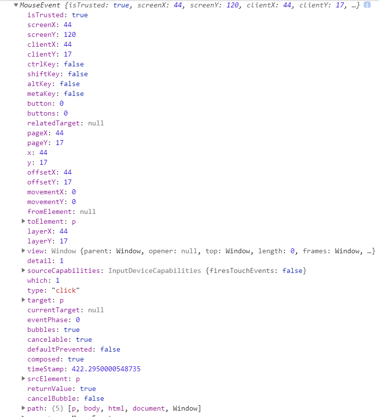
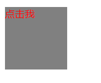
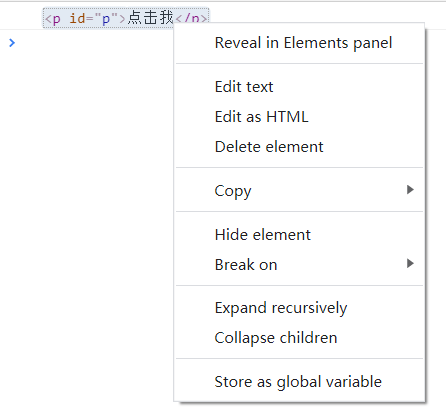
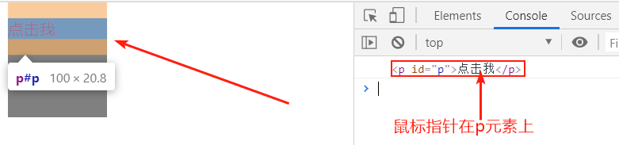
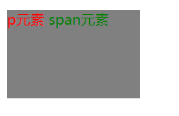
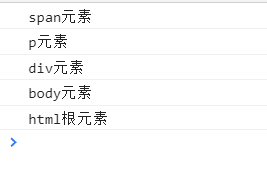
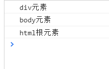
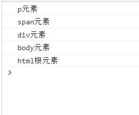
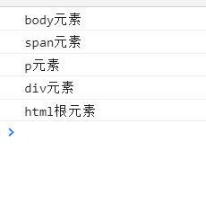
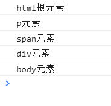

# [事件介绍](https://developer.mozilla.org/zh-CN/docs/Learn/JavaScript/Building_blocks/Events)

## 什么是事件？

**事件是您在编程时系统内部发生的动作或发生的事情,系统通过事件[对象]来告诉您当前系统内部发生了什么**,在您愿意的情况下,您可以以某种方式*(编写代码)*对系统内部发生的事情/动作*(对事件)*进行回应.

例如:用户在一个网页上单击某个按钮时,系统内部就会接收这个动作并告诉浏览器,按钮被单击了(发生了这个事件),是否要执行事件对应的回应?

而这个回应就是开发者编写的代码,即:若开发者有编写当用户单击该按钮时,系统会给出的回应,那么当用户单击该按钮,系统就会按照预设的回应去响应用户,

否则系统将不会对用户进行任何回应(除非该事件已经内置了某种回应).

- 用户**触发某个动作**,浏览器就会**以事件[对象]的方式**告诉开发者用户触发了该动作,是否要执行事件对应的回应?
  
  **如果有监听**该事件**且有编写**回应代码,则回应用户;**否则将会以默认**的方式回应用户(可能什么都不会回应)

以上就是事件的基本概念,这其实并不难理解.

## 一系列的事件

通常来说,每一个事件都不是单独发生的,它往往会伴随着其他事件的发生,就如上面刚才所说的:单击一个按钮.

当用户单击一个按钮时,除了点击按钮*(按下鼠标并松开)*这个动作本身会触发一个事件*(click事件)*以外,鼠标的按下和松开都会单独的触发事件:

- [`mousedown`](https://developer.mozilla.org/zh-CN/docs/Web/Reference/Events/mousedown) :在元素上按下任意鼠标按钮.
- [`mouseup`](https://developer.mozilla.org/en-US/docs/Web/API/Element/mouseup_event) : 在元素上释放任意鼠标按键.

## 事件是浏览器内置的

对于JavaScript来说,事件并不是它的核心,因为**事件被定义成内置于浏览器的JavaScript的 API**,

也就是说,**JS并不内置事件,它只是通过浏览器暴露的API从而调用浏览器内置的事件**罢了.

所以在一个Web中,事件都是在浏览器的窗口中被触发 且 通常被绑定到窗口内部的特定位置(部分)上——>

可能是某个html元素标签、一系列的元素元素标签、某段html代码[被加载到该窗体从而触发某个事件]、[绑定在]整个浏览器窗口[中的事件] 等等.

举几个可能发生的不同事件:

- 用户点击某个元素(如: button元素,或点击p元素中的文字)或悬停贯标在某个元素上  [会触发对应的事件]

- 用户在键盘上按下某个键(如: enter回车键)[会触发对应的事件]

- 用户调整整个浏览器窗口的大小/关闭浏览器窗口[会触发对应的事件]
  
  ​    ->这个就是事件被绑定在了整个浏览器的窗口上,移动、关闭、缩放浏览器窗口等,都会触发相应的事件.

- 一个网页停止加载[会触发对应的事件]

- 提交表单 [会触发对应的事件]

- 播放、暂停、关闭视频 [会触发对应的事件]

- 浏览器发生错误 [会触发对应的事件]

每个事件都是在浏览器窗口中或浏览器窗口本身 触发的,因为事件是浏览器内置的,它们被绑定在了浏览器窗口中的特定部分或窗口本身中,

所以说不在浏览器窗口或窗口中触发事件,能在哪里触发事件呢?

若您想了解更多的其他事件,参见:[MDN-Event reference](https://developer.mozilla.org/zh-CN/docs/Web/Events)

## 事件处理器(监听器)

对于事件来说,每一个可用的事件,都对应着一个事件处理器,也就是我们前面讲到的:对用户触发某个事件做出的相应回应,这个相应的回应就是事件处理器.

简单来讲,就是事件被触发时,会运行的代码块就是事件处理程序,当我们定义了一个 事件被触发就会执行的代码块时,我们就说我们**注册了一个事件处理器(EventHandler)**.

注意: 事件处理器也被称之为事件监听器,从我们的用意来看,这两个名字的用处都是相同的,尽管严格来说我们定义的这个事件处理器(代码块)既监听也处理事件.

监听器留意事件是否发生,然后处理器就是对事件发生做出的回应,监听和处理这两个事情,浏览器是一起做的.

所以你想将事件处理器称之为事件监听器也是可以的,您甚至可以说,您注册了一个事件监听器.

名字其实并不那么关键,用法才是.

## 事件并不是Web独有的

值得注意的是,并不是只有JavaScript才能使用事件——大多数编程语言都有这种机制,并且几乎所有的编程语言的事件的工作方式不同于 JavaScript,

这是因为网页上的事件机制不同于在其他环境中的事件机制,而使用浏览器内置事件的API的JavaScript,它使用的事件方式当然不同于其他编程语言.

比如, [Node.js](https://developer.mozilla.org/en-US/docs/Learn/Server-side/Express_Nodejs) 是一种非常流行的允许开发者使用 JavaScript 来建造网络和服务器端应用的运行环境.

[Node.js event model](https://nodejs.org/docs/latest-v5.x/api/events.html) 依赖定期监听事件的监听器和定期处理事件的处理器——虽然听起来好像差不多,但是实现两者的代码是非常不同的,

Node.js 使用像 on( )这样的函数来注册一个事件监听器,用 once ( )这样函数来注册一个在运行一次之后注销的监听器.[HTTP connect event docs](https://nodejs.org/docs/latest-v5.x/api/http.html#http_event_connect) 提供了很多例子

另外一个例子:您可以使用 JavaScript 来开发跨浏览器的插件,*使用 [WebExtensions](https://developer.mozilla.org/en-US/docs/Mozilla/Add-ons/WebExtensions) 开发技术.*

事件模型和网站的事件模型是相似的,仅有一点点不同——事件监听属性是大驼峰的,如:onMessage而不是onmessage

还需要与addListener函数结合.参见 [runtime.onMessage page](https://developer.mozilla.org/en-US/Add-ons/WebExtensions/API/runtime/onMessage#Examples) 上的一个例子

您现在不需要掌握这些,**我们只想表明不同的编程环境下事件机制是不同的，**

## 使用Web事件的三种方式

### 描述

在JS中,想要使用Web内置事件是非常简单的,有以下三种方法:

1. 行内事件处理器 (请勿使用)
2. 事件处理程序属性 (建议不用)
3. [DOM Level2 Events](https://www.w3.org/TR/DOM-Level-2-Events/)中EventTarget接口提供的addEventListener()方法(API,推荐使用)

下面我们来详细讲解这三个方法吧.

### 事件处理程序HTML属性 (请勿使用)

#### 什么是事件处理程序HTML属性

你也许在许多就网站或您自己的代码中看到过这么一种写法:

```html
<button onclick="bgChange()"></button>
<script>
        function bgChange() {
            const rndCol =     
            `
                rgb(${random(255)},
                ${random(255)},
                ${random(255)})
            `
            document.body.style.backgroundColor = rndCol;
        }
</script>
```

(您可以[在线演示](http://www.whyhw.com/api/code-example/javascript/events/use-web-events/inline-event-handler/random-color-inlineeventhandler.html)该程序 )

早期的时候,在Web上注册事件处理程序的方式就是类似于上面所示的**事件处理程序HTML属性**(也可以成为行内事件处理器或内联事件处理程序)*,

这时期的有关事件的html属性实际上是就是当事件发生时要运行的JavaScript代码. 所以除了以上的例子*(当单击事件发生时,就调用处于同一个页面的script标签中的bgChange函数)*,我们也可以直接在属性内插入JavaScript代码:

```html
<button onclick="alert('你好!我是事件处理程序html属性');">
    单击我
</button>
```

你会发现,通过事件处理程序html属性近乎可以处理所有事件,但是这是在早期时候才会使用的方式.

#### 为什么不应该使用事件处理程序HTML属性?

您现在不应该使用事件处理程序HTML属性,它们被认为是一种不好的做法,虽然使用一个事件处理程序html属性看起来非常的简单,但是一旦你的项目稍加复杂,使用这种方式监听并处理一个事件,很快你的项目就会变得难以管理和效率低下.

您不妨想想:你的一个Web页面中,存在数十个,数百个元素标签,你需要为它们都用事件处理程序html属性监听并处理一个事件,

但一旦发生某个bug,那你得花多少时间排查呀,即使您找到了错误源头,也很难直接消灭这个错误,因为您不知道,这个事件会不会影响其他事件; 

如果您想要在以后继续添加元素,注册事件,那您得考虑考虑新添加的元素和事件是否也会影响到其他元素; 

并且我相信,若一个维护人员看见您的数十个,数百个事件处理程序html属性,那他肯定会撂挑子走人,爷不干了!

所以您不妨考虑考虑使用事件处理器**(仍不建议使用,只是相对于该方式,事件处理器较为友好)**.

### 事件处理器 (建议不用)

#### 什么是事件处理器

事件处理器其实和上面的事件处理程序html属性是有些类似的,只不过这里的事件处理器是用JS的方式为一个元素的事件添加事件处理器,

**也就是用事件处理程序html属性作为节点对象的一个属性,为该属性添加一个方法,该方法就是事件处理程序方法.**

```HTML
<body>
    <button>Change color</button>
</body>
<script>
    const btn = document.querySelector('button');
    btn.onclick = bgChange;

    function random(number) {
        return Math.floor(Math.random() * number);
    }
    function bgChange() {
        const rndCol =
            `
                rgb(${random(255)},
                ${random(255)},
                ${random(255)})
            `
        document.body.style.backgroundColor = rndCol;
    }
</script>
```

- **btn.onclick = bgChange;**
  
  bgChange就是事件处理程序方法,btn就是节点对象,onclick就是事件处理程序html属性.

#### 是否使用事件处理器?

以上的这种方式对比事件处理程序html属性来说,是较好的,它分离了html和js代码,让二者相互独立,却又相互关联.

这更有利于后期的维护以及出现bug时的排查与调错.

不过可惜的是,使用这种方式并不能为同一个监听器注册多个处理器,如:

```js
myElement.onclick = functionA;
myElement.onclick = functionB;
```

第二行的事件处理器会覆盖第一行的事件处理器,也就是说,当我们单击myElement元素时,只会出发functionB,而不会触发functionA; 并且这种方式还有个缺点: 无法直观,高效的删除对myElement元素的监听,

或许你可能会认为用诸如: `myElement.onclick = null;`的方式不就好了吗?可是如我刚才所说的那样,这种方式不够直观,而且不够高效,它还会执行一次赋值操作,这是很愚蠢的一件事情.

**所以我给出的建议: 不要使用事件处理器,除非你的目的是为了兼容性(Internet Explorer 8支持事件处理程序html属性和事件处理器)**

对于事件监听并处理的机制来说,我们有更为优秀,更为友好的方式:addEventListener()和removeEventListener(),详见下面.

### [DOM Level2 Events](https://www.w3.org/TR/DOM-Level-2-Events/)的addEventListener()方法(推荐使用)

#### 机制说明

这种方式是一种新的事件触发机制,它被定义在[DOM Level 2 Events](https://www.w3.org/TR/DOM-Level-2-Events/)细则(规范)中,这个规范给浏览器提供了一个函数[addEventListener()](https://developer.mozilla.org/en-US/docs/Web/API/EventTarget/addEventListener).

该函数和以上的两种方式的作用是相同的,但是语法不同,我们可以用该函数重写 *事件处理程序HTML属性和事件处理器* 中的改变网页背景颜色示例:

```html
<body>
    <button>Change color</button>

</body>
<script>
    const btn = document.querySelector('button');

    function random(number) {
        return Math.floor(Math.random() * number);
    }
    function bgChange() {
        const rndCol =
            `
                rgb(${random(255)},
                ${random(255)},
                ${random(255)})
            `
    }
    btn.addEventListener('click', bgChange)
</script>
```

你们应该也注意到了,事实上,我只需要将多余的事件处理器删除,然后使用addEventListener()函数监听并处理事件即可.

我们也可以使用一个匿名函数作为addEventListener()函数监听的事件的处理器:

```js
 btn.addEventListener('click', function() {
         const rndCol =
            `
                rgb(${random(255)},
                ${random(255)},
                ${random(255)})
            `
 })
```

这种使用匿名函数的方法和以上写方法名的方式是等效的,您可以[在线运行]()该实例.有关于addEventListener方法和removeEventListener方法,***详见: addEventListener和removeEventListener***

#### 为什么推荐使用该机制

使用这种机制去注册一个监听器,并绑定一个事件处理程序相较于前两者而言,是**更为直白和高效**的,并且使用addEventListener()方法注册的监听器,

还对应着一个方法**能移除事件监听器**的:[removeEventListener()](https://developer.mozilla.org/en-US/docs/Web/API/EventTarget/removeEventListener),使用它能很方便的将一个已经注册的事件监听器移除,如我们移除以上示例的click事件:

```js
btn.removeEventListener('click', bgChange);
```

在这个简单的、小型的项目中可能不是很有用，但是在大型的、复杂的项目中就非常有用了，可以非常高效地清除不用的事件处理器.

另外在其他的一些场景中也非常有效——比如您需要在**不同环境下运行不同的事件处理器，您只需要恰当地删除或者添加事件处理器即可**。

 使用该机制还有另一个好处:**您可以给同一个监听器注册多个处理器**,而不会如 *事件处理器*  一节中所说的那样,后者覆盖前者,即以下方式无法注册多个事件监听器

```js
myElement.onclick = functionA;
myElement.onclick = functionB;
```

在 *事件处理器*  一节中我们也提到过了,是因为后者会覆盖前者,但是使用addEventListener()方法注册的事件监听器则可以时间为同一个元素注册相同的事件监听器,并且不会互相覆盖:

```js
myElement.addEventListener('click', functionA);
myElement.addEventListener('click', functionB);
```

当myElement元素被点击时两个函数都会被执行.

另外该方法还提供了其他强大的特性和选项(如注册的监听器是否是捕获阶段执行还是冒泡阶段执行),***详见: [addEventListener](https://developer.mozilla.org/en-US/docs/Web/API/EventTarget/addEventListener)和[removeEventListener](https://developer.mozilla.org/en-US/docs/Web/API/EventTarget/removeEventListener)***.

## 该使用哪种机制

前文说到,使用Web事件有三种方式,分别为: 

1. 事件处理程序HTML属性
2. 事件处理器
3. addEventListener()方法.

您**绝对不应该使用事件处理程序HTML属性**,这些属性已经过时,而且也不是好的做法,原因如 事件处理程序HTML属性 中所述.

而第2种和第3种机制您可以根据自己的需求,交叉使用.

对于第2种机制来说,它兼容性更好,可以支持IE8,但是相对于第3种机制来说,第2种机制的功能和特性就较少.

在不考虑至此极低版本的浏览器的情况下,我始终建议使用第3种机制,它对开发者更为的友好,并且拥有良好的特性和更多的功能.

# 事件对象

## 什么是事件对象?

有时候,你在一个事件处理函数(程序)内部,会看到一个名字为:event或evt,甚至是更简单的e 的参数, 这个参数被称之为事件对象.

也就是说,**事件处理函数的第一个参数就是事件对象.**

事件对象会在一个事件触发时,自动的作为参数传递给事件处理函数(如果该函数具有至少一个形参的话),并且事件对象始终会作为事件处理函数的第一个参数.

**事件对象其实就是: 提供当前触发该事件的节点对象(元素)的一些额外信息和该事件的功能.**

## 输出事件对象的例子

```html
<body>
    <p>点击我</p>
</body>
<script>
    const p = document.querySelector('p')
    p.addEventListener('click', function (e) {
        console.log(e)
    })
</script>
```



很显然,以上图片的结果,就是当前事件对象.

## 事件对象的target属性

我们已经知道了事件对象的本质:触发某个事件的节点对象,那么这里我介绍一个在事件对象中我们可能经常会使用到的属性:target属性.

eventObj.target: **始终指向当前直接触发事件的节点对象,也就是target属性会返回一个当前直接触发事件的节点对象的引用**,请看以下示例:

```html
<style>
    div {
        height: 100px;
        width: 100px;
        background-color: gray;
    }
    p{color: red;}
</style>
<body>
    <div>
        <p id="p">点击我</p>
    </div>

</body>
<script>
    const p = document.querySelector('p')
    p.addEventListener('click', function (e) {
        // 输出: <p id="p">点击我</p>
        console.log(e.target);
    })
</script>
```

渲染结果为:



当我们单击 p元素时,就会触发我们为p元素中注册的click事件,且会执行对应的事件处理函数,其中事件处理函数中,输出的结果为: \<p id="p">点击我</p>

请注意:以下跳出来的竖着的弹框是因为我单击鼠标右键,才会跳出来的弹框.我之所以会在该输出结果上单击鼠标右键,

是因为我想让你们知道: 该结果是对p元素的引用(**只是对p元素引用,不包括父元素和子项**),而不是单纯的输出一个字符串p而已.



现在如果您将鼠标指针移动到该输出结果上,你会发现在Web页面中,对应p元素的引用的 p元素将被选中:



如果在事件冒泡和事件捕获中,使用事件对象的target属性将会更有用,***详见:事件冒泡和事件捕获***

## 使用target属性的示例

```html
<style>
    div {
        background-color: red;
        height: 100px;
        width: 25%;
        float: left;
    }
</style>
<script>
    // 添加16个div元素
    for (let i = 1; i <= 16; i++) {
        const myDiv = document.createElement('div');
        document.body.appendChild(myDiv);
    }

    // 随机分配0-255(含)的整数
    function random(number) {
        return Math.floor(Math.random() * number);
    }
    // 事件处理函数
    function bgChange() {
        const rndCol = 
            `
                rgb(${random(255)},
                ${random(255)},
                ${random(255)})
            `;
        return rndCol;
    }

    // 返回一个NodeList集合: 页面中的所有div元素组成的
    const divs = document.querySelectorAll('div');

    // 为每一个元素注册事件
    for (let i = 0; i < divs.length; i++) {
        divs[i].addEventListener('click', function (e) {
            // e.target: 返回当前用户点击的元素的引用
            e.target.style.backgroundColor = bgChange();
        })
    }
</script>
```

您可以查看该示例的[在线演示](http://whyhw.com/api/code-example/javascript/events/event-object/useful-eventtarget.html)(玩的开心).

# 事件冒泡和事件捕获

## 事件冒泡和捕获的作用

浏览器的事件冒泡机制和事件捕获机制是一个非常重要的概念,如果您不理解这个概念的话,它会让你感受到真正的痛苦.

事件冒泡和事件捕获是两种完全不同的机制,它们两个的主要作用是: 

**决定 在一系列相关元素上(祖先和后代这种关系),某一个元素触发一个事件后会导致所有其他的元素上的 同名事件(如果存在的话)也被触发从而调用每个元素上的事件处理函数的 顺序.**

是的,在一系列相关元素上(祖先和后代这种关系)的任意一个子元素*(除了根元素html)*的某个事件的触发都会使父元素上的同名事件也被触发*(如果存在的话)*从而执行相关事件处理器.

这是一种默认的行为,幸运的是,你可以通过浏览器提供的某些API更改这种默认行为,使触发一个元素上的某个事件后,该事件不会传递给其他元素,如: stopPropagation()函数等.

当一个事件发生在具有父元素上的元素时,现在浏览器会存在两种阶段,使该事件触发——冒泡阶段和捕获阶段.

## 事件冒泡

事件冒泡是现代浏览器默认采用的事件触发机制.

- 事件冒泡: 当一个事件发生在具有父元素上的元素时,浏览器会先检查实际触发事件的元素是否有注册事件监听器,如果有,则执行对应的事件处理程序(函数),
- 然后移动到它的下一个直接父元素上,并做同样的事情,然后在移动到下一个,直到达到根元素html.

也就是说,默认情况下,如果浏览器执行的是**冒泡阶段的事件**,那么当一个元素上的事件被触发时,它的所有祖先元素上的同名事件将按照**从内→外的顺序**,也依次被触发.

即,执行的顺序大致为:

用户实际点击的元素 -> 父元素 -> 祖先元素... ->  body ->  html根元素

## 事件捕获

事件捕获机制和事件冒泡机制是完全相反的机制.

浏览器要在事件捕获机制下执行事件对应的处理程序,需要开发者自行打开,因为它不是现代浏览器的默认设置.

- 事件捕获: 当一个事件发生在具有父元素的元素时,浏览器会先检查元素的最外层祖先（包裹它的最外层的元素），
  查看它**是否在捕获阶段注册了**被触发事件的事件处理程序(函数),如果有,则执行它.

- 然后移动到的下一个祖先元素（从最外层数的第 2 个祖先元素）,并执行相同的操作,
  然后再移动下一个祖先元素，以此类推,直到到达实际出发事件的元素，然后从此元素再进行冒泡（执行过事件的元素不再重复执行）。
  为什么要冒泡？因为事件捕获：是对注册了事件捕获的元素才起效，对于没有注册的，还是默认事件冒泡。

触发事件元素的且开启了事件捕获的祖先元素 -以此类推往下执行-> 实际触发事件的元素 -> 从此元素开始冒泡

精确描述：

**若一系列相关树中，有 1 个或多个或全部元素开启了事件捕获：**

如果触发事件的元素，是开启了事件捕获元素的子元素（不论层级），那么会先执行最外层开启了事件捕获元素的元素，

- 如果只有 1 个元素开启了事件捕获，且实际触发事件的就是此元素，那么相当于它的最外层组件就是它自己。
  所以会先执行它自己的事件处理函数，然后从它开始冒泡。

然后第执行 2 个（若有）开启的事件捕获元素的事件，以此类推直到实际触发事件的元素，然后从此元素开始进行事件冒泡（若有）。

注：这个思想其实可以推理出 **若一系列相关树中全都开启了事件捕获** 这一节，不过由于全部开启了事件捕获，所以相当于没有事件冒泡了。

## 总示例

### 事件冒泡

```html
<style>
    p {
        color: red;
    }
    span {
        color: green;
    }
    div {
        background-color: gray;
        height: 100px;
        width: 150px;
    }
</style>
<body>
    <div>
        <p>
            p元素
            <span>span元素</span>
        </p>
    </div>
</body>
<script>
    const html = document.querySelector('html')
    const body = document.querySelector('body')
    const div = document.querySelector('div')
    const p = document.querySelector('p')
    const span = document.querySelector('span')

    html.addEventListener('click', function () {
        console.log('html根元素')
    })
    body.addEventListener('click', function () {
        console.log('body元素')
    })
    div.addEventListener('click', function () {
        console.log('div元素')
    })
    p.addEventListener('click', function () {
        console.log('p元素')
    })
    span.addEventListener('click', function () {
        console.log('span元素')
    })
</script>

```

渲染结果为:



不难看出,如果单击span元素,则按照默认的浏览器执行事件机制(冒泡)来说,触发单击事件的顺序为:

span -> p -> div -> body -> html.

​    

如果单击div元素,则触发单击事件的顺序为:

div -> body -> html



### 事件捕获

这里事件捕获的示例仍然是基于 事件冒泡 中的示例,不过我们需要addEventListener()函数的第三个参数:

```html
<script>
    p.addEventListener('click', function () {
        console.log('p元素')
    },true)
    span.addEventListener('click', function () {
        console.log('span元素')
    })
    div.addEventListener('click', function () {
        console.log('div元素')
    })
    body.addEventListener('click', function () {
        console.log('body元素')
    })
    html.addEventListener('click', function () {
        console.log('html根元素')
    })
</script>
```

这里我们将p元素的事件监听器的第三个参数改为true,这表示: p元素会基于事件捕获机制（一系列相关树中就存在一个开启事件捕获的元素）,

所以触发事件的元素，它是开启了事件捕获元素的子元素，(这里是单击事件，点击 span),则触发一系列相关元素的同名事件为:  

p(开启事件捕获的元素) -> 实际触发事件的p元素的子项(这里只有span元素) -> div -> body -> html（再开始冒泡）



----

现在验证不是直接子元素，而是后辈元素（不论层级），我们只将body的addEventListener设置为ture,将p元素的addEventListener的第三个参数设置为默认值false,查看是否是这样:

```js
    body.addEventListener('click', function () {
        console.log('body元素')
    },true)
```

此时,若我们单击span元素,则一系列相关元素触发click的事件顺序为:

body -> span -> p -> div -> html.

即:当执行完body和span(实际触发事件的元素)时,就开始正常的进行事件冒泡.



----

我们将html根元素和p元素的addEventListener函数的第三个参数设置为true,让它们两个基于事件捕获机制:

```js
    p.addEventListener('click', function () {
        console.log('p元素')
    }, true)
    html.addEventListener('click', function () {
        console.log('html根元素')
    }, true)
```

然后单击span元素,那么触发事件的顺序应该为:

html（最外层开启事件捕获的祖先元素） -最外层第 2 个开启事件捕获的祖先元素-> p -> span（实际触发事件元素） -开始冒泡-> div -> body



## 事件冒泡和事件捕获的区别

---

- 事件执行机制不一样
- 使用方法不一样（现代浏览器默认是事件冒泡，如果要改成事件捕获，则 addEventListener 设置第 3 个参数为 true.

# 自定义事件

## 概念

自己创建一个事件，然后你可以通过代码去让这个事件在代码执行的过程中发生，而不需要用户手动操作。

如果你想区分“真实”用户事件和通过脚本生成的事件可以通过: Event.isTrusted 判断：

- true: 真实事件
- false: 脚本生成的事件

## 示例

### 简单事件 Event

```html
<body>
    <button class="btn" onclick="handleClick(event)">click</button>
</body>
<script>
    // dipachEvent() 和 手动触发事件都会触发该事件处理器。
    const handleClick = () => {console.log(event)}
    const btn = document.querySelector('.btn')
    const clickEvent = new Event('click')
    // 或可以通过 btn.click() 模拟元素的单击
    btn.dispatchEvent(clickEvent) // 将 clickEvent 事件对象派发到 btn 目标，即：由 btn 目标来初始化和触发 clickEvent 事件。
</script>
```

- 通过 new Event() 实例化一个事件对象，然后可以通过 target.dispatchEvent(eventObj) 去将该事件对象派发到执行的目标身上。     并且可以通过 eventObj.isTrusted 去判读是否为真实事件。

如果你想创建一个诸如 MouseClick 的事件，这应该使用 new MouseEvent()，而非 new Event。 参见：[UI事件规范](https://www.w3.org/TR/uievents/) 

### CustomEvent

#### 概念

`CustomEvent ` 事件是由程序创建的，可以有任意自定义功能的事件。

通过 new CustomEvent(typeArg, customEventInit) 即可创建自定义事件。

#### 非冒泡的自定义事件

通过 <a href='#简单事件 Event'>简单事件 Event</a> 一节， 我们可以知道：   `EventTarget.dispatchEvent(event)` 可以让指定的事件对象触发一次指定的事件，若此若做，我们可以在任意时刻使用该语句触发一个事件。

```html
<body>
    <button id='btn'>button</button>
</body>
<script>
    const btn = document.getElementById("btn")
    // 创建一个 yomua 事件，并使用第2个参数初始化它
    const customEvent = new CustomEvent("yomua", {
        detail: { name: "yy" } // detail: 初始化时传入的数据 (需要一个对象)
    });
    // btn 监听 yomua 事件
    btn.addEventListener('yomua',(e)=>{
        console.log(`${e.type} 事件类型被触发`)
    })

    btn.addEventListener("click", function () {
        console.log('click 事件被触发')
        // 派发事件
        btn.dispatchEvent(customEvent);
    })
    // click 事件被触发
    // yomua 事件类型被触发
</script>
```

在此示例中，我们让 button 元素监听了 yomua 和 click 事件，且当 cilck 事件被执行时，将会使用代码将 yomua 事件派发到 button 元素。

所以当点击按钮 button时，将会触发 cilck 事件，在 click 事件处理函数中，将会派发事件对象 customEvent 到 btn 元素->让 btn 节点去触发指定的事件：yomua，这样 yomua 事件就被触发了，那么对应的事件处理函数也会被触发。

TIPS：想通过某节点触发某个自定义事件，则该节点需要监听此自定义事件（注：若该自定义事件是冒泡的，那么父元素如果监听了同名事件，则其处理函数将也会被执行），那么使用 `EventTarget.dispatchEvent(customEvent)` 才有效果。

- 这想想也是应该的，比如：我们想要让某个元素触发单击事件，那么该元素就有监听单击事件，并有对应的处理函数，这样单击该元素时，才会执行 click 事件的处理函数。

#### 冒泡的自定义事件

默认情况下，自定义事件都是不冒泡的（至少在 chrome 浏览器中是这样的），但是你可以在初始化自定义事件时，用它的第2个参数，去让该事件能冒泡

```html
<body>
  <div class="parent">
    <button id='son'>click</button>
  </div>
</body>

<script>
  const customEvent = new CustomEvent("yomua", {
    detail: { name: "yomua" },
    bubbles: true // 冒泡
  });

  const parent = document.querySelector(".parent")

  const son = document.getElementById("son")

  parent.addEventListener("yomua", e => {
    console.log('parent')
    console.log(e.target) // 仍然是 button 这个子元素，因为 Event 事件对象永远指向第一个触发事件的元素，即使再怎么冒泡也是一样
  });

  son.addEventListener("yomua", e => {
    console.log(`事件类型：${e.type}, 此事件被触发`)
  });

  son.addEventListener("click", function () {
    console.log('click')
    son.dispatchEvent(customEvent);
  })
  // click
  // 事件类型：yomua, 此事件被触发
  // parent
  // <button id="son">click</button>
</script>
```

值得一提的是，若在 son 的 click 事件中，我们将 customEvent 派发到 parent 元素上，则将会直接执行 parent 元素的 yomua 事件，这相当于我们直接单击了 div 元素。

#### 父组件创建一个自定义事件，让子组件监听事件并触发对应处理函数

父组件：有一个 Tab 可以放大或缩小，但是浏览器并没有内置任何关于 Tab 放大或缩小的事件类型，子组件无法直接监听 Tab 放大或缩小的事件，所以此时我们可以自定义个 TabScale 事件，让子组件方便监听并执行对应处理函数。

但是现在有个问题：在什么情况下使用 `EventTarget.dispatchEvent(’TabScale')` 执行，从而触发 TabScale 事件，最后让子组件监听到并执行事件处理函数呢？

这是一个实际需求问题，比如：当鼠标点击 Tab 并在 Tab 组件范围内松开时（onmouseup），触发 TabScale 事件。

这是因为当要让 Tab 进行放大或缩小时，肯定要单击鼠标，并选中 Tab，然后松开鼠标，才能对 Tab 执行放大或缩小，那么我们就可以肯定，在 Tab 范围内松开鼠标，一定包含对 Tab 进行放大或缩小的执行，所以我们可以这么做。

```react
const Parent = () => {
    tab.addEventListener('mouseup',()=>{
        window.dispatchEvent('TabScale')
    })
}

const Son = () => {
    EventTarget.addEventListener('TabScale',()=>{
        // do something
    })
}
```

当当鼠标在 Tab 组件松开时，则触发 TabScale 事件，此时我们可以让 Son 组件的任意元素监听 TabScale 事件，当此事件执行，我们可以在对应的事件处理函数中执行我们想要的任何合法操作。

注意：如果没有监听 TabScale 事件，并且**没有对应的处理函数**，则**即使 一直**触发 TabScale 事件，对于性能的影响也是微乎其微的 —— 这得益于优秀的浏览器 Event 机制，不然任何一个元素的 event 都是很多的，如果会造成性能影响，那么浏览器早就卡死了！

#### [目的](https://zhuanlan.zhihu.com/p/108447200)

在某个事件触发时，使用 dispatchEvent(cutomEvent) 触发自定义事件的目的是：让监听自定义事件的元素执行对应的事件处理函数，

也就是说，使用代码触发自定义事件 ，仅仅只是为了让【某个事件 A 执行】或【某个生命周期执行】时，同时触发一次自定义事件 B，让监听该事件的代码能运行罢了？

有个疑问：为什么不直接监听事件 A 呢？而要监听事件 A 触发导致使用代码触发的自定义事件 B 呢？

是的，其目的就是为了解耦，不要让多个模块都依赖于某个 HTML 内置的事件，否则，当以后这个元素要换位置了，名字、id 什么的都改了，或者干脆这个元素没了，那么这些模块里面监听该元素的事件 A 就要跟着改变，这太耦合了，

故用一个自定义事件，让多个模块监听该自定义事件事件 B ，这样即使元素没了，我们只要让另一个元素在触发某个内置事件时，触发这个自定义事件，这些模块仍然能正确的运行，这样也就只用改一处地方！

# Reference

- [时间冒泡和捕获 - 非官方](https://zh.javascript.info/bubbling-and-capturing)
