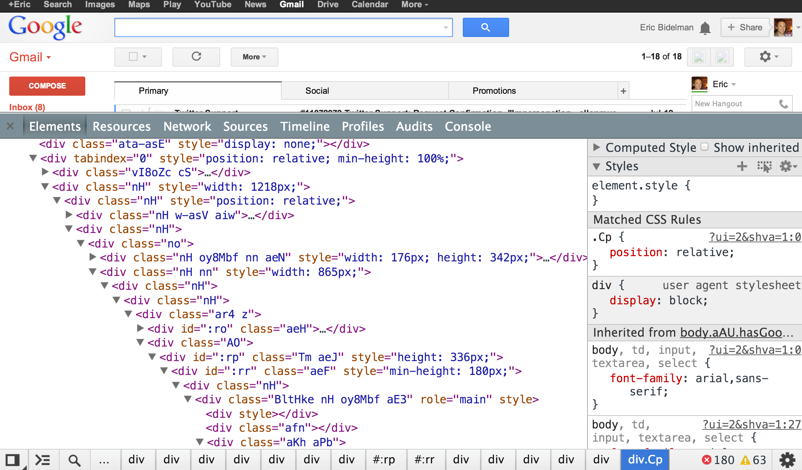

# 自定义元素

[阮一峰](http://www.ruanyifeng.com/blog/2017/06/custom-elements.html)

[和谷歌官方文档的撰写人是同一个人的另一份文档](https://www.html5rocks.com/zh/tutorials/webcomponents/customelements/)（旧的）

[谷歌官方文档](https://developers.google.com/web/fundamentals/web-components/customelements)

[HTML5 Standard](https://html.spec.whatwg.org/multipage/infrastructure.html#extensibility-2)(可扩展性)


前置条件

- 懂什么是:web components
- 了解:Window.customElements只读属性
  - 了解:CustomElemenRegistry接口

## What is Custom Elements?

自定义元素不是随便命名的一个元素标签*(那叫未知元素,详见:未知元素(HTMLUnknownElement))*,*如:`<yomua></yomua>`等,这是无效的自定义元素标签.*

它是开发者自己定义的一个TML元素,如果你注册了(*customElements.define*)一个自定义元素,那么该自定义元素将被HTML规范所承认; 

即使你未注册自定义元素,但是却定义了它*(只定义未使用define()方法)*,那么HTML规范仍然承认这是一个自定义元素标签,只不过该标签没有注册就无法拓展新功能,就和一个普通的HTML元素标签一样了.

自定义元素会默认实现HTMLElement接口*(而未知元素默认实现的是HTMLUnknownElements接口)*,是的即使你未注册它也一样,您可以在支持自定义元素的浏览器中核实这一点:

```js
// "tabs" is not a valid custom element name
document.createElement('tabs') instanceof HTMLUnknownElement === true // true

// "x-tabs" is a valid custom element name
document.createElement('x-tabs') instanceof HTMLElement === true // true
```

所以这就是自定义元素和其他HTML元素没有区别的原因,值得注意的是:自定义元素的默认display是inline,即:**所有的自定义元素默认都是行内元素.**

您可以根据一个HTML内置元素或一个已经被定义的CustomElement从而派生出一个新的自定义元素,该自定义元素将继承你所选择的那个元素,即:该自定义元素拥有您所选择的那个元素的功能,以及您还可以为它扩展一些新的功能(API).

如果你想要自己定义HTML元素,则必须按照HTML规范*(自定元素的规则)*,来定义元素,在HTML规范中,明确指定了有关于自定义元素的三项规则,***详见:自定元素必须遵守的三项规则.***

现在我们来稍微总结一下这节的知识,即:

- 自定义元素是开发者根据HTML规范,从而创建的某个被HTML规范和浏览器所承认的元素且自定义元素默认实现了HTMLElements接口.

- 开发者可以通过DOM接口*(customElements.define())*去注册自定义元素,从而可以扩展自定义元素功能.

- 且如果你愿意,你可以基于某个已经存在的元素*(内置/自定义元素皆可)*来派生出一个新的元素并为该元素扩展其他功能

  *(customElements.define())*.

- 所有的自定义元素默认都是行内元素.

## 自定元素必须遵守的三项规则

#### 自定义元素的名称必须包含英文短横线(`-`),

自定义元素的名称**必须包含英文短横线**(`-`),因此,类似: `<yomua-yhw>`

`<my-custom-element>`这样的标签,都是正确的自定义元素标签.

而如:`<tabs>` `<foo_samart>`这样的标签都是无效的自定义元素标签.

正因为HTML规范了自定义元素标签的名字,所以遵守HTML规范的浏览器都可以轻而易举的分辨自定义元素和常规元素.

HTML这一规范还可确保向 HTML 内置添加新标记时的向前兼容性,若没这一规范,则自定义元素标签可能和未来HTML自己定义的标签名字重复.

#### 任意相关联的文档中无法重复注册同一个标签

如果你定义了一个标签,还注册了它*(customElements.define())*,那么这个标签就会被浏览器记住并这样定了下来,你**无法再重复定义此标签**了,且你**无法撤回已经被注册的标签**（通过更改源代码去撤回已注册的标签不在此列，因为这根本不叫撤回）.

PS: 这个无法重复注册同一个标签的意思是=> 在有关联的文档中*(包括JS,CSS,HTML有关联)*,你在某处A注册了一个标签,

则无法继续在某处B重复注册这个标签,后面的不会覆盖前面的,浏览器只会报错:DOMException. 并且你也无法通过任何代码撤回已经注册完毕的标签.

#### 不能定义自我封闭的元素标签

自定义的元素不能自我封闭,因为HTML规范仅仅允许少数自我封闭的标签存在,您必**须为自定义元素添加开始和结束标签.**

自我封闭: 只存在开始标签的元素, 如: `<br />` `<input />`

## 为什么会存在自定义元素

在曾经的Web页面中,你任意查看一个Web页面的源码,你大概率会发现近乎所有的容器标签都是div,所有的段落都是p,短语都是span,没有任何变化:



​															(早期 GMail 的页面)

这一点都不"现代化",甚至直到<time datatime="2020-5-8">如今</time>仍有部分开发者只会使用div,span等此类的标签,连最基本的html5中的语义标签都不会正确的使用.

这非常可悲,这就是我们曾经构建Web应用的方式,幸运的是,现在(2020-5-8),我们站在的是巨人的的肩膀上,前辈们已经帮我们搭好了桥————Custom Elements,即自定义元素.

这就是自定义元素最初时为什么会出现的原因,现在除了让Web页面更现代以外,**自定义元素标签担任着高度可复用,可维护,可阅读的Web Components的容器或Web组件的元素**.

## 存在两种类型的自定义元素

### Autonomous custom elements自主定义元素

**是独立的元素，它不继承其他内建的HTML元素。**

这种类型的自定义元素最常见,因为它比*定制的内置的元素*这种类型更为的直白和易于理解.但是它的缺点也很明显,自主定义元素只能继承HTMLElement接口,而不能继承其他接口.

你可以直接把它们写成HTML标签的形式，来在页面上使用。例如:
 `<popup-info>`，或者是`document.createElement("popup-info")`这样。

***详见:如何注册自定义元素 - 创建并注册自定义元素的两种方法***

### Customized built-in elements定制的内置的元素

**继承自基本的HTML内置的元素。**

这种类型的自定义元素虽然没有*自主定义元素*类型 直白,但是它也仍有其优点:
它可以指定继承并扩展某个内置元素,而不是只单单继承HTMLElement接口并扩展该接口.

- 使用代码创建时，你必须指定所需扩展的元素;
- 正常使用时，需要先写出基本的元素标签，并**通过 is 属性指定custom element的名称**。（[is 属性解释](https://developer.mozilla.org/zh-CN/docs/Web/HTML/Global_attributes)）

例如`<p is="word-count">`,或者: `document.createElement("p", { is: "word-count" })` 

（意为：word-count 元素继承并扩展自 p 元素。）

且需要注意的是:在为该种类型的自定元素书写构造器时,您必须使该构造器继承正确的接口;

以及使用[define()](https://developer.mozilla.org/zh-CN/docs/Web/API/CustomElementRegistry/define)方法注册使用 *定制的内置的元素* 这种类型时,第三个参数options是必选的.

- options:是一个对象,只具有一个属性extend,属性值必须为当前is属性所在的那个元素的localname,

  这样才能将该类型的自定义元素注册,否则不行.

***详见:如何注册自定义元素 - 创建并注册自定义元素的两种方法***

## 自定义元素的特性

自定义元素允许开发者定义新的 HTML 元素类型.

虽然自定元素只是 [Web 组件](http://w3c.github.io/webcomponents/explainer/)模块提供的众多新 API 中的一个，但它也很可能是最重要的一个。

在前面的几个小节中,你们应该已经对自定义元素有了个很清晰的认识了,现在让我们关心关心自定义元素有什么特性,如果没有这些特性,整个Web组件架构可能都不存在:

1. 定义新的 HTML/DOM 元素

2. 基于其他HTML内置/自定义元素创建新的扩展(派生)元素*(customElements.define())*

3. 给一个元素标签绑定一组自定义功能*(customElements.define())*

4. 扩展已有 DOM 元素的 API *(customElements.define())*

   通过已注册的 自定义元素的 构造器去继承HTMLElements之后,然后在构造器中创建您想要的功能(这就是扩展已有 DOM 元素的 API)

## 未知元素(HTMLUnknownElement)

### 描述

未知元素就是开发者创建一个新的HTML元素时,未按照HTML规范要求来创建该元素,就导致浏览器无法识别这个开发者创建的HTML元素,如: `<yomua>,<yhw_wo>`等

但是有意思的是,即使浏览器无法识别未知元素,浏览器仍然愿意接收它们,将未知元素显现出来***(详见:示例)***.

这是因为HTML规范允许这么做,对于HTML规范来说,若你定义了一个不符合自定义元素规范 从而导致一个元素变成了未知元素,

那么此未知元素将会作为HTMLUnknownElement 进行解析,也就是未知元素会实现HTMLUnknownElement` 接口.

这就代表着HTML规范会承认未知元素的存在,并给出一个API让浏览器去识别未知元素对象,从而让浏览器能正确地显示未知元素.

不过,我始终建议: **不要去写未知元素,这是一件没有意义的事情,通过未知元素能做到的事,自定义元素也能做到甚至能做得更多!**

### 示例

```html
    <ILoveYou>
        Hello World!
    </ILoveYou>
```

## 如何注册自定义元素

### 使用[CustomElementRegistry](77c3780cdc528fb74734a6308247650a.html)接口的define()注册一个元素

使用[CustomElementRegistry](77c3780cdc528fb74734a6308247650a.html)接口的define()方法可以对一个已经存在的自定义元素进行注册(升级,***详见 :  什么是元素升级***).

```html
<body>
    <demo-demo></demo-demo>
</body>
<script>
    class demo extends HTMLElement {
        constructor() {
            super();
            // do something.
        }
    }
    // 注册demo-demo自定义元素,并执行demo类.
    customElements.define('demo-demo', demo)
</script>
```

注意:  元素升级实际上指的就是把一个自定义元素再某个已经存在的DOM接口上进行扩展.

否则我们的自定义元素除了名称和HTML内置元素有区别以外，其他的几乎没区别，甚至自定义元素还没有可以被屏幕阅读器等工具识别的语义.

### 什么是元素升级

一个已经存在自定义元素标签,但未进行注册(define())的自定义元素*(如: body中的 `<ai-ni>`, `<y-y>`等)*,然后使用customElements.define()进行注册并且成功的这一过程,称之为元素升级.

### 自定义元素的构造器需要继承的DOM API

注册一个元素时,它的构造器(这里指demo，上面的 demo 构造器)是必须的,且构造器也必须继承某个DOM API,并且**所继承的DOM API必须要和自定义元素的特性对应**.

如：使用p元素作为自定义元素*(详见 创建并注册自定义元素的两种方法 - 使用[is](https://developer.mozilla.org/zh-CN/docs/Web/HTML/Global_attributes/is)全局属性代替自定义元素名称并注册它)*时,

它的构造器继承的DOM API必须继承`HTMLParagraphElement` ,否则无法注册;还有如：每个自定义元素也都必须继承`HTMLElement`接口,否则也无法注册.

而无法注册真正原因是因为: 自定义元素的构造器不会被执行.

```html
<body>
    <demo-demo></demo-demo>
</body>
<script>
    // 错误的DOM API的 demo-demo元素无法注册，这里应该继承 HTMLElement
    class demo extends HTMLParagraphElement {
        constructor() {
            super();
        }
    }
    // demo-demo元素无法注册
    customElements.define('demo-demo', demo)
</script>
```

### 创建并注册自定义元素的两种方法

#### 使用自定义元素名称注册自定义元素

```html
<body>
    <demo-demo></demo-demo>
</body>
<script>
    class demo extends HTMElement {
        constructor() {
            super();
            // do something.
        }
    }
    // 注册demo-demo自定义元素,并执行demo类.
    customElements.define('demo-demo', demo)
</script>
```

#### 使用[is](https://developer.mozilla.org/zh-CN/docs/Web/HTML/Global_attributes/is)全局属性代替自定义元素名称并注册它

[is是一个全局属性](https://developer.mozilla.org/zh-CN/docs/Web/HTML/Global_attributes),即每一个html元素都可以使用,它允许我们制定一个html的内置元素像一个自定义元素一样被注册.

is属性的取值为: 自定义元素的名称且必须符合自定义元素须遵守的三项规则的前两项*(最后一项:不能定义自我封闭(如\<input/>这样的)的元素标签对 使用内置元素作为自定义元素的 元素来说,这项规则没意义)*.

如果要使用[CustomElementRegistry](77c3780cdc528fb74734a6308247650a.html)接口的define()方法注册一个用is属性写的自定义元素名称,则define()的第三个可选参数options必须存在.

- options 对于is属性中的需要注册的自定义元素名称来说,必须

  使得自定义元素继承自 - 并扩展 - 内置HTML元素,即:继承和扩展内置HTML元素.

  该参数是一个对象,目前只具有一个属性: extends,取值为is属性所在的那个内置HTML元素的名称(字符串).

  对于以下示例来说,就是: `{extends:"div"}`

```html
<body>
    <!-- 此时这里的 div 元素实际上是 div-custom-element 元素 ，我们将通过 is 属性指定的值引用该 HTML 节点对象-->
    <div is="div-custom-element"></div>
</body>
<script>
    class demo extends HTMLDivElement {
        constructor() {
            super();
            // do something.
            this.attachShadow({ mode: 'open' })
        }
    }
    customElements.define('div-custom-element', demo, { extends: 'div' })
</script>
```

-  ***class demo extends `HTMLDivElement` {}***

  请注意`HTMLDivElement`接口,该构造器必须继承该接口,因为我们使用的是div元素作为一个模板,让自定义元素(div-custom-element)继承并扩展它.

该示例的意思为: 注册一个自定义元素div-custom-element,它继承div元素且扩展div元素的专有DOM API.


