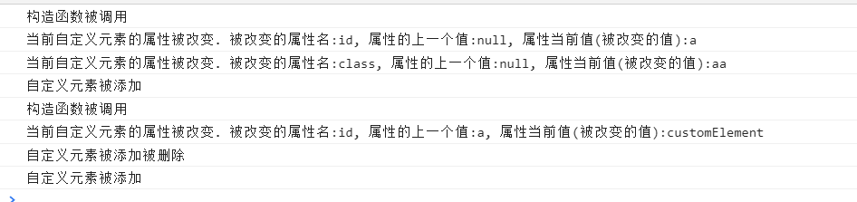

# [UseCustomElements](https://developer.mozilla.org/zh-CN/docs/Web/Web_Components/Using_custom_elements)

参见：H:\ProgramWay\ProgramWorkplace\Software\VSCode\Note\WebComponents

## 使用自定义函数中生命周期钩子(回调函数)

### 生命周期

在编程中,所谓的生命周期指的是代码指定的各个阶段,如开始执行,执行到一一半,执行结束,这个过程,就被称之为生命周期.

它是时间和流程上的概念.

### 生命周期钩子

生命周期钩子是指在一段代码的执行的各个阶段中,会被调用的一个函数.

也就是说,生命周期钩子是在代码执行过程中会被调用的回调函数.

### 如何使用自定义函数中生命周期钩子

#### 说明

在一个自定义元素整个生命周期中,我们可以使用DOM API,即使用自带的自定义元素的生命周期钩子,其中有以下常用的生命周期钩子:

1. **attributeChangedCallback(name, oldValue, newValue){}**

   当 custom element增加、删除、修改自身属性时，该函数会被调用.

   PS:该生命周期钩子必须要配合[静态观察属性 的伪属性],即:

   ```js
   static get observedAttributes() {
       // 属性名称:需要被观察的自定义元素的html属性
       return 
       ['属性名称1', '属性名称2',...,'属性名称n']; 
   }
   ```

   

2. **connectedCallback(){}**

   当 custom element首次被插入文档DOM时，该函数就被调用。

3. **disconnectedCallback(){}**

   当 custom element从文档DOM中删除时，被调用。

4. **adoptedCallback{}**

   当 custom element被移动到新的文档时，被调用。

#### attributeChangedCallback(name, oldValue, newValue){}


该方法必须和以下静态get伪属性一起使用,否则该钩子将无法触发.

```js
static get observedAttributes() { 
    return ['属性名称1', '属性名称2',...,'属性名称n']; 
} 
```

因为该get伪属性是用来确定所需要监听的 当前自定元素可能改变的html属性,将可能改变的html属性放入return语句的数组中,

这样,只要在数组中的html属性一被改变,就会被观察(监听)到,从而触发attributeChangedCallback()生命周期钩子函数.

attributeChangedCallback()函数接受三个参数:

1. name

   当前被改变值的属性的名称

2. oldValue

   当前属性还未被改变值 之前的值,即当前属性的上一个值.

3. newValue

   当前属性被改变的值.

一旦在静态get伪属性中观察的自定元素的html属性的值被改变,则会触发该函数.

#### connectedCallback(){}

当自定义元素被插入文档(普通)DOM中时调用.

即:一个自定义元素被插入Web页面时,该生命周期钩子函数就会触发.

#### disconnectedCallback(){}

当自定义元素从DOM中删除时调用.

即:一个自定义元素Web页面中删除时,该生命周期钩子函数就会触发.

**需要注意的是**:**同一个自定义元素的情况下,一定是先触发connectedCallback()钩子再触发disconnectedCallback()钩子**

这是理所当然的,没有添加自定义元素,删除也是无稽之谈了.

#### [adoptedCallback{}](https://stackoverflow.com/questions/50995139/when-does-webcomponent-adoptedcallback-fire)

当 custom element被移动到新的文档时，该生命周期钩子函数就会触发.

只有当自定义元素将在多文档上下文中使用，并且需要执行某些不应在connectedCallback()钩子函数中执行的特殊操作*（例如与所有者文档、主文档或其他元素的交互）*时，才应实现此方法。

#### 总示例

```html
<a-a id='a' class="aa">111</a-a>
<script>
    class ownClass extends HTMLElement {
        static get observedAttributes() { 
            return ['id', 'class']; 
        }
        constructor() { 
            super(); console.log('构造函数被调用') 
        }
        attributeChangedCallback(name, oldValue, newValue) {
            console.log(`当前自定义元素的属性被改变. 
            被改变的属性名:${name}, 
            属性的上一个值:${oldValue}, 
            属性当前值(被改变的值):${newValue}`)
        }
        connectedCallback() { 
            console.log('自定义元素被添加') 
        }
        disconnectedCallback() { 
            console.log('自定义元素被添加被删除') 
        }
        adoptedCallback() { 
            console.log('当前自定义元素移动到新的文档') 
        }
    }   
    
    customElements.define('a-a', ownClass)
    
    const a = document.getElementById('a')
    /** 
        创建a-a自定义元素并赋值给addA变量，
        由于a-a自定元素存在define()函数注册它，
        所以define()将被再一次调用 
    */
    const addA = document.createElement('a-a')
    // 触发 'attributeChangedCallback'钩子
    a.setAttribute('id', 'customElement')
    // 触发 'disconnectedCallback'钩子
    a.remove()
    // 触发'connectedCallback'钩子
    document.body.appendChild(addA)
</script>
```

- ***static get observedAttributes() { return ['id', 'class'];  }***

  由于该静态钩子:get伪属性的特殊性,它将会在当前类被执行(实例化)时,先于constructor()调用

以上示例的渲染结果为:



#### 总结

四个自定义元素的生命周期钩子函数都是普通方法,即存在于自定义元素构造器(class)中的方法, 其相当于: `自定义元素的构造器名字.prototype.钩子函数名字`,

也就是说,实际上钩子函数存在于Prototype原型对象上,可以被当前自定义的节点对象使用*(无论是自主自定义元素还是内置自定义元素)*.

而attributeChangedCallback()钩子函数和其他三个钩子函数有所不同,它还需要一个静态的get伪属性来确定所需要观察(监听)的自定义元素的html属性,

只有这样,它被观察的html属性的值改变时,才会触发attributeChangedCallback() 钩子函数

