- 什么是[shadow DOM](https://developers.google.com/web/fundamentals/web-components/shadowdom) 

  [MDN-shadow DOM](https://developer.mozilla.org/zh-CN/docs/Web/Web_Components/%E5%BD%B1%E5%AD%90_DOM)

- 使用[Shadow DOM-MDN](https://developer.mozilla.org/zh-CN/docs/Web/Web_Components/Using_shadow_DOM)


# [Shadow DOM](https://developers.google.com/web/fundamentals/web-components/shadowdom#tricks)

前置条件

- Element.attachShadow()给指定的元素挂载一个Shadow DOM

- ShadowRoot 影子DOM的根节点

- element.shadowRoot只读属性

- CSS伪类的使用 => :host, :host(), :host-context()等


- shadowRoot.host 只读属性

  返回一个指定的shadowRoot的shadow host.

  也就是说: 得到一个返回值=>当前shadow根的宿主元素(shadow host)

## 术语

### 描述

为避免您在阅读此篇文章时陷入迷茫，我们先标准化一些术语，这样我们就能讲同样的行话.

### 术语——Shadow Root和Shadow Host

本篇文章将会假设你对[DOM](https://developer.mozilla.org/en-US/docs/Web/API/Document_Object_Model/Introduction)有一定的理解***(参见:<DOM和BOM.md>)***.

我们知道浏览器会将HTML;元素标签当作是一个个的*(节点)*对象,HTML的结构则转换成扁平的DOM树,这些节点对象就存在于这个DOM树中,作为主干和枝干.

现在让我们大概了解以下什么是DOM和DOM树吧,假设有这么一段HTML结构:

```html
<!DOCTYPE html>
<html>
  <head>
    <meta charset="utf-8">
    <title>Simple DOM example</title>
  </head>
  <body>
      <section>
          <h1>Yomua</h1>
          <span>I Love you</span>
      </section>
  </body>
</html>
```

以下是HTML结构生成的DOM树*(并不一定要以这种方式呈现DOM树,可以呈现为类似二叉树那种形态,这就是互联网,允许不同)*:

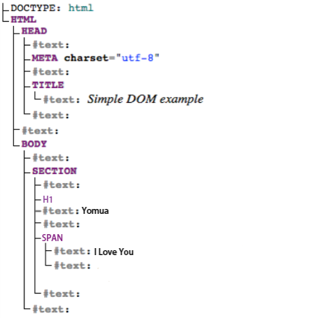

---

shadow DOM则可以通过DOM API附加到一个实际元素*(可以是自定义,但必须是已经注册的 / HTML内置的元素)*中.

这个**被shadow DOM附加的实际元素,则称之为:shadow host**.

**shadow Root则是一个虚拟概念**,它不是一个实际存在的元素,它类似于#document-fragments那样***(参见:<iframe.md>)***,请看以下图片:

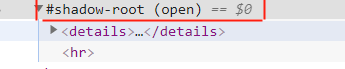

红色线圈起来的#shadow-root就是这里所说的shadow  DOM的shadow Root.

shadow host和shadow Root的区别就在于: **前者是被附加shadow Root及其内部shadow DOM的元素,后者是shadow DOM本身存在于的一个虚拟概念元素.**

需要注意的是:**shadow Root**(包括内部shadow DOM)**存在的前提**是,它必须首先要被附加到一个实际元素中,我们才能在shadow Root中添加shadow DOM.

也就是说,我们**无法单独创建一个shadow Root和Shadow DOM**,一旦创建就一定是附加到某个实际元素中,因为<time datetime='2020-5-12'>至今</time>我们创建shadow DOM的方式为:

Element.attachShadow()=>这表示为Element附加一个shadow Root,所以这也代表着,shadow Root及shadow DOM要存在必须是附加于一个实际元素中.

为了让说明更加的清晰,现在有以下示例:

```html
<is-shadow-host></is-shadow-host>
```

假设我们已经注册了自定义元素\<is-shadow-host\>,并在它的构造器中使用Element.attachshadow()方法为它附加了一个shadow DOM,并在shadow DOM中添加了一些元素,

让我省略掉这些繁琐的代码,现在让我们瞧瞧最终呈现在浏览器中的源码:

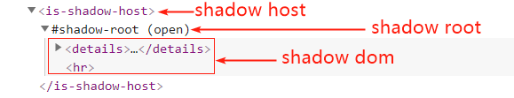

显然的,这已经解释的非常明白了.

1. shadow Host: 被shadow DOM附加的实际元素,也可以称之为宿主元素.
2. shadow Root: 一个虚拟概念,它不是一个实际存在的元素,它类似于#document-fragments.
3. shadow DOM:存在于shadow Root里面的一个DOM.

### 术语——light DOM

由使用组件的用户 编写在组件内部的元素(标签), 该DOM(用户编写的元素)不存在于shadow DOM之内,它是shadow host实际的子元素.

假设div元素是有附加shadow DOM的元素，即 div 元素为 shadow host: 

```html
<div is="better-button">
  <!-- img和span就是light DOM -->
  
  <span>Settings</span>
</div>
```

### 术语——Shadow DOM

该DOM是由开发者(组件创造者)自己编写的DOM.

shadow DOM对于整个组件*(组件:类似一个模块,一部分功能等)*而言它是本地的,即shadow DOM存在作用域的;

它定义内部且独立于页面其余部分的HTML结构,并封装CSS样式且让该CSS样式仅仅存在于自身内部,不会溢出到shadow DOM外部*(除非是特殊CSS样式,如: :focus-within伪类)*

除此之外,shadow DOM还提供了一种: 如何渲染 组件的使用者自己在组件内部编写的元素,即:如何渲染light DOM.

*这种方式是通过slot占位(插槽)元素实现的,**详见:如何将light DOM分布到Shadow DOM?***

以下是一个存在于shadow-root中的shadow DOM, 如果您将shadow-root附加到某个shadow host中,那么整个shadow Root(包括shadow DOM)中将会代替shadow host内部的子项进行渲染,***详见:术语——Shadow Root和Shadow Host***

需要注意的是: 一旦shadow-root的内部shadow DOM附加到了shadow host之中, shadow host就会代替shadow-root作为shadow DOM的根元素,因为此时shadow-root已经降级到了第二级.

```html
#shadow-root
  <style>...</style>
  <slot name="icon"></slot>
  <span id="wrapper">
    <slot>Button</slot>
  </span>
```

## 什么是shadow DOM?

shadow DOM顾名思义: "影子"DOM,它隐藏于"阴影"之下.

shadow DOM 是三大Web组件之一,Web组件的三个基本技术是:

1. [HTML模板元素template](https://developer.mozilla.org/zh-CN/docs/Web/Web_Components/Using_templates_and_slots) ***(参见:\<template slot.md\>)***
2. [Custom Elements](https://developers.google.com/web/fundamentals/web-components/customelements)***(参见:<CustomElements.md>)***
3. [shadow DOM](https://developers.google.com/web/fundamentals/web-components/shadowdom#tricks) 

作者注:在早期的时候,是存在四大Web组件的,第四个是:[HTML导入](https://www.html5rocks.com/en/tutorials/webcomponents/imports/),不过可惜的是,它已经过时了.

shadow DOM是一个伟大的Web组件中的提案,是的,直到2020-5-10为止,它仍然是个提案,仍然没有被纳入规范,这大概是因为供应商的问题吧; 不过幸运的是,现代浏览器除了IE近乎都支持shadow DOM了.h dow DOM和DOM几乎是相同的文档对象模型,除了shadow DOM有两点迥异于普通DOM: 

1. shadow DOM创建 / 使用的方式
2. 与页面其他部分有关的行为方式

通常来说,我们创建shadow DOM的方式是: 

​	将一个DOM附加至其他元素A 作为子项*(Element.attachShadow())*,且这个附加于其他元素A中的 DOM将代替该元素A中的 所有子元素被浏览器渲染,不过您可以在这个(shadow)DOM中使用slot元素存放A元素内部的light DOM.

而这个附加于其他元素的DOM将将是独立于整个页面的,而正因这个DOM是独立的,所以它自身存在于一个作用域,我们将此作用域称之为shadow tree(影子树),而这个DOM则称之为shadow DOM.

PS:此时的shadow DOM的根是shadow host, 而是shadow root则是shadow host的直接(第一)子元素.

## 为什么会存在shadow DOM?

之所以有shadow DOM的存在,是因为shadow DOM解决了构建网络应用(Web组件)脆弱性的问题,即: 

这是由于HTML,CSS,JS的全局性引起的问题.

如: 在某个页面中,我们很难了解现在使用的某个变量*(CSS属性 / JS变量 / HTML的自定义元素名)*是否和现有名称冲突,

以至于当我们使用这些不确定是否冲突的变量时,可能会产生一些微小的错误,当微小的错误渐渐增多: 

CSS之间的相互影响(它不正交) / HTML元素之间的碰撞 / JS变量之间的冲突, 特别是CSS样式选择器及其内部的样式之间的相互层叠*(CSS属性可能互相覆盖,从而造成预期之外的结果——`!import`所有CSS属性:( )*

而这些问题都可能会变得失控以及造成性能的受损, 不一而足,这是一件代价非常大的事情.

而**shadow DOM修复了CSS和DOM之间可能存在的名称冲突问题**,这是因为它在Web中引入一个概念: 作用域.

也就是说: shadow DOM内部的CSS和文档片段(DOM)是具有作用于的,换一句话来说: 这二者是独立于普通的DOM的.

除非是一些特别的CSS属性和DOM的事件,如: :focus-within伪类和click/keydown事件等,才会超出这个作用域.

​	NOTE:为shadow host添加CSS样式,则那些能被子项继承的样式,也会延伸到shadow Root内部的shadow DOM元素上,

​	也就是说shadow DOM元素会继承来自shadow host的CSS样式*(如果这个样式可以被继承的话)*,不过您可以通过`all:initial`解决这个问题. 

所以我们几乎可以为shadow DOM的标签添加任意一个id或css,而**不用考虑会和外部的名称造成冲突,这也就让您直接可以使用原生 JavaScript 捆绑 CSS 和标签、隐藏实现详情以及编写独立的组件.**

以上,就是为什么会存在shadow DOM的理由.

## 	shadow DOM的作用

- **隔离 DOM**：组件的 DOM 是独立的（例如document.querySelector() 不会返回组件 shadow DOM 中的节点）.
- **作用域 CSS**：shadow DOM 内部定义的 CSS 在其作用域内.样式规则不会泄漏.页面样式也不会渗入.
- **组合**：可以为组件设计一个声明性、基于shadow host的 API*(自己定义在shadow host的Prototype对象中的方法)*.
- **简化 CSS** - 作用域 DOM 意味着您可以使用简单的 CSS 选择器.更通用的 id/类名称.而无需担心命名冲突.
- **效率** - 将Web页面看成是多个 DOM 块.而不是一个大的（全局性）页面.

**Note:** 尽管您可以在Web组件之外利用 shadow DOM API 及其优势,但是shadow DOM API不一定要用于WebComponents.

## 如何创建shadow DOM?

聪明如你,我相信你一定发现了前文中,我已经有提及过如何创建shadow DOM了,这一定难不倒你吧.

shadow DOM是附加在shadow host(宿主元素)的文档片段,要想获取到shadow DOM,需要通过shadow host中的shadow root.

如果创建一个shadow DOM,则必须把shadow DOM附加于一个实际元素中,让这个实际元素成为shadow host

我们通过`element.attachShadow()`来为指定的元素附加(挂载/创建)shadow DOM,并返回指定的元素的 [ShadowRoot](https://developer.mozilla.org/zh-CN/docs/Web/API/ShadowRoot) 接口***(详见:ShadowRoot接口)***的对象shadow root（shadow root 包含 shadow dom，详见：***术语 - 术语——Shadow Root 和 Shadow Host***）

以上就是如何创建/挂载/附加shadow DOM的方法.

## [ShadowRoot](https://developer.mozilla.org/zh-CN/docs/Web/API/ShadowRoot)接口

### 什么是ShadowRoot接口

在 ***术语 - 术语——Shadow Root和Shadow Host*** 我们讲过shadow root是什么了.但是这里要讲的ShadowRoot和术语shadow root稍微有点区别.

这里的ShadowRoot主要是说ShadowRoot是一个Shadow DOM的接口,我们通过实现ShadowRoot接口的shadow root对象来为Shadow DOM创建/删除元素、事件、CSS等.

即: 由于Shadow DOM是具有作用域的,所以为了访问到它,我们需要使用到实现ShadowRoot接口的shadow root对象,

**通过shadow root对象才能访问到shadow DOM.**

而这就是ShadowRoot接口的作用及目的.

### ShadowRoot接口具有的属性和方法

由于shadow root对象实现了ShadowRoot接口,所以每一个shadow root对象都可以使用Shadow Root接口的属性.

下面让我们一起来看看ShadowRoot API都有些什么属性吧:

#### [ShadowRoot.host](https://developer.mozilla.org/zh-CN/docs/Web/API/ShadowRoot/host) 只读

返回ShadowRoot 附加的宿主 DOM 元素,即返回shadow host.

`constant shadowhost = shadowRootObj.host`

#### [ShadowRoot.innerHTML](https://developer.mozilla.org/zh-CN/docs/Web/API/ShadowRoot/innerHTML)

返回ShadowRoot 内部的 DOM 树(shadow DOM)

`console.log(shadowRootObj.innerHTML)`

也可以通过该属性向shadow DOM添加/删除元素等,如:

```js
shadowRootObj.innerHTML = 
	`
		<style>
			p {
				color:red
			}
		</style>
		<p>测试</p>
	`
```

#### [ShadowRoot.mode](https://developer.mozilla.org/zh-CN/docs/Web/API/ShadowRoot/mode) 只读

ShadowRoot 的模式——可以是 open 或者 closed。

这定义了 shadow root 的内部实现是否可被 JavaScript 访问及修改.

也就是说.shadow root中的shadow DOM是否可以被JS访问或修改.例如.video(***参见:<autdo video track.md>***)标签内部实现无法被 JavaScript 访问及修改.

使用方法,即获取当前shadow root对象的mode的状态(一个字符串): `console.log(shadowRoot.mode)`

需要注意的是,由于该属性是只读,所以无法修改mode,如:

`shadowRoot.mode='closed'`是错误的

### ShadowRoot接口具有的方法

 ShadowRoot 接口包含了下列几个在 [DocumentOrShadowRoot](https://developer.mozilla.org/zh-CN/docs/Web/API/DocumentOrShadowRoot) mixin中定义的方法.

 **请注意它现在仅在Chrome浏览器中应用; 其它的浏览器仍在[Document](https://developer.mozilla.org/zh-CN/docs/Web/API/Document)接口实现.**

- [DocumentOrShadowRoot.getSelection()](https://developer.mozilla.org/zh-CN/docs/Web/API/DocumentOrShadowRoot/getSelection)

  返回一个 [Selection](https://developer.mozilla.org/zh-CN/docs/Web/API/Selection) 类来表明用户选择的文本选区或者光标所在的位置

- [DocumentOrShadowRoot.elementFromPoint()](https://developer.mozilla.org/zh-CN/docs/Web/API/DocumentOrShadowRoot/elementFromPoint)

  返回在指定坐标最上层的元素.

- [DocumentOrShadowRoot.elementsFromPoint()](https://developer.mozilla.org/zh-CN/docs/Web/API/DocumentOrShadowRoot/elementsFromPoint)

  返回一个包含所有在指定位置上的元素的Array

- [DocumentOrShadowRoot.caretPositionFromPoint()](https://developer.mozilla.org/zh-CN/docs/Web/API/DocumentOrShadowRoot/caretPositionFromPoint)

  返回一个 [CaretPosition](https://developer.mozilla.org/zh-CN/docs/Web/API/CaretPosition) 对象.包括包含了光标的DOM节点.以及光标在该节点中的字符偏移量

## 如何将light DOM分布到Shadow DOM?  

前文中***(术语 - 术语——Shadow DOM)***我们已经提到过使用什么方式能将
light DOM分布到shadow DOM中——slot插槽(占位)元素.

想使用slot元素,前提是slot元素必须是存在于shadow DOM中的,再进行一些恰当的配置,slot元素就可以将用户编写的标签用引用的方式放入自身内部,作为子项.

​	注:用户编写的每一个独立的元素,都会作为一个引用存在于slot元素内部作为子项.

如果将引用的元素删除,则slot元素内部对应的引用也会消失. 

请注意:我们只能删除引用的元素,而不能直接删除slot元素内部的引用(至少在浏览器的Console中,无法这么做)

即:slot元素其实就是组件内部的占位符,用户可以使用自己编写的元素来用引用的方式 填充到slot元素中作为子项.

以上就是如何将light DOM分布到shadow DOM的方式*.如果您想了解更多如何使用slot元素的知识,**请参见:\<template slot.md\>***

## 为shadow DOM设定样式

### 描述

在看到这小节标题时,或许您会不屑一顾,因为你可能已经对如何为元素设置CSS样式已经非常的熟练了,

但是,这里的设定样式是为shadow DOM 元素设定样式,虽然您会疑惑:前文不是说过,shadow DOM元素设定样式和普通DOM元素设定样式并没有什么不同吗?

是的,确实并没有什么不同. 不过在CSS中,您可能并不知道有些选择器和属性是专为shadow DOM量身打造的.

而这节,就是讲有关于shadow DOM的CSS样式以及选择器.

### 有关于shadow DOM的CSS——选择器和属性

在讲解关于shadow DOM的CSS之前,让我们先来看看都有哪些CSS可用吧:

- :host伪类 选择器
- :host()伪类 选择器
- :host-context()伪类 选择器
- ::slotted()伪元素 选择器
- all属性

现在,我们已经知道了关于shadow DOM的CSS,现在跟随我一起继续往下看看如何使用它们吧.

​	*PS: 除了有关shadow DOM的CSS之外,还有 有关shadow DOM的 DOM API,**详见:有关shadow DOM的API***

### 基于情境设定样式 `:host-context(<selector>)`

#### 该伪元素的意思

`:host-context(<selector>)`伪类的意思为:

选择某个元素的内部(或存在某个CSS样式)的所有shadow host.

#### 适用于哪里

`:host-context(<selector>)`伪类经常用于根据组件的环境进行主题化,即:组件当前存在于哪个元素内部,就为那个元素内部的所有组件(shadow host)设定指定样式.

#### 示例

<!-- 存在以下两个主题,分别是darktheme和graytheme -->

```html
	<div class="darktheme">
        <dark-theme></dark-theme>
    </div>

    <div class="graytheme">
        <gray-theme></gray-theme>
    </div>
```

现在,假设我们已经注册了两个custom element : `dark-theme`和`gray-theme`,并在它们在shadow root中添加了style元素,且在style元素中为这两个自定义元素设定样式:

```html
<dark-theme>
	#shadow-root(open)
    	<style>
            :host {
                display:inline-block;
                width:100px;
                height:100px;
            }
            
			:host-context(.darktheme) {
				background:black;
			}
		</style>
</dark-theme>
<!-- ------------------------------------------------ -->
<gray-theme>
	#shadow-root(open)
    	<style>
            :host {
                display:inline-block;
                width:100px;
                height:100px;
            }
            
			:host-context(.graytheme) {
				background:gray;
			}
		</style>
</gray-theme>
```

- ***display:inline-block;***

  使用这个的目的是因为:所有custom element都是行内元素,而行内元素是无法使用width和height属性的, ***参见:视觉格式化基础 文件夹.***

  所以为了使用width和height,需要改变它们的display,我这里改的是:inline-block

- ***:host-context(.darktheme) 和 :host-context(.graytheme)***

  这两者的意思是差不多的,只不过作用的元素不同,即:

  选择类名为darktheme/graytheme的实际元素下的 所有shadow host,并为之设置指定的样式.

最后渲染结果为:

基于情景设定样式.png)

这也就是我们所说的为什么host-context()伪类常用于根据组件的环境进行主题化的原因,

因为该伪类能很好的选择到某个环境*(实际元素)*下的组件*(shadow host)*,然后为它设置样式.

#### 注意

请注意 `:host-context(<selector>)` 伪类是一个实验中的功能,此功能某些浏览器尚在开发中,如:Firefox(Firefox无法使用此伪类)

### 从外部和内部为shadow host(组件)设定样式`:host`

#### 描述

有两种方法可从直接为组件(shadow host)设定样式:

1. 最简单的方法是使用标签名称作为选择器,在外部的style中为之设定样式
2. 还有一种方式就是通过 :host伪类,可以直接选择到当前的shadow host.

需要注意的是: 外部为shadow host设定的样式 优先于 shadow DOM内部使用 :host 伪类为shadow hwst设定样式.

#### 外部为组件设定样式

```html
<style>
    /** 组件:d-j */
    d-j {
        color: red;
        ....
    }
</style>
```

#### shadow DOM内部为组件设定样式

```html
#shadow-root(open)
	<style>
		:host {
			color:green;
			...
		}
	</style>
```

注意:如果此时和上一个示例是为同一个shadow host设定color属性,那么上一个示例的样式优先级将高于本示例.

- 上一个示例: 外部为组件设定样式.
- 本示例: 内部为组件设定样式.

### 当组件具有某个/多个CSS属性时则预定的样式生效`:host()`

#### 描述

当组件具有某个/多个CSS属性时则预定的样式生效 :host();

:host()伪类函数类似于:host伪类,也是选择当前的shadow host,但是:host()伪类函数在圆括号中可以写入1个/多个CSS属性作为参数,其意思为:

当前的shadow host具有该CSS属性时,则里面的样式生效.

注意:这里的指的CSS属性,包括类似于: `[class='c1']`, `[id='i1', name='yy']`, `[background]`.

我想你们也发现了,在:host()伪类函数的圆括号中,要选择某个CSS属性时,需要使用方括号[] 将之括起来,如果该属性存在值,则需要为该值添加单/双引号.

#### 适用场景

:host()伪类通常用于预设定样式,即: 如果当前的shadow host某个标签属性被JS/其他方式改变时, 若我们有为该 被改变后的属性 设定样式,那么一旦该属性被改变,就会应用我们为shadow host设定的样式.

这样就可以和用户进行互动,让用户体验更好.类似于:hover伪类这种.

#### 示例

```html
<body>
    <d-j id="dj"></d-j>
    <button onclick="change()">
        为d-j元素添加HTML的background 属性
    </button>
</body>

#shadow-root(open)
	<style>
        :host([background]) {
            color:red;
        }
	</style>

<script>
    function change() {
        const dj = document.getElementById('dj');
        // background不存在值,所以设定'',就不会被赋值.
        dj.setAttribute('background', '');
    }
</script>
```

- ***#shadow-root(open)***

  代表的是: 某个自定义元素已经注册且为之附加shadow root,或者某个实际元素附加了shadow root.

  并为shadow root中添加style元素,且在该元素中设置了元素样式.

该实例的意思是: 存在一个button,当点击该button时,为d-j自定义元素添加HMTL的background属性.

由于d-j是一个shadow host,且我们已经为shadow host预设定了,当它存在background属性时,就改变它的前景色为:red.

所以最后用户会发现,当他单击button时,d-j元素内部元素的前景色改为:red

- 前景色指的是字体颜色.

伪类函数-示例(1).png)

伪类函数-示例(2).png)

### 为分布式节点设定样式 `::slotted(<selector>)`

分布式节点的意思: 存在于slot元素中的light DOM引用,这些引用对应的元素,称之为分布式节点***(参见:\<template slot.md - slot的使用 - 需要知道的知识\>)***.

#### 该伪元素的意思

- **:slotted(\<selector\>)**

  选择存在于slot元素中的某个元素.

- **某个slot元素的选择器:slotted(\<selector\>)**

  ​	=> #slotID:slotted(\<selector\>)

  选择在指定的slot元素中的某个元素.

  注意: 前面的 *某个slot元素的选择器* 一定是一个slot元素,否则:slotted()不会生效.

- **:host ::slotted(\<selector\>)**

  ​	请注意host和slotted中间有空格.

  选择当前shadow host中,存在于slot元素的 某个元素.

  **#tab ::slotted(*)**

  ​	在当前的作用域中(可能是全局作用域或者shadowDOM的作用域),选择id=tab的元素下的 slot元素中的 所有子项.

#### 适用的场景

::slotted()伪元素通常用来匹配slot元素下的某个/所有元素,并为它们设定样式.

#### 示例

```html
#shadow-root(open1)
<style>
    /** 改变slot元素中的所有元素的前景色为red */
   	::slotted(*) {
		color:red;
	}
    /** 改变slot元素中的所有p元素的字体大小为40px */
    ::slotted(p) {
		font-size:40px;
	}
    /** 改变id=gkd的slot元素中的 所有元素的透明度为0.5 */
	#gkd::slotted(*) {
		opacity:0.5;
	}
</style>

```

### 为shadow host设定样式会影响到shadow DOM内部元素

#### 描述

我们知道:shadow DOM的CSS隔离(作用域)指的是对shadow host -> 
shadow root -> shadow DOM中的所有子项的样式进行隔离.      

您可以通过如: 

- :host,:host(),:host-context()这三个CSS伪类选择到shadow host, 

- 或者直接在shadow DOM外部选择shadow host并为它直接设定样式,

  注:外部为shadow host设定的样式 优先级大于 shadow DOM内部为shadow host设定样式,

  ***详见: 设定样式 - 从外部和内部为shadow host(组件)设定样式`:host`***

以上连个方法为shadow host及其内部设定CSS样式.

至于为什么我写的是: 为shadow host`及其内部`. 这是因为,为shadow host设定的样式能被shadow host的子项继承,也就是 shadow root中的shadow DOM元素以及存在于slot元素中的light DOM引用 都可以继承来自shadow host的CSS属性.

前提是:这些属性允许被继承.

如果您不愿意为shadow host设定样式时,其内部子项会继承样式,那么您可以在在为shadow host设定样式时,使用: `all:initial`,这代表将 [unicode-bidi](efb2509dc92b65b4b68aa106511ecb91.html) 与 [direction](124fd6468fe31b21cb56d3841513b1f2.html) 之外的所有属性重设至其初始值.

- [all属性](https://developer.mozilla.org/zh-CN/docs/Web/CSS/all)
  - initial
  - inherit
  - unset
  - revert

#### 示例

```html
<!-- 页面中,即shadow DOM的外部 -->
<style>
    d-j {
		color: red;
    }
</style>

<d-j id="dj"></d-j>

#shadow-root(open)
	<span>我是shadow host(d-j元素)的子项</span>
```

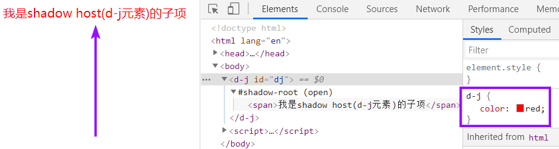

如果您将d-j的样式修改为以下样式,则span元素将不会继承d-j的colors属性:

```html
<style>
    d-j {
		color: red;
		all:initial;
    }
</style>
```

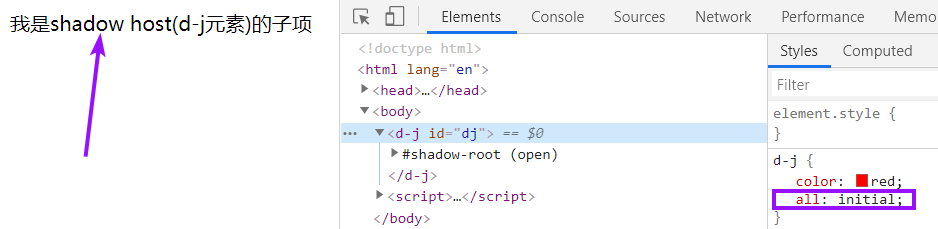

## 有关shadow DOM的API及事件

### API

注意:以下属性和方法都是实验性API.

#### Element.attachShadow() 方法

为指定的元素附加shadow root，并返回指定元素的 shadow root 对象。

#### HTMLSlotElement.assignedSlot 只读属性

##### 描述

表示指定的元素是否分配给某个插槽,如果该元素已经被分配,则返回该元素分配到的那个插槽元素(slot)以及其中的所有内容.

如果指定元素没有分配给某个插槽,则返回null

##### 示例

```html
<fancy-tabs id="ft">
	<div slot="title" id='div'></div>
</fancy-tabs>

#shadow-root(open)
	<slot name='title'></slot>

<script>
	    let assignedSlot = 
            document.querySelector('#div').assignedSlot;
    console.log(assignedSlot)
</script>
```

最后得出的结果为:

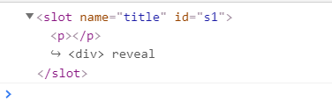

#### HTMLSlotElement.assignedNodes() 方法

##### 无参数的assignedNodes()

查看slot元素正在引用的内容*(正在渲染的当前的某个引用对应的元素)*,并则将引用 对应的元素名称按照引用的顺序依次放入数组中,最后返回这个数组.

即:如果正在渲染div和span,其会返回一个数组: [div, span]

##### 有参数的assignedNodes({flatten:true})

slot.assignedNodes({flatten:true}) => slot元素不存在任何渲染对象时,就依次将当前slot元素中自身原本就存在的内容(备用内容)放入数组,最后再返回这个数组.

- 备用内容: 包括回车符,文本节点对象,节点对象等.例如,若slot元素没有渲染用户元素,则该示例返回 :[text, p, text] ,第一个text就是回车符.

  如:[text, text] , 其中两个text表示回车符.

*注意: slot元素本身存在的内容只会在slot元素没有引用light DOM,才会被浏览器渲染(显示)，否则 slot 元素的内容会被相对应的 light DOM 替换。*

若slot元素已经引用了light DOM,则slot.assignedNodes({flatten:true})的效果就相当于 slot.assignedNodes(),即:无参数的assignedNodes()方法.

如果slot元素没有引用light DOM以及自身没有元素*(备用内容:回车符,文本节点也算)*,那么这两个方法都将返回:[]

##### 示例

###### slot元素中存在light DOM引用

```html
<fancy-tabs id="ft">
	<div slot="title">
		<span>第一个引用</span>
	</div>

	<p slot="title">
		<span>第二个引用</span>
	</p>
</fancy-tabs>

#shadow-root(open)
	<slot name='title' id='s1'>
		<p>备用内容</p>
	</slot>

<script>
	// 被附加的shadow DOM的元素的构造器中
    let assignedNode = 
        ShadowRoot.querySelector('#s1').assignedNodes({ flatten: true });
            console.log(assignedNode);
</script>
```

- ShadowRoot.querySelector('#s1').assignedNodes({ flatten: true });

  选择shadow root中id=s1的slot元素,并返回一个数组: 

  ​	若存在light DOM引用,则将引用对应的元素名称按照引用的顺序依次放入数组中; 

  ​	若不存在light DOM引用,则将#s1的slot元素的备用内容依次放入数组中.

渲染结果为:

.png)

#### Event.composedPath() 方法 (Event事件的API)

##### 描述

Event 接口的一个方法.当一个Event对象调用该侦听器时会返回一个数组:

​	从Event事件当前发出的起始点的元素的名称作为一个值放入数组,依次往外,直到shadow DOM边界,在这期间经过的每一个元素,都会将其名称放入数组中.

**这样最后返回的这个数组,从左→右,就分别是 Event事件起始点 -> 经过的哪些元素 -> 结束点.**

注意:有些shadow DOM内部触发的事件,会不受shadow DOM的作用域影响.
***详见:事件***

---

如果存在shadow Root(影子根节点)被注册并且ShadowRoot.mode是关闭的.那么该路径不包括影子树中的节点.

需要注意的是:如果ShadowRoot.mode是关闭的,则这个addEventListener()将返回null;这也就就导致无法判断事件路径了,即无法使用Event.composedPath(),因为null代表什么都没有,自然无法使用composedPath()函数了.xA

这是因为若ShadowRoot.mode是关闭的,则shadow DOM内部将无法访问,自然也无法为之注册事件监听器,

所以我始终建议,不要封闭shadow root.

##### 示例

```html
<fancy-tabs id="ft">
	<div slot="title">
		<span>demo</span>
	</div>
</fancy-tabs>

#shaado-root(open)
	<div class="title">
    	<slot name="title" id="s1">
    		<p>p元素和事件没关系,事件会从slot元素发出.</p>
    	</slot>
    </div>

<script>
    class ft extends HTMLElement {
        // 省略了constructor以及里面的附加shadow DOM和往shadow DOM添加slot元素步骤
        load() {
            let s1 = 
                document.getElementById('ft').shadowRoot;
            
            s1.addEventListener('slotchange', e => {
                // 判断当前事件对象的路径
                console.log(e.composedPath())
            })

        }
    }
    customElements.define('fancy-tabs', ft);
    document.getElementById('ft').load();

</script>
```

- console.log(e.composedPath())

  结果为:

   [slot#s1, div.title, document-fragment]

### 事件

- 有一个和slot元素有关的事件: `slotchange` 事件,参见:
  ***<template slot.md - 关于slot的事件>***

当事件从 shadow DOM 中触发时.其事件目标将会调整以便维持 shadow DOM 提供的封装.

也就是说.事件的目标重新进行了设定. 即:本来是来自shadow DOM内部的子项的事件,变成了这些事件看起来像是来自组件.而不是来自 shadow DOM 中的内部子项.

还有些事件不会从 shadow DOM 中传播出去.

**确实**会跨过影子边界的事件有：

- 聚焦事件：blur、focus、focusin、focusout
- 鼠标事件：click、dblclick、mousedown、mouseenter、mousemove.等等
- 滚轮事件：wheel
- 输入事件：beforeinput、input
- 键盘事件：keydown、keyup
- 组合事件：compositionstart、compositionupdate、compositionend
- 拖放事件：dragstart、drag、dragend、drop.等等

### 自定义事件

自定义事件就是给shadow host节点对象添加自定义的方法,可以设置该方法在什么情况下会被调用,或者在该方法内部封装1个/多个事件.

需要注意的是:通过shadow DOM内部节点触发的自定义 的DOM 事件不会超出shadow DOM作用域,除非事件是使用 `composed: true` 标记创建的：

```js
// 处于<fancy-tab>自定义元素的class中:
class demo extends HTMLElement {
    constructor(){super();}
    selectTab() {
  		const shadowRoot = 
              this.shadowRoot.querySelector('#tabs');
  		shadowRoot.dispatchEvent
        	(new Event('tab-select', 
                               {bubbles: true, 
                                composed: true}));
	}
}
customElements.define('fancy-tab', demo);
```

如果是 composed: false（默认值）.用户无法侦听到影子根之外的事件


## [处理焦点](https://developers.google.com/web/fundamentals/web-components/shadowdom#focus) (未看)

如果您从 [shadow DOM 的事件模型](https://developers.google.com/web/fundamentals/web-components/shadowdom#events)重新调用.将对在 shadow DOM 内部触发的事件进行调整.使其看起来来自宿主元素.例如.我们假设您点击某个影子根内部的input:

```html
<x-focus>
  #shadow-root
    <input type="text" placeholder="Input inside shadow dom">
```

`focus` 事件看起来来自 .而不是input。 与此类似.document.activeElement 将是 x-focus。

如果影子根使用 `mode:'open' 创建（请参阅[闭合模式](https://developers.google.com/web/fundamentals/web-components/shadowdom#closed)）.您还可以访问获得焦点的外部节点：

```js
document.activeElement.shadowRoot.activeElement // only works with open mode.
```

如果存在多个级别的 shadow DOM（即自定义元素位于另一个自定义元素中）.您需要以递归方式深入影子根以查找 `activeElement`：

```js
function deepActiveElement() {
  let a = document.activeElement;
  while (a && a.shadowRoot && a.shadowRoot.activeElement) {
    a = a.shadowRoot.activeElement;
  }
  return a;
}
```

焦点的另一个选项是 `delegatesFocus: true` 选项.它可以将元素的焦点行为拓展到影子树内：

- 如果您点击 shadow DOM 内的某个节点.且该节点不是一个可聚焦区域.那么第一个可聚焦区域将成为焦点.
- 当 shadow DOM 内的节点获得焦点时.除了聚焦的元素外.`:focus` 还会应用到宿主.

**示例** - `delegatesFocus: true` 如何更改焦点行为

```html
<style>
  :focus {
    outline: 2px solid red;
  }
</style>

<x-focus></x-focus>

<script>
customElements.define('x-focus', class extends HTMLElement {
  constructor() {
    super(); // always call super() first in the constructor.

    const root = this.attachShadow({mode: 'open', delegatesFocus: true});
    root.innerHTML = `
      <style>
        :host {
          display: flex;
          border: 1px dotted black;
          padding: 16px;
        }
        :focus {
          outline: 2px solid blue;
        }
      </style>
      <div>Clickable Shadow DOM text</div>
      <input type="text" placeholder="Input inside shadow dom">`;

    // Know the focused element inside shadow DOM:
    this.addEventListener('focus', function(e) {
      console.log('Active element (inside shadow dom):',
                  this.shadowRoot.activeElement);
    });
  }
});
</script>
```

**结果**

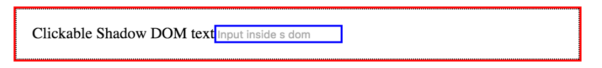

上面是 获得焦点（用户点击、点按和 focus() 等）、点击“Clickable Shadow DOM text”或内部 获得焦点（包括 autofocus）时的结果.

如果是设置 delegatesFocus: false.下面将是您看到的结果：

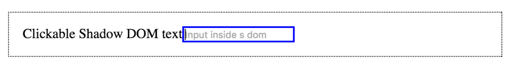delegatesFocus: false 和内部input 获得焦点.

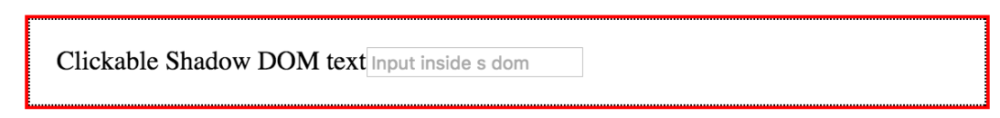delegatesFocus: false 和 x-focus获得焦点（例如.tabindex="0"`）.

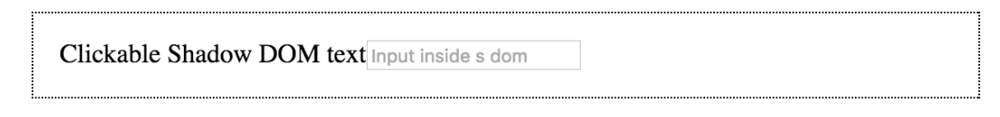`delegatesFocus: false` 并且点击“Clickable Shadow DOM text”（或点击元素 shadow DOM 内的其他空白区域）.

## 提示与技巧

### 擅于使用CSS的contain属性

#### CSS Containment

实际上CSS的contain属性就是来自于CSS containment规范,该规范的目的是:

允许开发人员将页面的子树与页面的其他部分隔离开来,从而提高web页面的性能.

即:如果浏览器知道页面的一部分是独立的,则可以针对性的进行优化呈现,从而使性能提高.

该规范<time datetime='2020-5-14'>至今</time>只定义了一个CSS属性:contain.

#### style,layout,paint的意思

在接下来的章节中,您会一直看见style,layout,paint 这三个名词,所以为了能让您能更加的清楚这三者的意思,这里我将稍作讲解.

1. **style**

   元素的CSS属性.

2. **layout**

   指的是DOM.

   即: 浏览器将HTML标签看作是一个文档对象模型,并将HTML结构用树的方式表现,其中每一个HTML元素(包括文本,回车符等)都看作是节点对象,存于树中,而这个树就是 : DOM tree.

   所以DOM tree指的就是layout. ***参见:<DOM和BOM.md>***

   言简意赅的说: layout指HTML元素在浏览器中的排版方式 ,也就是HTML元素对应的DOM tree.

3. **paint**

   顾名思义绘画,绘制.

   即:浏览器渲染DOM树到页面,从而显示给用户的整个过程.

#### contain属性的作用

CSS的contain 属性允许开发者声明当前元素和它的内容尽可能的独立于 DOM 树的其他部分,这个概念有点类似于shadow DOM.

也就是contain属性使开发人员可以限制浏览器的style,layout和paint工作的范围

这使得浏览器在重新计算布局、样式、绘图或它们*(指使用contain属性的元素)*的组合的时候,只会影响到有限的 DOM 区域,而不是整个页面.

也正因为如此,contain属性将会提高浏览器的性能,如: 存在一个不可见的元素*(比如屏幕外的导航栏等)*,虽然用户看不见,但是浏览器其实仍然还会渲染这个不可见节点(元素), 这样浏览器就会耗费一定的时间去渲染该元素.

但如果该不可见元素设置了CSS的cotain: paint,浏览器就不会去渲染屏幕外的东西,从而节约了渲染不可见元素的时间,而这样相对的 屏幕内的内容就会被更快地渲染出来,也就提升了浏览器的性能.

注意:**所有的HTML元素都能使用contain属性**


#### contain属性的适用场景

- 这个属性常用在包含大量独立的 widgets 小部件的页面,contain 属性可以防止某个小部件的 CSS 规则改变或影响页面上的其他东西.

  即:第三方插件类使用

- 元素在屏幕外不可见时

- container queries

 通常来说,前两个场景使用的最多.

#### 为什么要使用contain属性

##### 描述

在制作一个Web App 或者一个复杂的网站时,最重要的还是性能的提升,而对于浏览器的性能如何提升来讲,最大的挑战是: styles、layout和paint,实际就是通过CSS的contain属性限制这三者.

在早期,整个DOM会被认为是一个计算的"范围"(DOM被当做一个整体),这意味着浏览器很难绘制一个独立的"view",

即:DOM和DOM的样式一部分的更改会影响其他部分,并且我们无法告知浏览器应该如何计算 我们改变的DOM或者DOM的样式 是否会影响其余部分.

这就会使浏览器不得不在您改变一部分DOM或DOM的样式时,重绘整个DOM,很显然,这非常的浪费性能.

##### 例子说明为什么要使用contain属性

假如现在有个页面,它其中的源码是:

```html
<section class="view">
  Home
</section>

<section class="view">
  About
</section>

<section class="view">
  Contact
</section>
```

接着我们向该页码的源码中的某个class=view元素,添加一个新元素div:

```html
<section class="view">
  Home
</section>

<section class="view">
  About
	<div class="newly-added-element">Check me out!</div>
</section>

<section class="view">
  Contact
</section>
```

显然的,新增的div元素将会触发style,layout和paint,也就是说这个div元素会使DOM的样式和布局重新的进行绘制.

而在以上的例子中,DOM的作用范围是整个页面,也就意味着浏览器必须计算所有元素,根据这些元素的style和layout来将这个新的div元素正确的在页面进行渲染.

很显然,如果DOM的元素越多,浏览器涉及的计算工作也就越多,也越有可能使浏览器不响应用户的输入,也就是常说的卡死 / 未响应状态.

不过好消息是,现代浏览器在自动限制style，layout和paint的范围方面变得越来越聪明,这意味着浏览器的性能变得越来越好,而您无需执行任何操作.

但更好的消息是,有一个新的CSS属性将DOM的范围控制移交给开发人员,使开发人员能精确地控制style,layout,paint这三者.

而这个新的CSS属性,就是我们这里说的: contain。

##### 总结

使用contain属性是为了限制DOM和DOM的样式是否会被浏览器绘制(渲染)和某个DOM元素或其样式是否会影响其余部分.

通过限制DOM和DOM的样式的影响范围,从而提升浏览器性能.

#### [contain属性取值](https://developer.mozilla.org/zh-CN/docs/Web/CSS/contain#%E5%B1%9E%E6%80%A7%E5%80%BC)

contain属性支持7个值

1. none 默认值
2. strict
3. content
4. size
5. layout
6. style
7. paint

PS:实际上真正算做值的只有后面有4个.

前面三个值,第1个是默认值,第2,第3个是后面4个值的多种应用,即:你可以使用后面4个值拼接从而达到它们二者的功能.

##### contain:none 默认值

声明当前元素正常渲染,没有包含规则.

##### containt:strict

声明所有的contain的属性值应用于这个元素.

这样写等价于 contain: size layout style paint;

##### contain:content

声明当前元素上有除了 size 外的所有contain属性值.

等价于 contain: layout style paint;

##### contain:size

启用指定的元素的大小限制.

使用该属性的元素的尺寸计算将不会依赖于它的子项尺寸,这样可以确保对该元素进行布局时,不用检查其子项的布局.

因为我们知道:子项的外边距宽/高 + 边框的宽/上下边框的高度 +  内容区宽/高 等于 父辈块级元素容纳块的内容区 宽 / 高***(参见:<视觉格式化基础_块级置换和非置换元素.md>)***

而该属性值使子项的这些值不会影响到父级.

大小限制确实是一项周全的措施,可确保您不依赖子元素进行大小调整，也就是说：该属性使得子元素无法撑开父元素。

但是就其本身而言,它并不能提供太多的性能优势.

##### contain:layout

启用该属性值的元素,将会**确保该元素和它的子项是独立的.**

也就是说: 使用该属性的元素,它和它的子项将不会影响到页面其余部分的布局,页面其余部分的布局也不会影响到它和它的子项.

##### contain:paint

启用该属性值的元素,将会**确保该元素的子项不会超出该元素**,比如:假设一个A元素是不可见的/视区外的,则它的子项也就不可见或者在视区外.

paint值是一个另一个非常有用的属性值,但是使用它的同时也会带来一些副作用(某些情况下可以认为是好作用):

- **使用该属性值的元素会成为绝对定位和固定定位元素的容纳块**.

  也就是说,如果一个元素是绝对定位/固定定位的,且存在于一个样式为contain:paint的元素中,则那个元素会成为绝对/固定 定位元素的容纳块

- **使用该属性值的元素会成为一个堆栈上下文**.

  意味着诸如之类的东西——z-index会对元素产生影响,并且子元素将根据新的上下文进行堆叠.

- **使用该属性值的元素会成为新的格式化上下文.**

  如果您有一个样式为contain:paint的块级元素,则它将被视为一个新的,*独立的*布局环境.

  这意味着元素外部的布局通常不会影响拥有contain:paint样式的元素的子项.

  (我们使用contain:paint样式的目的通常就是因为这个)

##### contain:style

启用指定的元素的style限制.

使用该属性值的元素和它的子项将不会被 因为值的改变从而可能影响到整个DOM的CSS属性 所影响.

注意:该属性值的这种限制,仅仅只在 一个可能影响到整个DOM的样式 发生改变时,而不是在声明 一个可能影响到整个DOM的样式 时.

PS:该值在某些浏览器可能并不兼容,如Firefox

#### 组合contain属性值

就如同strict和content值一样,我们可以自己组合这四个关键字,如:contain:size layout,或者 contain:style paint

#### 使用contain属性示例

##### 使用contain:paint

我们知道,paint值会确保该元素的子项不会超出该元素,也因为此特性,某个元素使用该属性值后,那么它的块级框(包含外边距)大小将会是子元素的外边距+边框+内边距+内容去 大小之和.

PS:不存在此属性时,该元素的块级框的内容区大小才会是子项的各个属性加起来的大小***(参见:<视觉格式化基础_块级置换和非置换元素.md>)***.

```html
<style>
    div {
        contain: paint;
        height: 100px;
    }
    p {
        height: 200px;
        background-color: gray;
    }
</style>
<div>
	<p>我是子项</p>
</div>
```

我们对div元素使用了样式contain:paint; 这意味着,它的子项将不会超过它本身的大小. 

如果div不存在contain:paint; 则很明显,渲染结果将为: 一个宽度为视区宽度,高度为200px的p元素的灰色矩阵 和存在于p元素中的字体:我是子项.

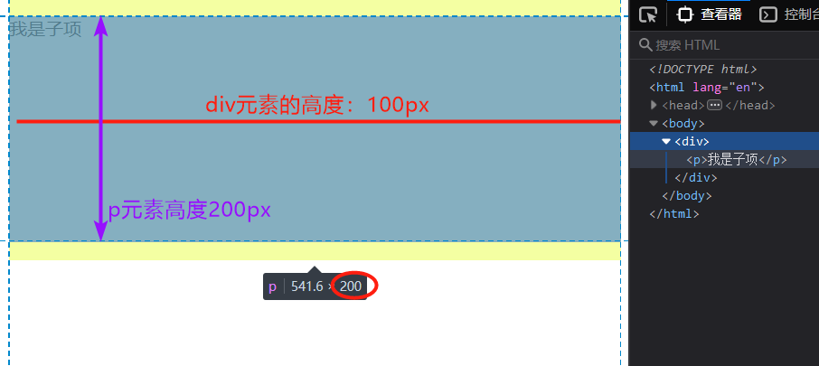

（不存在contain时）

下面如果存在contain:paint样式,则您会发现,p元素即使设置了height:200px,也不会超过div元素的高度100px.

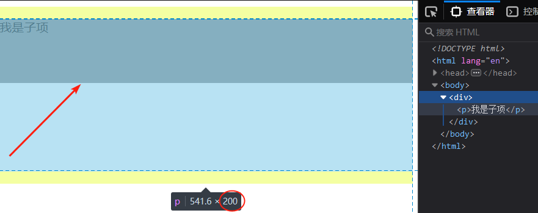

（存在contain时）

请注意以上的渲染结果,我相信你们已经发现了,即使p元素的高度仍是200px,但是由于contain:paint的限制,p元素的渲染结果只能是height: <= 200px.

其实这就相当于裁剪,将一个具有contain:paint属性的元素的 子项进行大小裁剪,使其不能超过自身大小.

所以当div元素的height属性值设置为0时,p元素的height值也将为0,其表现结果将为: 用户看不见div和p元素(因为height为0.)

##### 使用contain:size

使当前元素的尺寸计算不会依赖于子项.

```html
<style>
    div {contain: size;}
    p {
        height: 100px;
        background-color: gray;
    }
</style>
    <div>
        <p>我是子项</p>
    </div>

```

由于div元素的尺寸计算不会依赖于子项,所以在此示例中,div元素的高度将会不变,仍然是0.

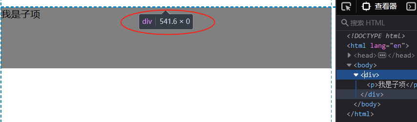

如果正常请情况下(没有contain:size),div的内容区高度将会是子项(p)的内外边距+边框+内容区高度之和***(参见:<视觉格式化基础_块级置换和非置换元素.md>)***.

也就是以下渲染结果:

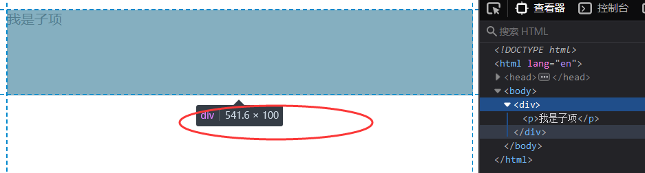

##### 使用contain:style 和 contain:layout

PS由于这两个值在在单独的示例上很难显示出效果,所以需要你们自己去尝试.

### 重置可继承样式

在 ***为shadow DOM设定样式 -  为shadow host设定样式会影响到shadow DOM内部元素*** 中我们讲过,为shadow host设定样式时,那些可被子项继承的样式会突破shadow DOM的作用域,影响shadow DOM内部的元素.

如果您并不愿意shadow DOM内部的元素被 可继承的样式 渗透,可使用 `all: initial;` 将可继承样式重置为初始值.

### 查找页面所有自定义元素

***参见<查找某个网址的自定义元素个数.md>***

以下是核心代码:

```js
// 将每一个自定元素对象(包括其所有子项,子项将在对象中)放入此数组
const allCustomElements = [];

/** 判断是否为自定义元素 */
function isCustomElement(el) {
  const isAttr = el.getAttribute('is');
  // includes(str);指定的字符串存于string中,则返回true,
  //反之返回false
  return el?.localName?.includes?.('-') || 
      isAttr?.includes?.('-');
}

/** 查询自定义元素 */
function findAllCustomElements(nodes) {
  /// 遍历当前页面的所有节点名字组成的集合
  for (let i = 0, el; el = nodes[i]; ++i) {
    if (isCustomElement(el)) {
      allCustomElements.push(el);
    }
    // 若某个节点对象存在shadowRoot,则递归它.
    // 即:shadow DOM中的元素也会查询
    if (el?.shadowRoot) {
      findAllCustomElements(el.shadowRoot.
        querySelectorAll('*'));
    }
  }
}
findAllCustomElements(document.querySelectorAll('*'));
console.log(allCustomElements)
```

#### 	使用 \<template\> 创建元素

我们不是使用 `.innerHTML` 来填充影子根,而是使用一个声明性template元素.

模板是用于声明网络组件结构的理想占位符.

即:实例化模板元素,将之内容取出,然后克隆填充到shadow -root(open)中即可.

***参见:\<template slot.md\>***

## 兼容性和历史性

请注意,并不是每一个浏览器都实现了shadow  DOM,template,slot元素.

如果最近几年您一直在关注网络组件,您会发现有一段时间 Chrome 35+/Opera 随附的是旧版本 shadow DOM。

Blink 将继续在一段时间内同时支持新旧两种版本. 

v0 规范提供了创建影子根的不同方法（`element.createShadowRoot`,而不是 v1 的 `element.attachShadow`）. 调用旧方法仍可通过 v0 语法来创建影子根,因此现有的 v0 代码不会出错.

如果您想了解旧版 v0 规范,可查看 html5rocks 文章：[1](https://www.html5rocks.com/en/tutorials/webcomponents/shadowdom/)、[2](https://www.html5rocks.com/en/tutorials/webcomponents/shadowdom-201/)、[3](https://www.html5rocks.com/en/tutorials/webcomponents/shadowdom-301/).[shadow DOM v0 与 v1 的差异](http://hayato.io/2016/shadowdomv1/)中也提供了大量的二者比较信息.

## 结论

有史以来第一次,我们拥有了实施适当 CSS 作用域、DOM 作用域的 API 原语,并且有真正意义上的组合.

 与自定义元素等其他网络组件 API 组合后，shadow DOM 提供了一种编写真正封装组件的方法,无需花多大的功夫或使用如 iframe***(参见<iframe.md>)*** 等陈旧的东西.

不要误会我的意思。Shadow DOM 无疑是一个复杂的巨兽！值得我们去学习. 请花一些时间来研究.认真学习并积极提问！

### 深入阅读

- [Shadow DOM v1 与 v0 的差异](http://hayato.io/2016/shadowdomv1/)
- [“基于 Slot 的 Shadow DOM API 简介”](https://webkit.org/blog/4096/introducing-shadow-dom-api/)（出自 WebKit 博客）.
- [网络组件和模块化 CSS 之未来](https://philipwalton.github.io/talks/2015-10-26/)（作者：[Philip Walton](https://twitter.com/@philwalton)）
- [“自定义元素：构建可重复使用的网络组件”](https://developers.google.com/web/fundamentals/getting-started/primers/customelements)（出自：Google 的 WebFundamentals）.
- [Shadow DOM v1 规范](https://dom.spec.whatwg.org/#shadow-trees)
- [自定义元素 v1 规范](https://html.spec.whatwg.org/multipage/scripting.html#custom-elements)