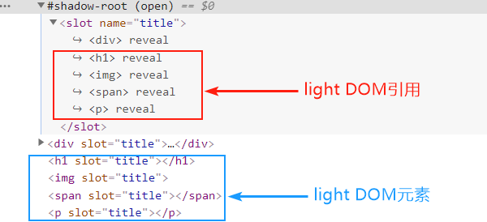
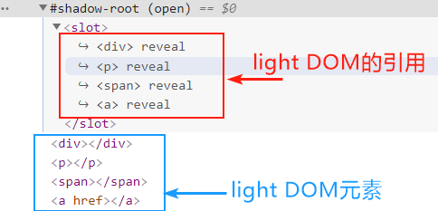

有关WebComponents,***请参见:<WebComponents.md>***

# [template](https://developer.mozilla.org/zh-CN/docs/Web/HTML/Element/template)

## 描述

存在开始和结束标签

template是一个模板元素,是一种保存客户端内容的机制,存在于template元素中的文档片段在页面加载时并不会被浏览器渲染,但是随后可以在运行时使用 JS 将其实例化template元素.

注意:虽然浏览器不会渲染template元素,但是仍然会处理template元素中的文档片段([DocumentFragment](https://developer.mozilla.org/zh-CN/docs/Web/API/DocumentFragment)),这样做只是为了确保这些内容有效罢了.

即template元素类似于JS中的class(类),用不到的时候不使用它,需要的时候在进行实例化.

## 为什么template元素不会被渲染

实际上是因为template元素默认的display样式是none罢了,你可以用以下代码测试:

```js
    let template = document.getElementById('template');
    let display = 
        window.getComputedStyle(template).display;
    console.log(display); // none
```

- ***window.getComputedStyle((element, [pseudoElt])***

  返回指定的element节点对象的所有style.

  其中第二个参数pseudoElt指定一个要匹配的伪元素的字符串,必须对普通元素省略（或null）。

虽说template元素默认的display样式是none,但是即使你使用setAttribute方法将display设置为除none以外的其他样式,也**无法将之显示在页面** *(正确方法是通过JS将里面的文档片段取出然后添加到body/body的其他元素中),*

因为我们一直在强调,<em><strong>template元素是文档片段:document-fragment.</strong></em>

笔者注：Shadow Root（虚拟概念）也算是一个文档片段，参见：<em><strong><ShadowDOM.md></strong></em>

如果强制让template元素的display属性非none,则在HTML源码(浏览器控制台)中的显示效果就会类似于[iframe](https://developer.mozilla.org/zh-CN/docs/Web/HTML/Element/iframe)元素***(参见:<iframe.md>)***,

只不过不会像iframe元素那样是整个完整文档,而**是文档片段**,并且**不会在浏览器中有任何显示效果**.

如:

```html
<template id="template">
	<p>I am Yomua.</p>
 </template>

<script>
    let template = document.getElementById('template');
	template.setAttribute('display', 'block')
</script>

```


## 属性

### 描述 

template元素本身只具有[全局属性](https://developer.mozilla.org/en-US/docs/Web/HTML/Global_attributes).

但是由于template元素也节点对象,所以它实现的[HTMLTemplateElement](https://developer.mozilla.org/zh-CN/docs/Web/API/HTMLTemplateElement)接口却具有一属性:[content](https://developer.mozilla.org/zh-CN/docs/Web/API/HTMLTemplateElement/content).

### content

content属性返回template元素中的文档片段(即内容)

#### 语法

- Fragment: 片段

`let documentFragment = templateElement.content`

#### 示例

```js
let templateElement = document.querySelector("#foo");
let documentFragment = 
	templateElement.content.cloneNode(true);
```

- ***document.querySelector("#foo");***

  获取ID为foo的template元素

- ***let documentFragment =templateElement.content.cloneNode(true);***

  将template元素中的文档片段*(即document Fragments大纲,而不是里面的内容)*克隆出一个副本.

  也就是说将template元素中文档片段复制一个,然后赋值给documentFragment变量.

## 示例

```js
	/**检查来测试浏览器是否支持HTML模板元素 */
	
	// template 节点对象或原型链上是否支持 content 属性
    if ('content'in document.createElement('template')) {
        // 得到template元素
        let t = document.querySelector('#productrow'),
            //返回一个NodeList集合:tempalte元素内部所有td元素.
            td = t.content.querySelectorAll("td");
        // 在template节点(元素)的td元素中插入指定文本.   
        td[0].textContent = "1235646565";
        td[1].textContent = "Stuff";
        /** 
        现在,template元素中存在一行两列,
        其中两列已经被插入了节点对象,
        即刚才指定的文本,(DOM树中,所有节点都是对象,包括文本) 
        */

        /** 克隆新行并将其插入表中*/
        
        //返回HTMLCollection集合:包含文档中的所有的tbody元素.
        let tb = document.getElementsByTagName("tbody");
        let clone = document.importNode(t.content, true);
        // 在tobdy元素中添加一个子结点: template中的片段.
        tb[0].appendChild(clone);
        // 重新指定template元素中两列的节点内容,
        td[0].textContent = "0384928528";
        td[1].textContent = "Acme Kidney Beans";
        
        /** 克隆新行并将其插入表中 => 
        template元素此时存在一行两列,两列节点内容分别为: 
        0384928528 和 Acme Kidney Beans*/
        let clone2 = document.importNode(t.content,true);
        tb[0].appendChild(clone2);

    } else {
        // 找到另一种方法来添加行到表,因为不支持HTML模板元素。
    }
```

- ***[in运算符](https://developer.mozilla.org/zh-CN/docs/Web/JavaScript/Reference/Operators/in)***

  某个属性是否存在于某个对象或其对象的原型链中,如果存在,则返回true,否则返回false.

- ***[Node.textContent](https://developer.mozilla.org/zh-CN/docs/Web/API/Node/textContent)*** 

  Node.textContent属性表示一个节点及其后代的文本内容

- ***[document.importNode](https://developer.mozilla.org/zh-CN/docs/Web/API/Document/importNode)(externalNode, deep(布尔值));***

   externalNode：将要从外部文档导入的节点。
   
   deep：是否要导入节点的后代。
   
   拷贝template中的片段(所有元素,包括其后代元素,因为第二个参数为true) => 一行两列,并且此时的两列是刚才插入的节点对象: 1235646565 和 Stuff

注意:克隆template元素中的内容是因为template元素中的内容是一个模板,这个模板是不能动的,因为其他实例可能也需要这个模板.

## 如何实例化template元素

想必,通过前面的***示例***,你们也都大概知道template元素是如何被"实例化"的,不是通过将display设置为非none值,而是:

- 先获取template元素这个节点对象以及里面的文档片段(HTMLTemplateElement接口的content属性)
- 接着在根据需求向文档片段中添加一些子节点/节点对象.
- 然后你可能会使用如importNode,cloneNode这样的属性去克隆template元素中的文档片段并赋值给一个变量.
- 最后你再将存放文档片段的变量使用appendChild这样的属性,去添加到某个节点对象(元素)中.
- 至此,你就完成了"实例化"template元素.

## template元素未出现前的html模板

曾经还不存在template元素时(大概在2013年前),开发者常用的嵌入html模板方式是使用: 

```html
<script type="text/template">
// ...   
</script>
```

是的,你没看错,使用的是script(即通过JS代码),但实际上,并不存在type="text/template"这样的标准写法,template元素的出现旨在让HTML模板HTML变得更加标准与规范。

更早以前,我们可能还使用过textarea或者xmp(废止但依然可用)嵌套非转义的HTML标签代码,实现一些特定的前端功能,

但同样的,跟上面的流行用法一样,都是不规范的。从现在和未来趋来讲,显然template标签才是王道。

可惜的是: 兼容性是个不可忽略的问题,如该死的IE浏览器并不支持template元素,不过没什么大不了的,不是吗?

# [slot](https://developer.mozilla.org/zh-CN/docs/Web/HTML/Element/slot)

## 描述

- 有个slot全局属性:[MDN-slot全局属性](https://developer.mozilla.org/zh-CN/docs/Web/HTML/Global_attributes/slot)

存在开始和结束标签.

slot元素,翻译为:槽,插槽.

slot元素是[Web Components](https://developer.mozilla.org/en-US/docs/Web/Web_Components)技术套件的一部分并且也是Web组件内的一个占位符。

该占位符(slot元素)可以填充用户编写的的标记语言*(ligth DOM,即HTML元素)*填充，这样开发者就可以创建单独的 shadow DOM树，并将shadow DOM与light DOM组合在一起.

​	*您想了解更多关于shadow DOM和light DOM的知识吗?**参见:<ShadowDOM.md>***

注:IE并不支持slot元素.

有关插槽的意思,可以参见:[Vue.js中文文档](https://cn.vuejs.org/v2/guide/components-slots.html)

## 属性

slot元素除了具有全局属性外,还有以下属性:

### name

插槽的名字

拥有name属性的插槽(slot元素)叫具名插槽 .

## slot的使用

### 需要知道的知识

slot元素通常使用于shadow DOM中作为一个占位符(插槽),来引入light DOM,虽然您如果愿意,也可以将之当作一个普通元素使用,不过这样意义不大.

slot元素引入的这些light DOM元素,被称之为"**分布式节点"**.

分布式节点看上去似乎"跨越"了shadow DOM的作用域,即:似乎shadow DOM外部影响到了shadow DOM内部,但是其实并没有.

实际上,slot元素并不会移动light DOM,它不会把light DOM从外部移动到自身内部来存储,它只是在自身内部存放一个指向light DOM的引用*(指针)*,而light DOM本身还是会在它最初所在的元素内部进行渲染.

通过 ***<ShadowDOM.md>*** 我们知道,shadow Root和内部的shadow DOM将会代替shadow host内部的所有子项进行渲染,而这些被代替渲染的子项就是light DOM,

在shadow DOM中使用slot元素并进行正确的配置,就可以在slog元素中引用指定的light DOM元素,且对应的light DOM元素依然会保留在shadow host内部，防止被 Shadow DOM 代替。

### slot元素如何配置才能引用light DOM

slot元素是怎么判断是否要将原本存在于shadow host中的light DOM 放入自身的内部进行引用呢?

存在两种方法

#### 命名插槽法

shadow DOM中的slot元素指定了name属性的值,该值若等于shadow host中的light DOM元素的全局属性slot的值.

那么User Agent就会将 和 shadow DOM内部的slot元素的name属性值 相互匹配的1个/多个light DOM元素*(slot属性值匹配)* 放入slot元素内部作为一个引用.

```html
#shadow-root(open)
	<slot name='title'></slot>

<!-- 某个 shadow host 内部 -->
<div slot='title'>
    <p>
    	
    </p>
    <span></span>
    ....
</div>
```

以上示例中, shadow-root中的shadow DOM存在slot元素,且它的name属性值为title;  shadow host内部存在一个slot属性值为title的div元素,

由于div元素具有的slot属性值 === shadow DOM的slot元素的name属性的值,所以slot元素将会把div元素作为一个引用放入自身内部,其效果为:


值得一提的是:slot元素只会把具有slot属性的那个元素(div)放入内部作为引用,而不会将div的子项也引用过来,但即使是这样,div的子项依然也会被保留于shadow host中.

且slot元素中的div的引用是无法操作的,只能操作源元素(div),即使您去浏览器的Console中,找到这个引用也无法删除.

---

现在让我们看看,基于以上例子的多个slot属性值 === name属性值的情况:

```html
<!-- shadow host内部 -->
<h1 slot='title'></h1>

<span slot='title'></span>
<p slot='title'></p>

```

在以下渲染结果中,我将不会把上文化中的div元素以及引用标出.



注意: **当一个slot元素具有name属性时,则它只能将具有slot属性且值等于 它的 name 属性值 的元素 作为引用放入自身内部.**

而其他元素则无法作为引用放入自身内部,除非有个不存在name属性的插槽(slot元素),这是下面 *非命名插槽法* 要讲的.

#### 非命名插槽法

 若shadow host中存在不具有slot属性的light  DOM元素,那么同样不具有name属性的slot元素会将这些light DOM元素作为引用放入自身内部.

```html
#shadow-root(open)
	<slot></slot>
<!-- shadow host 内部 -->
<div></div>
<p></p>
<span></span>
<a href=""></a>
```

在以上的示例中,shadow host中的所有无slot属性的元素将会作为引用放入shadow-root中的无name属性slot元素内部,最后得出的渲染效果为:



### 为slot元素添加备用子项

在 s*lot元素如何配置才能引用light DOM* 一节中,我们学会了如何通过shadow DOM中编写插槽(slot)元素 如何把light DOM元素保留下来,

但是细心如你,我相信你肯定发现了: 如果没有一个light DOM元素可以作为引用放入shadow DOM中的slot元素内部,那么该slot元素将会起不了任何作用,

虽然这就是slot元素的用处(占位符),但是如果我们仍然想为一个slot元素在不存在任何引用的情况下,让它拥有默认的能被浏览器渲染的子项,该怎么做呢?

这并不是一个难事,甚至可以说是非常简单. 我们只需要在slot元素中,正常的进行添加HTML标签即可:

```js
// 某个构造函数的内部,this代表某个节点对象(元素)
const shadowRoot = this.attachShadow({ mode: 'open' });
shadowRoot.innerHTML =
	`
		<slot name='title'>
			<p>备用内容</p>
		</slot>
	`
```

以上代码的渲染结果为:


请记住: 这样只是为slot元素添加备用子项,也就是说只有在不存在一个light DOM元素能作为引用放入slot元素内部时,备用子项才会被渲染.

只有有一个light DOM引用能放入slot元素内部,则备用子项是不会被浏览器渲染的,但是**备用子项不会消失,仍存于slot元素内部**.

在基于以上示例,我们为shadow host内部添加light DOM元素,且具有slot属性, 值 === slot元素的name属性值: 

```html
<!-- shadow host内部 -->
<h1 slot='title'>我被渲染</h1>
```


## 关于slot的事件

### slotchange事件

#### 描述

当一个shadow DOM中的slot元素的内容发生改变时,一个名为[`slotchange`](https://developer.mozilla.org/zh-CN/docs/Web/API/HTMLSlotElement/slotchange_event) 的事件就会触发.

且每一个slot元素只能**触发一次**该事件, 也就是说:

即使你多次向一个slot元素中 添加或删除 1个/多个元素,也只会触发一次slotchange事件

#### 示例

##### 通用 JS代码,用来注册元素和触发slotchange执行的内容

```js
    class ft extends HTMLElement {
        constructor() {
            super();
            const ShadowRoot = 
                  this.attachShadow({ mode: 'open' });
            ShadowRoot.innerHTML =
                `
                    <slot name='title'></slot>
                `
        }
	// 该方法封装slotchagne事件
        load() {
            // 记录slotchange事件执行了多少次
            let i = 0;
            // 获取id=ft的元素的影子根.
            let s1 = 
                document.getElementById('ft').shadowRoot;
            // 为影子跟注册事件监听,监听slotchange事件.
            s1.addEventListener('slotchange', e => {
                console.log(
                    'light dom children changed!', ++i)
            }); // of s1.addEventListener
        }
    }
```

##### 多次向同一个slot元素添加内容只触发一次slotchange

```html
#shadow-root(open)
	<slot name="title"></slot>

<!-- shadow host -->
<fancy-tabs id="ft">
		<p slot='title'>p会作为引用翻入slot元素中</p>
</fancy-tabs>

<script>
    // 以下代码目的是:将一个具有slot属性且值为title的div元素放入shadow host.
	let div = document.createElement('div');
	div.setAttribute('slot', 'title');
    document.getElementById('ft').appendChild(div);
    // 调用封装slotchange事件的函数.
    document.getElementById('ft').load();
</script>
```

该示例是基于 *通用JS代码*  的,这里我们能明显发现,我们为同一个slot元素添加了两次不同的元素的引用: p引用和div引用.

但是实际上,slotchange事件只触发一次.


通过以上渲染结果,我们发现,slot元素内部确实存放了两个引用,但是指出发了一次slotchange事件.

​	PS:即使再继续使用Node.removeChild()删除该slot元素中的引用对应的元素,也无法继续触发该事件: document.getElementById('ft').removeChild(div);

现在让我们来看看如果多个不同的slot元素改变了其中的内容之后,slothchange事件触发的次数吧

##### 多次向不同的slot元素添加内容会触发多次slotchange

为 ***通用JS代码*** 的shadowRoot内部增添一个slot元素:

```js
ShadowRoot.innerHTML =
    `
        <slot name='title'></slot>
        <slot name='panels'></slot>
    `
```

然后在基于 上一个示例 的script标签中,继续再下面添加以下代码:

```js
// 以下代码目的是:
// 将一个具有slot属性且值为panels的span元素放入shadow host.
let span = document.createElement('span');
span.setAttribute('slot', 'panels');
span.textContent = '我是span的引用'
document.getElementById('ft').appendChild(span);
```

最后依然是调用封装了slotchange时间的load()方法,其渲染结果为:


红色矩阵框起来的代表: 向同一个slot元素添加/删除多个内容只会触发一次slotchange事件.

紫色矩阵框起来的代表: 只有向不同的slot元素添加/删除内容,才会触发多次slotchange事件.

#### 总结

一个slot元素,只会触发一次slothange事件.

即:第一个元素作为引用放入slot元素内部时 或 最后一个元素的引用从slot元素中删除时.

只有这两种情况发生,才会触发slotchange事件,且当这

注意: 通过代码,**先添加**第一个元素的引用放入slot元素内部 **再将该元素删除**,这种操作,**也仍然只会触发一次**slotchange事件.


