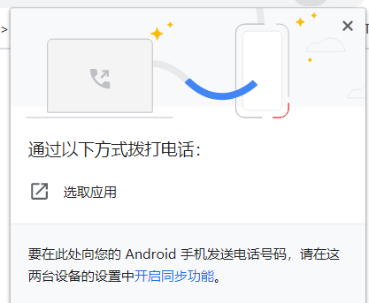

# [a](https://developer.mozilla.org/zh-CN/docs/Web/HTML/Element/a)

## 描述

a元素全称为:anchor,可以将之称为锚元素.

至于为什么我要单独开一个章节将这个"常识"般的元素,这是因为大部分新人都只知道a元素可以用来导航到另一个页面,但是却不知道其他的用处,如:

​	它可以创建同一页面内的位置、电子邮件地址或任何其他 URL 的超链接,甚至包括点击它就可以在当前页面下载指定文件,或下载canvas,以及能执行一段JS代码等.

## 作用

a元素可以创建通向其他网页、文件、同一页面内的位置、电子邮件地址或任何其他 URL 的超链接,

甚至包括点击它就可以在当前页面下载指定文件,或下载canvas,以及能执行一段JS代码等.

## 属性

### href

#### 描述

a标签中最重要的属性,它包含超链接指向的 URL 或 URL 片段,以及能做更多的事情,如执行一段JS代码,或打开邮件等.

在执行非url时,如执行打开邮件,执行js代码时,我们需要在执行这些操作时,使用某些协议,如: `tel:` , `javascript:`等,

使用这些协议告诉a标签,你要执行的是有关于这些协议中的内容,而不是导航到超链接或者其他什么的,详见:***示例***.

#### 格式

`<a href='url/url片段/js代码/邮件/电话等'>a标签</a>`

#### 示例

以下并不是全部示例,更多请在互联网上搜索.

##### 使用哈希标记#

###### 描述

URL 片段是[哈希标记](https://baike.baidu.com/item/%E5%93%88%E5%B8%8C%E6%A0%87%E7%AC%A6)（#）前面的名称，哈希标记指定当前文档中的内部目标位置（HTML 元素的 ID）.

也就是说,通过HTML元素的ID,然后使用: `href="#元素id"`,接着点击a标签,则就可以跳转到当前页面中该ID所在的元素的位置.

注：当这样使用并点击 \<a href="#元素id"> 标签时，页面的 URL 会改变，即：在后面加个：`#元素ID`

###### 格式

`<a href='#元素id'> </a>`


###### 回到页面顶部

```js
<a href="#">回到页面顶部</a>
<a href="#top">回到页面顶部</a>
```

该示例是[HTML5中的新特性](https://html.spec.whatwg.org/multipage/history.html#scroll-to-fragid). 

注意: #默认情况下代表: #top.

###### 跳转到指定的元素

```html
<p id="p">跳转到我这里</p>
<a href="#p" >跳转到p</a>
```

##### 打开你的邮件[mailto协议](https://developer.mozilla.org/zh-CN/docs/Web/Guide/HTML/Email_links)

```html
<a href="mailto:nowhere@mozilla.org">打开邮件</a>
```

<a href="mailto:nowhere@mozilla.org">打开邮件</a>

这是常见的创建按钮或链接，将用户的电子邮件程序打开，让他们发送新邮件。这是通过使用一个[mailto链接](https://developer.mozilla.org/zh-CN/docs/Web/Guide/HTML/Email_links)完成的

##### 创建电话链接

供电话链接有助于用户查看连接到手机的网络文档和笔记本电脑。

更详细的语法请参考 [RFC 3966](https://tools.ietf.org/html/rfc3966)。

```html
<a href="tel:+491570156">+49 157 0156</a>
```



当我们点击a标签时,浏览器可能会提示这个.

##### 创建点击即可下载文件的a标签

该示例和***download - 示例*** 重合,详见:***download***

```html
<a href="./img/5.png" download / download="我是文件名.png">
	
</a>
```


##### [使用a标签执行JS代码](https://developer.mozilla.org/zh-CN/docs/Web/JavaScript/Reference/Operators/void)

当使用a标签的href属性执行一段js代码时,需要在前面添加:`javascirpt:`,

告诉a标签,你要执行的是JavaScript代码,而不是导航到超链接或者其他什么,这和我们使用`tel:` , `mailto:`时一样

但是需要注意的是:**W3C标准不推荐利用 javascript: 伪协议来执行 JavaScript 代码,他们推荐的做法是为链接元素绑定事件**

###### 执行一段简单的js代码

```html
<a href="javascript:alert('执行成功')">执行js代码</a>
```

###### 执行一个JS方法

```js
function tell(){alert('你好')};
//单击a标签则弹出:你好
<a href="javascript:tell()">执行js代码方法</a> 
```

###### 执行一条空的js代码

```js
<a href="javascript:;">执行空的js代码</a>
```

通常若使用这种方法,会配上a标签的onclick事件,在onclik事件中执行js方法等.

###### 使用void

在大部分页面中,我们经常可以看到有这么一条a标签:

```html
<a href="javascript:void(0)">单击该标签什么都不会发生</a>
```

[void](https://developer.mozilla.org/zh-CN/docs/Web/JavaScript/Reference/Operators/void): 它是一个JS中的运算符,void对给定的表达式进行求值并返回 undefined.***参见:<void运算符.md>***

该示例的意思为: 单击a标签之后,执行href属性中url,由于该href属性是一个javascript代码,所以会执行void(0),但是**void(0)代表着什么都不会发生**,

因为void(0)首先先执行0这个表达式,然后返回一个undefined,而0这个表达式本身就不会改变什么,且返回的undefined也并不会被a标签体现出来,所以就表现的什么都没有发生一样.

需要注意的是:void只是一个会让表达式返回undefined的运算符罢了,实际上,如果你愿意,你可以使用void(1),void(1241123)等等,**只要void右边的表达式是一个不会改变任何事物的表达式,则点击这个a标签都会如同什么都没做一样.**


##### ftp:

##### [file:](https://en.wikipedia.org/wiki/File_URI_scheme)

### download(HTML5)

#### 描述

download属性是HTML5中新属性,它指示浏览器下载a标签中href属性指定的 URL,而不是导航到它，因此当用户点击a元素时,浏览器将提示用户将该文件保存为本地文件。

如果downlaod属性不存在属性值: `download`,则下载a标签的href属性指定的文件时,以该文件的名字作为下载完成后默认保存的文件.

若该属性存在属性值: `download:"filename"`,那么此值将在下载保存过程中作为默认的文件名(如果用户需要，仍然可以更改文件名).

且download属性对允许的值没有限制，但是 `/` 和 `\` 会被转换为下划线。

由于大多数文件系统限制了文件名中的标点符号，因此,浏览器将相应地调整建议的文件名.

#### 使用download属性的注意点

- 此属性仅适用于[同源 URL](https://developer.mozilla.org/zh-CN/docs/Web/Security/Same-origin_policy)。
- 尽管 HTTP URL 需要位于同一源中，但是可以使用 [`blob:` URL](https://developer.mozilla.org/zh-CN/docs/Web/API/URL.createObjectURL) 和 [`data:` URL](https://developer.mozilla.org/zh-CN/docs/Web/HTTP/Basics_of_HTTP/Data_URIs) ，以方便用户下载使用 JavaScript 生成的内容（例如使用在线绘图 Web 应用程序创建的照片）。
- 如果 HTTP 头中的 [Content-Disposition](https://developer.mozilla.org/zh-CN/docs/Web/HTTP/Headers/Content-Disposition) 属性赋予了一个不同于此属性的文件名，HTTP 头属性优先于此属性。
- 如果 HTTP 头属性 Content-Disposition 被设置为inline（即 Content-Disposition='inline'），那么 Firefox 优先考虑 HTTP 头 Content-Dispositiondownload 属性。

#### 格式

`download`

`download="filename"`

- filename: 下载指定的文件时,该文件默认的名字.

#### 示例

```html
<a href="./img/5.png" download / download="我是文件名.png">
	
</a>
```

需要注意的是:若download属性存在值,则最好为它添加一个扩展名,如 filename.xxx, 否则下载的文件将不会有任何扩展名.

### rel

该属性指定了目标对象到链接对象的关系。该值是空格分隔的[列表类型值](https://developer.mozilla.org/zh-CN/docs/Web/HTML/Link_types)。

### target

该属性指定在何处显示链接的资源。 取值为标签（tab），窗口（window），或框架（iframe）等浏览上下文的名称或其他关键词。

以下关键字具有特殊的意义:

- `_self`: 当前页面加载，即当前的响应到同一HTML 4 frame（或HTML5浏览上下文）。此值是默认的，如果没有指定属性的话。
- `_blank`: 新窗口打开，即到一个新的未命名的HTML4窗口或HTML5浏览器上下文
- `_parent`: 加载响应到当前框架的HTML4父框架或当前的HTML5浏览上下文的父浏览上下文。如果没有parent框架或者浏览上下文，此选项的行为方式与 _self 相同。
- `_top`: IHTML4中：加载的响应成完整的，原来的窗口，取消所有其它frame。 HTML5中：加载响应进入顶层浏览上下文（即，浏览上下文，它是当前的一个的祖先，并且没有parent）。如果没有parent框架或者浏览上下文，此选项的行为方式相同_self

注意: 使用target时，考虑添加 rel="noopener noreferrer" 以防止针对 window.opener API 的恶意行为。

**Note:** Linking to another page using `target="_blank"` will run the new page on the same process as your page. If the new page is executing expensive JS, your page's performance may suffer. To avoid this use `rel=noopener`.

### hreflang

该属性用于指定链接文档的人类语言。其仅提供建议，并没有内置的功能。hreflang 允许的值取决于HTML5 [BCP47](http://www.ietf.org/rfc/bcp/bcp47.txt)。

### ping

包含一个以空格分隔的url列表，当跟随超链接时，将由浏览器(在后台)发送带有正文 PING 的 POST 请求。通常用于跟踪。

### type

该属性指定在一个 [MIME type](https://developer.mozilla.org/zh-CN/docs/Glossary/MIME_type) 链接目标的形式的媒体类型。

其仅提供建议，并没有内置的功能。

### referrerpolicy(实验性属性)

## 无障碍监建议

锚点标签常常通过将 **href** 属性设置为 "#" 或 "javascript:void(0)" 来创造一个能阻止页面刷新的伪按钮的方式被滥用。 

这些属性值会在拖动 / 复制链接时导致意外的行为，即:可能导致在新窗口 / 新标签打开链接，加入书签以及 JavaScript 仍在下载时 会出现错误或被禁用。

这也会向辅助技术（如屏幕阅读器）传达不正确的语义。

在这些情况下，推荐使用button元素 来代替。

**通常情况下，您应该只将锚点用于正常的 URL 导航。**

## Clicking 及 focus

点击一个 a标签是否会出现 focus 取决于浏览器和操作系统。,如:

在Safari 7.0.5,Windows 8.1中,focus并不会被触发.