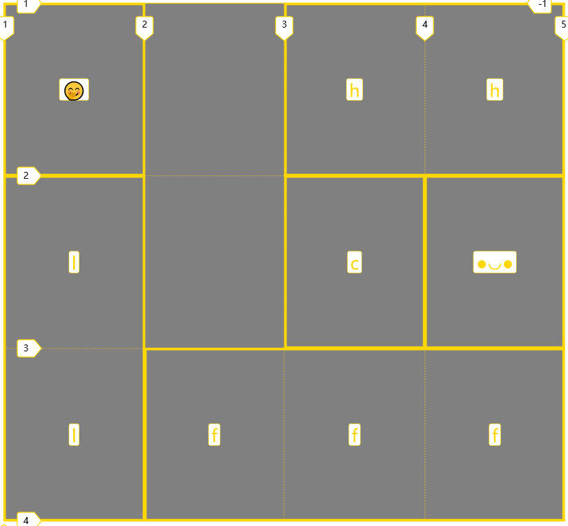
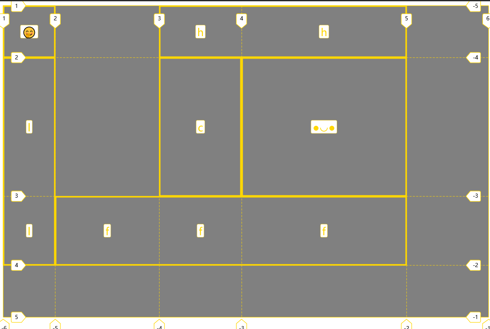
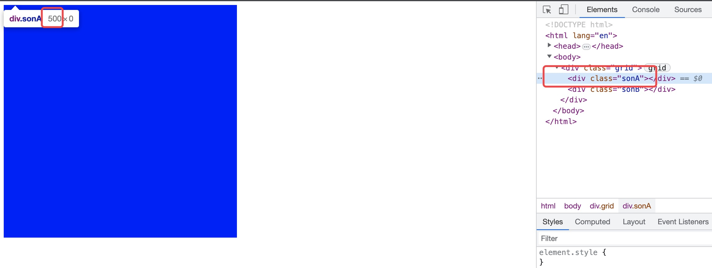
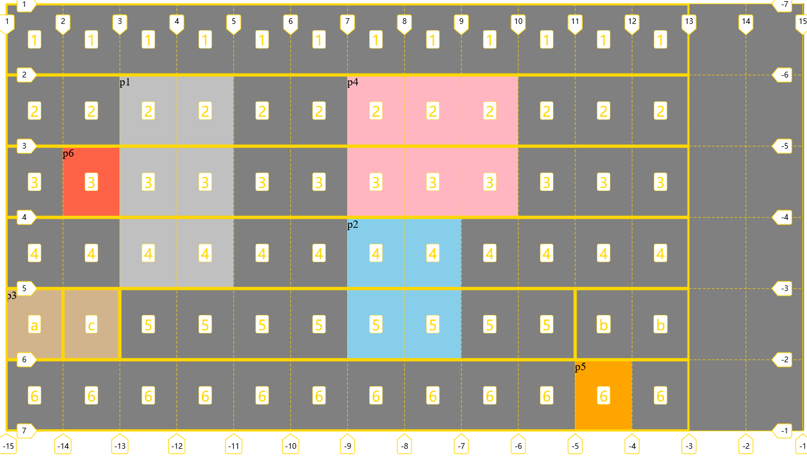
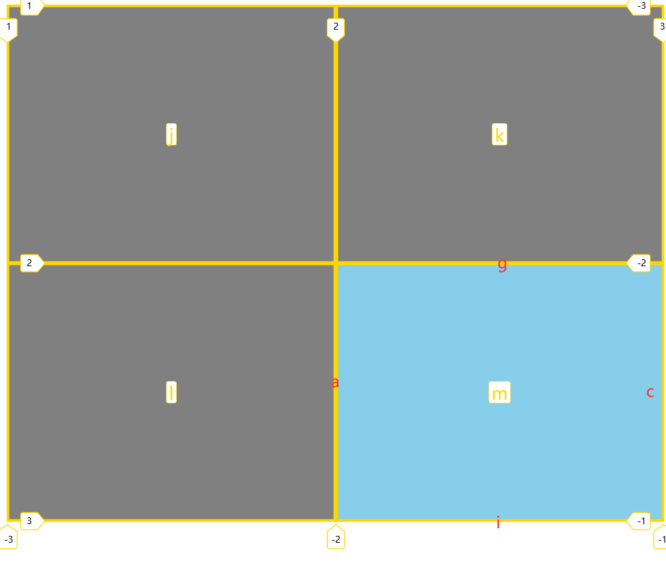

# 基本

## 描述

栅格布局是**最普适的**布局系统,由于它依赖行和列,初看时会以为倒退到了表格布局,但是事实上,栅格布局是要强大的 多的多的多.

使用栅格布局,无需顾虑各部分在源文档中的顺序,如果愿意,不同的部分还可以重叠在一起.

我们可以在栅格布局中嵌套栅格布局,其层次无限制(弹性布局也是),可以使用表格或弹性布局等.

而这这是其中的一些方面,栅格布局的功能还有很多很多. P657

## 概念

想创建栅格布局,**第一步必须定义栅格容器**(grid container),这与定位所用的容纳块和弹性布局中的弹性盒的作用很像: 即栅格容器为其中的内容定义一个栅格格式化上下文**(可以理解为定义一个栅格容纳块,里面的内容永远基于容纳块的内容区布局)**.

栅格布局沿用了许多弹性布局中的概念, 例如: **栅格容器的子元素(包括匿名元素)是栅格元素**,但是**子元素的子元素不是栅格元素**.

**栅格中可以嵌套栅格,且层级不限**,弹性元素也是如此. (注意:栅格布局还有子栅格这个概念,但是**这个概念并不是什么栅格子元素和嵌套的栅格容器**,稍后会说)

- 使用**display:grid 或display:inline-grid**属性**创建栅格布局.**
  
  **display:grid属性: 生成块级框**
  
  **display:inline-grid属性:生成行内框,**注意,这是行内框,不是行内块级框,这和弹性布局的display:inline-flex属性生成的行内块级框不是一个东西.
  
  ​    即前者类上下两边会折行,后者如同行内框一样不会折行.

- 虽然display:grid属性创建的栅格布局是生成的块级框,但是CSS规范明确指出:**"display:grid属性创建的栅格容器不是块级容器"**P658
  
  ​    例如:栅格容器中的浮动元素并不会打乱栅格容器的布局,可是块级框中的元素会. 
  
  ​    栅格容器的外边距不与其后代的外边距折叠,块级框的外边距(默认)会与其后代元素外边距折叠,
  
  ​        比如一个有序列表的第一个元素如果有上外边距则会与有序列表的外边距重叠. 还有许多不同的地方,以后你们会一一知道的. P658

- **有些CSS属性并不能应用到栅格容器和栅格元素上.**P659
  
  ​    栅格容器上的所有colum属性(如colum-count,colum等)都将被忽略
  
  ​    栅格容器没有::first-line和::first-letter位元素,若使用则被忽略.
  
  ​    栅格元素(非栅格容器)上的float和clear属性将被忽略.但是,float属性对栅格元素的display属性的计算值是有影响的,因为栅格元素的display属性值在变成栅格元素之前就被计算了.
  
  ​    vertical-align属性对栅格元素不起作用,不过可能会影响栅格元素中的内容(注意:是栅格元素的内容),不过别担心,有更强大的方式对齐栅格元素.

- 在使用**display:inline-grid属性时**,若是**在浮动的元素或绝对定位(absolute)的元素上使用**,则display的**计算值将变为:grid,即取代inline-grid值**.P660

- **栅格元素一定是相对于栅格容器的内容区进行布局的.**(亲测)
  
  弹性元素也是这样,一定相对于弹性盒的内容区进行布局.

## 基本的栅格术语P660

- ***栅格容器*: 是确立栅格 格式化的上下文的框体**,即**定义一个栅格区域,其中的元素根据栅格布局规则排布**(非块级布局,前面提到过,这是相似但不同的概念..
  
  **或者说栅格容器是栅格元素的容纳块,其栅格元素以据容纳块进行布局. 注意:栅格元素是以据栅格容器的内容区进行布局的,即容纳块的内容区.** P660

- **栅格线:** 栅格线是一条条虚线组.只有在GodModuel中看见,且目前只有FireFox实现了可视化栅格布局. P661

- ***栅格元素*: 是在栅格格式化上下文(栅格容器的内容区中)中参与栅格布局的东西,可以是任何子元素,包括匿名文本.**P660

- **栅格轨道:** 从栅格容器的一边延伸到另一边,即有栅格行,栅格列. 栅格轨道的尺寸由栅格线的位置决定.
  
  我们可以将栅格行/栅格列称之为**行内轴轨道/块级轴轨道**.即对从左→右书写的语言来说: **栅格列在块级轴上,栅格行在行内轴上.**P 661

- **栅格单元:** 由四条栅格线限定的**矩形**区域,内部不存在其他栅格线贯穿.
  
  栅格线是栅格容器中最小单位,无**法直接使用CSS属性处理**,即不存在一个CSS属性能把一个栅格元素放在指定的栅格单元里(可以将栅格单元变成栅格区域即可)P662

- **栅格区域:** 由四条栅格线限定的**矩形**区域,由一个/多个栅格单元构成,最小的栅格区域就是一个栅格单元,最大的栅格区域是栅格容器中所有的栅格单元. 
  
  **栅格区域能直接使用CSS属性处理**,定义好栅格区域后即可在其中放置栅格元素.
  
  注意:**单个栅格单元被定义成栅格区域之后**,它就不是栅格单元了,而**是栅格区域**,所以才说栅格单元无法直接使用CSS处理.

- **栅格轨道,栅格单元,栅格区域都完全由栅格线构成,且它们不一定要有对应的元素才能存在**
  
  **栅格区域中不一定充满栅格元素,可以让部分或者多数栅格单元空着.**
  
  **栅格元素可以重叠,方法是定义重叠的栅格区域,或者把栅格线重叠起来.** P662

- **栅格线的数量不限**,且**可以只定义块级轴轨道上的栅格线或者内轴轨道上的栅格线**, 即**一行多列, 或者一列多行.**P662

- 若栅格元素**无法放入你定义的列或行轨道中**,或者你**明确指定**把栅格元素放在轨道的**外部**,那么栅格系统将**自动添加栅格线和轨道**.P662

## grid-template-rows和grid-template-colums 放置栅格线P662

所谓的放置栅格线,也就是**确定那些用户"看不见"的虚线的摆放位置**,可是这不是一件简单的事情,这并不是说这个概念很难,而是因为栅格线的放置方式太多了,不同的使用方式使用的句法有细微的区别.

添加几行几列

- 最常见的放置栅格列/栅格行的栅格线的属性为:
  
  **grid-template-rows和grid-template-colums,**这两个属性的**取值是一样的**,即:none | \<track-list> | \<auto-track-list>
  
  none: 初始值
  
  - <track-list\> : 
  
  其值的类型可以为以下类型:
  
  ​    百分数,px,em等.
  
  **百分数的值永远是相对于栅格容器的内容区宽度和高度,即height和width**(通常情况下,存在box-sizing:border-box则height和width就会计算内边距和边框,就是错的了,因为**栅格元素永远相对于栅格容器的内容区布局**)
  
  ​    *使用百分数作为字体宽度或width这样的值得宽度时,其相对于font-size大小计算*
  
  \<auto-track-list>
  
  ​    暂无介绍
  
  其中若使用这两个属性,则我们每多写一个数值则就是多添加一条栅格行 / 栅格列.在**后续我会先讨论一些基础知识在详细讲解这两个属**性.
  
  P663-P664

- 使用grid-template-rows和grid-template-colums两个属性**能大致定义栅格模板中的栅格线**,CSS规范将这一行为称之为:**explicit grid显示栅格**. P664

- 栅格线**始终可以使用数字引用**,也**可以任意为栅格线命名.**其只需要在grid-template-rows和grid-template-colums两个属性值的前面加上[],其中写名字即可.P664
  
  如:grid-template-rows:[name] 200px [col] 100px等 P666
  
  栅格线的命名,其**行内轴轨道中的栅格线与块级轴轨道中的栅格线不共用命名空间**,即它们可以用相同的名字,~~但是**同一个轴上不行**~~同一个轴轨道依然可以(P680).P667
  
  PS: grid-template-rows:[name] 200px [col] 100px **[last-line]**其中的[last-line]**是最后一条栅格行/列线**,
  
  ​    这是由用户代理自动补充的(矩形区域肯定是存在四个边的,这四个便都是由用户代理生成,我们可以设置其名,
  
  ​    但是无法改变大小,因为它随着里面的内容改变大小. P703

- 使用名称引用的栅格线,请注意:**我们引用的是一组词.**
  
  即:grid-template-rows:[one two] 1fr [a b] 1fr [c d]
  
  我们可以使用one词来引用第一条栅格线,或者使用two,其引用的都是第1条栅格行, c 和 d引用的都是最后一条栅格行.**请看:在栅格中附加元素 - grid-area使用区域P702.** 
  
  TIP: 最后一条栅格行指的是 => 一个矩形区域具有两条列边，两条横边，所以 `grid-template-rows:[a b] 1fr [c d]` 中的 `a b` 指的是矩形横边的第1个，`[c d]` 指的是矩形横边的第2个。

- 根据CSS栅格规范规定:用户代理将先解析列的尺寸再解析行的尺寸.P676 所以列的尺寸可能影响行的尺寸

- 注意:我们可以将这两个属性的值视为: **有几个值就添加几行/几列,并且每行/每列 的宽度就是指定的与之对应的属性值.**

## 宽度固定的栅格轨道P665

首先说明如何创建固定的栅格轨道,这里的**固定不单止固定的px或em,也有百分数.**

**宽度固定则是指**:栅格线之间的距离不随栅格轨道中的内容变化而变化.P665

- **宽度固定的块级轴轨道可能在起边和终边**(最左边/最右边)**接触不到栅格容器的左/右边界**,但是没关系,**没有规定必须接触**,而且我们也**有多种方法能让它们接触**,所以不必担心. P665

### minmax(最小值,最大值) P668

- **使用minmax(最小值,最大值)可以为某个轴轨道上的某个栅格线的行高/列宽设定其最小不能小于多少,最大不能大于多少.**
  
  其目的是为了防止栅格线的宽/高度溢出栅格容器.P668 - P669

- **浏览器是这么计算使用了minmax(a,b)的栅格线的宽/高度的:**将栅格容器的内容区剩下的宽/高度看情况分配给指定的栅格线的宽/高度.最少不会分配小于a,最多不会分配大于b. P669

- 若minmax(a,b)中的**最大值b<最小值a,则最大值b将被忽略,最小值a将用来设定宽度/高度固定的轨道长度**.P669

- 使用minmax(),用户代理的含糊行为*(用户代理可能会增加其栅格线宽/高,又或者减少宽/高,且不知道具体增加/较少多少)*可能会让你焦躁不安,或许你可以使用以下的calc()解决此问题. P669

- 最小值无法使用fr作为单位,最大值可以使用fr作为单位.P673

### calc()P669, P138

- calc()可以用在grid-template-rows和grid-template-colums属性的值中,即**使用+-*/计算它们的值**P669

- 其目的也是为了**防止栅格线的宽/高溢出栅格容器的内容区宽/高**.且**没有含糊行为**.
  
  但是**有时并不会这么牢靠**,比如我们想让一列弹性变形,使用cale()极难做到,或者根本做不到.所以,我们**有更可靠的实现方式,**稍后我们会说.P669
  
  需要注意的是: calc(a - b); calc(a + b); 即**减法和加法的左右两侧必须有空白**,和正负号区分开,**没有空白则会被忽略**.P138

### 示例

宽度固定的栅格轨道P665

```css
#grid {
    display:grid;
  /*创建一行三列的栅格轨道(栅格线)*/
  grid-template-rows: 1fr;  
    grid-template-columns:200px 50% 100px;
}
```

- 注意这里是列,因为列的排列(块级轴轨道)才是宽度,行的排列(行内轴轨道)则是高度.

## fr份数单位 弹性栅格轨道P669

以上讲述的都是固定值的轨道线(百分数也仍属于固定值),现在让我们来讲讲一个新的属性:fr; 

它可以让相邻的栅格线之间的距离"弹"起来,即可以根据其它的因素所变化自己的大小.

> 此单位和弹性布局中的 flex 属性有异曲同工之妙

- **fr:** **份数单位**,将余下的空间分成一定份数,分配给各个使用这个单位的各栏.  P670

- **fr份数单位的计算:**若存在grid-template-columns:1fr 2fr 3.1415fr;这么一个属性,这首先表示将块级轴轨道方向上的栅格线有3条,即分3栏其中没栏的宽度计算为: `(除开固定值之外的可用空间宽度 / 份数) * 各栏拥有的份数 = 各栏的实际宽度值.`
  
  如: 可用空间为600px,
  
  ​    则第一栏宽为: (600 / (1+2+3.1415))  * 1 ≈97.69.
  
  ​    则第二栏宽为: (600 / (1+2+3.1415))  * 2 ≈195.39.
  
  ​    则第三栏宽为: (600 / (1+2+3.1415))  * 3.1415 ≈306.91
  
  PS: **行高也可以这样说,其计算过程一样的.**P672

- **fr单位的目的**就是可以让某一个栅格区域具有自适应栅格容器大小的能力. P671

- 使用fr份数单位的轴轨道上的栅格线所在的栅格区域的高/宽值**可能为0,**即**不存在余下的空间可以分配给这一个弹性列/弹性行了.**
  
  但是其栅格行/栅格列**并不会消失,只是会和其他栅格行/栅格列重叠,**P673

- 我们可以在grid-template-rows和grid-template-colums属性的值上**使用minmax()值,限制其某个栅格线的最小值和最大值.**
  
  这样就**不用担UserAgent自己发挥从而导致与预期结果大相径庭**.
  
  但是需要注意:**最小值无法使用fr份数单位(使用则被忽略),但是最大值可以使用fr份数单位.** 

- 虽然fr份数单位和minmax(最小值,最大值)也可以用在栅格行上,效果也不错,但是其实**更多的时候你往往想根据栅格行中的内容的高度从而设定尺寸**,而不是根据其可用空间还剩多少来设置其行高. 
  
  ​     grid-template-rows: 200px **minmax(100px, 1fr)** 100px; 有时候我们根本不想根据可用可见还剩多少来排列,就需要用到其他属性,请往下看.
  
  ​        minmax(100px, 1fr): **第二个栅格行的高度最小不得小于100px,最大值为可用空间大小**. (当最大值<最小值时,最大值被忽略,此时如同只设定了一个值:最小值 P669)
  
  P673-P674

## min-content和max-content根据内容设定轨道轴的尺寸P674

**min-content和max-content关键字和以下的fit-content比不太灵活.**

- min-content和max-content是**两个关键字,它们可以直接使用,**其意思为:
  
  **min-content:尽量少占据空间,刚好够显示内容即可.**
  
  **max-content:尽量多占据空间,占据所能占据得最大空间.**P674

- max-content:在当前轴轨道中,和最宽/最高的那个栅格元素的大小对齐.

- 这两个关键字最强大之处在于: 那个轴轨道的某栏(行/列)用了之后,则整行/整列都会被应用.

- **min-content:尽可能地缩小宽/高度,如果当前指定的栅格行/列能换行渲染就换行渲染**,因为min-content可能会造成栅格元素的大量换行以及特别窄.
  
  **max-content:尽可能让宽/高度增大,即尽量让所有文本以及图形什么的都渲染在一个基线中**,所以如果其内容>栅格容器内容区,则会溢出. P678
  
  ​    当然了,只是尽量.比如:如果栅格元素换个行就能阻止溢出容器发生,则就不会强制让栅格元素的内容在一条基线上.

- 还有一个**关键字auto**:**用作最小值时**,视作栅格元素的最小此村,即由min-width或min-height定义的值.
  
  **用作最大值时**,作用等同于max-content,即由max-width或max-height定义的值.
  
  ​    auto除了用在minmax()语句以外,还能用在其他几乎任何地方,但是我们**不建议使用auto作为属性的值,**因为UserAgen/t怎么做是很难确定的,每个基于不同内核的浏览器的UserAgent可能行为都不太一样.
  
  ​    但是**如果在栅格容器上使用auto作为属性值,则栅格元素的尺寸可由align-content和justify-content属性调整.** 
  
  ​    auto是唯一有此特性的轨道尺寸值,所以有时还是有理由使用的.

通过以下示例和书本我们能得出这些结论:

- max-content: 在一个栅格行/栅格列上**,所有的栅格元素的的大小将与当前行/当前列最高/最宽的那个栅格元素一样大.**P674
  
  ​    *(进行计算时: 会**计算内,外边距**,因为栅格元素值整个元素框相对于栅格容器的内容区布局的.)*

- **栅格元素的内容可以是任何类型,**包括但不限于图片,文本等.P674

- 所以我们将max-content关键字描述为:让宽/高度值尽量大.P674

- 注意**:即使栅格轨道(栅格线)从栅格容器中溢出**,**依然为以下示例 - max-content **那样的处理方式,不会因为溢出就被改变布局方式.
  
  所以**max-content才经常用在minmax()中,** 
  
  ​    如: minmax(0,max-content); 其意思为:将某栏的尺寸限制在0到max-content范围之内,即**将各栅格元素尽量留在栅格容器内**,
  
  ​    如果某行/某列上的某个栅格元素溢出,则其他栅格元素的宽/高度会在**不超出栅格容器的基础上,尽量像那个值靠拢**,如果实在没办法靠拢,则就达到刚好无法超出栅格容器大小的那个宽度.
  
  ​    **如果栅格元素内容大于栅格轨道的宽/高,则内容将溢出,可能会与其他轨道重叠,这是栅格容器的标准行为. P676**

- min-content:尽量少占据空间,够显示内容即可,这意味着宽度会尽量收窄,只保证最大的栅格元素能在一行里完整显示.
  
  这个值会导致栅格元素中有大量断航,而且特别窄特别高.P674

### 示例

#### max-contentP674

由于min-content和max-content是两个关键字靠文字可能或许很难理解,所以我们要使用一个小示例,帮助我们理解.

```html
<style>
    div {
        display: grid;
        background-color: gray;
        /* 根据CSS栅格规范规定:用户代理将先解析列的尺寸再解析行的尺寸.P676 */
        grid-template-columns: max-content max-content max-content max-content;
        grid-template-rows: max-content max-content max-content;
    }

    p {
        background-color: rgb(231, 166, 166);
        margin: 0;
    }

    .p1,
    .p2 {
        height: 40px;
    }
</style>

<body>
    <div>
        <p>1111111111</p>
        <p>22222222222</p>
        <p>333333</p>
        <p class="p1">44444444444444444444</p>

        <p class="p2">
            555555555
            55555555555
        </p>
        <p>66666666</p>
        <p>7777</p>
        <p>888888</p>

        <p>999999</p>
        <p>aaaaaaaaa</p>
        <p>
            bbbbbbbbbbbbbbbbbbbb
            bbb
        </p>
        <p>cccccccccccc</p>
    </div>
</body>
```


#### min-content P674

min-content:尽量少占据空间,够显示内容即可,这意味着宽度会尽量收窄,只保证最大的栅格元素能在一行里完整显示.

这个值会导致栅格元素中有大量断航,而且特别窄特别高.

## fit-content根据轨道中的内容适配P677

fit-content和min-content/max-content关键字比 比较灵活.

- **使用fit-content(argument)函数作为关键字,能让行的高度和列的宽度根据其中的内容的大小进行适配**P677
  
  ​    fir:适配

- fit-content(argument)
  
  argument: 一个参数,是一个指定的长度值或百分数.
  
  fit-cotent(argument)的意思为: **首先确定一个栅格元素的min-content的值**,然后**和argument比较,找出那个大的值**,
  
  ​    **再和**当前的栅格元素的**max-content值比较**,**找出其中小的那个值**,而这个小的**这个值就是其fit-content(argument)所计算出来的值.**
  
  简略来说则是: 
  
  ```js
  if(argument > min-content) {
      if(argument > max-content) {
          max-content就所计算出来的值.
      }else if(argument < max-content) {
          argument就是计算得出来的值
      }
  }else {
      if(min-content > max-content) {
          max-content就是计算出来的值.
      }else if(min-content < max-content) {
          min-content就是计算出来的值.
      }
  }
  ```
  
  P677-P678

- 当**min-content和max-content一样大的时候**,则若**不论** argument > min-content 或者 argument < min-content,则**fit-content的计算值都为min-content**,即换成代码表现为:
  
  ```js
  // argument简写为a
  while(min-conten == max-content) {
      if(a > min-content || a < min-content) {
          fit-content的计算出来的值都为min-content
      }
  }
  ```

- fit-content(argument)函数和minmax(最小值,最大值)相比**,其优点是更为灵活**,即当内容不多时,其栅格行/栅格列大小将缩小为最小的内容尺寸,而在内容较多时,又能为栅格行/栅格列的大小设置一个上限.

## repeat()重复栅格线P679

- **repeat()意思:**
  
  repeat(重复次数, 重复的栅格线宽/高度) ,可以设置多个分栏进行重复
  
  P679

- repeat()函数**通常使用在**grid-template-colums和grid-template-rows属性中.P679

- **repeat()的目的是**:在栅格容器中,各栅格尺寸在一样的时候,可以避免我们重复的一个个输出尺寸值. P679

- **使用了repeat()仍然可以继续添加栅格列/栅格行以及设置其宽/高度**. P680
  
  即: grid-template-rows: 2em repeat(3, 2em 50%) 100px;
  
  ​    即意为: 先添加一个分栏,其高度为2em,其次添加两个分栏:2em和50%并重复三次, 最后再添加一个分栏,高度为100px.
  
  ​    所以总共存在: 1 + (3*2) + 1 = 8个分栏. P680

- repeat()中**几乎可以使用任何值,包括命名栅格线:** P680
  
  repeat(4, 10px [start] 250px [end]) 
  
  ​    在这个函数指定的栅格行/栅格列中存在相同的栅格线的命名,但是这并没有任何关系,不会对布局造成任何影响. 
  
  ​    但是如果栅格线是重复的(如声明fr的栅格行/列没有空间可用,就和其他栅格线重叠),则那条栅格线表明看上去会有多个名字.
  
  ​    但这依然没事,CSS并没有规定不能重复,甚至在某些情况下这样做有一定好处. P681

## repeat(auto-fill,值)和repeat(auto-fit,值)自动填充轨道 P681

### repeat(auto-fill,值)

- 使用repeat(**auto-fill**,值);能重复**简单的创建栅格线的工作, 直到填满整个栅格容器为止**.P681

- grid-template-rows / grid-template-colums :(auto-fill, 5em); 
  
  意为:将行内轴轨道/块级轴轨道上以每行/列5em的大小填充栅格容器内容区,直到栅格容器被填满为止. P681

- repeat(auto-fill,值)**无法重复多个尺寸固定的轨道**(行/列),也**无法重复多个弹性变化的轨道(行/列),同时一个轨道模板中只能有一个自动重复的模式**
  
  如:repeat(auto-fill,1em **1em**); repeat(auto-fill,1fr **1fr**) ​;:x:
  
  **grid-template-rows**:repeat(auto-fill,1em)  repeat(auto-fill,1fr) ;:x:
  
  P682

- 固定数量的重复模式可以和repeat(auto-fill,值)自动填充轨道一起使用,这是因为栅格布局会先为固定尺寸的轨道(栏)分配空间的,最后再分配弹性轨道.
  
  如: repeat(2, em) repaet(auto-fill, 2em); :ballot_box_with_check:

- 使用repeat(auto-fill,值): **重复创建栏时,至少会创建一次栏**,即使出于什么原因栅格容器中放不下这栏(列/行)也是如此. P683

- 使用repeat(auto-fill,值);重复创建栏(行/列)时,不会因为没有栅格元素就不创建栏(轨道,列/行).
  
  比如:某个栅格容器你使用某个值最多能创建7列,那么就一定会创建7列,不会因为栅格容器不存在栅格元素就不创建,但是repeat(auto-fit,值)就不一样了,请往下看. P683

### repeat(auto-fit,值)

- repeat(auto-fit,值)和repeat(auto-fill,值)很像,除了其中的auto-**fit**和auto-**fill** P683

- auto-fit:在重复创建轨道时,没有栅格元素的栏将被剔除.
  
  即,如果一个栅格容器没有任何栅格元素,那么使用repeat(auto-fit,2em) 将不会创建任何一列/行.
  
  因为fit就是适配的意思. 详情请看:fit-content,你就会明白其意思,即按元素中的内容适配,没有内容自然适配为0. P683

- auto-fit除了会不为空元素创建栏,其他皆和auto-fill一样. P683

## grid-template-areas栅格区域P683

由于这个属性单看文字似乎难以理解,所以我们会使用一些示例来讲解.

- grid-template-areas属性用在栅格容器中,用来创建栅格区域.P683

- grid-template-areas属性取值为:noe | \<string>
  
  none:默认值,即如同没有创建栅格区域
  
  \<string>任意的有效字符串文本

- grid-template-areas属性简单的意思可理解为: 
  
  ​    **使用字符串进行排版,以空格分割每组字符串;每组字符串都是一行;每个字符串中的一组词都是一列;**
  
  ​        一组词:即所对应的栅格单元的名称.
  
  ​    **相同的词会构成一个区域,即为栅格区域,区域只能为矩形,即使跨字符串进行构成栅格区域依然可以.** P684
  
  ​    **字符串中的"词"不一定必须存在,**可使用1个/多个.(点号)表示占位空间,即**这里存在栅格单元,但是不属于任何区域**. P686

- 使用grid-template-areas属性创建栅格区域之后,我们可以接着使用grid-template-colums和grid-template-rows创建栅格行/列并定义每行每列的的大小.
  
  如果创建的栅格行/类超出栅格区域定义的行/列,则超出的那部分会补充在栅格区域后.P687

- 为栅格区域命名之后依然可以为栅格线命名,但是栅格区域一旦命名,就相当于为栅格线也命名了: 即栅格区域的名称自动成为首位两条栅格线的名称.P687

- 建议一直显示命名栅格区域,隐式生成-start和-end形式的栅格线名称,不要反过来做.P689

### 示例

#### grid-template-areas

```
<style>
    div {
        display: grid;
        grid-template-areas:
            "🤭 ...  h  h"
            "l  .  c  ●◡●"
            "l  f  f  f";
        background-color: gray;
        height: 600px;
    }
</style>

<body>
    <div></div>
</body>
```



很显然,从源代码和渲染结果中,我们能轻易得出以下结论:

​    :one:每个字符串都代表一行,字符串中的每一组以空格分开的词都代表一列,且对应栅格单元的名称,并且每组词中可以使用一个/多个空格/制表符分开.P686

​    :two:每组相同的词会合并成一个栅格区域,且只能为矩形区域P685.并且可以跨行合并（跨行合并并不是跨任意区域合并，如：以上图片，若将右下角 f 改成 l，则 `grid-template-columns` 属性将失效，因为这是错误的行为。

​    :three:使用一个/多个.(点号)则表示占位符,代表此处应该存在一个栅格单元,它不属于任何栅格区域,但是如果旁边的栅格单元也是用.(点号)则它们会被合并成一个矩形栅格区域, 且1个/多个.(点号)其是一样的意思.P686

​    :four:字符串中的每组词可以使用任何有效的字符(小括号()是无效字符,还有其他一些,需要自己尝试).即使大于U+0080码位的Unicode字符也可以使用.P686

#### grid-template-areas和grid-template-rows&grid-template-colums的使用

```html
<style>
    div {
        display: grid;
        grid-template-areas:
            "🤭 .  h  h"
            "l  .  c  ●◡●"
            "l  f  f  f";
        background-color: gray;
        grid-template-columns: 100px 200px 1fr 2fr 1fr;
        grid-template-rows: 100px 2fr 1fr 100px;
        height: 600px;
    }
</style>

<body>
    <div></div>
</body>
```



通过以上的源代码和渲染结果,我们很显然能得出以下结论:

​    :one:当使用grid-template-rows和grid-template-colums属性创建栅格行/列,并给每行/每列设置对应的值时,栅格区域同样也会受到影响,因为栅格行/类包含栅格区域.P687

​    :two:2个及以上栅格单元的栅格区域,其中若栅格区域的某个栅格单元所在的行/列的大小值改变,只会影响当前的栅格单元的大小,并不会影响到整个栅格区域中其它栅格单元的大小,除非它们在同一个栅格行/列. P687

## 栅格元素和栅格容器


```html
<style>
  .grid {
    display: grid;
    width: 100px;
    background-color: black;
  }

  .sonA {
    width: 100%;
    height: 100%;
    background-color: red;
  }

  .sonB {
    width: 500px;
    height: 500px;
    background-color: blue;
  }
</style>
<body>
  <div class="grid">
    <div class="sonA"></div>
    <div class="sonB"></div>
  </div>
</body>
```

- 如果没有规定栅格容器的列宽（grid-template-columns）和行高（grid-template-rows），那么栅格元素的 width 将和它同级且具有最大 width 的栅格元素一样宽。
  
  即：如果没有 `grid-template-columns` **和** `grid-template-rows` ，那么 `sonA` 的 width 为 500px.
  
  

（没有 `grid-template-columns` 或 `grid-template-rows`）

- 如果仅只具有 `grid-template-rows` 设置行高(height)，那么栅格元素的 width 将和它同级且具有最大 width 的栅格元素一样宽。
  
  
  
  （仅只具有grid-template-rows.png）

- 如果仅只具有 `grid-template-columns` 设置列宽(width)，那么栅格元素的 height 将和它同级且具有最大 height 的栅格元素一样高。
  
  
  
  （仅只具有`grid-template-columns`）

总结一下，即：

- 栅格容器如果没有规定 grid-template-rows，那么栅格元素的 width 将会自适应为同级最大栅格元素的 width.

- 栅格容器如果没有规定 grid-template-columns，那么栅格元素的 height 将会自适应为同级最大栅格元素的 height.

应用这个规则，可以让栅格元素的宽度和同样是栅格元素的 table 一样宽。

一个例子：

```html
<style>
  .container {
    width: 100px;
  }
  .yomua {
    width: 100%;
  }
  .grid {
    display: grid;
  }
  .table {
    width: 2000px;
  }
</style>
<div class="container">
  <div class="yomua"></div>
  <div class="grid">
    <table></table>
  </div>
</div>
```

由于 table 太宽，让 container 出现了滚动条，而 yomua 此时的宽度是基于 container，所以 yomua 的宽度是 container 可视区域宽度，不包含滚动条外的宽。

如果此时 yomua 存在背景色，那么在滚动 container 时，yomua 的背景色不会出现在可视区域之外（效果是：滚动时，yomua 的背景色只有一段），

而根据以上的规则，我们可以这么改：

```html
<div class="container">
  <div class="grid">
    <!-- 将 yomua 移动到此处 -->
    <div class="yomua"></div>
    <table class="table"></table>
  </div>
</div>
```

这样，yomua 的宽度就会和栅格元素 table 一样宽

# 在栅格中附加元素P690

## grid-row/colum-start/end指定栅格元素边界在哪条栅格线P690

- 使用grid-row/colum-start/end四个属性可以指定栅格元素的边(包括外边界)在第几条栅格线(不是栏),即边和栅格线重叠.
  
  **grid-row-start:**即栅格元素的最上面那条边(包括外边距)
  
  grid-row-end:栅格元素最下面那条边.
  
  **grid-colum-start:**栅格元素最左边那条边
  
  grid-colum-end:栅格元素最右边那条边
  
  <a href='#grid-row/colum行和列的简写属性P695'>grid-row 和 grid-column 是简写 </a> 

- 取值为:
  
  ​    auto | <custom-ident> | [<integer>&&<custom-ident>?] 
  
  ​    |  [ span && [<integer> || <custom-ident> ] ]
  
  - **<integer> **P690
  
  ​    使用整数(负数/正数)指定栅格元素的最外面那条(开始/结束)边在第<integer>栅格列/栅格行上.
  
  - **<custom-ident>**P694
  
  ​    使用自定义的标识符*(自定义栅格线名称/栅格区域隐式创建的栅格线名称)*指定栅格元素的边在哪个名称为[标识符]的栅格线上.
  
  ​    如果栅格线得名称重复,则无法使用此值,需要使用以下值:
  
  - **<integer>&&<custom-ident>**P693
  
  ​    (必须同时取这两个值,但两个值顺序任意,中间用空格隔开) 使用自定义的栅格线的名称 和指定的整数,使栅格元素的(开始/结束)边在第<integer>条名称为<custom-ident>的栅格线上.
  
  - **<span>&&<integer>**P691-P692
  
  ​    span:跨度. 指定栅格元素的开始/结束边,从当前的开始/结束线,跨(span)\<integer>(含)条栅格线,并存在于那里.
  
  ​    使用方法:**span** 2;(不能2 span). 且使用span后,其后面跟着的<integer>**只能为正整数,不能为负整数.**
  
  - **<span>&& <integer>  <custom-ident>**P693
  
  ​    <integer>和<custom-ident>值顺序任意,但span必须在最前面
  
  ​    使栅格元素的边span(跨)<integer>条名称为<custom-ident>的栅格线,并存在于那里.
  
  - **auto**P695
  
  ​    自动确定位置,自动确定跨度(span)或者为1. 
  
  ​    **通常来说**: 对于开始线,auto指下一条可用的栅格列/行线,对结束线,auto指跨一个栅格单元后得栅格线.
  
  ​    在实际应用中,具体选择哪条栅格线由栅格流(grid flow)确定.
  
  而且注意:这里说的是通常,因为由用户代理的自动机制是没有定数的.

- **span后面若不存在数字,则默认为1**,且span是**开始线和结束线都能使用的**,即其具体行为: **向确定了编号的栅格线的反方向计数**.
  
  即:如果**定义了开始栅格线,把结束栅格线设为span值**,那么span将向栅格结束的方跨度.
  
  ​    如果定**义了结束栅格线,把开始栅格线设为span值**,么span将向栅格开始的方跨度. P692
  
  简单地说:**开始/结束线哪边确定了元素哪边要从第几条栅格线开始布局,则span指就往哪个方向跨度.**

- 栅格编号引用栅格线可以使用**负整数,**意思为:**从后往前数第几条栅格线.栅格列/行都一样.**

### 示例

```html
<style>
    div {
        display: grid;
        height: 600px;
        background-color: gray;
        grid-template-areas:
            "1 1 1 1 1 1 1 1 1 1 1 1 "
            "2 2 2 2 2 2 2 2 2 2 2 2 "
            "3 3 3 3 3 3 3 3 3 3 3 3 "
            "4 4 4 4 4 4 4 4 4 4 4 4 "
            "a c 5 5 5 5 5 5 5 5 b b "
            "6 6 6 6 6 6 6 6 6 6 6 6 ";
        /** 使用 col 和 row 来引用栅格行和列 */
        grid-template-columns: repeat(auto-fill, [col] 5em);
        grid-template-rows: repeat(auto-fill, [row] 100px);
    }
    p {
        margin: 0;
    }
    /* 编号引用栅格线 */
    p.p1 {
        background-color: silver;
        grid-column-start: 3;
        grid-column-end: 5;
        grid-row-start: 2;
        grid-row-end: 5;
    }
    /* 栅格线名称引用+编号引用栅格线 */
    p.p2 {
        background-color: skyblue;
        grid-column-start: col 7;
        grid-column-end: col 9;
        grid-row-start: row 4;
        grid-row-end: row 6;
    }
    /* 使用栅格区域隐式创建的栅格线名称引用栅格线 */
    p.p3 {
        background-color: tan;
        grid-column-start: a;
        grid-column-end: c;
        grid-row-start: a;
        grid-row-end: c;
    }
    /* span:使用指定值(含),指定元素的最外面的边从当前开始/结束跨几条栅格线结束 */
    p.p4 {
        background-color: lightpink;
        grid-column-start: 7;
        grid-column-end: span 3;
        grid-row-start: span 2;
        grid-row-end: 4;
    }
    /* 使用负数的栅格线编号引用栅格线 */
    p.p5 {
        background-color: orange;
        grid-column-start: -4;
        grid-column-end: -5;
        grid-row-start: span 1;
        grid-row-end: -1;
    }
    /* 使用auto关键字来作为start/end的属性值 */
    p.p6 {
        background-color: tomato;
        grid-column-start: 2;   
        grid-column-end: auto;
        grid-row-start: auto;
        grid-row-end: 4;
    }
</style>
<body>
    <div>
        <p class="p1">p1</p>
        <p class="p2">p2</p>
        <p class="p3">p3</p>
        <p class="p4">p4</p>
        <p class="p5">p5</p>
        <p class="p6">p6</p>
    </div>
</body>
```



通过以上渲染结果+示例,我们可以轻松发现: 

这四个属性只要运用得好,我们能轻松得栅格容器进行布局. 且你试想:如果栅格单元足够小并且栅格列和行足够多,

比如:创建的栅格行/列都只有1px大小,则只要有耐心,我们可以用这四个属性画画,不是吗?毕竟图片也是像素构成的.

## grid-row/colum行和列的简写属性P695

- grid-row和grid-colum是grid-row/colum-start/end的简写属性,除了简写以外,和这四个属性是等效的. P695

- 语法形式: grid-row: start / end; grid-colum: start / end
  
  即用一条斜杆划分两个部分,前半部分为开始线,后半部分为结束线.这两个属性都是一样的. P695

- **使用简写属性当然还能使用span或栅格区域/栅格线名称引用栅格线,当然也能使用负**数,除非是span后面的值才无法使用. P696
  
  grid-row:R 2 / span C 3
  
  grid-colum: -2 / span 5

- **如果使用简写属性但不存在斜杆**,则指定的值代表开始栅格线,结束栅格线在哪里**取决于开始栅格线值的类型**.
  
  - grid-colum:9 P696
  
  ​    若**只有一个值且指定为<integer>,则结束栅格线的值则会被自动设为auto**,即此样式等效于: grid-colum: 9 / auto;
  
  - grid-row:col-A -2 P696
  
  ​    若只有一个值且使用的是名称引用栅格线,则结束栅格线的值也会使用此名称引用,即此样式等效于: grid-row:col-A -2 / col-A.
  
  ​    意为:倒数第二条名为col-A的栅格线作为元素的开始线,结束线为从当前开始线一直到出现下一条名为col-A的栅格线.(不管中间有多少个栅格单元) P696

- 隐式创建的栅格线名称也始终能使用简写属性引用. P697

## 隐式栅格P697 - P701

- 核心一条:能使用显示栅格就是用显示栅格,万万不要使用隐式栅格布局,除非实在不行.

## 错误处理P701-P702

- 如果设置开始线的属性的值 **<** 设置结束线属性的值
  
  则通常来说,它们两个的值会被对调.

- 如果**开始线和结束线都声明为跨度**span,grid-row:span / span 3
  
  则结束线会被强制替换为auto, span = span 1.

- **如果只有具名跨度,而不指定具体跨度值,**则具名跨度将会被强制设置为: span 1.
  
  →grid-row:span header /auto,会被强制替换为:grid-row:span 1/auto

## grid-area使用区域P702

在前面我们讲过grid-row/colum-start/end和其简写属性grid-row/start可以通过指定栅格元素的四个边,让栅格元素到指定的位置.

现在我们使用grid-area属性**可以指定栅格元素在哪个具名栅格区域,或哪四条栅格线中**(row-start,colum-start,row-end,colum-end)P704

- grid-area属性取值为: **<grid-line> [/  <grid-line>]{0,3}**

- grid-area属性简单的用法则是:**把元素移动到指定的 (已经定义好的)栅格区域中.** 
  
  如:grid-area: a; 将当前栅格元素移动到区域a中.P702
  
  PS:**通常情况下,被移动的元素将会和其栅格区域一样大(会计算外边距)**,亲测.

- 使用grid-area**属性指定栅格元素处于哪四条栅格线中,如果没写满四个栅格线名称,则后面省略的值将会自动等同于前面的值.** P704
  
  **详情细节请看下面示例.**

### 示例

由于grid-area:区域名称,这样写法太简单了,所以这里我们省略此示例,现在来看以下指定4条栅格线名称控制栅格元素在哪个位置的示例 .

grid-area属性指定4条栅格线名称控制栅格元素位置

```html
<style>
    div {
        display: grid;
        grid-template-areas:
            "j k"
            "l m";
        grid-template-columns: [one] 1fr [a b] 1fr [c];
        grid-template-rows: [e] 1fr [g z] 1fr [i];
        height: 600px;
        background-color: gray;
    }

    p {
        background-color: skyblue;
        margin: 0;
        /** 行开始 / 列开始 / 行结束 / 列结束 */
        grid-area: g / a / i / c;
    }
</style>

<body>
    <div>
        <p></p>
    </div>
</body>
```



- 看到以上示例,我想你们也注意到了,**我们为中间的(第二条)栅格行/列线在一个中括号中定义两组词**,这代表,这**第二条栅格行/列可以由任意的这其中一组词引用,但是无法两个一起使用**,即:
  
  ​    grid-area: **g / a** / i / c; :ballot_box_with_check: grid-area: **z / b** / i / c; :ballot_box_with_check:
  
  ​    以上两种写法都是正确的,但是以下写法是错的:
  
  ​    grid-area:g z / a b / i / c;:x: 因为在斜杆两边只需用一组词引用栅格线.P703 - P704

- 在使用grid-area属性引用栅格线名称来指定元素位置是,我们**不一定要把4个栅格线的名字写出来**,**没写出来的栅格线名称将会和前面的栅格线名称引用一样的值:**
  
  ​    grid-area:g === grid-area: g /g / g 
  
  ​    grid-area: g / a; === grid-area: g / a / a / a 
  
  ​    但是请注意:**如果指定的栅格线位置不存在这些名称,则此样式将被忽略.**P704

- 如果你们在仔细看一下,会发现,这指定的四条栅格线的顺序为:**上 左 下 右**(行开始线,列开始线,行结束线,列结束线),
  
  这**恰好是围绕栅格元素从12点钟方向开始,逆时针的顺序摆放的**,至于原因,我也不知道. P704
  
  ​    PS:margin属性则是顺时针,上右下左.

- ​    如果在省略某条/几条栅格线的名称时,**它的栅格行/列开始线是数字值,则其对应的结束线的值自动被设置为auto**.(始终可以使用编号引用栅格线)
  
  ​    grid-area: 1; === grid-area: 1 / auto / auto /auto;P704
  
  ​    其意思为:栅格元素的最上面的边开始位置在第一条栅格线,列开始,行结束,列结束在第auto个栅格线
  
  ​    *(由用户代理自己决定,不过有通常的具体行为,请看:grid-row/colum-start/end指定栅格元素边界在哪条栅格线*

- 根据以上的一点**,指定栅格区域的名称就能将栅格元素放入栅格区域中,正是基于指定1个名称复制出另外3个名称的模式:**
  
  grid-area:footer;
  
  grid-area:footer / footer / footer / footer;
  
  以上两个样式是等效的,其中footer为某个栅格区域名称.P704-P705

## 栅格元素可能重叠P705

我们早就知道栅格元素肯定会出现重叠的,即使栅格容器这么棒也是如此,没有什么是完美的.

但是我们可以改变其重叠的顺序(如同z-index那样改变堆叠顺序,但不完全是使用z-index,还可以使用order属性(不建议使用)P733)

并且我们也有可能避免重叠的栅格元素出现,即使用栅格流:grid-auto-flow.

## grid-auto-flow栅格流 P706

在栅格容器的**默认情况下,栅格元素将以从左→右的顺序自动的放到栅格元素中,如果到了最右边之后还有元素,就换行继续添加,**类似弹性布局那样(<弹性盒布局.md>)

但是实际情况复杂的多,尤其是显示定位和自动定位的栅格元素共存时,自动定位的栅格元素将围绕显示定位的栅格元素放置.P706

> 此属性类似于弹性布局中的 flex-direction

- 使用grid-auto-flow**可以定义栅格容器中的元素以什么样的形式进行添加**,其取值为: [row | colum] || dense(稠密的)P706
  
  **row**:默认值,让栅格容器中的元素以行的形式添加新元素.P707
  
  **colum**:让栅格容器的元素以列的形式添加新元素P707
  
  **dense**:即row dense 或 colum dense,其意思为让栅格元素尽量靠近,不管里面的顺序是什么都是如此. P711

- 声明grid-auto-flow:row/colum时: 即**先填满一行/一列,再转到下一行/下一列**.P707,P710

- 使用grid-auto-flow属性其实**放置的是栅格区域,然后再把栅格元素附加到栅格区域中**. P708
  
  但是**请依然把它认为是改变栅格元素的方向**,如同弹性盒flex-flow(or flex-direction)那样. 因为**如果你为栅格区域定义名称,你会发现栅格区域名称并没有跟着元素一样以列摆放.(亲测)**

- **想在栅格容器中放置尺寸各异的内容而不想让之重叠**,如图像等,可以使用:
  
  **grid-colum:auto / span n;**
  
  **grid-row:auto / span n;**
  
  即当前栅格元素的**开始线自动为下一个可使用的空闲的栅格线,然后当前开始线,跨n个(含)栅格线为结束线.** (n具内容到底尺寸各异,异多少而定,尺寸差别的越大,n就越大). P709

- 使用dense,即密集栅格流时,浏览器会沿流动方向(row / colum)从起点
  
  ​    *(从左→右书写的语言起点为左上角,即第一行第一列的第一个栅格单元)*
  
  开始扫描整个栅格容器,找到能放下栅格元素的位置就把元素放在那儿. P711

- 使**用dense,密集栅格流会导致让整个栅格容器排列的更紧凑**,因为那些本来会因为各种原因从而导致留出来的空栅格单元**会被能装进这些栅格单元的元素占据.** P711

## gird-auto-rows/colums自动增加栅格线

**如果栅格元素超出了显式定义的栅格容器的边界,则会根据布局要求增加所需的行或列,即隐式栅格**P698-P701

**默认情况下,自动增加的栅格线(行/列)是所需的最小尺寸,即刚好能放下元素即可.** P712

- 我们可以使用grid-auto-rows/colums两个属性控制自动增加的栅格线的尺寸.P712

- grid-auto-rows:80px; grid-auto-colums:90px;
  
  意为: 当自动增加的栅格元素在栅格边界的下边界时则自动增加的高度为80px.
  
  ​    当自动增加的栅格元素在栅格边界的右边界时则自动增加的宽度为90px. P712
  
  ​    **沿着块级轴轨道自动增加的栅格线,其列宽是相等的.**
  
  ​    **沿着行内轴轨道自动增加的栅格线,其行高是相等的.**
  
  ​    打开"无限扩充行数"就知道为什么了.

## grid简写属性P715

grid属性和其他简写属性一样,是为了以简洁的句法定义其他属性需要很复杂的形式才存在的.

- 需要注意的是:用grid属性**定义栅格模板**(如同使用grid-template-rows/columns**时**,**无法同时设定栅格流**,并为自动增加的栅格轨道设定尺寸P715

- grid属性**无法设置栏距**,但是grid属性却会将它重置为默认值.

- grid属性**可以定义栅格区域并且能设置其行高和列宽**,也可以为栅格行添加栅格线名称.
  
  **即使用grid-areas.** P715
  
  *grid:* 
  
  ​    *"1 1" 3em*
  
  ​    *"2 2 " 2em / 4em 6em*
  
  即设置两行两列的栅格区域,其第一行高:3em,第二行高为2em; 第一列宽为:4em, 第二列宽为6em.P716

- **grid属性也可以使用grid-template-rows/colums**,如:
  
  ​    grid-template-rows: 3em 1fr minmax(2em, 1fr)
  
  ​    grid-template-colums: 20% 2fr minmax(2em, 100px);
  
  ​    **上面等效于:** 
  
  ​    grid: 3em 1fr minmax(2em, 1fr) / 20% 2fr minmax(2em, 100px);
  
  即**前面创建几条栅格栏,并为其设置高度; 后面创建几个栅格列(栏),并为其设置宽度**.P716

- 如果使用**gird属性**,那么**没有写出来的属性,将会被重置为默认值.**
  
  
  
  这个示例我只使用grid属性写了栅格区域,但是一些其他属性没写,所以这些**未写属性将被自动重置为默认值**

- **通过以上图片,我们可以发现,grid属性简写的就是以上的属性,不过grid又有自己实现的简写形式**,如:grid: 1em / 2em,创建一行一列的栅格线. P716

- **使用grid属性可能会将前面的[被gird简写的属性]属性覆盖,因为grid属性会重置未写属性为默认值.** P717

- grid属性**可以设置栅格流,自动增加的栅格行/列的尺寸,注意,顺序别搞反,**如: grid:row 2em / 3em; 
  
  其意思为: 设置栅格流为row,自动增加的栅格行/列为:2em 和 3em P717
  
  但是**不知道为什么,我无法实现实现栅格流,设置自动增加的栅格线的尺寸的属性的简介,会直接被忽略.** 

- grid属性简写栅格区域+栅格行/列宽度时,可以**设置栅格线 的 行名称,**但是**列名称似乎无法设置** P716
  
  ​    grid: 
  
  ​    **[tow-start]** "1 1" 3em **[two-end]**
  
  ​    "2 2 " 2em / 4em 6em
  
  如果设置其行名称,则**必须放在字符串的前面,表示当前行轨道上面的栅格线名称**, 同时也能**放在字符串和轨道尺寸的后面,表示当前行轨道下面栅格线的名称**. P716
  
  当然两个可以同时放置,不必担心会和原有的栅格线/栅格区域名称重合,因为它们不会公用命名空间,例如:一个栅格线存在3个名称,则这3个名称都可以引用这条山歌先.

### 总结

1. grid能设置: **栅格区域(grid-template-areas) `+` 栅格行/列的宽度**(gird-template-rows/columns)
   
   > ​    grid: 
   > 
   > ​    "1 1" 3em
   > 
   > ​    "2 2 " 2em / 4em 6em
   
   设置两行两列的栅格区域,其第一行高:3em,第二行高为2em; 第一列宽为:4em, 第二列宽为6em.
   
   P716

2. 能设置: **栅格行 / 栅格列**; **控制有几行几列,宽高为多少.**
   
   > ​    grid: gird-template-rows / grid-template-colums.
   
   P716

3. 能设置: **栅格流 自动增加的栅格行尺寸 / 自动增加的栅格列尺寸**
   
   > ​    grid: dense rows 2em / minmax(3em, 1fr); 
   
   P719
   
   ​    *这条我无法实现,2020/3/22*

4. **未设置的属性将被重置为默认值,且1,2,3都是单独出现在一个栅格容器中的,重复使用后面的grid通常会覆盖前面的grid,这就是样式优先级的原因.**

## subgrid 子栅格P718

- 2020/3/22,firefox和Google中无法使用此属性.

## row/column-gap栏距P719和gap简写属性P720

### row/column-gap栏距

- **书上的**grid-row/column-gap是**过时的属**性,虽然也可以使用,但不建议使用.

- **row-gap: 增加行轨道和行轨道之间的距离**
  
  **column-gap:增加列轨道和列轨道之间的距离.**

- **栏距只能为长度 或 百分数..(在简写属性那可以混用)**

- 在**设定栅格轨道(栅格行/列)的尺寸时,栏距会被视作栅格轨道**.
  
  ```css
  display:grid;
  height:500px;
  grid-template-rows: 100px 1fr 1fr 100px;
  row-gap:15px;
  ```
  
  其意思为: 有个4行一列的栅格容器,其高度为500px,相邻的两个行轨道(栅格行)之间的距离为15px.
  
  所以1fr: 127.5px.  所以第二行和第三行的行高应该为127.5px P719

### gap简写属性P720

- gap: **row-gap column-gap.**
- 如果使用gap简写属性**只设置一个值,则此值为行轨道之间的栏距,并且列轨道的栏距将会和此值一样.**
- **栏距只能为长度 或 百分数.**

## 栅格元素与盒模型P721 - P726

- **负外边距的栅格元素会往外扩张**
  
  **正外边距的栅格元素会往内搜索.**P721
  
  首先这是因为栅格元素是以栅格容器的内容区进行布局的,再者如果山歌容器中存在栅格单元,则栅格元素会默认存在于栅格单元,此时栅格元素就会以栅格单元边界限定的区域布局.

## 栅格的对齐方式 P726 - P732

其栅格布局的对齐方式使用的属性和弹性布局对齐方式使用的属性是大致一样的,且概念也类似.

​    说大致一样,是因为有些grid能使用的属性flex无法使用.如:justify-self/items.

***不信可以去看P587 - 布置弹性元素***

- **justify-self**:让**一个元素**沿行内方向对齐(用在栅格元素上)
  
  **justify-items**:让**所有元素**沿行内方向的对齐方式(用在栅格容器上)
  
  **justify-content**让行内方向的**所有栅格**横向对齐(用在栅格容器上)

- **align-self**:让**一个元素**沿块级轴方向的对齐方式(用在栅格元素上)
  
  **align-items**:让**所有元素**沿块级轴方向的对齐方式(用在栅格容器上)
  
  **align-content**:让块级轴方向的**所有栅格**纵向对齐(用在栅格容器上)

- 我们不难发现: justify-*:代表沿行内方向对齐的方式.(主轴)
  
  ​                           align-*:代表沿块级轴方向对齐的方式.(垂轴)

由于栅格布局的 对齐方式和弹性布局的对齐方式所用属性和概念类似,所以这里我再赘述,想了解的请去看书本: P726 - P732

## 分层和排序 P732

前面我们说过栅格元素能会重叠的,其中的原因有许多种,例如:栅格元素的外边距为负外边距导致栅格元素扩张,或是因为将两个栅格元素指定在了同一个栅格区域中等等,

- 现在我们可以使用**z-index或order(注意使用,也不建议使用)**属性控制当栅格元素重叠时哪个栅格元素应该压在上面.

- **z-index:**就不用说了:改变元素的堆叠顺序,值不限制,只要是整数(负数或整数),且越大越离用户进,即能压住其他元素,在其他元素上面. P732
  
  **order**:**强制改变栅格元素的渲染顺序,值不限制,只要是整数(负数或整数),且越大的值将会渲染在当前同级元素的最后面.** P733

- order属性是弹性布局中的,也**可以用于弹性元素,当然也可以用于栅格元素(**虽然firefox可能会提示无效,但是确实能改变栅格元素的渲染顺序.(亲测)

- **请尽量不要使用order替代z-index的作用**,因为此属性会改变栅格(弹性)元素在同级元素之中的渲染顺序,**除非**: 仅当视觉顺序无需与阅读和导航顺序一致时才可以使用order顺序. P734

- 即使你发现某些情况下必须使用order属性,那就要仔细想象这是不是最好的方案. P734
