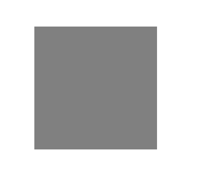
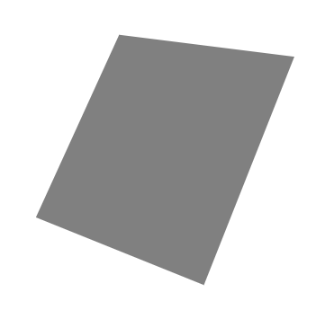
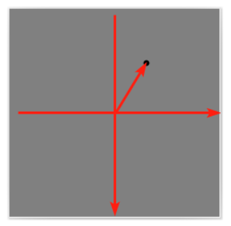
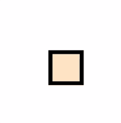
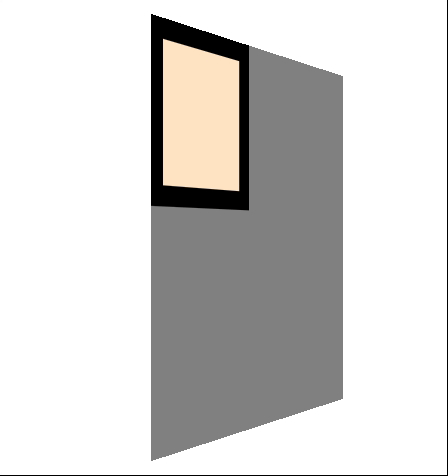
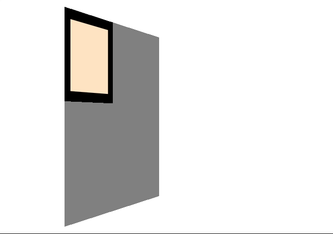
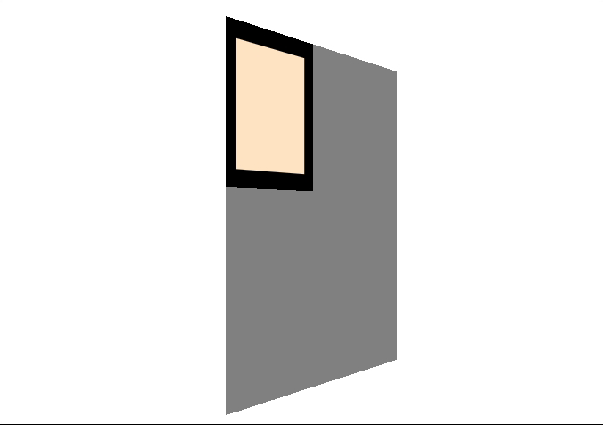
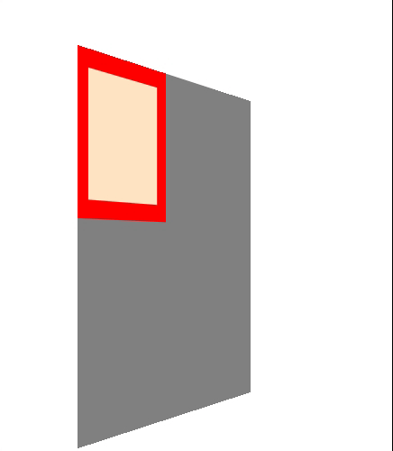
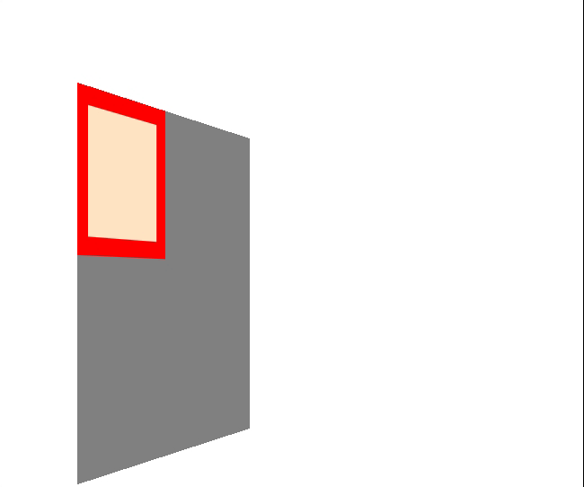
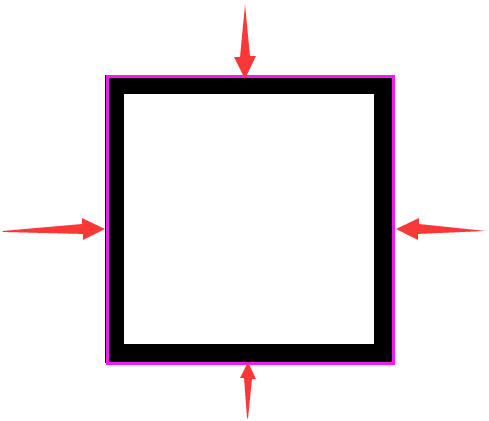

# 概述 P825 - P834

## 简要

变形在css中使用transform属性表示.

变形是一个非常有意思的 且 很有用的功能,它能以不同的方式改变对象的形态,而且不仅仅只限于二维. 

变形功能的出现让我们脱离了曾经只能让一个对象进行平移这种没有新意的做法,如:浮动元素到其他位置上,或者说利用负外边距技巧或者二者兼用,

而现在CSS提供了变形这一功能,不仅可以平移对象,还能使对象进行旋转,翻转,缩放,倾斜等. 而且不仅仅只限于二维方面,在三维方面也能利用变形功能做到.

**变形元素适用于 除拥有行内框(行内元素)之外的任何元素.**

- 首先要知道笛卡尔坐标系(x/y/z坐标系)以及球坐标系,并且知道在运算中的用法.
  
  对于CSS来所,笛卡尔坐标系中的**x轴的正方向是右边,负方向是左边**;
  
  **y轴的正方向是下边,负方向是右边**.
  
  PS:y轴的正反方向和初等代数中的y轴正反方向不同是因为:CSS中,y轴值越大,元素就会往下移. 你不妨想想**一个元素定位后,top值越大**是不是元素就往**下移,越小或者负值元素就往上移**. P827

- CSS变形中的**球坐标系是用来描述3D空间中的角度的**.
  
  即:对变形中的**2D旋转,其实都是在围绕z轴旋转**,而如果是3D旋转,则就需要绕x,y轴进行旋转,也就需要用到球坐标系了.
  
  **绕z轴,整个元素绕着屏幕的平面(z轴)旋转.**
  
  **绕x轴,上下翻转**,元素将偏向或远离我们.
  
  **绕y轴,左右两侧翻转**. P827 - 829

- CSS变形只有一个属性:transform,不过有几个辅助属性用于控制如何变形(稍后会将) P829

- transform的属性值有函数构成,2个及以上的函数需要**用空格分割**,这些函数控制对象如何变形,如:旋转,平移,倾斜,缩放等. P833
  
  且多个变形函数将依照**从左→右的顺序进行变形**,也就是说:同样的三个变形函数,它们所在的顺序会影响变形后的效果. P831
  
  但是有例外,如:先移动再缩放,或先缩放再移动,其结果是等效的,不过我们建议: **假定始终需要考虑顺序去写变形效果.** P832
  
  并且需要注意:如果transform属性值中,只要有一个函数值无效,则整个transform无效 P832
  
  transform属性具有六大函数值: (下方会详解)
  
  - **translate()**
    
    ​    translateX()
    
    ​    ranslateY()
    
    ​    translate3d()
  
  - **rotate()**
    
    ​    rotateX()
    
    ​    rotateY()
    
    ​    rotate3d()
  
  - **scale()**
    
    ​    scaleX()
    
    ​    scaleY
    
    ​    scale3d()
  
  - **matrix()**
    
    ​    matrix3d()
  
  - **skew()**
    
    ​    skewX()
    
    ​    skewY()
  
  - **perspective()**

- **变形的元素都有自己的堆叠上下文(类似于容纳块概念),且每个元素变形后与变形前它们在页面上所占的空间保持不变.** P830
  
  这个保持不变,指的是页面占用空间,而不是说元素大小不变.比如:a元素未变形前,有个b元素在它的下方,等a元素变形后(放大缩小),b元素所在的位置仍然保持不变. 
  
  参见以下例子,上面的是a元素,下面的是b元素,b元素并不会因为a元素缩小而移动位置.
  
  
  
  

- **变形元素都是相对于自身坐标系进行变形的**,而不是父元素或者页面或者视区等坐标系.
  
  如一个元素进行旋转后,它的x,y,z轴也都会进行旋转,此时你去平移它,它会按照它自身的坐标系去进行平移,而不是其他元素坐标系.
  
  P831

- 通常来说,**变形不会叠加,也就是说,多个transform属性,权重高的会覆盖权重低的**(通常是后者覆盖前者),即使前者存在后者不存在的属性,transform的值也仍然不会叠加 P832
  
  当然以上说的是通常情况,那么这就是说明,存在例外,即:**若变形是使用动画或过渡效果呈现的,则该transform属性值会和普通的transform属性相互叠加**.  P833
  
  如: 存在一个a元素,它已经实现了变形效果:顺时针渲染45deg,此时你使用一个:hover伪类(状态变化都可视作过渡),当鼠标移动到a元素就让它平移100px,那么此时,该元素就如同: 先旋转45deg,再平移100px,
  
  需要注意的是: **即使是动画变形(过渡和动画效果呈现),若当前transform中的某个函数和普通的transform中的某个函数相同,则前者会覆盖后者或后者覆盖前者(看权重),它们是不会叠加的.**
  
  如,还是以上那个例子: 当鼠标移动到元素a时顺时针旋转45deg,  那么此时这个45deg将覆盖a元素自身的45deg,也就是相当于a元素保持不变,即仍然是旋转45deg,而不是90deg. (亲测)
  
  至于**原因**,很简单,我们说的是**叠加变形,而不是又再一次完整的执行变形效果**,这两者还是有区别的.

# transform属性的六大函数值 P833

## translate() P834

translate()本身是一个简写属性.

**translate(a,b) 相当于 translteX(a) translteY(b).**

​    =>使元素沿着自身的x轴移动a距离后,再沿着自身的y轴移动b距离.

该元素可以只接受一个值作为参数,如:translte(a),这就相当于translate(a,0),原因是因为在不存在第二个参数时,该函数会假定该参数为0.

*注:translate3d()无法省略参数,否则整个语句无效,或者说:所有有关3d的函数,都无法省略参数.*

平移函数能控制一个元素沿着一个或多个轴(以自身坐标系)移动.

### translateX() 和 translateY() P834

这两个函数通常称之为"2D"平移函数,因为它们只能上下或左右移动元素,即在一个平面内移动元素,但是不能沿着前后(z轴)移动元素.

两个函数的取值:长度值 或 百分数,且可以为正数,负数,小数.

注意:最新版CSS规范,该两个2D函数的值可以不带单位,即如同px; 但是至2020-5-23,没有浏览器实现该规范.

#### translateX()

使元素以自身的x轴平移元素.

translateX(a): 使元素沿着自身的x轴移动a的距离

#### translateY()

使元素以自身的y轴平移元素.

translateY(b): 使元素沿着自身的y轴移动b的距离

### translateZ() P835

使元素以自身的z轴平移元素,取值:只能为长度.

该函数是一个三维平移函数,即让一个元素能在第三个维度移动元素(前后移动)

需要注意的是:要使该函数出现视觉效果,需要元素具有深度轴*(通过perspective()函数 或 perspective属性,请往下看)*,否则元素永远只能在平面移动)

### translate3d() P835 - P836

该函数是translateX,Y,Z()的缩写形式,能同时设定元素x,y,z轴的平移量.

取值为:长度值 或 百分数. 如: translate3d(200px,200px,200px)

该函数的参数无法省略,或者说所有有关3d的函数,都无法省略参数.

该函数意思很简单: translate3d(200px,200px,200px),即: 使元素向自身的x轴平移200px,再向y轴(自身的)平移200px,最后再向z轴(往前拉近)200px.

注意:和translateZ()一样的是,使该函数出现视觉效果,需要元素具有深度轴.

#### 注意

平移的3d函数不要和旋转的3d函数搞混,前者的值就是一个translteX,Y,Z()的混合值,和后者的值是向量的分量. ***详见: rotate() - rotate3d()***

## scale() P837

scale(a,b)本身是一个简写属性,相当于scaleX(a) scaleY(b),这和translate()类似.

缩放函数将一个元素放大或缩小,具体怎么做取决于提供的值.

取值: 无单位的实数, 且是以倍数的方式决定元素大小,如:scale(a,b),将元素的宽放大a倍,高放大b倍.

scale()函数允许只接受一个值,第2个值可以省略,一旦省略第2个值,则该值将和第1个值一样*(这和translate()不同,它省略第二个值,则默认为0)*

如:scale(a),将元素的整体(宽高)放大a倍

### scaleX() P837

使元素的宽度放大a倍.

取值:无单位实数.

### scaleY() P837

使元素的高度放大b倍..

取值:无单位实数.

### scale3d() P838

和translate3d()函数一样,该函数使元素可以沿着3个轴放大,即x,y,z轴.

如:scale3d(2,2,2), 使元素的宽,高放大2倍,并且深度放大2倍.

注意:该函数想要显示3d视觉效果的前提是元素必须具有深度,这点和translate3d,translateY,scaleZ,或者说和所有有关3d效果的函数一样.

## rotate() P838

rotate()函数并不是一个简写属性,它等效于 rotateZ(a),即:绕着z轴旋转
a deg/grad/turn/rad(单位).

取值: 有关旋转变形的函数取值都是一个数字+一个有效的角度单位(deg,grad,rad,turn P149)

旋转函数指示元素绕着哪个轴或向量(rotate3d)旋转,如果旋转的角度超出正常常规范围,则会被转为范围内的值: 437deg和77deg最终的显示效果是一样的,与-283deg效果一样.

注意:这仅仅是效果一样,实际上,如果以过渡或动画的形式显示这效果,则它们的旋转过程是不一样的,这可以类推到所有transform属性的变形函数 P838.

该函数实施的是2d旋转,和rotateZ()一样;rotateX,Y()和rotate3d()都是3d旋转.

**需要注意的是,默认情况下,元素的原点(x,y,z轴的交叉点)在元素的正中心.**

可以参见这个[例子](https://developer.mozilla.org/zh-CN/docs/Web/CSS/transform-function/rotate3d)

### [rotateX()](https://developer.mozilla.org/zh-CN/docs/Web/CSS/transform-function/rotate3d) P838 - P839

rotateX(adeg/grad/rad/turn)

使元素绕x轴顺时针旋转a角度,如果是负数则是逆时针旋转.

rotateX是3d旋转,因为你不妨想一下,一个矩阵绕着自身x轴进行旋转,是不是就是上下进行旋转,若以顺时针旋转的话,则元素上顶部会远离你,底部会接近你,逆时针则相反

### [rotateY()](https://developer.mozilla.org/zh-CN/docs/Web/CSS/transform-function/rotate3d) P838 - P839

rotateY(bdeg/grad/rad/turn)

使元素绕y轴顺时针旋转b角度,如果是负数则是逆时针旋转.

rotateY是3d旋转.因为你不妨想一下,一个矩阵绕着自身y轴进行旋转,是不是就是左右进行翻转那样旋转,若以顺时针旋转的话,则元素右边会接近你,左边会接近你,逆时针则相反

### rotateZ() P838 - P839

rotateZ(cdeg/grad/rad/turn)

使元素绕z轴顺时针旋转c角度,如果是负数则是逆时针旋转.

z轴:深度轴,从显示器射出来,直至你的眼睛的那个线,离你眼睛越近,则该值越大,反之越远(可以是负数)

绕z轴旋转,就是2d旋转,你可以自己试试用一只笔直直的穿入一张纸,然后纸绕着笔进行旋转,是不是在做平面旋转.

### [rotate3d()](https://developer.mozilla.org/zh-CN/docs/Web/CSS/transform-function/rotate3d) P839

取值:number ,number,number,angle (一个值都不能少)

该函数的参数是向量的分量,也就是说,我们需要将3个参数一起计算,看成一个三维(空间)向量,然后元素绕着这个三维向量进行旋转.

- 三维向量: 由找到x,y,z轴所描述的点,然后从原点连接该点,形成一个射线,就是三维向量了.
  
  你可以将该三维向量两端无限延长,然后元素就是绕这个三维向量进行旋转的.                                                                                                                                                                                    

rotate3d()是3d旋转,在进行判断用x,y,z轴的分量判断向量位置时,原点在元素的中心,然后画一个2维坐标,x轴右边的为正,y轴下边的为正*(P827,top越大,元素就越往下)*, 

而z轴,**需要你先将x,y轴形成的那个点确定后,根据z值的大小,判断该点是远离你还是接近你**.

这样,假设该点应该接近你,则得到接近的值是多少**,如果是1,则将以x,y轴确定的那个点往前(你的眼前)拉进1,然后停止,这样x,y,z轴形成的点就确定了,**最后将**该点和原点相连形成一个射线,然后元素就绕着这个射线旋转***(你可以想象该射线无限延长,方便你在脑海中旋转元素.)*

- z轴: 你可以想象有个垂直于你眼睛的直线,若z值越大,则离你眼睛越近,若z值越小,则离你眼睛越远.

用个例子更好说明.



使用=>transform: perspective(600px) rotate3d(1, -2, 1, 45deg);  

​    找到(1,-2)形成的点,然后将该点向你的我们拉近1(直线拉近),将原点和拉近1之后的点相连,最后元素绕该射线旋转.

最后得到该结果:



首先让我们来看看(1,-2)的坐标,就是那个黑点,而由于z轴不好在平面上体现,所以现在请你们想象一下,将黑点向前拉近1(向观察者),然后将原点链接拉近后的黑点,就形成了以下图片上的射线.



现在射线是朝向watcher倾斜的,右半部分将会靠近watcher,左半部分将会远离watcher,就和上面那张旋转结果一样.

即:先想象元素和这个倾斜的射线垂直,然后再如同2d旋转那样旋转45deg,就可以得到以上的渲染结果(你可以找张纸和笔试试,让纸张和倾斜的笔垂直,纸张在进行45deg旋转)

且注意:rotate3d(1,1,0,45deg)和rotateX(45deg) rotateY(45deg) 是有非常大的差别的,前者是绕着从元素左上至右下且经过原点的 直线旋转45度; 而后者是先绕x轴旋转45deg,再绕y旋转45deg

​    => 绕两个轴分别旋转和绕3d空间中的向量旋转是有差别的.

## matrix() P845 - P848

矩阵函数.存在6个以逗号分割的number参数,可以为正或负或小数,并且参数一个都不可省略.

matrix()函数可以覆盖其他所有**二维变形效果**,它描述元素变形后的最终状态,即该函数也会覆盖其余所有变形效果. P845

如果你熟悉或者需要使用矩阵函数,则完全可以且绝对应该使用,因为它节约性能并且非常精准.虽然也可以使用其他变形函数得到相当的结果,但是没有这么精准和节约性能.P846

### matrix3d() P846 - P848

和matrix()函数类似,不过matrix3d()函数覆盖的是所有3d变形效果,用来描述一个元素的3d变形状态.

取值为:16个以逗号分割的number,一个都不能少,可以为正或负或小数.具体计算方法: P846.

### 用matrix() 或matrix3d()与其他变形函数的不同

覆盖元素的最终状态指的是: 如果使用matrix() 或matrix3d()函数 变形过后的元素的最终显示效果 和使用1个或多个其他函数达到的最终显示效果 是一致的,

这也不会表明它们在变形的过程中是一致的,就好像旋转720deg和不旋转的最终显示效果一致,但是过程不一致,720deg会转2圈.

很显然,matrix() 或matrix3d()函数也类似这个道理,不过这矩阵函数之所以会造成不同的原因在于: **matrix() 或matrix3d()函数始终会取最短路径到达最终状态.P848**

假如: 一个元素使用旋转函数顺时针旋转200度,那么是真的会旋转200度,但是如果使用matrix()函数,则元素将逆时针旋转160度. 而这两种旋转后,元素达到的最终效果却是一致的.

## skew() P843

倾斜函数.

取值:angle

skew()并不是一个简写属性,即skew(45deg,20deg) 和 skewX(45deg) skewY(20deg)还是有区别的.

skew(a,b)通过矩阵元素[ax,ay]实施2d倾斜,而后者只是沿着x,y轴倾斜.

### skewX() P842

取值:angle

使元素沿着x轴倾斜x度

### skewY() P842

取值:angle

使元素沿着y轴倾斜x度

## perspective() P843 - P844

取值为:长度值

视域函数,该函数可以为元素赋予深度,即前后深度,让元素能在二维平面上展现出三维的视觉效果,

​    如果和transform-style属性*(将一个元素的所有子项绘制成一个3d对象,即让子项摆脱父元素的平面限制)*,

​    backface-visibility属性*(使一个元素背面可见/不可见)*配合,这可以使一个元素更加3d化.

该函数的值越小,就会得到极端的视角,就像在元素跟前通过鱼眼镜头看元素一样; 越大,得到的视角就越温和,就像从元素通过变焦镜头看元素一样. P843

1. <300px,则得到的效果越失真
2. \>200px,则得到的效果十分温和
3. 2000px< x<500px则产生适中的效果(适中的视域)

不妨这么理解: 值越大,则我们就如同在很远处观察一个事物,该事物怎么变化对我们来说,就像只变化了一点*(参见你在地下看飞机,飞机飞的很慢)*

值越小,则如同我们站在很近的地方看事物,事物稍微变化一点,对我们来说就变化的很大.*(参见:一叶障目,你把一个叶子盖着拿着你近一点,就可以挡住你大部分视野,如果你本身很远,将叶子拿同样的距离,你就只会被挡住一点视野)*

## 总结

- 所有有关3d的函数都无法省略参数

- 想要让元素显示出3d效果,前提是元素必须具有深度轴,如果想得到更好的3d效果,则元素还需要改变transform-style属性的值.

- 3d平移函数translate3d(xdeg,ydeg,zdeg)和3d缩放函数scale(x,y,z)都是比较简单和相像的,它们都是:
  
  先向x轴平移n度/宽度缩放n倍
  
  再向y轴平移n度/高度缩放n倍
  
  最后向z轴平移n度/深度缩放n倍.

- 3d旋转函数rotate3d相对于难点,它要计算3个轴形成的点,然后用原点连接该点,形成三维向量,然后元素绕着这三位向量旋转xdeg.
  
  rotate(x,y,z,deg)

- 矩阵函数能使用则使用,它相对于其他变形函数更节约性能和精准.

- 倾斜函数没什么好说的.

- perspective()函数可以改变当前元素的深度,能让一个元素有3d效果,不过我建议使用perspective属性***(详见:其他transform属性的辅助属性)***

# 其他transform属性的辅助属性

- 存在4个辅助transform的属性,分别是:transform-origin,transform-style, perspective,backface-visibility

## transform-origin

- transform-origin可以改变元素的原点,即默认来说,旋转一个元素,是绕着从中心点出发的坐标轴旋转,而不是元素的其他位置.

- transform-origin可以改变原点在元素中的位置,取值通常为**2-3个关键字**,取值为:
  
  **left** **right** **top** **bottom** **center**
  
  **百分数** **长度值**
  
  需要注意的是: 第一个值针对横向,第二个值针对纵向,可选的第三个值针对z轴上的长度,且**第三个值取值只能为长度值,不能使用英语关键字**.P849
  
  而第1和第2个值则都可以使用.

- transform-style的使用方式为: left bottom / left top / left 50% / 50% 50% / center / 100px 100px  / 100px 200px 50%等 P849
  
  百分数的计算方式为:相对于元素的尺寸(横向就是宽,纵向就是高)计算.P849
  
  意思为: 离元素左边的距离为a,离元素顶边的距离为b,离观察中的距离为c.
  
  注意: **这些值或关键字都是相对于一个元素的范围框计算的,即:边框的最外边那条线形成的边界**(亲测)
  
  如:transform-origin: left top; transform: rotate(360deg); 即使原点在左上角顶点,然后绕着z轴旋转一周得出的效果为:
  
  

- transfor-origin改变原点除了对旋转有影响以外,还对倾斜和缩放也有影响,如:原点在中心,缩放时,每一遍缩放的量相等,即沿中心缩放;如果原点在左上角,则元素将向那一角缩放;
  
  类似的,中心倾斜和相对左上角倾斜也是如此,虽然原点不论如何改变,缩放和倾斜最终的到的元素形状是一样的,但位置却不同.P850 -P851

- 只有平移效果不会受到原点改变的影响,因为平移是直接整个元素平移,而不是以原点平移.P850

## transform-style

- transform-style属性能将一个元素的**子项(亲测,只是子项,而不是孙子项等)**绘制成一个3D对象,让子项跃出父元素的平面.P853
  
  transform-style当前取值为:flat | preserve-3d.
  
  默认情况下transform-stylede值为flat,该值会使一个元素仅仅贴着它的父项,不管怎么变形该元素,得到的结果总是扁平的,即只能在父项的平面上变形. P852-P853
  
  ```html
  <style>
      #father {
          perspective: 600px;
          transform: 
              perspective(800px) rotateY(60deg);
          /** 将子项绘制一个3d对象 */
          transform-style:preserve-3d!important;
      }
      #son {
          transform-style: preserve-3d;
      }
      #son:hover {
          transition: 5s;
          transform: 
              translate3d(100px, 100px, 200px);
      }
  </style>
  <div id="father">
      <p id="son"></p>
  </div>
  ```
  
  以上示例省去不重要的属性,如元素的宽高,颜色,内外边距等,但是这并不影响我们讲解.
  
  首先先来看看,如果**不存在**该示例中的 `transform-style:preserve-3d!important;` 的到的渲染结果:
  
  
  
  **如果设置了transform-style:perserve-3d**; 则p子元素将会被绘制成一个3d对象,跃出父元素的平面,以下是渲染效果 P854:
  
  

- 值得注意的是: **有些属性会覆盖transform-style设定的变形方式**,从而导致父元素的子项将不是一个3d对象了,其中**原因是因为**:那些属性的某些之要求**元素及其子元素必须以扁平的方式呈现才起作用**.P854/

- 为了避免其他元素的值覆盖transform-style属性的效果,**将以下属性设置为给出的值**,参见:P854.
  
  如果在编辑CSS的过程中,你发现你设置了transform-style:perserve-3d后,子项仍然是扁平的,根源可能就在上述列表中的某个属性上.P854

## perspective属性

- perspective()函数可以修改视域,同时也存在perspective属性也能修改视域,也就是它们两个都可以为元素添加深度P855,从而让它们存在一个立体的空间中.

- perspective()和perspective属性 要与transform-style区分开来,
  
  前面两个是让元素存在一个3d空间中, 
  
  而后者则是让元素成为其直接父元素的一个3d对象; 
  
  **如果这个3d对象不存在一个3d空间中,那么该元素仍然是会以平面的方式进行变形.**
  
  如果**只将以上的transform-style的示例中的 #father{ perspective: 600px;} 该属性删除,**则效果为:
  
  

- 除了修改视域的函数和属性与transform-style有区别之外,perspective()和perspective属性之间也有区别.P855

- **perspective属性是让一个元素的所有子元素共用一个深度(视域)**,P855
  
  **perspective()函数则只是让当前使用它的元素具有深度**,该深度(视域)是独立于其他元素的.如:transform: perspective(500px) ; 只有使用当前transform属性的元素菜会具有深度,其他元素则依然不存在.

- perspective()函数的显示效果和perspective属性的显示效果也是不同的P856.
  
  总的来说,使用perspective属性是比较好的,是正确的,与预期一致.P857

- 需要注意的是:由于perspective属性是用于其所有子项*(不只是子项,而不是孙子项等)*,这和transfor-style属性一样,
  
  所以如果你在设定perspective属性时忘记使用transform-style属性将子项绘制成3d对象,则深度轴的效果将无法有3d效果,
  
  你只会感觉子元素具有深度,但是却仍然在父元素的平面上进行移动(**由于有深度但却不是3d对象,就会呈现一种类似于放大/缩小的感觉**)
  
  P857
  
  以下是元素具有深度,但不是一个3d对象,即没有使用transform-style:perserve-3d;
  
  
  
  现在我们使用transform-style:perserve-3d;看看其效果:
  
  
  
  **通过以上的渲染结果,我们很容易就能明白,一个元素若只具有深度,但却不是一个3d对象,则它的变形效果仍然是扁平的,而不是立体的.**
  
  所以在使用perspective属性是一个元素的子项(只是子项,而不是孙子项等)具有深度时,请同时使用transform-style属性让一个元素的子项成为3d对象,反过来也是一样的.
  
  P857

## perspective-origin

顾名思义,改变视域原点,这和transform-origin有这异曲同工之妙,transform-origin改变的原点是让元素的坐标系从哪个地方为基础延伸,也就是让元素围绕哪个点变形.

而perspective-origin定义的是视线汇聚于哪一点,即当元素一直往某个地方延伸时,它的消失点的位置. P858

取值为: 和transform-origin的取值一样.

# 有关变形的函数和属性的值的百分数计算

## 范围框 P830

首先要了解什么是是范围框才能知道如何计算变形中的百分数.

范围框就是边框的外界,即在一个盒模型中,除了元素的外边距和轮廓之外的边界.



即粉色线条就是范围框了,而它包裹的趋于,称之为范围区域,很明显的:**范围框就是一个元素边框的最外面那个线组成的框.**

## 计算 P830

如果你是用一个百分数在变形函数的参数或属性值中,则该百分数相对于范围框计算.

如果是以表格形式显示的元素,则范围框是表格的容器库那个,包括表格框和相应的表题框.

如果使用CSS(的变形)改变可缩放矢量图形(SVG)的形态,则范围框是SVG图形定义的对象范围框.

# 处理背面 P859

## 简要

以前我们从来没想过可以看到一个元素的背面是什么样子,那如果可以看到元素的背面,那是什么样呢? 

现在3d变形就可以做到让一个元素存在背面并且背面是否可见.

这种情况使用backface-visibility属性决定. P859

取值:visible | hidden

backface-visibility属性作用非常简单,只是决定当元素的背面朝向我们时是否渲染背面,仅此而已.

## 示例

例如: 你在一个图片的背后记录图片的信息,然后只有鼠标移动过去时,元素会翻转,然后信息才会显现,这样是不是很有趣? P860 - P861

它的实现非常简单: 首先有一个容器,如\<section>,然后在里面存在\和\<span>, 用img来显示图片,用span来描述图片信息.

这样看似乎没什么大不了的,是的,所以我们需要做一些特殊的操作.

现在需要将span元素先左右翻转180度,让span元素以背面朝向我们,并使用backface-visibility:hidden; 让span元素的背面不做渲染,即对用户不可见.

再设置当鼠标移动到容器上时,整个容器左右翻转180°,这样img和span元素都会被同时翻转180度,这样span元素就翻转了回来成为 正面,对用户可见,而span元素翻转到了背面(可以设置透明点),

这样总体的效果就好像是: span元素写在了图片的背面.

以下示例会省略不必要的属性:

```html
<style>
    /* 容器 */
    section {position: relative;}

    /* 用来作为背面的一层,覆盖图片,然后使这层透明0.5,这样图片就会显得透明 */
    div {
        position: absolute;
        background: rgba(255, 255, 255, 0.6);
        backface-visibility: hidden;
        /** 照片信息左右翻转180度到背面 */
        transform: rotateY(180deg);
    }
    /* 文字信息 */
    span {position: absolute;}

    /* 图片 */
    img {
        position: absolute;
        /** 图片背面可见 */
        backface-visibility: visible;
    }
    section:hover {
        transition: 2s;
        perspective: 200px;
        /** 必要属性,使子项是一个3d对象,否则元素不存在背面 */
        transform-style: preserve-3d;
        transform: rotateY(180deg);
    }
</style>

<section>
    
    <div class="info">
        <span>这张照片的信息...</span>
    </div>
</section>
```


## 注意点

通过以上示例,这表明backface-visibility属性并没有你想象的那么简单,这并不是说backface-visibility属性本身有多么复杂,而是如果忘记使用transform-style:perserve-3d;的话,这个backface-visibility属性就根本看不到效果,

P860

这原因详见: ***其他transform属性的辅助属性 - transform-style.***

简明地说: transform-style属性的默认值设置为flat,即默认情况下,元素不论怎么变形都是扁平的,即只有一个面,也只能再平面上变形移动.

只有将transform-style属性的值设置为:perserve-3d,那么设置该值的元素下的直接子元素都将被绘制成3d对象,这使得一个元素立体了起来,具有正面和背面,并且不会仅仅在一个平面上变形.

同时,如果父元素具有perspective属性或子元素变形时正确使用了perspective()函数,则所有直接子元素 / 当前元素 将具有深度,即可以向前向后变形,让元素更加3d化.

# 小结

CSS变形功能使元素能在二维和三维控件改变元素的形态,这位设计师提供了新的呈现信息的方式.

使用丰富的2d变形可以实现引人注目的效果,利用3d变形还能创建交互式界面,变形功能为设计开辟了一片新天地.

需要注意的是:有些属性之间有依赖关系,这对刚接触CSS 变形的创作人元素来说可能有些陌生,但是用的多了也会习惯的.
