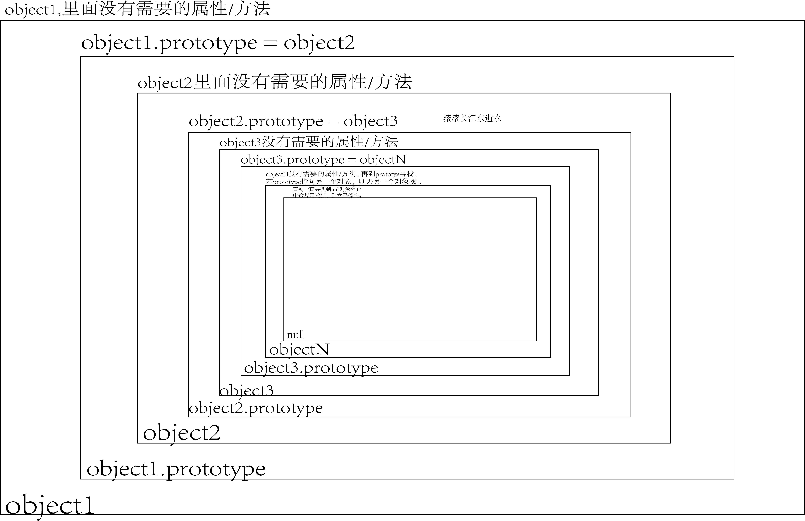

# 原型对象

## 概念

一个对象 A 通过 `prototype` 或 `__proto__`（字面量对象） 指向一个新对象 B，则 B 就称之为原型对象。

原型对象上的属性/方法是被指向它的对象所共享的，所以，我们可以通过此特性，产生一个概念：原型链。即：

```js
function Func() {}
Func.prototype = {
    name:'yomua',
    __proto__: {
        getName(){
            return this.name
        }
    } 
}


const func = new Func()

// getName 中的 this 指的就是 func 
func.getName() // yomua
```

- [new 运算符的行为](https://developer.mozilla.org/zh-CN/docs/Web/JavaScript/Reference/Operators/new#%E6%8F%8F%E8%BF%B0) 

- `func.getName() // yomua`
  我们通过 `func` 访问到 `Func.prototype` 的原型对象: `__proto__:{getName: ƒ()}`;

  由于 `this` 的[行为](https://developer.mozilla.org/zh-CN/docs/Web/JavaScript/Reference/Operators/this#%E5%87%BD%E6%95%B0%E4%B8%8A%E4%B8%8B%E6%96%87), 所以当通过 `func` 调用 `getName` 时, 此时 `getName` 中的 `this` 指的就是 `func`, 故返回 `yomua`

JS 中，每个对象都继承另一个对象，后者就是被称为原型对象.

- 只有null，它没有自己的原型对象,其他都有。

  ```js
  const obj = {}
  obj.__proto__ === Object.getPrototypeOf(obj) // true
  Object.getPrototypeOf(obj) === Object.prototype // true
  ```

## 构造函数的 `prototype`

通过构造函数生成实例对象时，会自动为实例对象分配原型对象。

可以参见：[new 运算符的行为](https://developer.mozilla.org/zh-CN/docs/Web/JavaScript/Reference/Operators/new#%E6%8F%8F%E8%BF%B0)。

> 1. 创建一个空的简单 JavaScript 对象（即 **`{}`**）；
> 2. 为步骤 1 新创建的对象添加属性 **`__proto__`**，将该属性链接至构造函数的原型对象；
> 3. 将步骤 1 新创建的对象作为 **`this`** 的上下文；
> 4. 如果该函数没有返回对象，则返回 **`this`**（就相当于返回这个创建的对象）。

```js
function Func(){}
Func.prototype.getName = () => 'yomua'
const func = new Func() // func 此时就是被 new 创建的对象
func.__proto__ === Func.prototype // true
```

## 字面量对象的 `__proto__` 

```js
const obj = {}
obj.__proto__ === Object.prototype // true

// 重新赋值 obj.__proto__
obj.__proto__ = { getName(){ return 'yomua'} } 
obj.__proto__ // { getName: ƒ }
obj.getName() // yomua
```

可以通过: [Object.getPrototypeOf](https://developer.mozilla.org/zh-CN/docs/Web/JavaScript/Reference/Global_Objects/Object/getPrototypeOf) 或 [Object.setPrototypeOf](https://developer.mozilla.org/zh-CN/docs/Web/JavaScript/Reference/Global_Objects/Object/setPrototypeOf) 来设置对象的原型对象或得到对象的原型对象。

- 注意：不论是通过 `obj.__proto__` 或 `Object.setPrototypeOf` 动态设置原型对象，都是会对[性能有所损耗](https://developer.mozilla.org/zh-CN/docs/Web/JavaScript/Reference/Global_Objects/Object/setPrototypeOf)。
  所以，如果不是非常必要，请在创建字面量对象的时候就使用 `__proto__` 属性设置原型对象，或通过 `Object.create` 设置。

  ```js
  const obj = {
  	__proto__: { getName() { return: 'yomua'} }
  }
  obj.getName() // yomua
  ```

参见下面的章节：字面量的隐式构造函数。

参考：

- [`Object.prototype.__proto__`](https://developer.mozilla.org/zh-CN/docs/Web/JavaScript/Reference/Global_Objects/Object/proto) 
- [对象初始化器 - 原型 setter](https://developer.mozilla.org/zh-CN/docs/Web/JavaScript/Reference/Operators/Object_initializer#%E5%8E%9F%E5%9E%8B_setter) 

## 不要混淆 `prototype` 和 `__proto__`

- `prototype`  指：在给定函数被用作**构造函数**时，分配给其***实例***的 `[[Prototype]]`，即：原型对象

- `__proto__` 构造函数中是没有这个属性的，它通常存在于字面量语法的对象中，比如：

  ```js
  const object = { a: 1 };
  const array = [1, 2, 3];
  const regexp = /abc/;
  ```

  以上三者都有 `__proto__` 属性

或许你注意到实际上 `Object.__proto__` 或 `Array.__proto__` 或 `Map.__proto_` 以及其他任意的内置的，能被 new 的构造函数除了 `prototype` 属性之外，都有 `__proto__` 属性，并且它们都是互相严格全等的，比如：

```js
Map.__proto__ === Object.__proto__ // true
RegExp.__proto__ === Object.__proto__ // true
Map.__proto__ === RegExp.__proto__ // true 
...
```

`2023年8月28日`: 

但是，我没有找到相关文档（类似这样的 `Object.__proto__` 文档），只找到：[`Object.prototype.__proto__`](https://developer.mozilla.org/zh-CN/docs/Web/JavaScript/Reference/Global_Objects/Object/proto)，并且连这个也被弃用了，所以我们这里暂时不做考究，或许未来可以再看看。

`2024年1月9日`: 

好消息是: 通过 [ChatGpt](https://chat.openai.com/), 得到了一个看上去是有道理的答案, 即:

这些内置的构造函数 (可以被 new) 都属于函数对象, 它们都指向 `Function.prototype` 或者说 `Function.__proto__`, 因为它们的原型是相等的:

```js
Map.__proto__ === Function.__proto__ // true
Map.__proto__ === Function.prototype // true
```

所以它们自然会全部相当 (都指向相同的 `Function.__proto__`)

## [字面量的隐式构造函数](https://developer.mozilla.org/zh-CN/docs/Web/JavaScript/Inheritance_and_the_prototype_chain#%E5%AD%97%E9%9D%A2%E9%87%8F%E7%9A%84%E9%9A%90%E5%BC%8F%E6%9E%84%E9%80%A0%E5%87%BD%E6%95%B0)  

JavaScript 中的一些字面量语法会创建隐式设置 `[[Prototype]]` 的实例，即：隐式创建原型对象。比如：

```js
// 对象字面量（没有 `__proto__` 键）自动将
// `Object.prototype` 作为它们的 `[[Prototype]]`
const object = { a: 1 };
Object.getPrototypeOf(object) === Object.prototype; // true

// 数组字面量自动将 `Array.prototype` 作为它们的 `[[Prototype]]`
const array = [1, 2, 3];
Object.getPrototypeOf(array) === Array.prototype; // true

// 正则表达式字面量自动将 `RegExp.prototype` 作为它们的 `[[Prototype]]`
const regexp = /abc/;
Object.getPrototypeOf(regexp) === RegExp.prototype; // true

```

我们可以将它们“解糖（de-sugar）”为构造函数形式。

```js
const array = new Array(1, 2, 3);
const regexp = new RegExp("abc");
```

这种字面量的隐式构造函数，给我们来来了诸多好处。比如：类似于 [`map()`](https://developer.mozilla.org/zh-CN/docs/Web/JavaScript/Reference/Global_Objects/Array/map) 这样的“数组方法”只是在 `Array.prototype` 上定义了，

而我们创建字面量数组时，`map` 又自动在所有数组实例上可用，就是因为这个原因。

## `__proto__` 和 `prototype` 是有所联系的

```js
function User() {}
User.prototype.getUser = () => "yomua";

const user = new User();
user.getUser() // yomua

user.__proto__ === User.ptototype // true
```

当我们通过 `user` 实例访问 `getUser` 时，我们知道，由于 `User 构造函数`本身没有 `getUser` 这个方法，所以程序会尝试去 `User 的原型对象`上寻找 `getUser`（User.prototype），

而实例 `user` 是没有 `prototype` 的，它是怎么得到` getUser` 的呢？

这是因为 [new 运算符执行过程](https://developer.mozilla.org/zh-CN/docs/Web/JavaScript/Reference/Operators/new#%E6%8F%8F%E8%BF%B0)的原因 —— new 运算符会创建一个空的字面量对象，并且设置它的 `__proto__` 为构造函数的原型对象（这里是 `User.prototype`），然后将它作为 this，最后返回此 this，

所以，我们得到的 `user 实例`就是此 this，那么理所当然 `user.__proto__ === User.prototype` 。

最后，当 `user.getUser()` 时，程序执行时发现 `user` 这个实例上面（this 上面）没有挂载 `getUser`，于是会去原型链上(`__proto__` 指向的原型对象） 寻找，

而寻找 `__proto__` 原型对象上的属性/方法实则就是寻找 `User.ptototype` 的原型对象的属性/方法。

 所以 `user.getUser` 就会调用 `User.prototype.getUser`，得到 `yomua`

# 原型链

## 原型链形象化解释

原型对象就像一个公共仓库，`prototype` 或 `__proto__` 这两个属性是这个公共仓库的一把主钥匙，对象引用（实例/对象名字）是一个个队员，

每个队员都会被主钥匙分发一把副钥匙，此副钥匙每把都能打开公共仓库，并使用仓库里的东西，而仓库里的东西是BOSS通过 ，`prototype` 或 `__proto__` 存入的。

只有 BOSS 用主钥匙才能往里面存入东西.

- 原型对象：公共仓库
- `prototype` 或 `__proto__`  ： 主钥匙
- 对象引用： 队员，会被分一把副钥匙    
- 构造函数或字面量对象：BOSS    

***BOSS往公共仓库里放入东西***

​    构造函数使用 prototype 指针指向被创建的一个指针变量 method，往这个指针变量 method 指向原型对象的内存空间中,存放一个函数，而字面量对象通过 `__proto__`

```js
// 构造函数
function A(){
    ...
};
A.prototype.method = function() {};
// 字面量对象
const obj = {__proto__: { method(){} } }
```

***队员使用副钥匙打开公共仓库并使用里面的内容***

对象引用 用 prototype 指针指向的函数指针 method, 然后用它来使用原型对象里的内容,即用`对象引用.函数指针`就可以访问你存放在原型对象的内存地址空间中的内容。

字面量对象则是直接访问即可。

```js
// 构造函数
let a = new A();
a.method();

// 字面量对象
obj.method()
/*
    所有对象引用都共享其原型链上的属性/方法.
    即构造函数A的所有实例,都能使用通过 prototype 属性创造的属性/方法，而 obj 则是能访问通过 __proto__ 指向的原型对象产生的原型链上，其所共享的所有属性/方法
*/
```

> 而不能直接使用`构造函数A.method()`的原因：
>
> 开发者通常无法直接操作内存空间(构造函数就是指的是整个内存空间,包括地址)，只能操作变量,
>
> 所以要使用一个指针指向其内存地址,然后通过操作指针的方式访问地址中的数据。
>
> 而且原因其二有程序根本不会执行function A (){...}这段代码,所以根本不会知道有这个构造函数A,
>
> 当然 `A.method();`也没有啦（method 函数存在于 A.prototype 指向的 Prototype 原型对象中，而 A 本身没有 method 函数，所以无法使用 A.method() 访问 method 函数）,没有的东西怎么执行?
>
> ​        若想详情了解,请看:<JavaScript高级.md>

## 图形表示法



# Reference

- 详情了解<JavaScript高级.md>和<h5_css_js.doc>→prototype（这个可能没有本章讲得好）

- 更多的示例请看<h5_css_js.doc>→定义类/对象→原型方式（这个可能没有本章讲得好）
- [MDN - 继承与原型链](https://developer.mozilla.org/zh-CN/docs/Web/JavaScript/Inheritance_and_the_prototype_chain) 
- [`Object.prototype.__proto__`](https://developer.mozilla.org/zh-CN/docs/Web/JavaScript/Reference/Global_Objects/Object/proto) 
- [对象初始化器 - 原型 setter](https://developer.mozilla.org/zh-CN/docs/Web/JavaScript/Reference/Operators/Object_initializer#%E5%8E%9F%E5%9E%8B_setter) 

