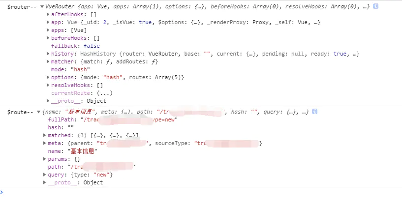

## 容易混淆的概念

### [attribute 和 property 的区别](https://juejin.im/post/6844903712721387534)

attribute：始终会保持html 代码中的初始值。

property：它的值可能是变化的。

```html
<!-- 在页面加载后，我们在这个input中输入 "Jack" -->
<input id="the-input" type="typo" value="Name:" />  

<script>
    // attribute still remains the original value
    input.getAttribute('id') // the-input
    input.getAttribute('type') // typo
    input.getAttribute('value') // Name:

    // property is a different story
    input.id // the-input
    input.type //  text
    input.value // Jack
</script>
```

可以看到, 在 attribute 中, 值仍然是 html 代码中的值. 而在 property 中, type 被自动修正为了 **text**, 而 value 随着用户改变 input 的输入, 也变更为了 **Jack**

### 内联语句处理器和非内联语句处理器

内联语句处理器：加括号的事件处理函数，

非内联语句处理器：不加括号的事件处理函数

参见：H:\ProgramWay\ProgramWorkplace\Software\HBuilderX\Vue学习\Vue入门\事件处理	使用括号和不适用括号调用事件处理函数的区别.html

内联语句处理函数：向对应的事件处理函数传递 `$event` 参数，那么对应的事件处理函数对应的接收参数上，就会接收这个 `$event` 参数，就相当于 Event 对象

注：在非内联语句处理函数中，Vue 会自动帮我们传入 Event 对象作为非内联语句处理函数的第一个参数。

#### 示例

```html
<p @click="showMe"></p>
<p @click="sayHello('yomua',$event)" :style="style"></p>

<script>
     let vm = new Vue({
            el: '#view',
            methods: {
                showMe(event) {
					// <p></p>
                    console.log(event.target); 
                },
                sayHello(name,e) {
                    // yomua: 你好!
                    console.log(`${name}: 你好!`) ; 
                     // 我是Event对象: [object MouseEvent]
                    console.log(`我是Event对象: ${e}`);
                }
            },
        })
</script>
```


### props 属性

#### 约定

本身根组件：\<y-y> 就是本身根组件

```html
<y-y></y-y>
```

template 中的根组件（根元素）：\<div> 就是template 中的根组件

```js
Vue.compoent('y-y',{
	template:`
				<div>
					....
				</div>
			`
})
```


#### 作用

props 是接收来自父组件的数据（data{} / data()）给子组件使用，并且需要在子组件上的根元素（非 template 中的根元素，而是 HTML 中的）上绑定来自于 props 属性对象中的属性，

否则无法在子组件的选项对象的 template 中的根元素中使用 props 属性对象中的属性。

注：以下的  :id="id"  和 :title="title"  等，可以使用不同的变量，如：kidID="id"，这样仍然是同样的效果，只需要将 props 中的 id 改为 kidID 即可，***详见：Vue 入门 - 修饰符 - .sync***

```html
<div id="view">
	<y-y 
         :id="id" 
         :title="title" 
         :customPropertyName="customPropertyName" 
         static="static">
	</y-y>
</div>

<script>
    /** 
    	全局注册已存在的自定义组件 y-y
    	注：当前自定义元素(组件)全局注册的行为必须在包含它的直接父元素的实例化(new Vue())之前发生,
    */
    Vue.component('y-y', {
        props: {
            title: String,
            id: {
                type: String,
                required: true
            },
            dd: String,
            static: String,

        },
        template: `
                <div>
                    <p>
                        {{id}} 
                        {{title}} 
                        {{dd}} 
                        {{static}}
    				</p>
                </div>
            `
    })
    let vm = new Vue({
        el: '#view',
        data: {
            id: 'yhw',
            title: 'props 的使用',
            customPropertyName: 'customPropertyName'
            static:"<y-y> 组件接收不到该数据，因为 <y-y> 本身根组件中没有动态绑定该数据，如：v-bing:static='static'"
        },
    })
</script>
```

对于以上的示例来说：

`:id="id"`，其中 `"id"` 指的是 \<y-y> 选项配置对象 props 中的属性 id。

`static="static"`，静态数据，由于并非：v-bing="static"，所以无法接收来自父组件的 data 属性对象中的同名属性。

以上两个单独来讲，就可以覆盖知识点了。

总的来说：如果要在一个子组件的选项配置中的 template 的根元素中（\<div>）使用 props 中接收的来自于父组件的 data{} / data() 的数据，则需要在子组件本身根组件（\<y-y>）中动态绑定 props 中的属性，绑定哪个属性，就可以在 template 的根元素中使用哪个属性。


### 路由

参见：

- [Vue router](https://router.vuejs.org/zh/)
- [Vue.js - 路由](https://cn.vuejs.org/v2/guide/routing.html)

通过一个根组件：App.vue，在 App.vue 中，使用 \<router-link> 替代 \<a>，使用其中的 to 属性，规定一个路径名，如：`\` or `\router\router-name`；然后在路由配置文件中（如：router\index.js），将路径名和组件进行关联，即：当点击 \<router-link> 时，将会跳转到对应的组件中。

注：在路由配置文件中，我们可以在一个【路径对应组件】中，去设置子组件（依然是一个路径名对应一个组件名），即：假设有个路径名为：`\router`，它的子组件可能名为：`\router\sonRouter`，又或者 `\rouer\sonRouter\sonSon`

### data-v-*

​    这是在标记vue文件中css时使用scoped标记产生的，因为要保证各文件中的css不相互影响，给每个component都做了唯一的标记，所以每引入一个component就会出现一个新的'data-v-xxx'标记

## [Vue 实例的生命周期钩子](https://cn.vuejs.org/v2/guide/instance.html#%E5%AE%9E%E4%BE%8B%E7%94%9F%E5%91%BD%E5%91%A8%E6%9C%9F%E9%92%A9%E5%AD%90)

每个 Vue 实例（new Vue()）在被创建时都要经过一系列的初始化过程——例如：需要设置数据监听、编译模板、将实例挂载到 DOM 并在数据变化时更新 DOM 等。

同时在这个过程（生命周期）中也会运行一些叫做**生命周期钩子**函数，这给了用户在不同阶段添加自己的代码的机会。

- 生命周期和生命周期钩子函数，***参见：<UseCustomElements.md>***


（Vue生命周期钩子函数图示）

#### 实例

 [`created`](https://cn.vuejs.org/v2/api/#created) 钩子可以用来在一个实例被创建之后执行代码：

```js
new Vue({
  data: {
    a: 1
  },
  created: function () {
    // `this` 指向 vm 实例
    console.log('a is: ' + this.a)
  }
})
// => "a is: 1"
```

当然了，也还有其他一些生命周期钩子函数会在不同 Vue 实例的阶段被调用，如: [`mounted`](https://cn.vuejs.org/v2/api/#mounted)、[`updated`](https://cn.vuejs.org/v2/api/#updated) 和 [`destroyed`](https://cn.vuejs.org/v2/api/#destroyed)，***参见：[Vue 实例的生命周期钩子](https://cn.vuejs.org/v2/guide/instance.html#%E5%AE%9E%E4%BE%8B%E7%94%9F%E5%91%BD%E5%91%A8%E6%9C%9F%E9%92%A9%E5%AD%90)***

注：生命周期钩子的 `this` 上下文指向调用它的 Vue 实例，即：在一个 Vue 构造函数的选项对象配置中的 this，通常都指向该构造函数的实例。

## [mustache 语法](https://cn.vuejs.org/v2/guide/syntax.html)

mustache 语法就是使用 `双大括号 + 变量` 的语法，如：`{{xxx}}`，它最常用于数据绑定，其中双大括号中括起来的变量，通常是 `Vue 实例的 data 对象中的属性`名 或 `computed 计算属性的返回值。`

```html
<span>Message: {{ msg }}</span>
```

需要注意的是：mustache 语法无法使用在 HTML Attribute 中，如:

```html
<!-- 错误的写法 -->
<span id="{{ msg }}"></span>

<!-- 正确的写法 -->
<span v-bind="msg"></span>
```

我们可以在 mustache 语法中使用简单的 JS 表达式，如：调用方法,三目运算符,加减乘除等；但不应该在模板表达式中试图访问用户定义的全局变量，也无法使用声明语句，循环，if语句

```html
<div id="view">
    <p>{{habbits.handler? 'Right': 'Wrong'}}</p>
</div>
<script type="text/javascript">
    let vm = new Vue({
        el: 'div',
        data: {
            name: 'yomua',
            habbits: {
                love: 'yhw',
                eat: 'no know',
                how: 'so-so',
                handler: true,

            },

        }
    })
</script>
```

- 会在页面显示： Right

## [Vue 实例](https://cn.vuejs.org/v2/guide/instance.html)

### [创建 Vue 实例](https://cn.vuejs.org/v2/guide/instance.html#%E5%88%9B%E5%BB%BA%E4%B8%80%E4%B8%AA-Vue-%E5%AE%9E%E4%BE%8B)

对于任何一个 Vue 项目/应用来说，它们都是通过 Vue() 构造函数创建一个新的 Vue 实例开始的。

```js
// vm：view model，参见：<MVC和MVVM和MVP架构.md>
let vm = new Vue({
	// 一些配置
})
```

有趣的是，使用 Vue.js 创建的 Vue 项目并没有严格遵循 MVVM 这种架构模式，但是 Vue 的设计是受到 MVVM 架构模式的启发的，因此在文档中经常会使用 `vm` (ViewModel 的缩写) 这个变量名表示 Vue 实例。

当你通过 Vue() 构造函数创建一个 Vue 实例时，你可以向 Vue() 构造函数中传递一个对象（选项对象），这个选项对象是整个 Vue 应用的核心，该选项对象如同 为 Vue() 构造函数进行一些配置，使得它的“行为”更加丰富。作为参考，你可以在 [Vue API 文档](https://cn.vuejs.org/v2/api/#选项-数据)中浏览完整的选项列表。

在这里，我先介绍一些最为常见的（Vue() 构造函数的选项对象的）核心的属性：

- [el](https://cn.vuejs.org/v2/api/#el)

  提供一个在页面上已存在的 DOM 元素作为 Vue 实例的挂载目标，可以是 CSS 选择器，也可以是一个 HTMLElement 实例。

  类似作用属性***参见：[render](https://cn.vuejs.org/v2/api/#render) 及 [渲染函数 & JSX](https://cn.vuejs.org/v2/guide/render-function.html)***

- [data——*参见：[深入响应式原理](https://cn.vuejs.org/v2/guide/reactivity.html)*](https://cn.vuejs.org/v2/api/#data)

  其类型为：Object | Function；

  它是 Vue 实例的数据对象，data 对象中的属性可以在使用 el 属性挂载的元素中使用，通过 mustache 语法，即：{{xxx}}

- [computed](https://cn.vuejs.org/v2/api/#computed)——*参见：[computed](https://cn.vuejs.org/v2/guide/computed.html)*

  计算属性，它通常是一个对象，它里面通常是一个属性函数；computed 属性是用来进行业务逻辑的计算，它里面的属性函数返回值可以在对应的挂载元素上通过 mustache（{{xxx}}）语法使用。

- [methods](https://cn.vuejs.org/v2/api/#methods)——*参见：[事件处理器](https://cn.vuejs.org/v2/guide/events.html)*

  methods 通常是一个对象，用来存放事件处理程序（函数），它将被混入到 Vue 实例中。

  我们可以直接通过 VM 实例访问这些方法，或者在 HTML 内置元素中这样使用：v-on:click="clickMe" OR @click="clickMe"；

  methods 对象的属性方法中的 `this` 自动绑定为 Vue 实例，如果其属性函数是箭头函数，则 this 指向 undefined.

- [template](https://cn.vuejs.org/v2/api/#template)

  模板元素，类型为 String，通常使用 `` 这个符号（ES6 中的模板语法）来在 template 属性中拼接 HTML 元素

  ***参见：[通过插槽分发内容](https://cn.vuejs.org/v2/guide/components.html#通过插槽分发内容)*** | \<template slot.md>

- 其他更多属性***参见：Vue API***

#### [data 对象与 $方法](https://cn.vuejs.org/v2/guide/instance.html#%E6%95%B0%E6%8D%AE%E4%B8%8E%E6%96%B9%E6%B3%95)

当一个 Vue 实例被创建时，它将 Vue() 构造函数中配置的 `data` 对象中的所有的 property 加入到 Vue 的**响应式系统**中。

当这些 property 的值发生改变时，视图对应 data 中的 property 将会产生“响应”，即匹配更新为新的值。

也就是说：将一个 HTML 元素挂载到一个 Vue 实例后，data 对象中的属性将可以在挂载到了 HTML 元素中通过 mustache 语法使用，如：

```html
<div id="view">
    {{name}} // 输出：yomua
</div>
<script>
    let vm = new Vue({
    el:"#view",
    // vm.name === {{name}} === 'yomua'
    data:{
        name:'yomua'
    }
})
</script>

```

以上示例的 data.name 一旦被改变，则对应 #view 元素中的 {{name}} 也会随之改变。

值得注意的是：只有当实例被创建时就已经存在于 `data` 中的 property 才是**响应式**的。也就是说如果你添加一个新的 property，比如：vm.b = 'hi'，那么对 `b` 的改动将不会触发任何视图的更新。

但是很好解决这个问题，假如你知道你会在晚些时候需要一个 property，但是一开始它为空或不存在，那么你仅需要设置一些初始值。如：

```js
data: {
  newTodoText: '',
  visitCount: 0,
  hideCompletedTodos: false,
  todos: [],
  error: null
}
```

注：使用 `Object.freeze(obj)`，会把对象(obj)冻结在某个时刻,使之不再参与"政治"；在Vue中,最直观的反应就是阻止了值传递，即：阻止了 ViewModel 绑定View，使得数据不再影响。如:

```html
<div id="view">
	{{foo}}
	<button v-on:click="foo = 'bbb'">Change it</button>
</div>

<script type="text/javascript">
        let obj = {
            foo: 'bar',
        }
        
        Object.freeze(obj)
	
    	// 这里省略了 let vm，因为用不到，所以不写也行。
        new Vue({
            el: '#view',
            data: obj
        })
</script>
```

- **Object.freeze(obj)**

  没有这段代码时，单击 button，将会使得 obj.foo = 'bbb'，#view 中也会随之改变；

  但是存在这句代码，单击 button，#view 并不会更新，只有 data.foo 会改变。

除了数据 data 对象的 property，Vue 实例还暴露了一些有用的实例 property 与方法。它们都有前缀 `$`，以便与用户定义的 property 区分开来。例如：

```html
<main id="main">
    <p>{{name}}</p>
</main>
<script type="text/javascript">
    let model = {name: 'yomua'};
    let vm = new Vue({
        el: 'main',
        data: model
    });
    /**
     * 以 _ 或 $ 开头的属性 不会被 Vue 实例代理，
     * 因为它们可能和 Vue 内置的属性、API 方法冲突。
     * 你可以使用例如 vm.$data._property 的方式访问这些属性。
     */
    console.log(vm.$data === model); // true
    console.log(vm.$el === document.querySelector('main')); // true
    console.log(vm.$el.id); // main
</script>
```

更多***参见： [API 参考](https://cn.vuejs.org/v2/api/#实例-property)***

## 组件基础

### [组件中的 data()](https://cn.vuejs.org/v2/guide/components.html#data-%E5%BF%85%E9%A1%BB%E6%98%AF%E4%B8%80%E4%B8%AA%E5%87%BD%E6%95%B0) 和 [Vue 构造函数中的 data 对象](https://cn.vuejs.org/v2/guide/instance.html#%E6%95%B0%E6%8D%AE%E4%B8%8E%E6%96%B9%E6%B3%95)

- *参见：[API - Vue  Data](https://cn.vuejs.org/v2/api/#data)*

data() 注册子组件时使用，必须为一个函数，参见： [data 必须是一个函数](https://cn.vuejs.org/v2/guide/components.html#data-%E5%BF%85%E9%A1%BB%E6%98%AF%E4%B8%80%E4%B8%AA%E5%87%BD%E6%95%B0)。

当你使用如 Vue.component() 这样的一个函数去注册一个组件时，该组件所对应的选项配置对象中的 data 属性必须为一个 Functional。

这样做的目的是：使得每一个组件都可以维护一份独立的被返回对象的拷贝；如若 Vue.js 没有这份规则，则在相同根实例下的不同子组件，可能会互相影响到各自的选项配置对象中的 data 属性绑定的值，如：

```html
<div id="view">
    <button-counter></button-counter>
    <button-counter></button-counter>
    <button-counter></button-counter>
</div>
<script type="text/javascript">
        Vue.component('button-counter', {
            data: function() {
                return {
                    count: 0    
                }
            },
            template: '
            	<button v-on:click="count++">
            		You clicked me {{ count }} times.
    			</button>
                      '
        })
        new Vue({
            el: '#view'
        })
</script>
```

- [Vue.component( id, definition)](https://cn.vuejs.org/v2/api/#Vue-component)

如若以上的 data 是一个对象，则每次单击不同按钮， {{count}} 都会共享。参见：[data 必须是一个函数](https://cn.vuejs.org/v2/guide/components.html#data-%E5%BF%85%E9%A1%BB%E6%98%AF%E4%B8%80%E4%B8%AA%E5%87%BD%E6%95%B0)

而之所以为每个组件选项配置对象使用 data()  就能使的它们都有独立的 data 属性，是因为函数具有作用域，每一个函数运行完毕，垃圾回收机制就会执行，消除函数中的无用声明。


data{} 根组件使用，必须为一个对象

## [路由](https://router.vuejs.org/zh/)

### [编程式导航](https://router.vuejs.org/zh/guide/essentials/navigation.html#%E7%BC%96%E7%A8%8B%E5%BC%8F%E7%9A%84%E5%AF%BC%E8%88%AA)

除了使用 `<router-link>` 创建 a 标签来定义导航链接，我们还可以借助 router 的实例方法，通过编写代码来实现。

### [router.push(location, onComplete?, onAbort?)](https://router.vuejs.org/zh/guide/essentials/navigation.html#router-push-location-oncomplete-onabort)

**注意：在 Vue 实例内部，你可以通过 `$router` 访问路由实例。因此你可以调用 `this.$router.push`。**

## 有关$属性

$variableName：Vue 实例自身暴露的 property（属性）和 method（方法），加 $ 前缀是为了与用户定义的 property 区分开来。如：

```js
var data = { a: 1 }
var vm = new Vue({
  el: '#example',
  data: data
})

{{data}} === data
vm.$data === data // => true
vm.$el === document.getElementById('example') // => true

// $watch 是一个实例方法
vm.$watch('a', function (newValue, oldValue) {
  // 这个回调将在 `vm.a` 改变后调用
})
```

以后你可以在 [API 参考](https://cn.vuejs.org/v2/api/#实例-property)中查阅到完整的实例 property 和方法的列表。

### [vue-router](https://router.vuejs.org/zh/)

通过在 Vue 根实例的 `router` 配置传入 router 实例，下面这些属性成员会被注入到每个子组件。

- [**this.$router**](https://router.vuejs.org/zh/guide/#javascript) ——router 实例[属性](https://router.vuejs.org/zh/api/#router-%E5%AE%9E%E4%BE%8B%E5%B1%9E%E6%80%A7)和[方法](https://router.vuejs.org/zh/api/#router-%E5%AE%9E%E4%BE%8B%E6%96%B9%E6%B3%95)

  当前整个 VueRouter 的实例

  注意：在 Vue 实例内部，你可以通过 `$router` 访问路由实例，因此你可以这样使用它： `this.$router.push`

- [**this.$route**](https://router.vuejs.org/zh/api/#%E8%B7%AF%E7%94%B1%E5%AF%B9%E8%B1%A1)

  当前激活的[路由信息对象](https://router.vuejs.org/zh/api/#路由对象)。这个属性是只读的，里面的属性是 immutable (不可变) 的，不过你可以 watch (监测变化) 它。

以上二者的区别为：

[this.$router](https://router.vuejs.org/zh/guide/#javascript)：为整个 VueRouter 的实例，用来操作路由，里面含有很多属性和子对象，例如history对象；可以使用这种方式进行链接跳转：this.$router.push，和 router-link 跳转一样。

[this.$route](https://router.vuejs.org/zh/api/#%E8%B7%AF%E7%94%B1%E5%AF%B9%E8%B1%A1)：则是表示当前正在跳转的路由对象，该对象是只读对象，里面可以获取name、path、query、params等



（$router 和 $route）

## 修饰符

### [.sync](https://cn.vuejs.org/v2/guide/components-custom-events.html#sync-%E4%BF%AE%E9%A5%B0%E7%AC%A6)

目的：实现子组件中的 prop 和对应的父组件的 data{} / data() 中的值双向绑定。

通常，我们使用 v-model 对一个元素的值进行和父组件中 data 的值相互绑定，但是这种方法一次只能绑定一个 prop，无法绑定多个。

若需要绑定多个，则我们需要监听器，即：当子组件的 prop 发生改变时，触发对应的监听器并将改变的值传给这个监听器，然后让这监听器把父组件 data 中对应的值用新值覆盖，这样一来，我们就实现了双向绑定，参见：

```html
<body>
    <div id="view">
        #view 中：{{parentnumber}}
        <child 
       :childnumber="parentnumber" 
       v-on:update:childnumber="parentnumber = $event" />
    </div>
</body>
<script>
    Vue.component('child', {
        props: [
            // 接收父组件（#view）的 parentnumber 的值
            "childnumber",
        ],
        template:
            `
                <div class="child">
                    <p>
						子组件的 template 属性中：
						{{childnumber}}
    				</p>

                    <button @click=
"$emit('update:childnumber', childnumber + 1 )"> 
                        数字 + 1
                    </button>
                </div>
            `,
    })
    new Vue({
        el: '#view',
        data: {parentnumber: 0},

    })
</script>
```

- 当点击 \<button> 时，会触发当前实例上的 【update:childnumber】 事件并传递参数【 childnumber + 1】

- 此时，由于 \<chilid> 根组件（非 template 属性中的根元素）中由于存在 `v-on:update:childnumber="parentnumber = $event"` ，所以触发 【update:childnumber】 事件，就会触发事件处理器：`"parentnumber = $event"`

  注：$event 是一个对象

- 在该事件处理器中，会使得实参 【childnumber + 1】计算后的值赋值给 parentnumber 变量，从而使得父组件的值和子组件的 prop 属性： childnumber 进行双向绑定

但是这种方法是很麻烦的，所以 Vue 给我们带来了一种简易化的使用，即：在子组件的根组件（非 template 属性中的根元素）上：我们为需要和父组件的的值相互绑定的值使用 `.sync` 修饰符即可，如：

```html
<child :childnumber.sync="parentnumber" />
```

这样，和使用 v-on 监听 【updata:childnumber】 事件并传递参数
【 childnumber + 1】是一样的效果，只不过 .sync 封装了这个步骤而已。

但请注意：在子组件的选项配置对象的 template 的根元素中，你仍然需要使用 `$emit('update:childnumber', childnumber + 1 )` 这种方式去触发 `update:prop属性名` 事件，然后使用表达式（【 childnumber + 1 】）作为参数，去修改 prop 的值，从而使得对应的父组件的 data 值也发生改变。

- [知乎](https://zhuanlan.zhihu.com/p/100017093)
- [CSDN](https://blog.csdn.net/q850593913/article/details/106326925)

## [单独运行 vue 文件](https://cli.vuejs.org/zh/guide/prototyping.html#vue-serve)

场景：想单独运行某个Vue文件，不依赖src,类似运行单独的HTML文件

1.安装 vue serve 

2.运行 npm install -g @vue/cli-service-global

3.安装完成之后cd到需要单独运行的Vue目录下，执行 vue serve XXX 或 vue serve 'xxxx xx'

## [渲染函数 render](https://cn.vuejs.org/v2/guide/render-function.html)-[API render](https://cn.vuejs.org/v2/api/#render)

Vue 构造函数的选项中的 render 函数若存在，

* 则 Vue 构造函数不会从 template 选项或通过 el 选项指定的挂载元素中提取出的 HTML 模板编译渲染函数。

render 属性函数可接收一个由 Vue.js 内置的名为：createElement 的参数，同时使用 render 属性函数并接受参数 createElement 时，则 render 属性函数需要返回 createElement 参数，即：return createElement(...)

- createElement 参数是一个 VNode，它是一个对象

- [createElement 参数函数接收的参数](https://cn.vuejs.org/v2/guide/render-function.html#createElement-参数)
- [createElement() 参数函数返回的值](https://cn.vuejs.org/v2/guide/render-function.html#%E8%99%9A%E6%8B%9F-DOM)

注意：VNode 必须唯一，即：组件树中的所有 VNode 必须是唯一的。下面这样的渲染函数是不合理的:

```js
render: function (createElement) {
  var myParagraphVNode = createElement('p', 'hi')
  return createElement('div', [
    // 错误 - 重复的 子级 VNode
    myParagraphVNode, myParagraphVNode
  ])
}
```

但是如果你真的需要重复很多次的元素/组件，你可以使用工厂函数来实现。例如，下面这渲染函数用完全合法的方式渲染了 20 个相同的段落：

```js
render: function (createElement) {
  return createElement('div',
    Array.apply(null, { length: 20 }).map(function () {
      return createElement('p', 'hi')
    })
  )
}
```

## 没看的

- [使用 JavaScript 代替模板功能](https://cn.vuejs.org/v2/guide/render-function.html#%E4%BD%BF%E7%94%A8-JavaScript-%E4%BB%A3%E6%9B%BF%E6%A8%A1%E6%9D%BF%E5%8A%9F%E8%83%BD)一小节没看
- [JSX语法](https://cn.vuejs.org/v2/guide/render-function.html#JSX) -- JS语法扩展
- [工具](https://cn.vuejs.org/v2/guide/single-file-components.html) 都没怎么看

# Reference

- [Vue.js](https://cn.vuejs.org/v2/guide/components-registration.html) 讲解

  [Vue.js API](https://cn.vuejs.org/v2/api/index.html)

- [Vue Router](https://router.vuejs.org/zh/guide/) 讲解

  [Vue Router API](https://router.vuejs.org/zh/api/#v-slot-api-3-1-0-%E6%96%B0%E5%A2%9E)

- [Vue CLI](https://cli.vuejs.org/zh/guide/) 讲解

- [Vue CLI](https://cli.vuejs.org/zh/config/) 配置选项

- [Vuex](https://vuex.vuejs.org/zh/) 讲解

- [Vue Loader](https://vue-loader.vuejs.org/zh/#vue-loader-%E6%98%AF%E4%BB%80%E4%B9%88%EF%BC%9F) 讲解

  Vue Loader 之[单文件组件规范](https://vue-loader.vuejs.org/zh/spec.html#vue-%E5%8D%95%E6%96%87%E4%BB%B6%E7%BB%84%E4%BB%B6-sfc-%E8%A7%84%E8%8C%83)

- [Vue 的风格指南](https://cn.vuejs.org/v2/style-guide/) 


- [Vue2 入门指南](https://cn.vuejs.org/v2/guide)

- [What is the Vue.js？](https://cn.vuejs.org/v2/guide/index.html#Vue-js-%E6%98%AF%E4%BB%80%E4%B9%88)
