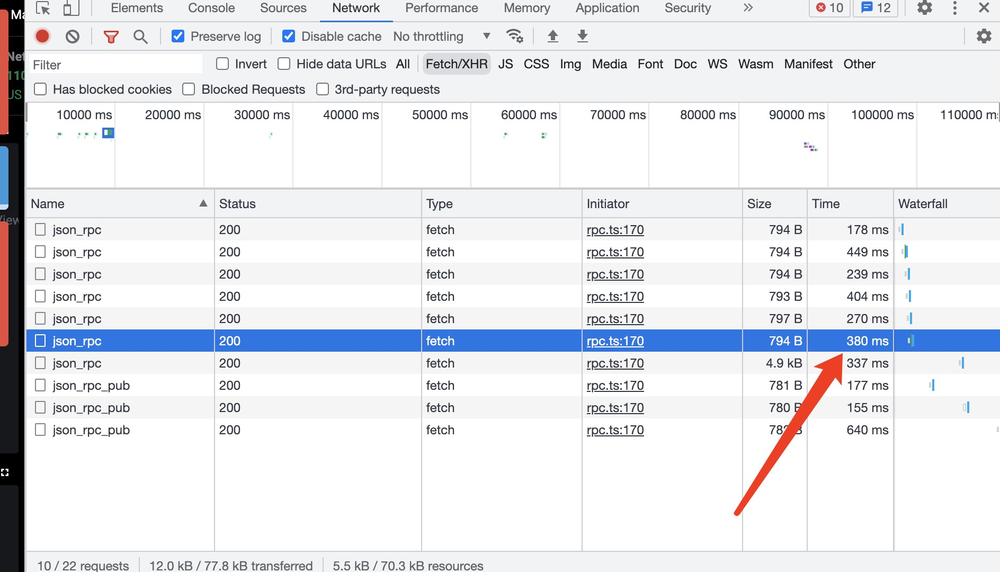
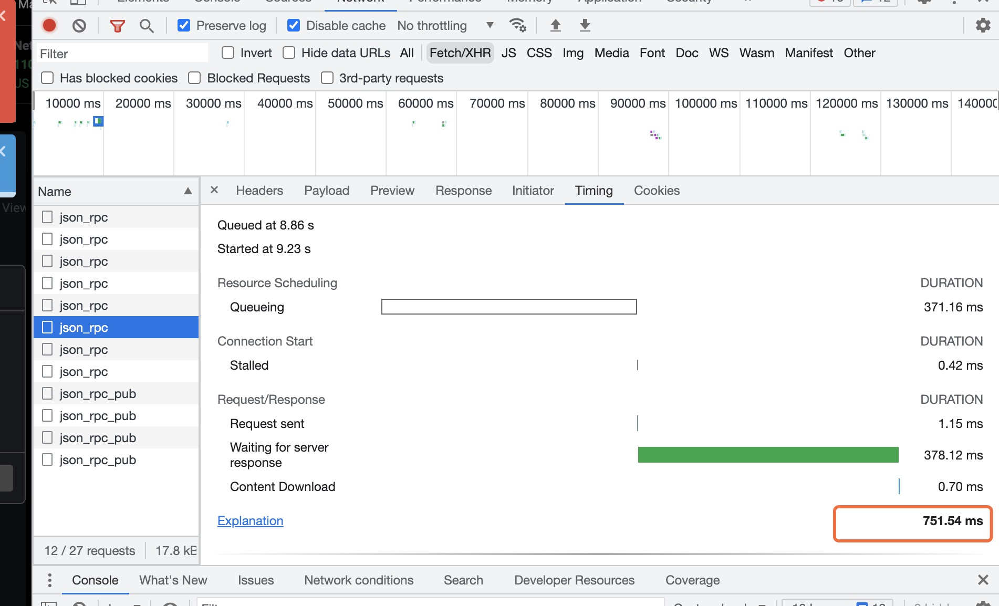

# [概念](https://developer.chrome.com/docs/devtools/network/reference?utm_source=devtools&hl=zh-cn#timing-explanation) 

我有以下的 Timing:

1. Queued at 648.38ms - 进入队列时间
2. Started at 1.15s - 开始时间
3. Resource Scheduling - 资源调度
   - Queuing 500.29ms - 正在排队
4. Connection Start - 开始连接
   - Stalled 8.52ms - 已停止
5. Request/Response
   - Request sent 0.11ms - 已发送请求
   - Waiting for server response 3000ms - 正在等待服务器响应
   - Content Download 500ms - 下载内容

请问，这些都什么意思？它们的流程是什么

ChatGPT

根据您提供的 Timing 信息，以下是对每个阶段的解释和流程的简要说明：

1. `Queued at 648.38ms` 
   这表示资源请求进入排队阶段的时间点。在这个时间点之前，资源请求已经创建并准备发送，但需要等待其他请求完成或等待网络资源的可用性。

2. `Started at 1.15s` 
   这表示资源请求开始实际的网络传输的时间点。在这个时间点之前，请求已经完成排队并开始与服务器进行通信，传输数据。

3. `Resource Scheduling` 

   - Queuing 500.29ms：这表示资源请求在资源调度中的排队时间。在这个时间段内，请求需要等待分配所需的资源。这可能是由于其他正在使用该资源或资源分配器决定推迟分配资源。

4. `Connection Start` 

   - Stalled 8.52ms：这表示在建立连接时发生了停顿的时间。
     可能由于网络问题或其他原因导致连接建立过程中的延迟。

5. `Request/Response` 

   这是整个请求-响应周期的总时间，即从发送请求到接收到完整响应的总时间。

   - Request sent（请求发送时间）
     表示从请求开始发送到请求头和请求体都已发送完成的时间。
     这个阶段包括了浏览器发起请求的时间，以及请求数据传输到服务器的时间。

   - Waiting for server response（等待服务器响应时间）

     表示从请求发送完成到接收服务器的第一个字节的时间。
     在这个阶段，浏览器等待服务器处理请求并返回响应的时间。
     如果这个时间很长，可能是服务器处理请求的时间较长，或者存在网络延迟。

   - Content Download（内容下载时间）

     表示从接收到服务器的第一个字节到接收到整个响应主体的时间。
     这个阶段包括了接收响应头和响应体的时间。如果响应体很大，下载时间可能会相对较长。

这些 Timing 数据提供了关于资源请求在不同阶段的时间信息。流程如下：

1. 资源请求进入排队队列等待发送，并在 Queued 阶段停留了约 648.38 毫秒。
2. 当请求进入 Started 阶段时，实际的网络传输开始，并持续进行数据交换。
3. 在 Resource Scheduling 阶段，请求在资源调度中继续排队等待分配所需的资源，持续了约 500.29 毫秒。
4. 在 Connection Start 阶段，可能发生了短暂的停顿（stalled）时间，持续了约 8.52 毫秒。
5. 在 Requst/Response 阶段, 请求 0.11ms 就全部发送给了服务器, 但是接收到服务器响应的第一个字节需要 3000ms, 而接受完服务器响应的内容则需要 500ms.

这些阶段和时间信息可以帮助开发者分析和优化资源请求的性能，识别潜在的延迟或瓶颈，并改进系统的响应速度和资源利用率。请注意，具体的流程和含义可能会因上下文和具体应用而有所不同。

# Queuing

https://stackoverflow.com/questions/34043505/chrome-devtools-what-does-queueing-means-in-the-timing-tab

# 总时间才是真正的请求花费时间，而不是 time

​								（time）

​								（总时间）