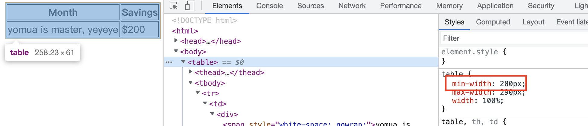
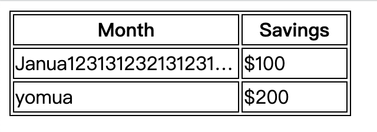
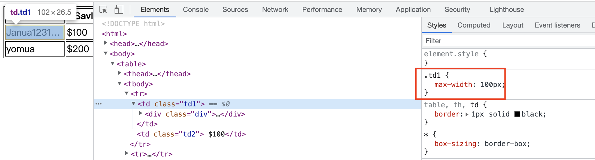
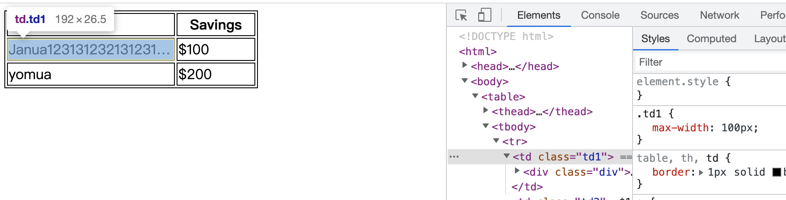

# table 特点

1. 为 \<table /> 设置 `min-width`  后，若某列某个单元格**内容太多且不允许换行**撑大了其宽度，导致每列宽度相加 > min-width，则 min-width 此时将为 \<table /> 每列宽度相加，而非设置的 min-width.
   
   `max-width` 道理也是如此，若因内容多导致每列宽度相加 > max-width，则实际宽度以每列宽度相加为准。
   
   
   
   yomua 单元格设置了 white-space:nowrap，否则将会换行保证 table 的 min-width 指定的值。

2. \<table /> 每列的最大宽度取决于最宽的那个单元格的宽度，其余单元格会被撑大到此宽度。
   
   NOTICE：表头 \<thead /> 也包含在此。
   
   

3. 单独为任意一个单元格 \<td /> 设置 `width`  时，存在两种情况：
   
   - 表格现在的宽度若 > 设置的 widh + 其余每列宽度，则设置的 width 将精确显示。
   - 表格现在的宽度若 < 设置的 widh + 其余每列宽度，则设置的 width 会缩小，缩小到此单元格内容所允许的最小宽度。
   
   <video src='video/单独单元格设置width.mov'></video>
   
   Janua 单元格设置 `width:350px`，默认状态下 width 宽度就是 350px，但是我们能明显发现，当可视区域缩小时，Janua 单元格的宽度也在缩小，小于 350px.        

4. \<td /> 标签只能设置最小宽度，而不能是设置最大宽度，且最小宽度需要使用：`max-width` 属性设置，这很奇怪，但是在实际实现时，效果就是这么表现的，如下所示：
   
   
   
   ​                                            (最小宽度为100，已无法继续缩小，这里102是因为此 td 有边框)
   
   
   
   ​                                        （很明显，192px 已经 > max-width:100px）

# table 动态列宽和固定列宽

## 示例

<video src='video/example.mov'></video>

- 当可视区域宽度变小时，Month 列随着变小且具有最小值，Savings 列不变
- 当可视区域宽度变大时，Month 列随着变大且具有最大值，Savings 列不变

## 代码

```html
<html>
<head>
  <style>
    * { box-sizing: border-box; }
    table,th,td {border: 1px solid black;}
    table {
      table-layout: auto;
      min-width: 190px;
      max-width: 290px;
      width: 100%;
    }
    .td1 {max-width: 100px;}
    .td2 {width: 90px;}
    .janual {
      text-overflow: ellipsis;
      overflow: hidden;
      white-space: nowrap;
    }
  </style>
</head>

<body>
  <table>

    <thead>
      <tr>
        <th>Month</th>
        <th>Savings</th>
      </tr>
    </thead>

    <tbody>
      <tr>
        <td class="td1">
          <div class="janual"><span>Janua12313123213123123213ry</span></div>
        </td>
        <td class="td2"> $100</td>
      </tr>
    </tbody>

  </table>
</body>

</html>
```

## 思路

1. 让 table 随着最外层（这里是可视区域）变大变小，即设置 `width:100%`

2. 为了达到第一列动态宽度，需要为第一列的每个单元格设置最小宽度 `max-width: 100px` 和超出隐藏（防止表格缩小时，动态列的宽度跟着缩小导致内容覆盖第二列及以后的内容）。
   
   若不为每个单元格都设置最小宽度，那么表格随着可视区域变小时，第一列的最小宽度将取决于此列内容区宽度最大的那个单元格：
   
   <video src='video/动态列宽需要为此列每个单元格都设置最小宽度max_width.mov' width='300px'/>
   
   Janua 单元格设置的 `max-width: 100px`; yomua 单元格则没有设置。
   
   我们能明显发现，Janua 单元格无法缩小到最小宽度: 100px，这是因为 yomua 单元格的内容区宽度 > 100px

3. 将除第一列的其余列宽设置为固定宽度：`width:90px`
   
   这样我们就能得出，表格的最小宽度为：100 + 90 = 190px，所以设置表格 min-width: 190px.

若按照以上步骤做，就能做到动态列宽+固定列宽，若还有更多需求：

- 设置列与列之间的边距：td 里面 div 设置 max-width:90, td 设置 max-width:100
  
  即：内容限定 90 大小，但是 td 的最小宽度却为 100，这样多出的 10 等于边距。

- 限制列的最大宽度：td 里面 div 设置 max-width
  
  内容设置最大宽度（再不允许换行），td 不限制最小宽度，这样 td 的宽度放大时，就强制被限制和内容一样的宽度，列宽又是以当前列中最大宽度的单元格决定，所以很轻松的就能限制列的最大宽度。
  
  内容可能会超出 td 宽度而溢出，但是我们能超出省略号或隐藏。
