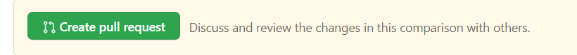
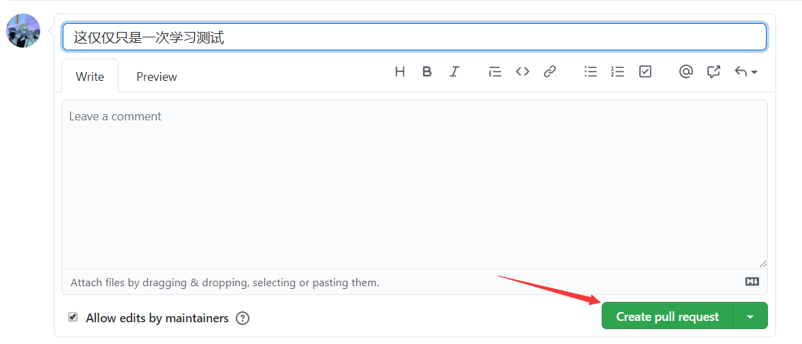
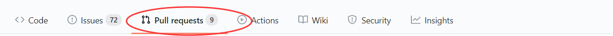
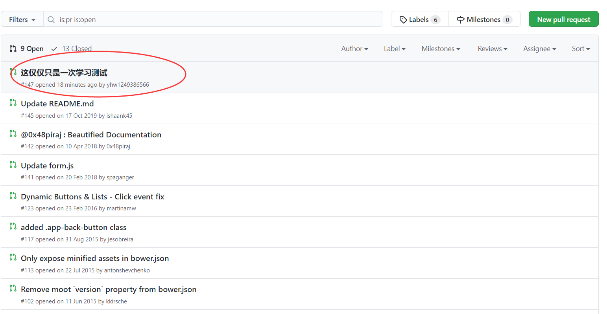

# 术语

[fork](https://git-scm.com/book/zh/v2/GitHub-%E5%AF%B9%E9%A1%B9%E7%9B%AE%E5%81%9A%E5%87%BA%E8%B4%A1%E7%8C%AE)：在以前，“fork”是一个贬义词，指的是某个人使开源项目向不同的方向发展，或者创建一个竞争项目，使得原项目的贡献者分裂。 在 GitHub，“fork”指的是你自己的空间中（为其它项目）创建的项目副本，这个副本允许你以一种更开放的方式对其进行修改。

[pull request](https://www.zhihu.com/question/21682976)：拉取请求。相当于向 fork 的项目的拥有者发起请求，请求的目的是将你 fork 下来后，做了修改的项目，让项目的拥有者看见，如果项目的拥有者觉得你的修改是合格的，则项目的拥有者可以将你所对该项目做的修改应用到源项目中，若不合格，自然就不会理你了，而项目的拥有者这么做的前提是，你有 pull request，否则项目的拥有者无法发现你对 fork 下来的项目所做的修改。

[star](https://www.zhihu.com/question/20406847)：收藏。以前只有 watch，但是 Github 的管理人员发现很多人只把 watch 当作收藏来使用，所以增加了 star。

[watch](https://www.zhihu.com/question/20406847)：关注，即：关注这个项目。

# [GitHub](https://github.com/) - [账户的创建和配置](https://git-scm.com/book/zh/v2/GitHub-%E8%B4%A6%E6%88%B7%E7%9A%84%E5%88%9B%E5%BB%BA%E5%92%8C%E9%85%8D%E7%BD%AE)


# [Github](https://github.com/) - 向别人的仓库提交/更正内容

在 Github 中：当你想更正别人的仓库里的错误时，要走一个流程：

1. 先 fork 别人的仓库，相当于拷贝一份，相信我，不会有人直接让你改修原仓库的

   

   （fork 所在位置）

2. `git clone` 命令将你 fork 的仓库克隆到本地（或[手动添加远程仓库](https://git-scm.com/book/zh/v2/Git-%E5%9F%BA%E7%A1%80-%E8%BF%9C%E7%A8%8B%E4%BB%93%E5%BA%93%E7%9A%84%E4%BD%BF%E7%94%A8#_%E6%B7%BB%E5%8A%A0%E8%BF%9C%E7%A8%8B%E4%BB%93%E5%BA%93)）

   ```bash
   $ git clone https://github.com/yhw1249386566/app
   
   Cloning into 'app'...
   remote: Enumerating objects: 2769, done.
   remote: Total 2769 (delta 0), reused 0 (delta 0), pack-reused 2769
   Receiving objects: 100% (2769/2769), 2.48 MiB | 5.00 KiB/s, done.
   Resolving deltas: 100% (1639/1639), done.
   ```

3. 对克隆到本地的仓库进行一些修改和提交，并将你的提交使用类如 `git push <远程仓库简写名> <branchname>` 这样的命令推送到远程你克隆的 fork 的远程仓库上。

   ```bash
   $ cd 切换到你克隆的本地仓库的目录
   $ vim README.md
   # 暂存并提交修改过的文件
   $ git commit -a -m "仅学习测试"
   # 将 master 分支推送到远程仓库 origin 上
   $ git push origin master
   Enumerating objects: 5, done.
   Counting objects: 100% (5/5), done.
   Delta compression using up to 8 threads
   Compressing objects: 100% (3/3), done.
   Writing objects: 100% (3/3), 371 bytes | 123.00 KiB/s, done.
   Total 3 (delta 2), reused 0 (delta 0), pack-reused 0
   remote: Resolving deltas: 100% (2/2), completed with 2 local objects.
   To https://github.com/yhw1249386566/app
      2f048ba..c823210  master -> master
   ```

4. 找到你在 Github 中 fork 的项目，然后点进去，找到下图中的地方。

   Compare：点击该按钮，Github 会让你知道你更改了什么内容到该项目中。

   Pull request：点击此按钮，会进入另一个界面，详情继续往下看。

   

   （pull request 所在位置）

5. Pull request：点击此按钮后，会进入另一个界面，该界面存在一个如下图的按钮

   

   当点击上图中的按钮时，Github 会让你填一些信息，用来作为通知源仓库作者的信息，如下图：

   

   （点击 create pull request 后出现的需要填写的注释信息）

   你可以在 Leave a comment 中书写一些注释，而其中 “这仅仅只是依次学习测试” 这是标题。

   当你觉得一切 ok 的时候，点击 Create pull request 按钮，那么你本次对 fork 下来的仓库的修改就会通知给源作者，当源作者觉得你做的 ok，那么就会使用你的修改，否则就不会。

   而你的修改你也可以查看，即：点击你 fork 下来的项目，找到如下图的位置：

   

   （查看对 fork 下来的仓库的修改（推送））

   下图，则是当你点击上图的 Pull requests 后出现的内容，很明显的，通过下图，我们可以发现：我们的修改已经暴露给了源作者。

   

   （查看对 fork 下来的仓库的修改 成功）


pull request 后，也可以对这次的 pull request 的内容进行重新修改，既可以在原本分支上重新修改后再次提交，也可以创建新分支，然后再提交；只不过需要注意的是，这样子的修改，会留下历史记录，就好像你在 Git 中，提交两次产生的历史提交一样。

且同时也能对 pull request 时，创建的标题和注释（留言）进行修改

# [Github](https://github.com/) - 一些页面的作用

[对 Github 中项目做出贡献](https://git-scm.com/book/zh/v2/GitHub-%E5%AF%B9%E9%A1%B9%E7%9B%AE%E5%81%9A%E5%87%BA%E8%B4%A1%E7%8C%AE)：你可以参考 *Github 中向别人的仓库提交/更改内容* 一小节。

[Your repositories](https://git-scm.com/book/zh/v2/GitHub-%E7%BB%B4%E6%8A%A4%E9%A1%B9%E7%9B%AE)：该页面可以创建、维护和管理你自己的项目。

[Your organizations](https://git-scm.com/book/zh/v2/GitHub-%E7%AE%A1%E7%90%86%E7%BB%84%E7%BB%87)：组织帐户代表了一组共同拥有多个项目的人，同时也提供一些工具用于对成员进行分组管理。 通常，这种账户被用于开源群组（例如：“perl” 或者 “rails”），或者公司（例如：“google” 或者 “twitter”）。

# [Github packages](https://docs.github.com/en/enterprise-server@2.22/packages/quickstart) 

## 简介

GitHub packages 的作用类似于你在 npm 上发布一个包，而它们的区别就是：通过 github packages 发布的包是在 gitthub 上，而 npm 发布的包是在 npm 上。

## [quick start](https://docs.github.com/en/enterprise-server@2.22/packages/quickstart) 

## 注意点

在完成 quick start 时，你需要注意，你的 package.json 的有几个属性应该是以下这样：

```json
{
  "name": "@yomua/hydrax-sdk-demo", // @userName/packageName
  "version": "1.0.0", // 这里的版本号要对应 git release 时所使用的版本号（那里的 title 则随意）
  "scripts":{
    "test":"exit 0" // 默认是这样，如果其他命令能 npm run test 成功也行
  }
}  
```

并且当你成功 release -> packages 完成后，你通过 `npm install `


 