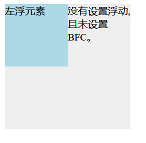
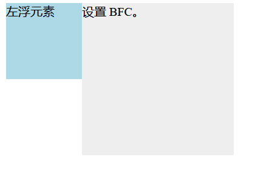

# 概念-[MDN](https://developer.mozilla.org/zh-CN/docs/Web/Guide/CSS/Block_formatting_context)

Formatting context(格式化上下文) 是 W3C CSS2.1 规范中的一个概念，它是页面中的一块渲染区域，并且有一套渲染规则，它决定了其子元素将如何定位，以及和其他元素的关系和相互作用。

那么 BFC 是什么呢？

BFC 即 Block Formatting Contexts (块级格式化上下文)。

**具有 BFC 特性的元素可以看作是隔离了的独立容器，容器里面的元素不会在布局上影响到外面的元素，并且 BFC 具有普通容器所没有的一些特性。**

通俗一点来讲，可以把 BFC 理解为一个封闭的大箱子，箱子内部的元素无论如何翻江倒海，都不会影响到外部。

也就是说：BFC 是一个 CSS 渲染规则，它具有普通容器没有的特性。

NOTICE：块级格式化上下文不是块级框，前者是提供一个环境，后者则是一个元素特性。

# 创建 BFC 的方式

- 根元素（\<html>）
- 浮动元素（元素的 [`float`](https://developer.mozilla.org/zh-CN/docs/Web/CSS/float) 不是 `none`）
- 绝对定位元素（元素的 [`position`](https://developer.mozilla.org/zh-CN/docs/Web/CSS/position) 为 `absolute` 或 `fixed`）
- 行内块元素（元素的 [`display`](https://developer.mozilla.org/zh-CN/docs/Web/CSS/display) 为 `inline-block`）
- 表格单元格（元素的 [`display`](https://developer.mozilla.org/zh-CN/docs/Web/CSS/display) 为 `table-cell`，HTML表格单元格默认为该值）
- 表格标题（元素的 [`display`](https://developer.mozilla.org/zh-CN/docs/Web/CSS/display) 为 `table-caption`，HTML表格标题默认为该值）
- 匿名表格单元格元素（元素的 [`display`](https://developer.mozilla.org/zh-CN/docs/Web/CSS/display) 为 `table`、`table-row`、 `table-row-group`、`table-header-group`、`table-footer-group`（分别是HTML table、row、tbody、thead、tfoot 的默认属性）或 `inline-table`）
- [`overflow`](https://developer.mozilla.org/zh-CN/docs/Web/CSS/overflow) 值不为 `visible` 的块元素
- [`display`](https://developer.mozilla.org/zh-CN/docs/Web/CSS/display) 值为 `flow-root` 的元素
- [`contain`](https://developer.mozilla.org/zh-CN/docs/Web/CSS/contain) 值为 `layout`、`content `或 paint 的元素
- 弹性元素（[`display`](https://developer.mozilla.org/zh-CN/docs/Web/CSS/display) 为 `flex` 或 `inline-flex `元素的直接子元素）
- 网格元素（[`display`](https://developer.mozilla.org/zh-CN/docs/Web/CSS/display) 为 `grid` 或 `inline-grid` 元素的直接子元素）
- 多列容器（元素的 [`column-count`](https://developer.mozilla.org/zh-CN/docs/Web/CSS/column-count) 或 [`column-width`](https://developer.mozilla.org/zh-CN/docs/Web/CSS/column-width) 不为 `auto`，包括 `column-count` 为 `1`）
- `column-span` 为 `all` 的元素始终会创建一个新的BFC，即使该元素没有包裹在一个多列容器中（[标准变更](https://github.com/w3c/csswg-drafts/commit/a8634b96900279916bd6c505fda88dda71d8ec51)，[Chrome bug](https://bugs.chromium.org/p/chromium/issues/detail?id=709362)）。

# BFC 特性

1. 同一个 BFC 下，相邻的两个块级元素的纵向外边距，大的那方将折叠小的那方。参见：[折叠的纵向外边距](https://github.com/yhw1249386566/privatenotes/blob/master/Difficult Concept/CSS/%E8%A7%86%E8%A7%89%E6%A0%BC%E5%BC%8F%E5%8C%96%E5%9F%BA%E7%A1%80/%E8%A7%86%E8%A7%89%E6%A0%BC%E5%BC%8F%E5%8C%96%E5%9F%BA%E7%A1%80_%E5%9D%97%E7%BA%A7%E7%BD%AE%E6%8D%A2%E5%92%8C%E9%9D%9E%E7%BD%AE%E6%8D%A2%E5%85%83%E7%B4%A0.md#%E6%8A%98%E5%8F%A0%E7%9A%84%E7%BA%B5%E5%90%91%E5%A4%96%E8%BE%B9%E8%B7%9D)

   将块级元素放入不同的 BFC 容器中，就可以使得相邻的两个块级元素的纵向外边距不折叠。

   ```html
   <div class="container">
       <p></p>
   </div>
   <div class="container">
       <p></p>
   </div>
   
   <style>
       .container {
           overflow: hidden;
       }
       p {
           width: 100px;
           height: 100px;
           background: lightblue;
           margin: 100px;
       }
   </style>
   ```

   这时候，两个盒子边距就变成了 200px

   

   

   （避免相邻的两个块级元素的纵向外边距折叠）

   NOTICE: 不折叠外边距的情况只对 BFC 中的元素生效，对于 BFC 本身来说，外边距仍然是折叠的，即：

   ```html
   <style>
       .container {
           overflow: hidden;
         	margin: 100px; /** 两个 BFC 的外边距将折叠，但其内部块级元素外边距不折叠 */
       }
   </style>
   ```

   现在两个 BFC 的相距距离为：折叠的 BFC 外边距距离 + 两个 BFC 内部子元素的外边距距离（不折叠） = 100 + 100 + 100 = 300 

2. BFC 可以包含浮动的元素（其效果如同清除了浮动）。

   即：若一个 BFC 中只有一个 浮动元素，则默认情况下 BFC 所属的块级框的内容区高度 = 浮动元素纵向格式化属性（7个）之和。

   若该块格式化上下文中除了浮动元素之外还有别的块级元素，则块格式化上下文所属的块级框的内容区高度 = 所有非浮动元素的7个纵向格式化属性之和（注：第1点在这里仍然是适用的，浮动元素将不算进去），如：

   ```html
       <style>
           .box {
               /* 使得 .box 的块级框为 BFC */
               overflow: auto;
               background-color: red;
           }
   
           .item {
               /* 浮动 .item */
               float: left;
               width: 100px;
               height: 100px;
               background-color: pink;
           }
   
           .one {
               width: 100px;
               height: 200px;
               background-color: gray;
           }
   
           .two {
               width: 100px;
               height: 100px;
               background-color: blue;
           }
       </style>
       <div class="box">
           <div class="item">overflow:auto</div>
           <div class="one"></div>
           <div class="two"></div>
       </div>
   ```

   ​	在以上的示例中，浮动元素 .item 的高度将对 BFC 所属的块级框的高度没有影响，但是其显示效果将会覆盖 .one 元素。

3. BFC 可以阻止浮动元素覆其他元素（只需要元素的块级框为 BFC 即可）。

   ```html
       <style>
           .one {
               float: left;
               height: 100px;
               width: 100px;
               background: lightblue
           }
   
           .two {
               width: 200px;
               height: 200px;
               background: #eee;
               /* 设置当前元素在 BFC 环境*/
               overflow:auto;
           }
       </style>
   
   
       <div class="one">
           左浮元素
       </div>
       <div class="two">
           没有设置浮动,且未设置 BFC。
       </div>
   ```

   

   ​	（未设置 BFC 的情况，浮动元素覆盖了背景）

   

   （设置 BFC 的情况，浮动元素未覆盖背景）


# Reference

- [张鑫旭-BFC](https://www.zhangxinxu.com/wordpress/2015/02/css-deep-understand-flow-bfc-column-two-auto-layout/) 
- [MDN](https://developer.mozilla.org/zh-CN/docs/Web/Guide/CSS/Block_formatting_context) 


