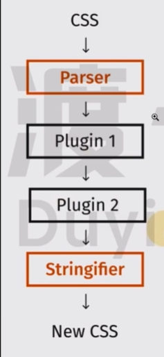

# 概念

将我们写的 css 经过 PostCss 插件进行转换一个新的 css，然后浏览器将应用这个新的 css.

原理：

1. 通过将我们写的 css 转换成一个 AST （Abstract Syntax Tree 抽象语法树）
2. 将此抽象树传递给 PostCss 插件
3. PostCss 插件再对此抽象树经过处理，返回成一个新的抽象树
4. PostCss 将新的抽象树转换成可识别的 css

​														(PostCss执行过程)

# Reference

- [官方文档](https://postcss.org/)