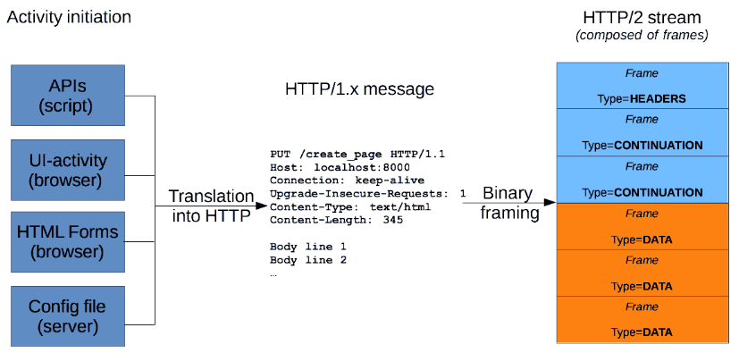
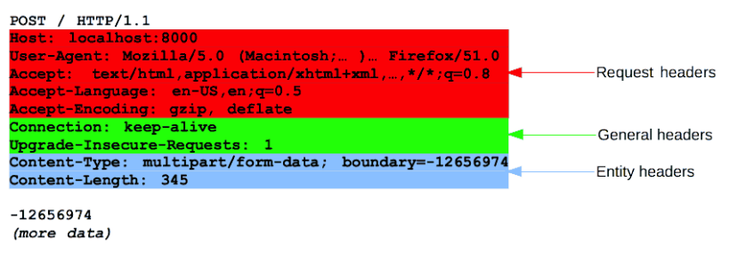
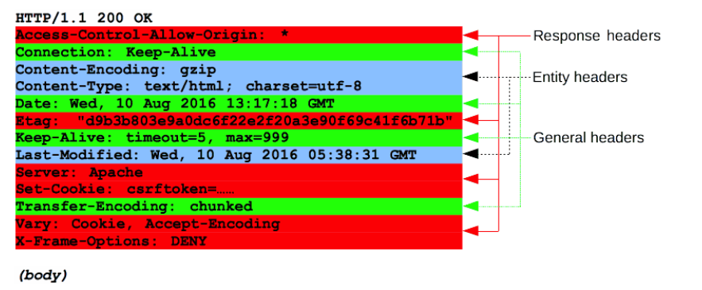
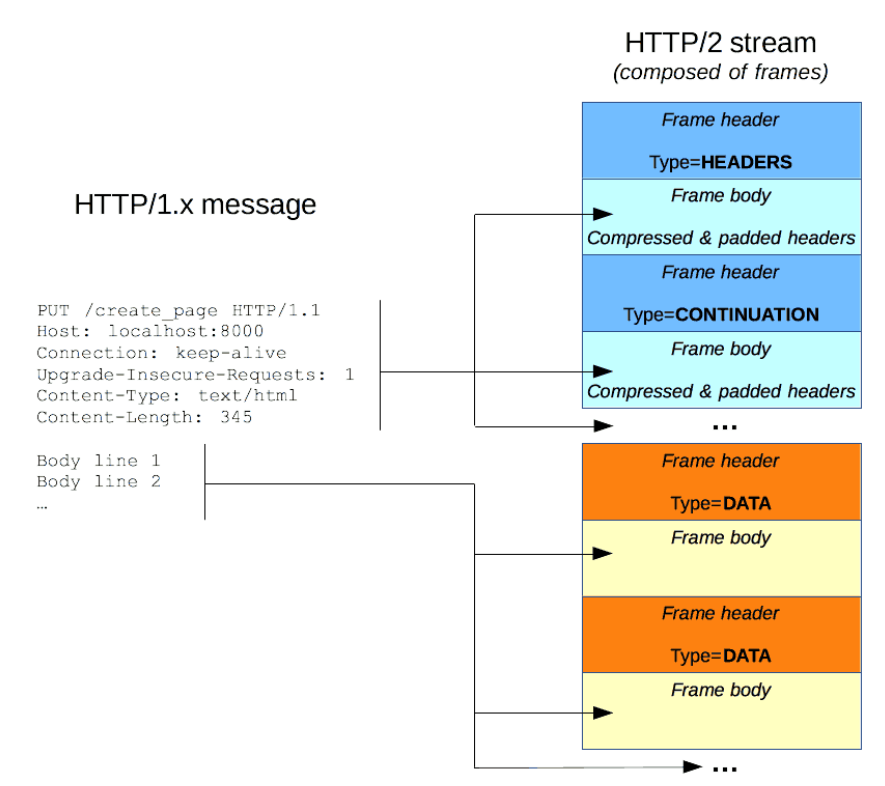

# [HTTP 消息](https://developer.mozilla.org/zh-CN/docs/Web/HTTP/Messages)

## 什么是 HTTP 消息？

HTTP 消息是服务端和客户端交换数据的方式。其中，HTTP 消息分为两种：

1. 请求（request）
   
   由客户端发送一个用来触发服务端的动作。

2. 响应（response）
   
   当服务端接收了来自客户端的消息时，向客户端回答的响应。
   
   即：来自服务器的应答。

在 HTTP/1.x 中，请求和消息这两种交换数据的方式，可以统称为 请求报文和响应报文；但是在 HTTP/2 中，这两种交换数据的方式 称之为 HTTP 帧（*详见：[HTTP/2 帧](https://developer.mozilla.org/zh-CN/docs/Web/HTTP/Messages#HTTP2_%E5%B8%A7)*）

HTTP 消息由采用 ASCII 编码的多行文本构成，在 HTTP/1.1 及早期版本中，这些消息通过连接公开地发送；但是在 HTTP/2 中，为了优化和性能方面的改进，曾经可人工阅读的消息被分到多个 HTTP 帧中（[HTTP/2 中帧的定义](https://halfrost.com/http2-http-frames-definitions/)）。

对于 Web 开发人员或网站管理员来说，他们很少自己手工创建这些原始的HTTP 消息，因为这些可以由软件、浏览器、 代理或服务器完成。

他们通过配置文件（用于代理服务器或服务器），API （用于浏览器）或其他接口提供HTTP消息。

下图是将 API、UI-activity、HTML Forms、Config file的内容翻译成 HTTP/1.x 的消息，然后在 HTTP/2 中转换成二进制帧，最后由二进制帧构成了 HTTP/2 stream。

总的来说，就是左边的 4 个点在 HTTP/1.x message 和 HTTP/2 stream 的不同表现形式。

（Activity initiation）

HTTP/2 二进制框架机制被设计为不需要改动任何API或配置文件即可应用︰ 它大体上对用户是透明的。

对于 HTTP 消息的两类（请求和响应）来说，它们具有相似的结构，都由以下部分组成：

1. 一行起始行用于描述要执行的请求，
   
   或者是对应的状态，成功或失败。
   
   这个起始行总是单行的。
   
   **称之为：请求/响应 行**

2. 一个可选的HTTP头集合指明请求
   
   或描述消息正文。
   
   **称之为：请求/响应 头**

3. 一个空行指示所有关于请求的元数据已经发送完毕。

4. 一个可选的包含请求相关数据的正文 (比如HTML表单内容), 
   
   或者响应相关的文档。 正文的大小有起始行的HTTP头来指定。
   
   **称之为：请求/响应 体**

## [HTTP 请求（报文）](https://developer.mozilla.org/zh-CN/docs/Web/HTTP/Messages#HTTP_%E8%AF%B7%E6%B1%82)

- 注意：该节以 HTTP/1.x 的版本去讲解关于请求报文，而不是以 HTTP/2 版本去讲解 HTTP 帧。

参见:[HTTP 请求报文剖解——CSDN](https://blog.csdn.net/u010256388/article/details/68491509/)

一个HTTP请求报文由四部分组成：

1. 请求行
2. 请求头
3. 空行
4. 请求体

### [请求行（起始行）](https://developer.mozilla.org/zh-CN/docs/Web/HTTP/Messages#%E8%B5%B7%E5%A7%8B%E8%A1%8C)

​    HTTP请求是由客户端发出的消息，用来使服务器执行动作。*起始行 (start-line)* 包含三个元素：

1. 一个 *[HTTP 方法](https://developer.mozilla.org/en-US/docs/Web/HTTP/Methods)*，一个动词 (像 [`GET`](https://developer.mozilla.org/zh-CN/docs/Web/HTTP/Methods/GET), [`PUT`](https://developer.mozilla.org/zh-CN/docs/Web/HTTP/Methods/PUT) 或者 [`POST`](https://developer.mozilla.org/zh-CN/docs/Web/HTTP/Methods/POST)) 或者一个名词 (像 [`HEAD`](https://developer.mozilla.org/zh-CN/docs/Web/HTTP/Methods/HEAD) 或者 [`OPTIONS`](https://developer.mozilla.org/zh-CN/docs/Web/HTTP/Methods/OPTIONS)), 描述要执行的动作。
   
   例如, `GET` 表示要获取资源，`POST` 表示向服务器推送数据 (创建或修改资源, 或者产生要返回的临时文件)。

2. 请求目标 (request target)，通常是一个URL，或者是协议、端口和域名的绝对路径，通常以请求的环境为特征。
   
   请求的格式因不同的 HTTP 方法而异，它可以是：
   
   - 一个绝对路径，末尾跟上一个 ' ? ' 和查询字符串。这是最常见的形式，称为 *原始形式 (origin form)*，被 GET，POST，HEAD 和 OPTIONS 方法所使用。
     `POST / HTTP/1.1GET /background.png HTTP/1.0HEAD /test.html?query=alibaba HTTP/1.1OPTIONS /anypage.html HTTP/1.0`
   - 一个完整的URL，被称为 *绝对形式 (absolute form)*，主要在使用 `GET` 方法连接到代理时使用。
     `GET http://developer.mozilla.org/en-US/docs/Web/HTTP/Messages HTTP/1.1`
   - 由域名和可选端口（以`':'`为前缀）组成的 URL 的 authority component，称为 *authority form*。 仅在使用 `CONNECT` 建立 HTTP 隧道时才使用。
     `CONNECT developer.mozilla.org:80 HTTP/1.1`
   - *星号形式 (asterisk form)*，一个简单的星号(`'*'`)，配合 `OPTIONS` 方法使用，代表整个服务器。
     `OPTIONS * HTTP/1.1`

3. *HTTP 版本 (HTTP version*)*，*定义了剩余报文的结构，作为对期望的响应版本的指示符。

### 请求头（Headers）

- 参见：HTTP 请求头和响应头（统称为：消息头）参数详解——[CSDN](https://blog.csdn.net/searchin_r/article/details/83692499)——[MDN](https://developer.mozilla.org/zh-CN/docs/Web/HTTP/Headers)

来自请求的 [HTTP headers](https://developer.mozilla.org/en-US/docs/Web/HTTP/Headers) 遵循和 HTTP header 相同的基本结构：不区分大小写的字符串，紧跟着的冒号 `:` 和一个结构取决于 header 的值。

整个 header（包括值）由一行组成，这一行可以相当长，并且有许多请求头可用，它们可以分为几组：

- *Request headers，*例如 [`User-Agent`](https://developer.mozilla.org/zh-CN/docs/Web/HTTP/Headers/User-Agent)，[`Accept-Type`](https://developer.mozilla.org/zh-CN/docs/Web/HTTP/Headers/Accept-Type)，通过进一步的定义(例如 [`Accept-Language`](https://developer.mozilla.org/zh-CN/docs/Web/HTTP/Headers/Accept-Language))，或者给定上下文(例如 [`Referer`](https://developer.mozilla.org/zh-CN/docs/Web/HTTP/Headers/Referer))，或者进行有条件的限制 (例如 [`If-None`](https://developer.mozilla.org/zh-CN/docs/Web/HTTP/Headers/If-None)) 来修改请求。
- *General headers，*例如 [`Via`](https://developer.mozilla.org/zh-CN/docs/Web/HTTP/Headers/Via)，适用于整个报文。
- *Entity headers，*例如 [`Content-Length`](https://developer.mozilla.org/zh-CN/docs/Web/HTTP/Headers/Content-Length)，适用于请求的 body。显然，如果请求中没有任何 body，则不会发送这样的头文件。

（HTTP 可用请求头的种类）

### 请求体（Body）

请求的最后一部分是它的 body。

不是所有的请求都有一个 body（和 HTTP 响应类似），如：获取资源的请求，GET，HEAD，DELETE 和 OPTIONS，通常它们不需要 body。 

有些请求将数据发送到服务器以便更新数据：常见的的情况是 POST 请求（包含 HTML 表单数据）。

Body 大致可分为两类：

- Single-resource bodies，由一个单文件组成。该类型 body 由两个 header 定义： [`Content-Type`](https://developer.mozilla.org/zh-CN/docs/Web/HTTP/Headers/Content-Type) 和 [`Content-Length`](https://developer.mozilla.org/zh-CN/docs/Web/HTTP/Headers/Content-Length).
- [Multiple-resource bodies](https://developer.mozilla.org/en-US/docs/Web/HTTP/Basics_of_HTTP/MIME_types#multipartform-data)，由多部分 body 组成，每一部分包含不同的信息位。通常是和  [HTML Forms](https://developer.mozilla.org/en-US/docs/Web/Guide/HTML/Forms) 连系在一起。

## [HTTP 响应（报文）](https://developer.mozilla.org/zh-CN/docs/Web/HTTP/Messages#HTTP_%E5%93%8D%E5%BA%94)

- 注意：该节以 HTTP/1.x 的版本去讲解关于响应报文，而不是以 HTTP/2 版本去讲解 HTTP 帧。

HTTP 的响应报文和请求报文的结构式类似的。

### [状态行（响应行）](https://developer.mozilla.org/zh-CN/docs/Web/HTTP/Messages#%E7%8A%B6%E6%80%81%E8%A1%8C)

HTTP 响应的起始行被称作 *状态行* *(status line)*，你或许也可以称之为 *响应行*，这样可以和 HTTP 请求的 请求行 相呼应，状态行包含以下信息：

1. *协议版本*，通常为 `HTTP/1.1。`
2. *状态码 (**status code)*，表明请求是成功或失败。常见的状态码是 [`200`](https://developer.mozilla.org/zh-CN/docs/Web/HTTP/Status/200)，[`404`](https://developer.mozilla.org/zh-CN/docs/Web/HTTP/Status/404)，或 [`302`](https://developer.mozilla.org/zh-CN/docs/Web/HTTP/Status/302)。
3. *状态文本 (status text)*。一个简短的，纯粹的信息，通过状态码的文本描述，帮助人们理解该 HTTP 消息。

一个典型的状态行看起来像这样：`HTTP/1.1 404 Not Found`

### [响应头（Headers）](https://developer.mozilla.org/zh-CN/docs/Web/HTTP/Messages#Headers_2)

- 参见：HTTP 请求头和响应头（统称为：消息头）参数详解——[CSDN](https://blog.csdn.net/searchin_r/article/details/83692499)——[MDN](https://developer.mozilla.org/zh-CN/docs/Web/HTTP/Headers)

响应的  [HTTP headers](https://developer.mozilla.org/en-US/docs/Web/HTTP/Headers) 遵循和任何其它 header 相同的结构：不区分大小写的字符串，紧跟着的冒号 `:`和一个结构取决于 header 类型的值。 

整个 header（包括其值）表现为单行形式，且有许多响应头可用，这些响应头可以分为几组：（这和 HTTP 请求的 请求头也是类似的）

- *General headers，*例如 [`Via`](https://developer.mozilla.org/zh-CN/docs/Web/HTTP/Headers/Via)，适用于整个报文。
- *Response headers，*例如 [`Vary`](https://developer.mozilla.org/zh-CN/docs/Web/HTTP/Headers/Vary) 和 [`Accept-Ranges`](https://developer.mozilla.org/zh-CN/docs/Web/HTTP/Headers/Accept-Ranges)，提供其它不符合状态行的关于服务器的信息。
- *Entity headers*，例如 [`Content-Length`](https://developer.mozilla.org/zh-CN/docs/Web/HTTP/Headers/Content-Length)，适用于请求的 body。显然，如果请求中没有任何 body，则不会发送这样的头文件。

（HTTP 可用响应头的种类）

### [响应体（Body）](https://developer.mozilla.org/zh-CN/docs/Web/HTTP/Messages#Body_2)

响应的最后一部分是 body。

注：和 HTTP 请求的 Body 类似，在 HTTP 响应中，并不是所有的响应都有 body，如：具有状态码 (如 [`201`](https://developer.mozilla.org/zh-CN/docs/Web/HTTP/Status/201) 或 [`204`](https://developer.mozilla.org/zh-CN/docs/Web/HTTP/Status/204)) 的响应，通常不会有 body。

Body 大致可分为三类：

- Single-resource bodies，由**已知**长度的单个文件组成。该类型 body 由两个 header 定义：[`Content-Type`](https://developer.mozilla.org/zh-CN/docs/Web/HTTP/Headers/Content-Type) 和 [`Content-Length`](https://developer.mozilla.org/zh-CN/docs/Web/HTTP/Headers/Content-Length)。
- Single-resource bodies，由**未知**长度的单个文件组成，通过将 [`Transfer-Encoding`](https://developer.mozilla.org/zh-CN/docs/Web/HTTP/Headers/Transfer-Encoding) 设置为 `chunked `来使用 chunks 编码。
- [Multiple-resource bodies](https://developer.mozilla.org/en-US/docs/Web/HTTP/Basics_of_HTTP/MIME_types#multipartform-data)，由多部分 body 组成，每部分包含不同的信息段。但这是比较少见的。

## 请求和响应这一具体过程

当用户下达一个指令需要让浏览器发送请求时,浏览器就会根据情况给服务器发送一个请求,这个请求就是一整个请求报文.

浏览器根据请求行发送请求，而服务器可能会先接收请求报文中的请求头,然后根据请求头的信息判断要不要接受请求体,当服务器接收一整个请求之后,通常来说它会进行一系列的处理,

当将请求处理完成之后会返回一个响应报文,这个响应报文包含:响应行,响应头,空行（指示元数据已发送完毕），响应体; 这响应报文的目的和请求报文的目的是类似的,

即:响应头和行告诉客户端我处理你这个请求已经完成(通过 status 状态码判断)了,且我返回的请求结果将会是你要求的类型.

而响应体中的数据就是服务端处理请求后返回的结果,也就是我们需要的"干货",服务端将结果通常是存储到 响应体中的.

当浏览器接收这个响应报文之后,JS 引擎会正确的通过响应报文的各种信息,进行数据的处理,将响应报文中的响应体中的数据返还给你,而响应行和头通常是隐蔽的*(可以通过特殊手段进行获取,如[HTTPWatch](https://www.httpwatch.com/)这个软件.)*

至此,整个请求结束.(如果中间有一方判断根据请求头和行进行是否要处理/接收数据时失败,则请求会提前结束)

## [HTTP/2 帧](HTTP/2 帧)

- [HTTP/2 中帧的定义](https://halfrost.com/http2-http-frames-definitions/)-或[参见这](https://www.jianshu.com/p/51b2a9c98fca)

有关于 HTTP/1.x 报文有一些性能上的缺点：

- Header 不像 body，它不会被压缩。
- 两个报文之间的 header 通常非常相似，但它们仍然在连接中重复传输。
- 无法复用。当在同一个服务器打开几个连接时：TCP 热连接比冷连接更加有效。

在 HTTP/2 中，引入了一个额外的步骤：它**将 HTTP/1.x 消息分成帧并嵌入到流 (stream)** 中。

数据帧和报头帧分离，这将允许报头压缩；将多个流组合，这是一个被称为 *多路复用 (multiplexing)* 的过程，它允许更有效的底层 TCP 连接。

下图是将 HTTP/1.x 的消息翻译成 HTTP/2 的 stream 的对应表，其中 Frame header 为报头帧，Frame body 为数据帧。

（HTTP 1.x 的消息翻译成 HTTP 2 的帧的对应表.png）

HTTP 帧现在对 Web 开发人员是透明的；在 HTTP/2 中，这是一个在  HTTP/1.1 和底层传输协议之间附加的步骤。

Web 开发人员不需要在他们使用的 API 中做任何更改来利用 HTTP 帧；当浏览器和服务器都可用时，HTTP/2 将被打开并使用。

## [HTTP/1.x 和 HTTP/2 的关键（报文和帧的关系）](HTTP/1.x 和 HTTP/2 的关键（报文和帧的关系）)

HTTP 报文是使用 HTTP 的关键；它们的结构简单，并且具有高可扩展性。

HTTP/2 帧机制是在 HTTP/1.x 语法和底层传输协议之间增加了一个新的中间层，而没有从根本上修改它，即 HTTP/2 帧是建立在经过验证的机制之上。

如：

- HTTP/1.x message

- HTTP/2 帧
  
  该层将 HTTP/1.x message 翻译成 HTTP/2 的帧，然后再由底层传输协议去控制。

- 底层传输协议

# Reference

- [HTTP/2 中帧的定义](https://halfrost.com/http2-http-frames-definitions/)-或[参见这](https://www.jianshu.com/p/51b2a9c98fca)
- [HTTP 消息](https://developer.mozilla.org/zh-CN/docs/Web/HTTP/Messages)
- 参见：HTTP 请求头和响应头（统称为：消息头）参数详解——[CSDN](https://blog.csdn.net/searchin_r/article/details/83692499)——[MDN](https://developer.mozilla.org/zh-CN/docs/Web/HTTP/Headers)