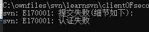
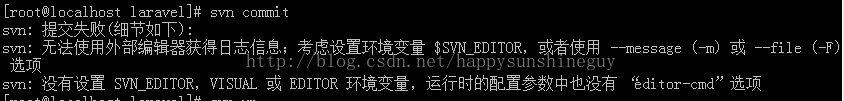
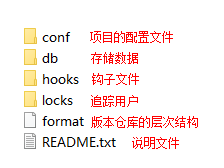

# 方便使用

下载 [TortoiseSVN](https://tortoisesvn.net/downloads.html)，它是一个 SVN 客户端，安装后你的右键就会多了几个SVN相关的菜单。

# [权限配置](https://www.runoob.com/svn/svn-create-repo.html)

当使用 `svn commit -m 注释信息 文件` 命令提交文件出现认证失败错误时，通常是因为在 SVN 服务器的仓库中，没有正确配置权限导致的。

（权限认证失败）

并且若使用 `git commit 文件` 命令，则会出现其他错误，即：

（直接使用 git commit 注释 命令造成的错误）

这种错误的最简单解决方法，就是为每一次提交加上注释信息，且我本人非常推荐这种做法，因为 Git 中就是如此推荐的。

# 初始化仓库（版本库）

1. 使用 CLI（CMD）

2. `svnadmin create 绝对/相对路径`

   使用相对路径是在当前命令行的目录为你想要的仓库的目录 

成功初始化仓库之后，会存在以下目录：

（svn初始化仓库该有的目录）

需要注意的是：不要随意修改以上目录中的任意文件，否则会导致不可预知的后果。

# 启动 SVN 服务器

`svnserve -d -r 绝对/相对路径 [--listen-port 端口号]`

-d：后台执行

-r：配置方式决定了版本库访问方式

--listen-port 端口号：默认 3690

当在 CLI 中使用了该命令之后，若光标一直闪烁，则服务器启动成功，只需要在另一个 CLI 中使用：`netstat -an` 查看是否有监听 3690（或自定义端口号）就行了。

启动服务器的目的：使得其他开发者可以通过该服务器能获取（检出）到服务器中存在的 SVN 仓库

注：启动 SVN 服务器存在两种选择模式：

1. 一个 svnserve 为多个仓库工作的模式，你只需要设置多个仓库共有的上级目录作为启动文件夹即可。

   如：`svnserve -d -r C:\svn` 

2. 一个 svnserver 为一个仓库工作，则你需要精确定位仓库位置从而启动服务器。

   如：`svnserve -d -r C:\svn\repositoryName` 

# 检出（获取） SVN 服务器中的某个仓库

`svn checkout svn://192.168.0.1/runoob01（服务器地址） --username=user01`

检出 SVN 服务器上的某个仓库到当前目录。

注意：如果你在启动 SVN 服务器时，选择一个 svnserve 为多个仓库工作的模式，则你在使用检出命令时需要精确定位仓库位置；而选择一个 svnserver 为一个仓库工作，则你的 URL 只需要写到仓库所在的上一级目录即可。

初始化仓库和启动 SVN 服务器都是和服务器有关的，现在该节是介绍开发者如何获取 SVN 服务器上的仓库。

当你使用以上命令成功检出一个 SVN 服务器上的仓库时，你检出的目录中应当存在于给 `.svn` 文件夹（类似 `.git`），它是一个隐藏项目，你需要设置隐藏的文件夹可见，才能看见。

# 提交（svn commit）

`svn commit -m 注释信息 文件`

使用以上命令可以对当前目录中的文件进行提交到对应的 SVN 服务器的仓库中。

如：你从一个 SVN 服务器仓库检出一个仓库到当前目录时，那么当前目录中使用以上命令就会将 文件 提交到检出的仓库中。

并且当其他人也检出那个仓库时，他会获得你的提交。

